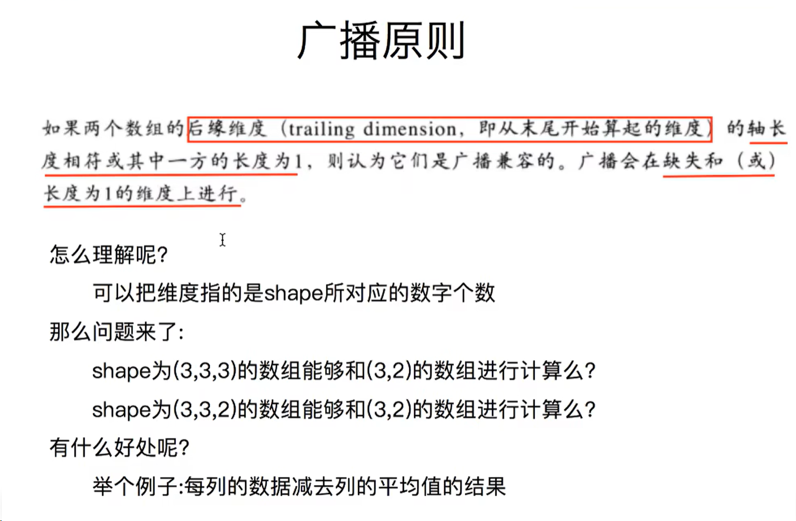
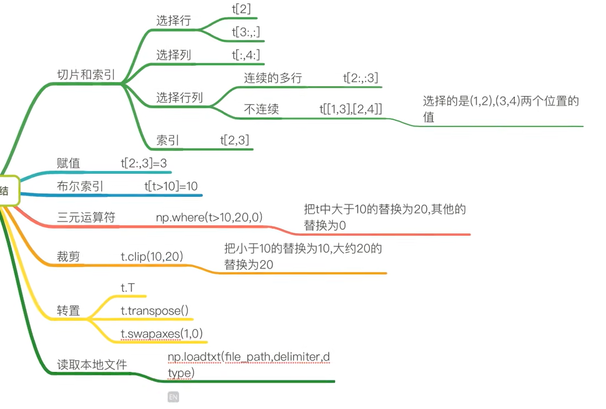

## Numpy

why:1. 快速
2. 方便
3. 科学计算的基础库
   
> 一个在python中做科学计算的基础库，重在数值计算，也是大部分python科学计算库的基础库

random.random()默认生成[0,1)之间的小数

### 数组的形状

即（2维数组，3行，4列的数据）
shape和reshape里面需要一个元组，reshape对原数组没有影响
flatten展开数据，展成一维，扁平化处理

### 数组的计算
与线代不同

广播机制
只要有一个维度相同的数组就能计算

### numpy读取数据

**csv**：comma——separted value 逗号分隔值文件

显示：表格状态

源文件：换行和逗号分隔行列的格式化文本，每一行的数据表示一条记录

> 

### numpy索引和切片

：是所有，逗号前面是行，后面是列

取行  print(t2[2])

取连续的多行 print(t2[2:])

取不连续的多行 print(t2[[2,8,10]])

取列
print(t2[1,:])
print(t2[2:,:])
print(t2:,0)

取连续的多列
print(t2[:,2:])

取不连续的多列
print(t2[:,[0,2]])

取多行多列
print(t[2,3])

取多行多列，取第3列到第5行，第2列到第4列的结果
b = t2[2:5,1:4]
print(b)

取多个不相邻的点
选出来的点是（0，0，(2,1）,(2,3)
c = t2[0,2,2],[0,1,3]
print(c)

#### 改数据

布尔索引

统计nan的个数
因为缺失值，数据要预处理
np.sum

把nan替换成均值或者中值

### 小结

