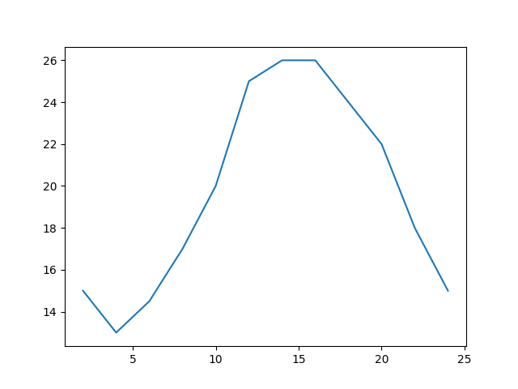
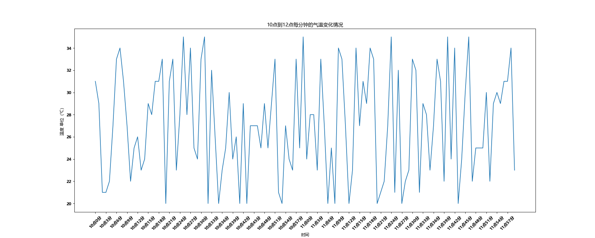
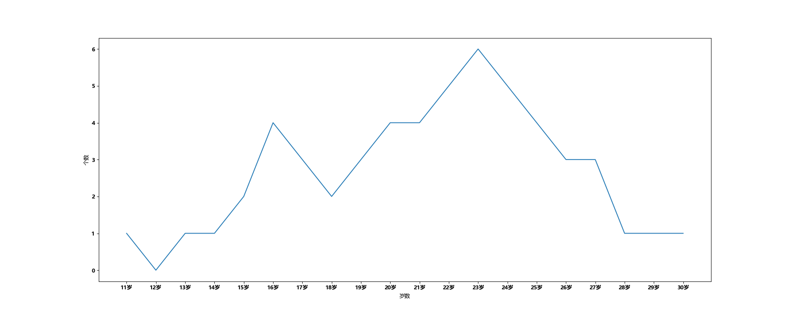
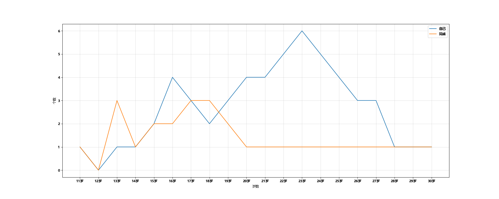
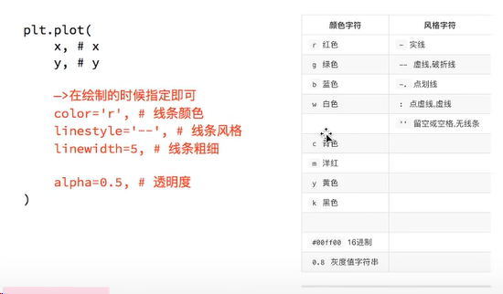
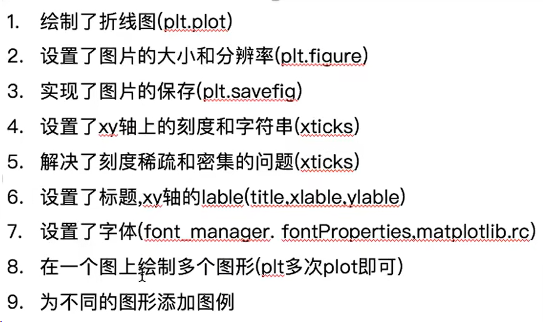
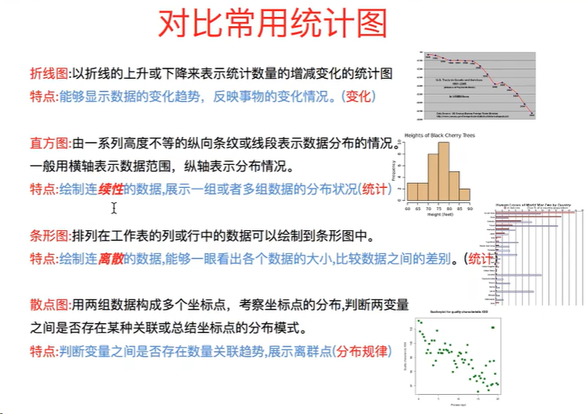
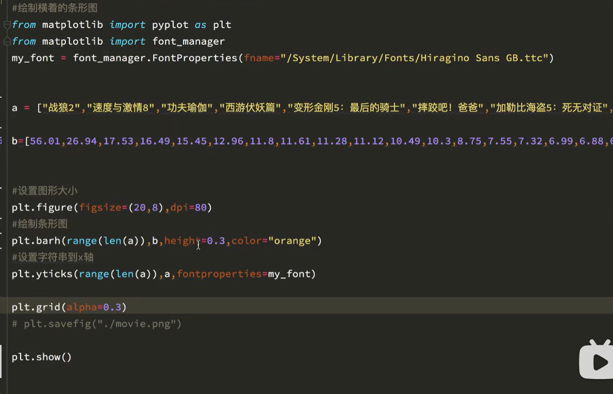
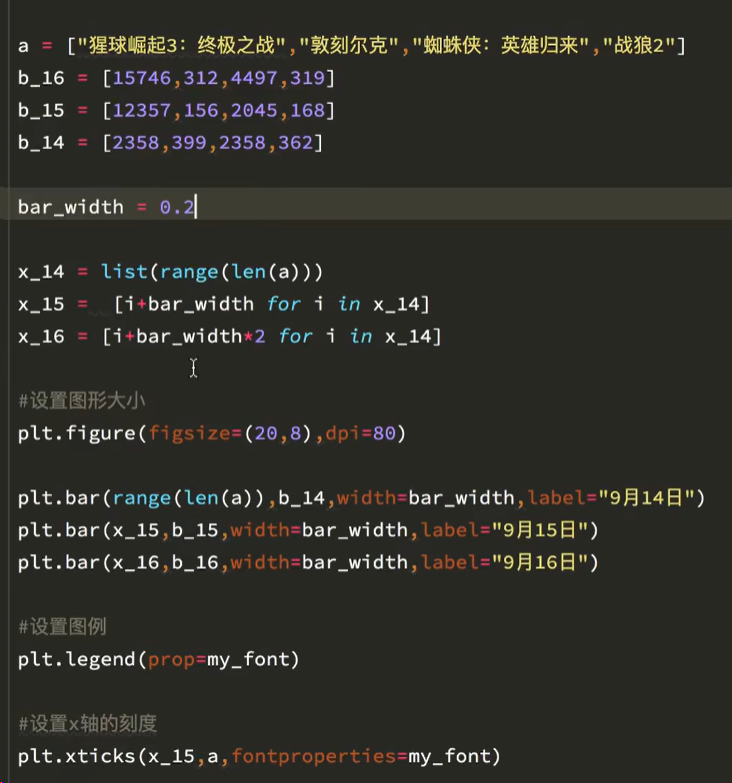
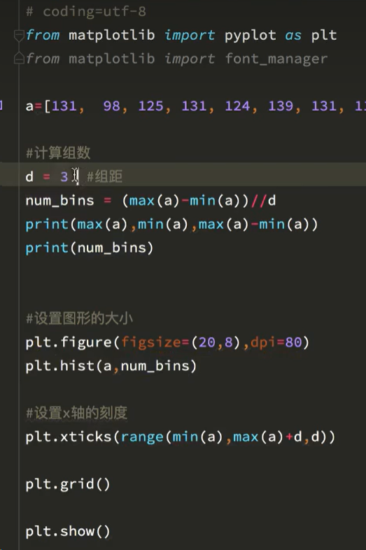

## Matplotlib Learning

> python底层绘图库（类似于matlab）

### why
1. 能将数据可视化，更直观的呈现
2. 使数据更客观、更真实

——————————————————————————————————————————
### 折线图
> plt.plot(x,y)

假设一天中每隔两个小时(range(2,26,2))的气温(℃)分别是（一堆数据）
```python
from matplotlib import pyplot as plt

x = range(2,26,2)
# 数据在x轴的位置，是一个可迭代对象

y = [15,13,14.5,17,20,25,26,26,24,22,18,15]
# y轴同理
# x轴和y轴的数据一起组成了所有要绘制出的坐标

plt.plot(x,y)
# 传入x和y，通过plot绘制出的坐标

plt.show()
```


——————————————————————————————————————————

```python
 如果列表a表示10点到12点的每一分钟气温，如何绘制折线图观察每分钟气温的变化情况

from matplotlib import pyplot as plt
import random
import matplotlib
font = {'family': 'Microsoft YaHei',
        'weight': 'bold',}

matplotlib.rc("font",**font)


x = range(0,120)
y = [random.randint(20,35)for i in range(120)]

plt.figure(figsize=(20,8),dpi=80)

plt.plot(x,y)

# 调整x轴的刻度
_xtick_labels = ["10点{}分".format(i) for i in range(60)]
_xtick_labels += ["11点{}分".format(i) for i in range(60)]
# 取步长，数字和字符串一一对应，数据的长度一样
plt.xticks(list(x)[::3],_xtick_labels[::3],rotation=45)
# rotation旋转的度数

# 添加描述信息
plt.xlabel("时间")
plt.ylabel("温度 单位（℃）")
plt.title ("10点到12点每分钟的气温变化情况")

plt.show()


```


——————————————————————————————————————————

```python
from matplotlib import pyplot as plt
import matplotlib
font = {'family': 'Microsoft YaHei',
        'weight': 'bold'}

matplotlib.rc("font", **font)

y = [1, 0, 1, 1, 2, 4, 3, 2, 3, 4, 4, 5, 6, 5, 4, 3, 3, 1, 1, 1]
x = range(11, 31)

# 设置图形大小
plt.figure(figsize=(20, 8), dpi=80)

# 设置x轴刻度
_xtick_labels = ["{}岁".format(i) for i in x]
plt.xticks(x, _xtick_labels)


plt.xlabel("岁数")
plt.ylabel("个数")
plt.plot(x, y)
plt.show()
```


——————————————————————————————————————————

```python
from matplotlib import pyplot as plt
import matplotlib
font = {'family': 'Microsoft YaHei',
        'weight': 'bold'}

matplotlib.rc("font", **font)

y_1 = [1, 0, 1, 1, 2, 4, 3, 2, 3, 4, 4, 5, 6, 5, 4, 3, 3, 1, 1, 1]
y_2 = [1, 0, 3, 1, 2, 2, 3, 3, 2, 1, 1, 1, 1, 1, 1, 1, 1, 1, 1, 1]
x = range(11, 31)

# 设置图形大小
plt.figure(figsize=(20, 8), dpi=80)

# 设置x轴刻度
_xtick_labels = ["{}岁".format(i) for i in x]
plt.xticks(x, _xtick_labels)
plt.yticks(range(0, 8))

# 绘制网格
plt.grid(alpha=0.4)
# alpha是透明度

plt.xlabel("岁数")
plt.ylabel("个数")
plt.plot(x, y_1, label="自己")
plt.plot(x, y_2, label="同桌")

# 添加图例
plt.legend()

#展示
plt.show()
```


可以自己调整图片风格


——————————————————————————————————————————



——————————————————————————————————————————



——————————————————————————————————————————


——————————————————————————————————————————
### 散点图
**技术要点**

> plt.scatter(x,y)
### 条形图
**技术要点**

>竖着的条形图 plt.bar(range(len(a)), b，width=xx)

a为横坐标，b为纵坐标

> 横着的条形图  plt.bar**h**(range(len(a)), b，height=xx)



绘制多次条形图

### 直方图

