### pandas

#### 常用数据类型
1. series 一维，带标签数组
2. DataFrame 二维，Series容器
   

#### series创建、切片、索引

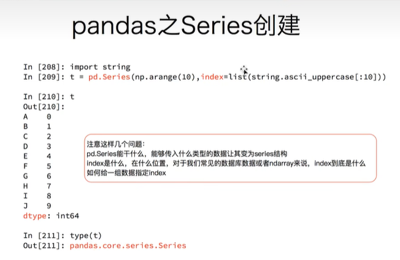
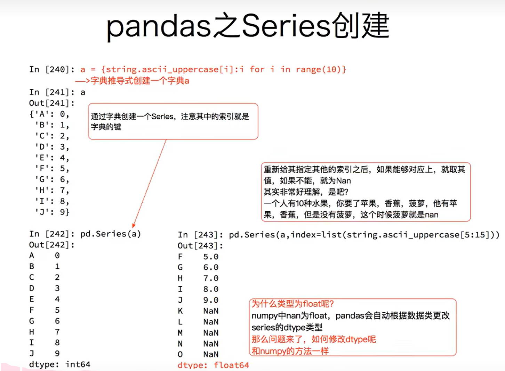
列表 对象range 字典，可以创建Series

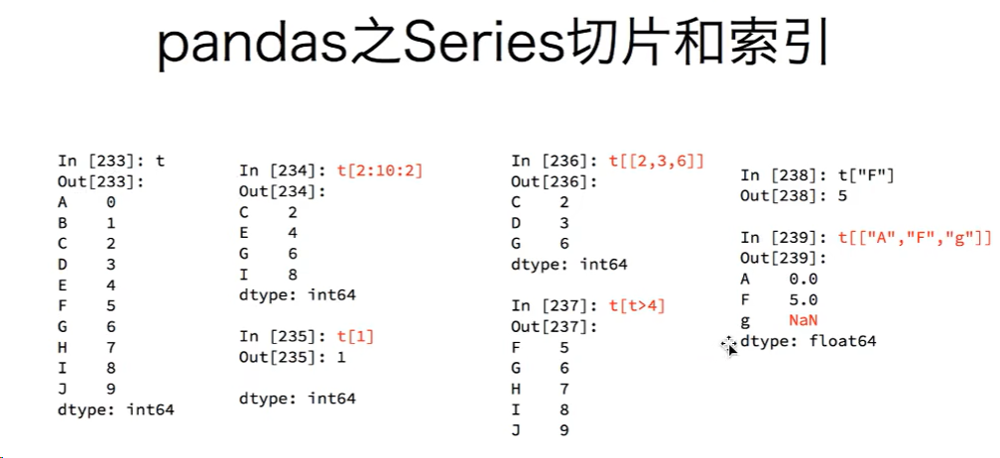
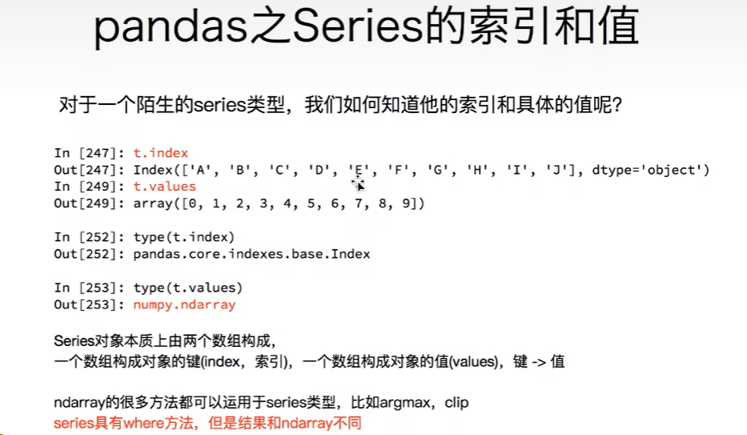

#### pandas读取外部数据
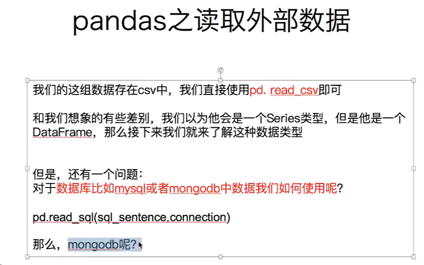

#### dataframe
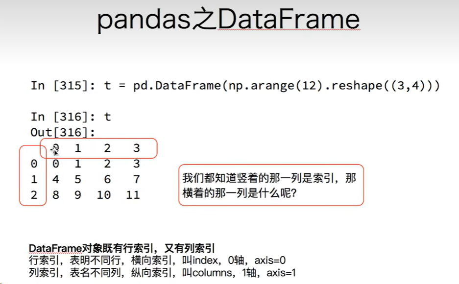
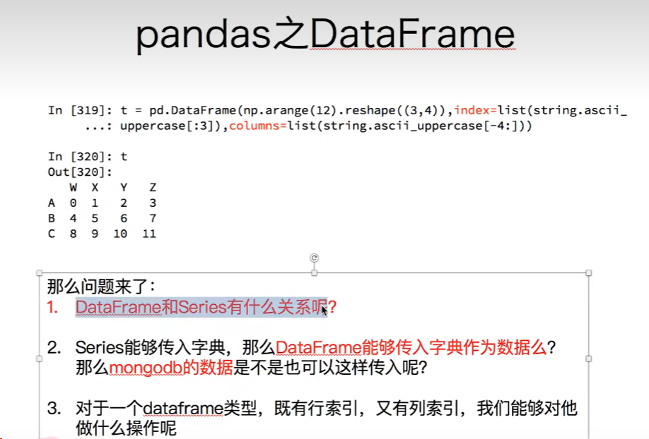
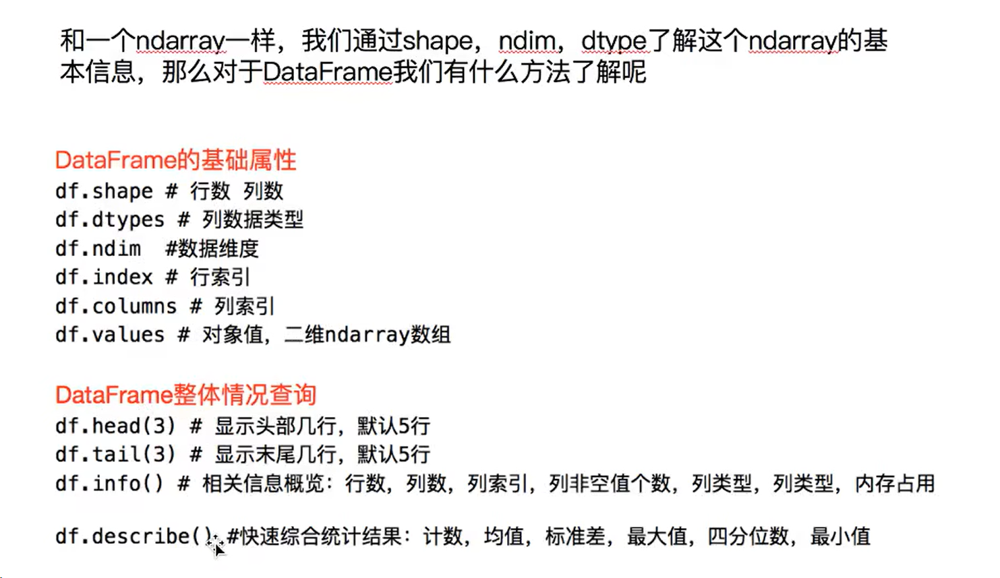

```python
df.sort_values(by="Count_AnimalName",ascending=False)
# 排序
```

#### pandas取行取列
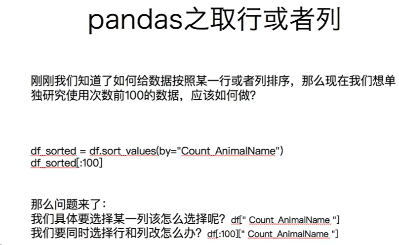
- 方括号写数组，表示取行，对行进行操作
- 写字符串，表示的取列索引，对列进行操作

1. df.loc通过**标签**索引行数据
2. df.iloc通过**位置**获取行数据
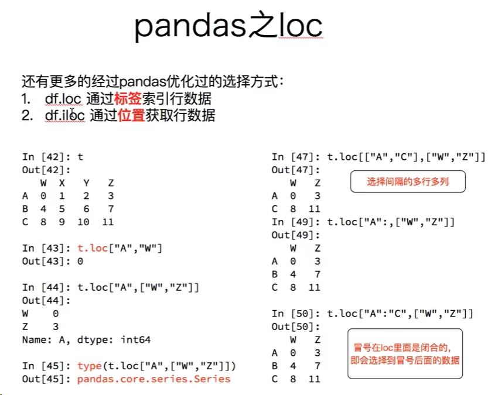
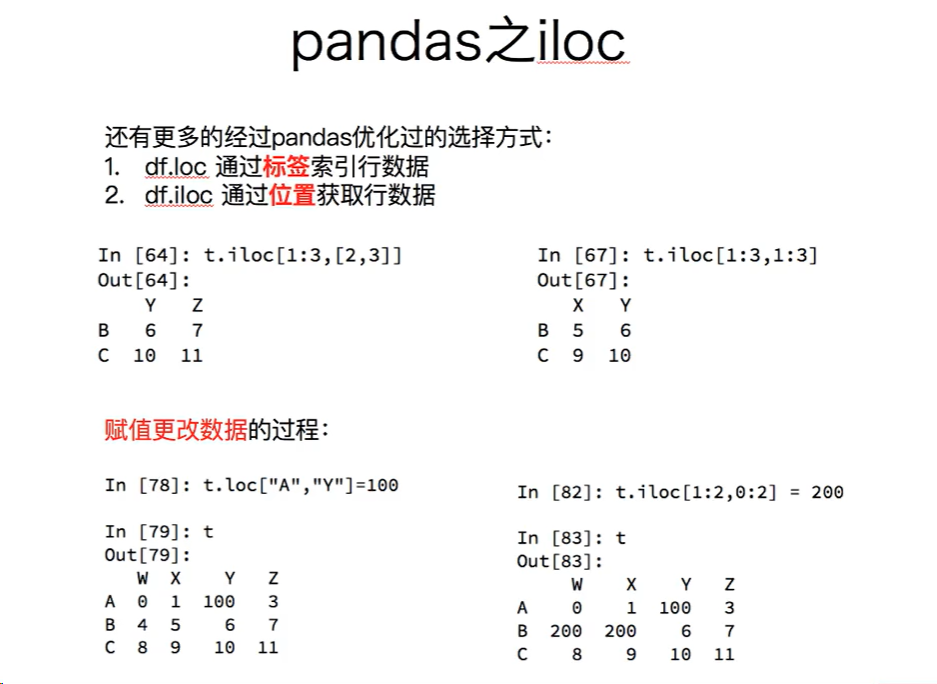

#### 布尔索引
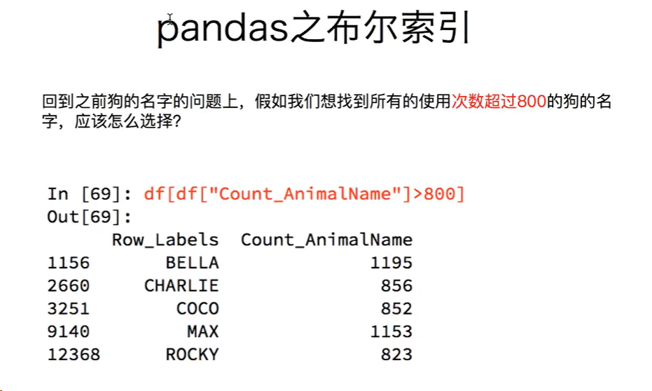