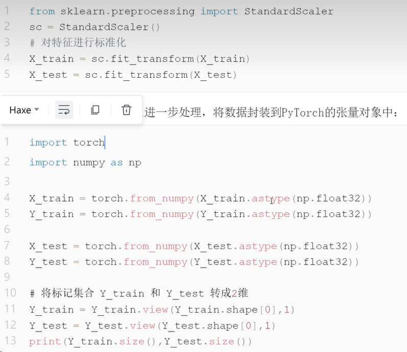
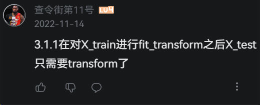
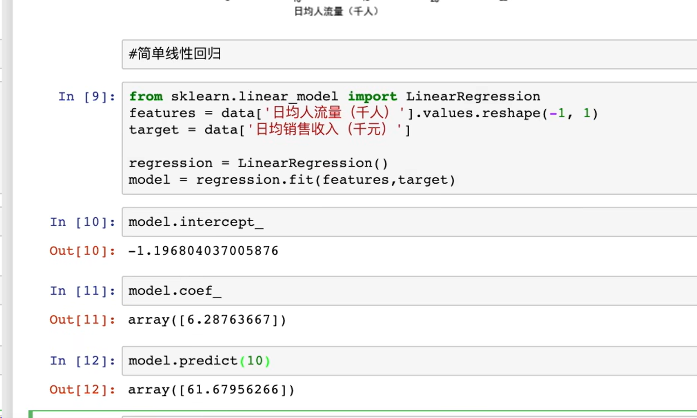

### 数据集的读取与处理
#### 1.读取文件
csv文件：pd.read_csv("")
npy文件：np.load("")  ->转为pd.dataframe()
df = data
行索引 df.index
列名集合 df.columns

对数据**切片**，把特征和标签分开
X= [df.columns[0:-1]].values
y=[df.columns[-1]].values

#### 2.数据集的划分
**利用sklearn中的model_selection函数，将原数据按比例随机分为训练集数据和测试集数据
```python
from sklearn.model_selection import train_test_split
X_train,X_test,Y_train,Y_test = train_test_split(X,Y, test_size=0.2, random_state=1234)
```


#### 3.数据集的标准化
将所有的数据按照比例缩放到一定范围内
使用sklearn.preprocessing来对数据集合进行标准化
fit_transform()的功能是对数据进行某种统一处理，将数据缩放到某个固定区间。实现数据的标准化、归一化







[关于算法与模型训练](https://blog.csdn.net/TiffanyRabbit/article/details/76574009)
[关于多分类的分类方法](https://zhuanlan.zhihu.com/p/270458779)