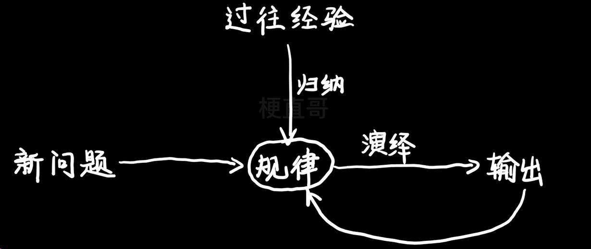
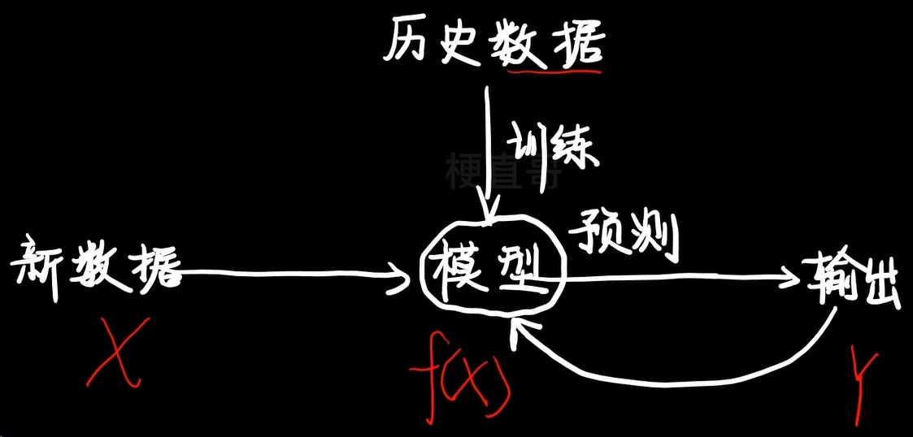

# 机器学习
———————————————————————————————————————

##### def：计算机从**数据**中学习**规律**并改善自身进行**预测**的过程
why to learn：人与计算机理解方式不同；规则系统不够用；逻辑判断专家参与耗时耗力

---

人类学习：

机器学习：

———————————————————————————————————————
#### 数据到模型的需要
1. 数据准备（一般占项目耗时的80%以上，像个excel表格，有输入特征与输出标签）

    1. 对原始数据进行清洗和预处理（纠正缺失值和进行数据格式的转化）；
    2. 然后根据二八原则把整个数据集拆分成20%叫做测试集，80%叫做训练集。先80%的数据训练成模型，再用20%的数据检测模型好还是坏，然后再去选择模型
1. 模型学习
   
   1. 根据目标问题进行**算法**的选择
   2. 对算法进行参数的调优，每种算法都涉及到很多超参数，不可能存在一个普遍适用于所有问题的解决方案
   3. 进行特征的选择，寻找最优的特征子集，减少特征的个数，提高模型的精确度，减少运行的时间
1. 模型评价（本质上机器学习就是给定一组x的值，预测y这样的过程）
    1. 分类
        1. 准确率
        2. 灵敏度（召回率）
        3. 特异性
        4. 相关系数
    2. 回归
        1. 确定系数
        2. 均方误差
        3. 均方根误差

———————————————————————————————————————
#### 实际应用

打开网购页面，迎面而来的一大批商品都与你有关，背后就有某种**推荐算法**

- 商品画像
- 用户画像
- 商品推荐
- 搜索算法
- 以图搜图
- 商品排序
- 人脸检测
- 活体检测
- 人脸识别
  
———————————————————————————————————————
#### 机器学习适用的条件

- 问题存在某种模式
- 难以用人工总结定义
- 有足够样本数据

(强人工智能：机器能解决人都解决不了的问题)

#### 基本概念学习
##### 数据集
一组相关数据的集合
(用来分成训练集和测试集，验证集)

##### 样本
- 用来表示一个实例或一个事件
- 是数据集中的一条数据，样本是数据集中一个个数据点，是数据集中最基本的单位
- 样本通常由一组特征和一个标签组成（监督学习有标签，无监督学习没有标签）
