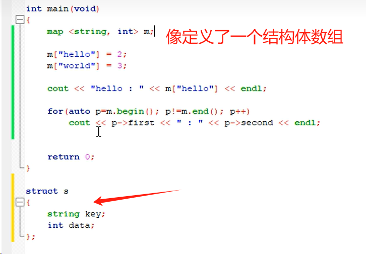
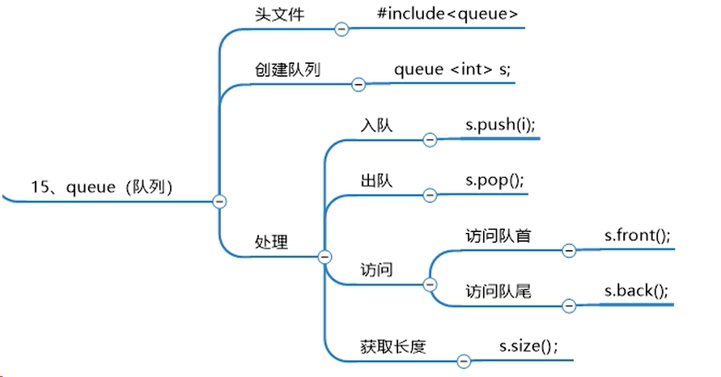

## c++
---
### 一些语法
```c++
#inculde<iostream>
using namespace std//头文件
cin >> n;
cout << "hh" << n++ << endl; //输入输出

string s = "hello";
string s2 = " world";
string s3 = s + s3;
cout << s << endl;//字符串类
cin >> s;//不会出现空格后的单词
cout << a << endl;
getline(cin,s);//可以输入一个句子，包括空格
cout << s.length() <<endl;
string s_sub = s.substr(6,5)//表示从第6个字符开始取后面的5个字符（包括该字符），从0开始算起
string s_sub = s.substr(6)//拷贝第6个后面的全部字符串
```

### stl
#### 容器
##### vector 
可变长数组
```c++
vector <int> v(10,2);//10个元素的数组，元素全为2
vector <int> v(10)//10个元素的数组，元素全为0
```
迭代器


##### set

```c++
set <int> s//后面不能带任何参数
```


##### map



##### stack(先进后出)

不能使用迭代器，只能使用s.top

##### queue(先进先出)

