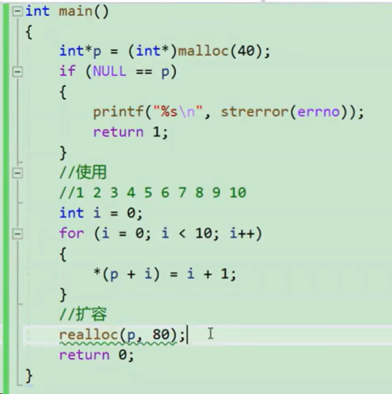

## 动态内存管理
____

为什么要开辟动态内存？
- 有时候我们需要的空间大小在程序运行的时候才能知道
  
___


> #### **核心**
> malloc
> free
> calloc
> realloc


#### 动态内存函数

> **malloc**和**free**
```c
void* malloc (size_t size);
```

```c
#include<errno.h>
#include<string.h>
#include<stdlib.h>
int main()
{
    ine arr[10] = {0};
    //动态内存开辟
    int* p = (int*)malloc(40);//强制转换类型
    if (p == NULL)
    {
        printf("%s\n", strerror(errno))//打印内存分配错误也ok
        return 1;//c语言历史习惯，返回0是正常返回
    
    }
    //使用
    int i = 0;
    for(i = 0; i < 10; i++)
    {
        *(p+i) = i;
    }
    for(i = 0; i < 10; i++)
    {
        printf("%d\n", *(p+i));
    }
    return 0;
    //没有free，并不是说内存空间就不会回收了，当程序退出的时候，系统会自动回收内存空间的

    free(p)//释放我的内存空间
    p = NULL;

}
```


free函数是用来释放动态开辟内存的
- 如果参数ptr指向的空间不是动态开辟的，那么free函数的行为是未定义的额
- 如果参数ptr是null指针，则函数什么事情都不做


> **calloc**
```c
void* calloc(size_t num,size_t size)
```


```
int*p = (int*)callocc(10,sizeof(int));

```

**如果你想初始化你就用calloc，不想初始化就用malloc**
> calloc = malloc+memset 先开辟后初始化


> realloc
作用：可以对动态开辟的内存进行调整

```c
void* realloc(void* ptr,size_t size)
```



