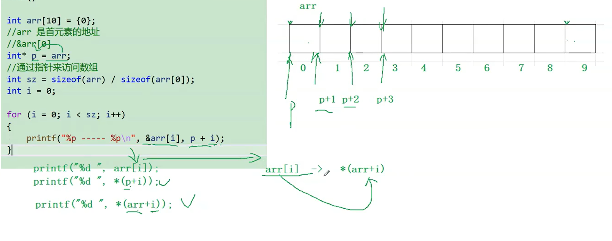
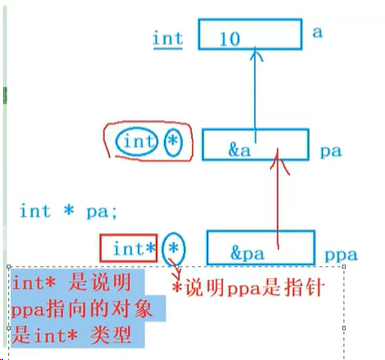
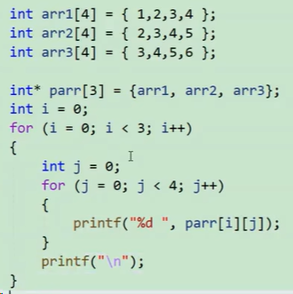
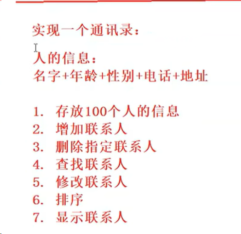

## 指针
1. **指针**是最小单元的编号，也就是**地址**
2. 平时口语中说的指针，通常指的是**指针变量**，是用来**存放内存地址**的变量
   
### 指针类型
```c
char *pc = NULL;
int *pi = NULL;
float *ps = NUll;
```
意义
1. 指针类型决定了指针在进行解应用操作时，我能有几个字节的访问权限
2. 指针类型决定了指针进行+1/-1操作时一次跳过几个字节

### 野指针
指针未初始化
### 指针运算

### 指针的解应用
通过指针，找到对应的内存和内存中的数据
```c
int a = 1;
int*p = &a;
//下面两者是等价的
*p+= 1;
a += 1;
 ```


&与*互为逆运算
    - &取变量的地址
    - *取地址对应的内存

### 数组与指针

数组名是首元素地址！

意思是
```
arr=p，*p=arr[0]， *(p+i)=a[0+i]=a[i];
```

### 一、二级指针
```c
int a = 10;
int* pa = &a;//pa是一个指针变量，一级指针变量
int** ppa = &pa;//ppa是一个二级指针变量
* pa = 20；//找到a
** ppa = 20；//找到a
printf("%d\n,a");
```
结果为20



**二级指针变量是用来存放一级指针变量的地址**

### 指针数组
**存放指针的数组就是指针数组**
```c
int a = 10;
int b = 20;
int c = 30;
int arr[10];

int* pa = &a;
int* pb = &b;
int* pc = &c;
//parr就是存放指针的数组
//指针数组
int* parr[10] = {&a, &b, &c};
//要打印的话
int i = 0;
for(i=0;i<3;i++)
{
    printf("%d ", *(parr[i]))
}

```
结果为10 20 30

（%c是字符 %d是整形 %s是字符串）

**应用：模拟二维数组**



因为前面的将&a,&b,&c存入的parr中，使用parr[i]只是获取到了parr数组的+i个元素

然后这里，因为parr中存放的就是一个数组的首地址，所以可以使用[j]来获取某个数组首地址+j的元素

### 字符指针
> char*


### 数组指针
> 指向数组的指针

int*p1[10]指针数组
int(*p2)[10]数组指针，p2可以指向一个数组，该数组有10个元素，每个元素是int类型


### 实现一个通讯录
