## 数据类型


- 日常用debug x86的环境
- release版本可以优化代码，它并不是改变代码，而是改变代码的效果，而且并不意味着你写的代码没有错误
- 故意写的死循环不能优化

 #### 数据类型介绍
 ##### 内置类型
 char  //字符数据类型   //1byte
 short  // 短整型  //  2
 int  //整型  //  4
 long  //长整型  //  4or8
 long long //更长的整型  // 8  （c99）
 float  //单精度浮点数   //  4
 double  //双精度浮点数  //  8

 ###### 类型的意义
 1. 使用这个类型开辟内存空间的大小（大小决定了使用范围）
 2. 如何看待内存空间的大小

##### 归类
###### 整型家族
char  ——>  字符本质是ASCII码值，是整型
signed 有符号
unsigned无符号
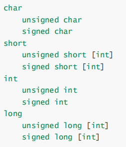

###### 浮点型家族
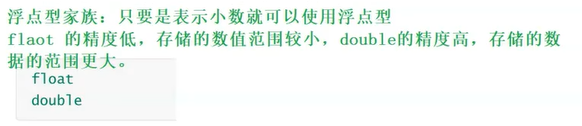

###### 构造类型/自定义类型、
- 数组
- 结构体  struct
- 枚举  enum
- 联合  union

###### 指针类型
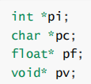

###### 空类型
void


#### 原码，反码，补码
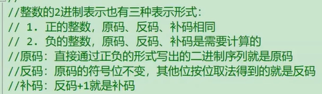
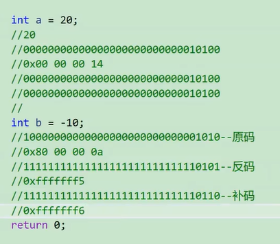
内存中本质存的是2进制，展示成16进制

对于整型来说：数据存放内存中其实存放的是补码

cpu只有加法器，1-1——> 1+（-1）


#### 大小端介绍

**什么是大小端**
大端字节序（存储）模式，是指数据的低位保存在内存的高地址中，而数据的高位，保存在内存的低地址中；
小端字节序（存储）模式，是指数据的低位保存在内存的低地址中，而数据的高位,，保存在内存的高地址中。

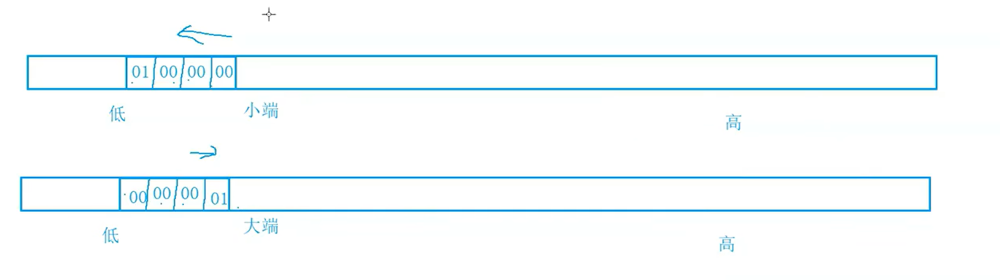
因为如果不强制类型转换，解引用访问的就是四个字节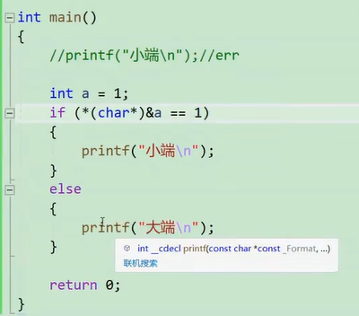


> strlen库函数（msdn）返回值类型为unsigned int

```c
int my_stelen(const char* str)
{
    assert(str);//判断传进来的指针是否为空指针
    int count = 0;
    while(*str)
    {
        str++;
        count++;
    }
    return count;
}
```
#### 浮点数存储规则
```c
int main()
{
 int n = 9;
 float *pFloat = (float *)&n;
 printf("n的值为：%d\n",n);
 printf("*pFloat的值为：%f\n",*pFloat);
 *pFloat = 9.0;
 printf("num的值为：%d\n",n);
 printf("*pFloat的值为：%f\n",*pFloat);
 return 0;
}
```
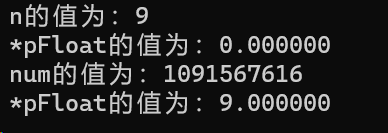
以整数的形式放进去，你就应该以整数的形式把他拿出来

小数在计算机中无法精确保存

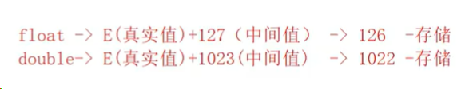
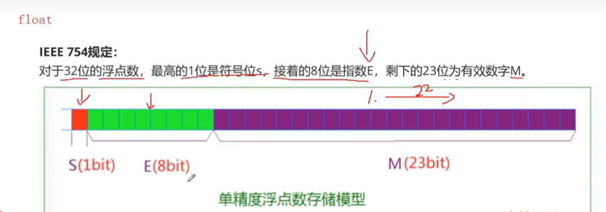
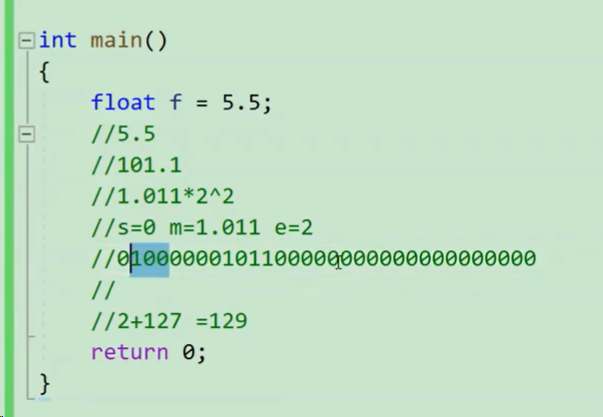


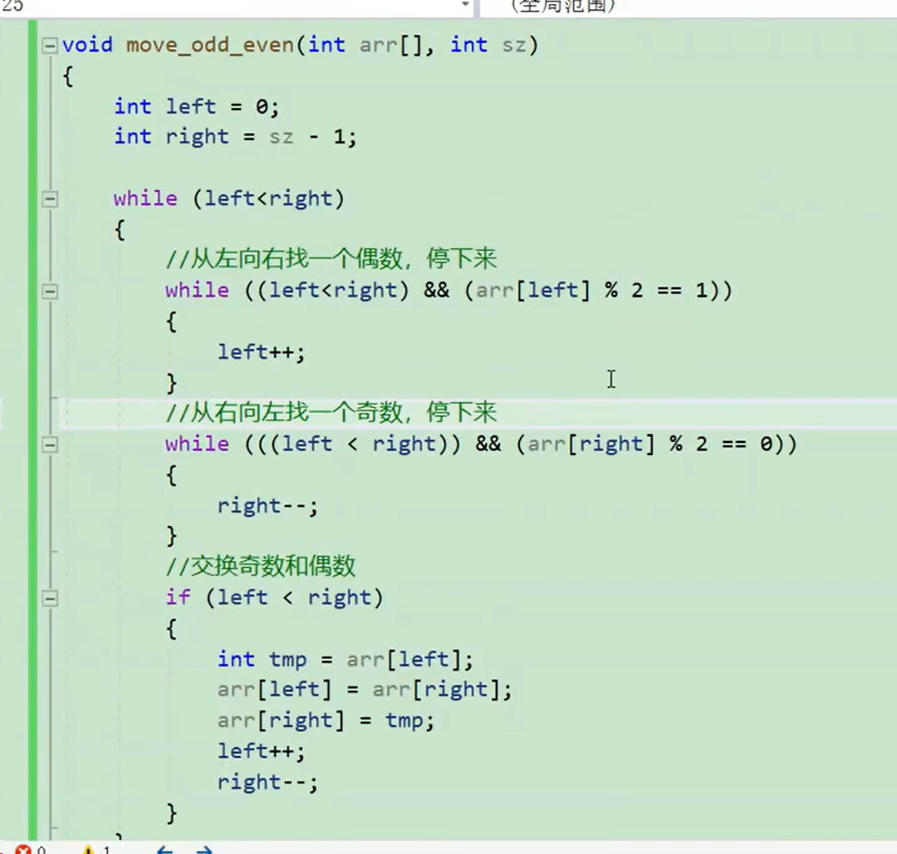

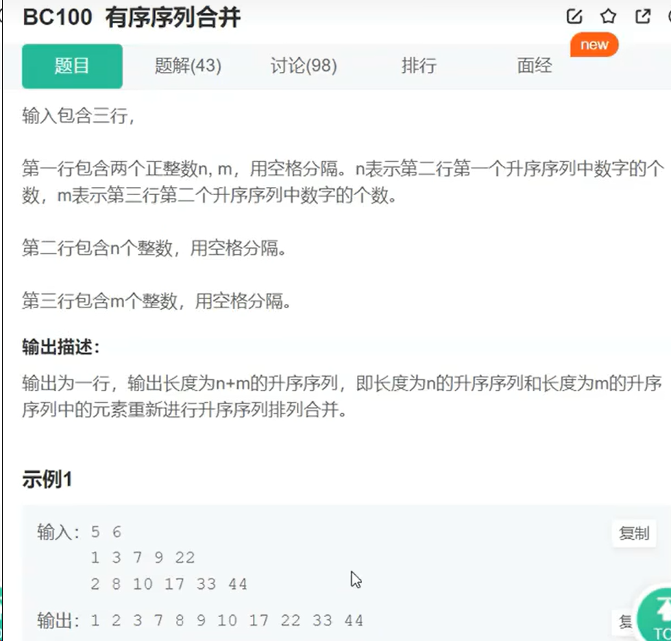
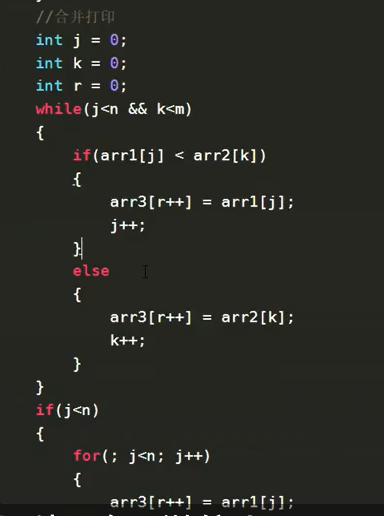
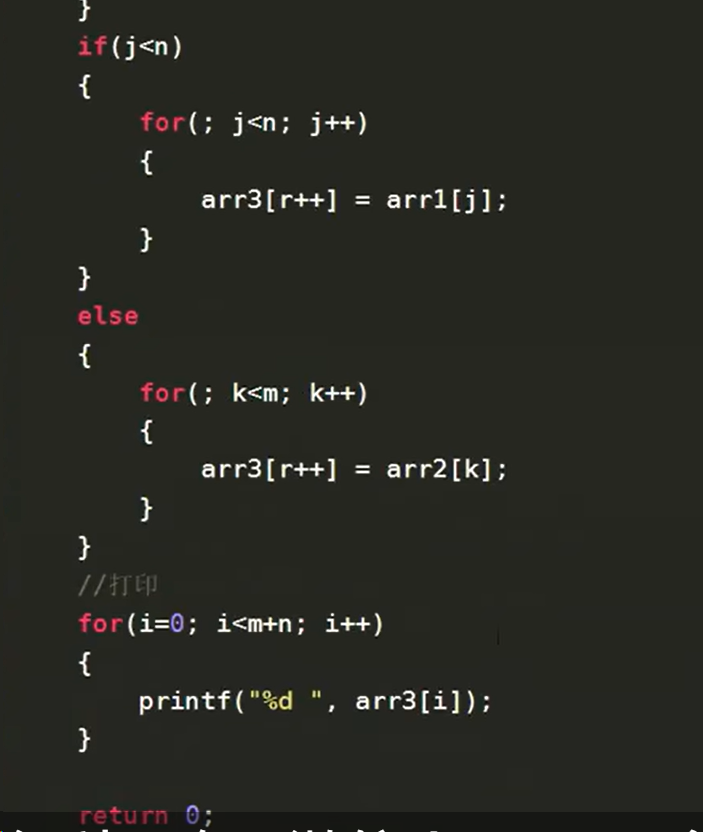