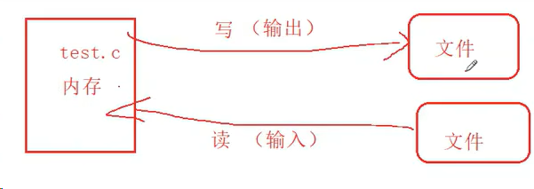
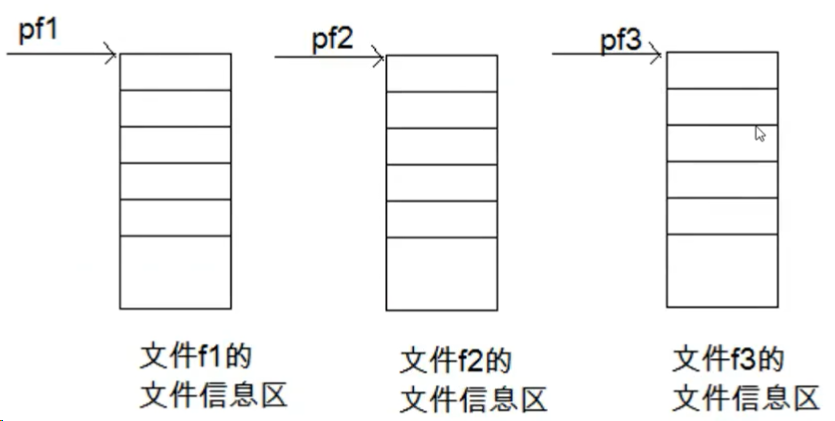
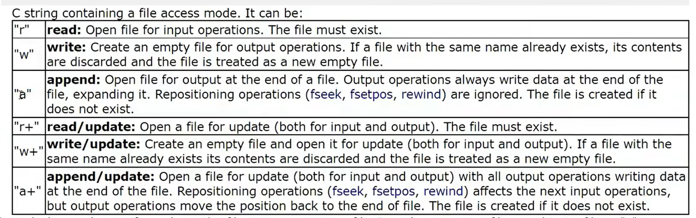

### 文件操作
---

why：
**数据持久化**

def:
硬盘上的文件就是文件
1. 程序文件
    - 源程序文件（.c）
    - 目标文件（windows环境为.obj）
    - 可执行程序（.exe）
2. 数据文件
    - 文件的内容不一定是程序，而是程序运行时读写的数据
  
        
#### 文件名
**文件的标识**
> 文件路径+文件主干名+文件后缀

```c
c:\code\test.txt
```


#### 文件的打开和关闭


##### 文件指针
```dotnetcli
FILE* pf;//文件的指针变量
```


##### 打开和关闭文件
```c
FILE* fopen(const char* filename,const char* mode);//打开文件

int fclose(FILE* stream);//关闭文件
```
