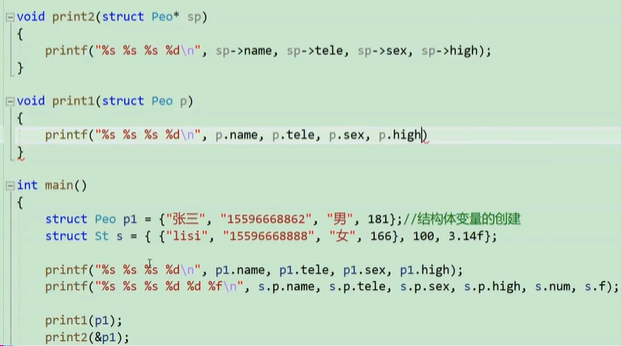

## 结构体
### 结构体类型声明

结构是一些值的结合，这些值称为成员变量。结构的每个成员可以是不同类型的变量

> 结构体声明格式: 
```c
struct tag
{
    member_list;
}variable_list;
```

```c
//人 声明的结构体类型
struct People
{
    char name[20];
    char tele[12];
    char sex[5];
    int height;
    
}p1, p2;
//p1p2是两个全局的结构体变量
int main()
{
    struct Peo p1 = { "张三","男", 181};//结构体变量的创建
    printf("%s %s %s %d\n", p1.name, p1.tele, p1.sex, p1.high);
}

```
结构体成员类型：标量、指针、数组甚至是其他结构体



### 结构体传参
**要传结构体的地址**
函数传参时，是要压栈的