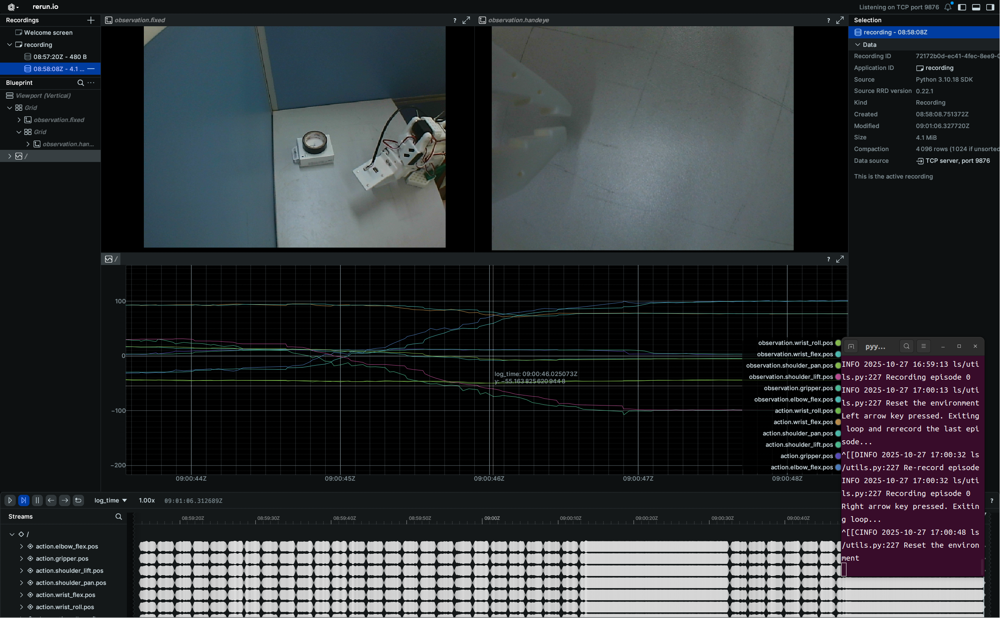
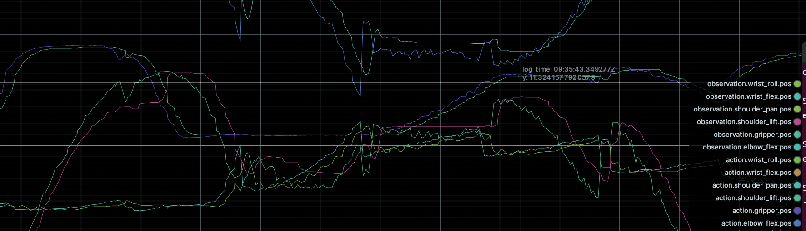
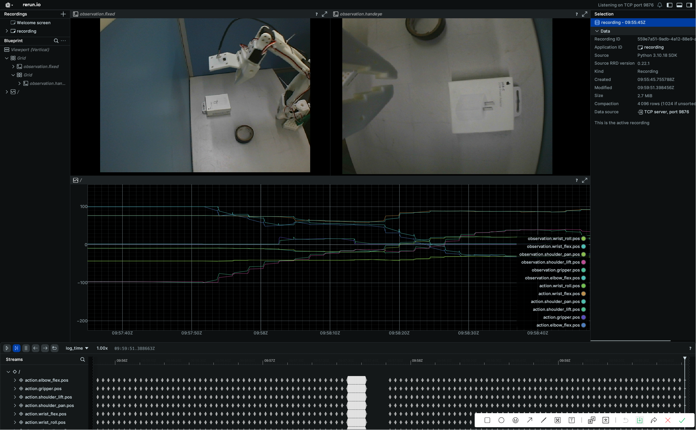

# 数据集

50个epoch

示教时比较缓慢

只有一个位置

但是覆盖4种抓法吧

# smolvla

```bash
lerobot-train   
--dataset.repo_id=Lisette1231/20251026so101   
--policy.type=smolvla  
--output_dir=outputs/train/20251026so101smolvla   
--job_name=20251026so101smolvla   
--policy.device=cuda  
--wandb.enable=true   
--policy.repo_id=Lisette1231/20251026so101smolvla   
--policy.push_to_hub=true   
--save_freq=2000 
--steps=10000
```



推理在eval_20251027so101smolvla4

先是测试了2次，机械臂非常抖动，抓取成功率3中2吧，曲线波折


# act

model.safetensors:207M

先推了两次还不错

加了个只取前50步预测

--save_freq=2000 
--steps=20000



act3没加只取前50步预测

act4加了，好像确实是没那么抖


# diffusion policy

马的，你就没成功过好吧，让我看看这次行不行。

1.07G

--save_freq=2000 
--steps=20000




# 数据采集笔记（copy）

如今的动作控制模型，如VLA大模型，DP/ACT模型都是训练一个状态转移模型，即输入condition，返回一个action，next action 是完全由action+condition决定的，是一个完整的马尔科夫链

> 所以数据采集中的conditon的选择是很重要的