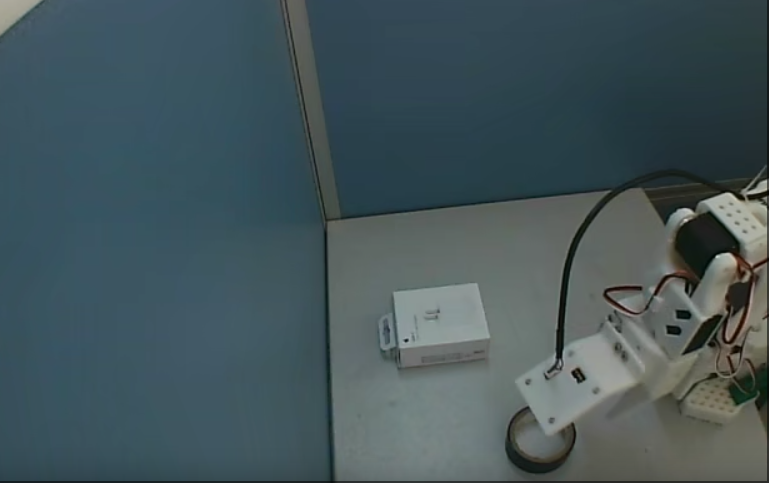

# 9月和10月的工作总结

## 9月

### 真机

主要是在熟悉这个硬件和lerobot cli的使用

当时的任务是：把胶带抓起来-放进快递盒子中

bug～

1. 我的任务描述不完整——only “grab the black tape”
2. 背景环境不固定，右下角有时候出现手臂，有时候出现电线等等问题
3. 抓取任务不“一气呵成”，收集数据期间自己遥操都会在抓取点徘徊
4. 抓取位置可以说没有任何想法，乱放的，想的是能抓就行
5. 用cpu跑推理（不兼容，但是没想到后面可以忽略这个报错），机械臂抖成帕金森

只跑了act，只收集了30个epoch

可以说这一个月算是当成游戏完了

---

但是当时推理的结果还不错，可能就尝试了几次

---

### 论文

看了老师发的5篇论文，我感觉我看论文有点问题，原理原理没看懂，细节细节没看到，改进方法

。。。。未想出

A Survey on Vision-Language-Action Models: An Action Tokenization Perspective

Embodied AI Agents: Modeling the WorldA 

Survey: Learning Embodied Intelligence from Physical Simulators and World ModelsLearning 

Fine-Grained Bimanual Manipulation with Low-Cost Hardware

EEG-based brain-computer interface enables real-time robotic hand control at in dividual finger level

## 10月份

### 真机

#### 10.11-10.17

后面机器学习项目本想用这个lerobot的项目来结课的。恩。

开完组会的的当天晚上，我就去尝试收集了一波新的数据集，然后弄了数据集上传huggingface，和wandb的记录

任务为“grab the black tape and put it on the white box”

10月13日收集的50个epoch

非常多的bug

1. 胶带摆放位置面积大，但是数据集少
2. 同时你还录有两个任务，但是只有50个epoch
3. 背景问题依旧
4. 操作问题依旧

现在11.3的我来看这注定是一个失败的任务

当时还用服务器同时训练act和dp，还训练了pi0

推理的时候act还能整，dp完全动都动不了呵呵，pi0当时用cpu直接给我干死机了

这个任务也是不了了之

---

#### 10.24-10.27

10月25-27每天都录制了一个数据集，用的还是旧版本啊啊！！本地是离散的视频，还好hf当时用代码转换了

20251025so101 在可视范围与可抓范围内画了格子来放胶带，录制的时候每个格子加上交叉线的位置只录了一次，50个epoch，面积太大，一个点的录制次数太少

20251025so101-simple 于是当天我就只录制了3个点位的，但是但是只有12个epoch啊，效果怎么好

20251026so101 另一天我就快速录制了50个epoch for 几个点位的，训练了个smolvla，推理跟颠了一样 ，查了一下可能是我当时录制的时候速度太快了

20251027so101于是慢速版本的又来了。。

smolvla能抓了，但是抓取成功率还是很低，抖动程度也很高，看来得异步推理了？

act很强，同时用了别人的插值和滤波算法之后感觉确实不错了

dp，推理太慢了，动作一卡一卡的不过抓取成功率还是有的，我看有人说是lerobot框架的dp不太行，原版的dp还是挺ok的 

---

### 学习的一些内容

看完了ros2025训练营的视频，对这整个领域的了解更深了，同时也发现自己基础不太行我哭！

关注了许多po主 in red book

没怎么看论文