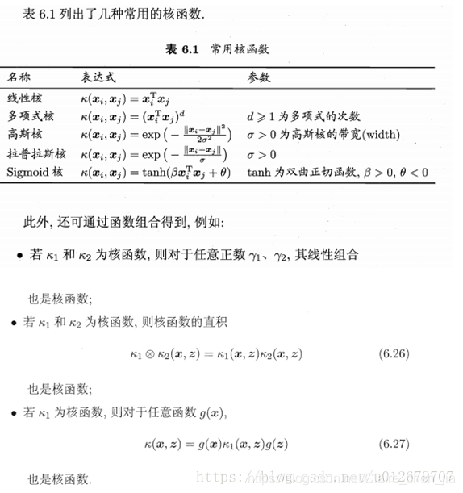

## SVM
___
- 分类模型
- 三宝，间隔，对偶，核技巧
- 支持向量机（Support Vector Machine，SVM）是一种机器学习算法，用于分类和回归分析。下面是对SVM中的间隔、对偶和核模型的解释：

1. **间隔（Margin）**：
   SVM的目标是找到一个能够将不同类别的数据点分开的决策边界（超平面），并且使得这个决策边界离最近的数据点（支持向量）的距离尽可能远。这个距离就是间隔。在二维空间中，间隔可以直观地理解为两个平行的决策边界之间的距离。SVM的优化目标就是要最大化这个间隔。

2. **对偶（Dual）**：
   SVM的原始形式是通过求解一个凸优化问题来获得决策边界的参数。然而，由于求解原始问题的复杂度较高，对偶问题被提出来简化求解。对偶问题是将原始问题通过拉格朗日对偶性转换得到的一个等价形式。通过求解对偶问题，可以得到SVM的支持向量和对应的拉格朗日乘子，从而确定决策边界。

3. **核模型（Kernel）**：
   在某些情况下，数据并不是线性可分的，这时候就需要引入核函数来将数据从原始空间映射到一个更高维的特征空间，使得数据在这个特征空间中是线性可分的。常用的核函数有线性核、多项式核、高斯径向基函数（RBF）核等。核函数的作用是通过计算两个样本之间的内积来隐式地进行高维空间的特征映射，而无需直接计算映射后的特征向量。这样就避免了在高维空间中的计算复杂性。使用核函数的SVM称为核SVM，它可以处理非线性可分的数据，并且在许多实际应用中取得了很好的效果。

综上所述，SVM通过最大化间隔来找到一个能够将数据分开的决策边界，通过求解对偶问题来确定支持向量和决策边界的参数，而核函数则可以将数据映射到更高维的特征空间，使得数据在这个空间中线性可分，从而处理非线性可分的情况。
- [svm学习链接](https://blog.csdn.net/Claire_chen_jia/article/details/110916001)

##### 线性不可分
**软间隔**：假如数据是完全线性可分的，决策界面将为硬间隔（指的是完全分类正确，不能存在分类错误的情况。）**软间隔，就是允许一定量的样本分类错误**。

**核函数**：它可以将样本从原始空间映射到一个更高维的特质空间，使得样本在新的空间中线性可分。
（妙啊：我们可以形象地理解为：桌子上零散地放着核桃和腰果两种零食，我们要把它分类。那么假设我们用力且巧妙的一拍打，恰好可以把所有腰果跳出桌面，停在空中，那么我们用力且巧妙的一拍打就可以理解为是核函数。）

#### 分类
svm.SVC（都可以。控制核函数）
svm.LinearSVC   （只针对线性核函数）

#### 回归
svm.SVR
svm.LinearSVR
