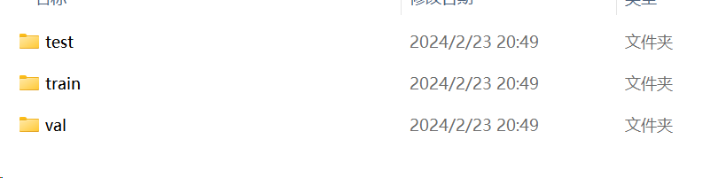

### 任务一

``` python
from matplotlib import pyplot as plt
import pandas as pd
import numpy as np

# pandas读取csv的文件
data = pd.read_csv("D:\桌面\小a ai组考核\田字型散点.csv", header=None)
df = pd.DataFrame(data)

# 将数据转化为数组
df = np.array(df)

# 提取数据
x1 = df[0]
y1 = df[1]
l1 = df[2]

# 设置图形大小
plt.figure(figsize=(20, 8), dpi=80)

# 获取figure和axis
fig = plt.figure(figsize=(5, 5))
ax = fig.add_subplot(111)

# 隐藏上边和右边（框）
ax.spines['top'].set_color('none')
ax.spines['right'].set_color('none')

# 移动另外2个轴
ax.xaxis.set_ticks_position('bottom')
ax.spines['bottom'].set_position(('data', 0))
ax.yaxis.set_ticks_position('left')
ax.spines['left'].set_position(('data', 0))

# 设置x轴范围
plt.xlim((-10, 10))

# 调整x轴刻度
my_x_ticks = np.arange(-10, 12.5, 2.5)
plt.xticks(my_x_ticks)

# 标记0的点为蓝，1的为红
plt.scatter(x1[l1 == 0], y1[l1 == 0], c='blue')
plt.scatter(x1[l1 == 1], y1[l1 == 1], c='red')

# 绘图
plt.show()
```


(只学了mateplotlib的时候就想画图，但不知道怎么读csv文件，学了numpy和pandas后，pandas.read_csv真香(●ˇ∀ˇ●))

---
### 任务二

##### 灰度图像的转化和计算方差
```python
import cv2
import numpy as np

image = cv2.imread("E:\\pycharm\\my first project\\picture\\image.jpg")    # 1.读取图像
gray_image = cv2.cvtColor(image, cv2.COLOR_BGR2GRAY)    # 2.将图像转为灰度图
gray_values = np.array(gray_image, dtype=np.int64)    # 3.计算每个像素的灰度值
mean_value = np.mean(gray_values)   # 4.计算灰度值平均值
diff = gray_values - mean_value
diff_squared = np.power(diff, 2)    # 5.计算每个像素灰度值与平均值的差值的平方
mean_squared = np.mean(diff_squared)    # 6.计算差值的平方的平均值
variance = mean_squared     # 7.灰度值方差
print(variance)


```
###### 划分数据集
```python
import os
import random
import shutil

# 随机
# 创建保存图像的文件夹
def makedir(new_dir):
    if not os.path.exists(new_dir):
        os.makedirs(new_dir)


random.seed(1)  # 随机种子

# 1.确定原图像数据集路径
dataset_dir = "E:/data"   # 原始数据集路径
# 2.确定数据集划分后保存的路径
split_dir = "E:/data"    # 划分后保存路径
train_dir = os.path.join(split_dir, "train")
valid_dir = os.path.join(split_dir, "val")
test_dir = os.path.join(split_dir, "test")
# 3.确定将数据集划分为训练集，验证集，测试集的比例
train_pct = 0.8
valid_pct = 0.1
test_pct = 0.1
# 4.划分
for root, dirs, files in os.walk(dataset_dir):
    for sub_dir in dirs:  # 遍历0，1，2，3，4，5...9文件夹
        imgs = os.listdir(os.path.join(root, sub_dir))  # 展示目标文件夹下所有的文件名
        imgs = list(filter(lambda x: x.endswith('.jpg'), imgs))  
        random.shuffle(imgs)  # 乱序图片路径
        img_count = len(imgs)  # 计算图片数量
        train_point = int(img_count * train_pct)  # 0:train_pct
        valid_point = int(img_count * (train_pct + valid_pct))  # train_pct:valid_pct

        for i in range(img_count):
            if i < train_point:  # 保存0-train_point的图片到训练集
                out_dir = os.path.join(train_dir, sub_dir)
            elif i < valid_point:  # 保存train_point-valid_point的图片到验证集
                out_dir = os.path.join(valid_dir, sub_dir)
            else:  # 保存valid_point-结束的图片到测试集
                out_dir = os.path.join(test_dir, sub_dir)
            makedir(out_dir)  # 创建文件夹
            target_path = os.path.join(out_dir, imgs[i])  # 指定目标保存路径
            src_path = os.path.join(dataset_dir, sub_dir, imgs[i])  # 指定目标原图像路径
            shutil.copy(src_path, target_path)  # 复制图片

        print('Class:{}, train:{}, valid:{}, test:{}'.format(sub_dir, train_point, valid_point - train_point,
                                                             img_count - valid_point))

```

(就做到这了/(ㄒoㄒ)/~~，属于边在网上找资料，看视频，边学边写的，一些包的使用都还不是很熟练，在学习线性回归模型和梯度下降)