### 深度学习
---
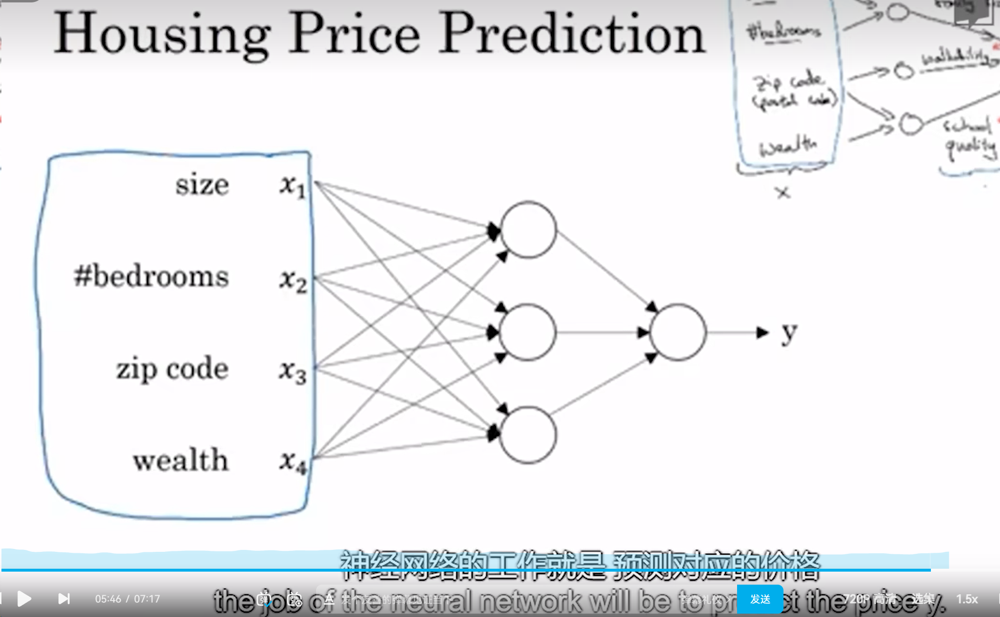
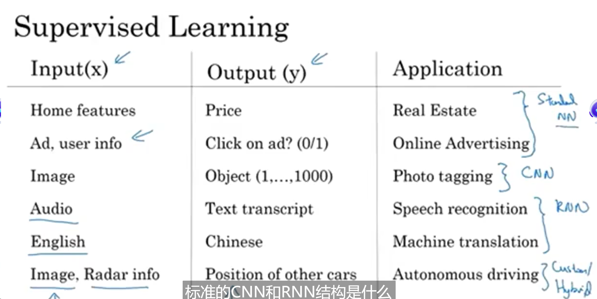
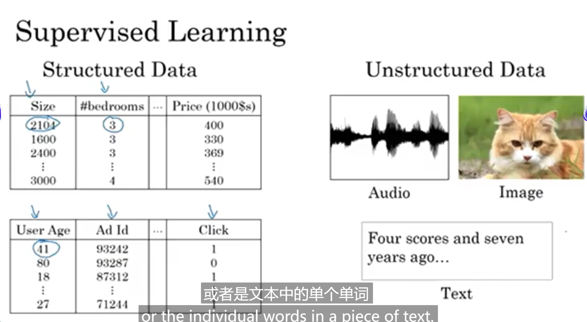

##### why deep learning are popular now?
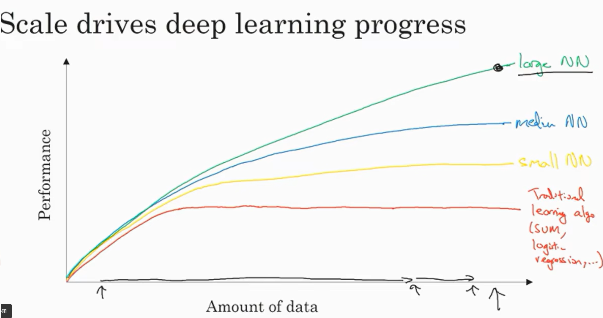
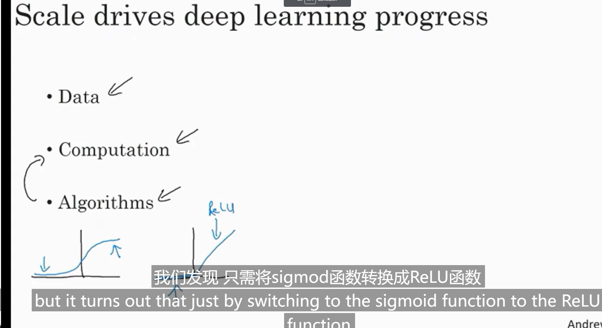
你下意识用for来遍历元素

---


#### 逻辑回归（logistic regression）
- 二分分类算法
（soga之计算机保存一张图片，要保存3个独立矩阵，分别有红绿蓝三个通道rgb。要把这些像素亮度值放进一个特征向量，这个矩阵的维度将是64*64*3，表示输入特征向量的维度）

- 目标：训练出一个分类器
  （以图片的特征向量x为输入，预测出结果标签，1/0）

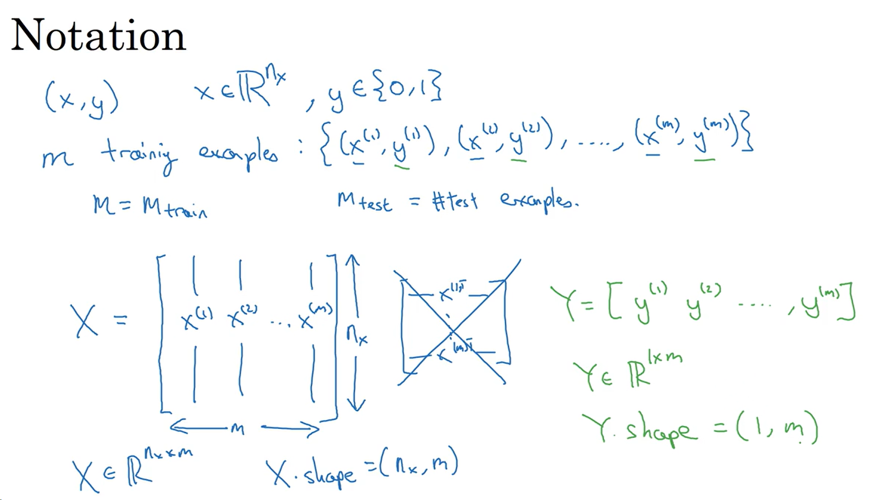

> **sigmoid函数**
> 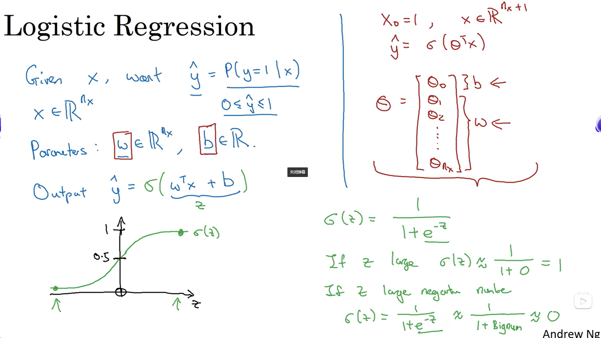
> **cost function**(交叉熵损失函数)


损失函数（loss function）
- 只适用于单个训练样本，是衡量单一训练样例的效果

成本函数
- 基于参数的总成本，在逻辑回归中我们要找到合适的参数w和b，然后让成本函数尽可能地小。是用于衡量参数w和b的效果，在全部训练集上衡量

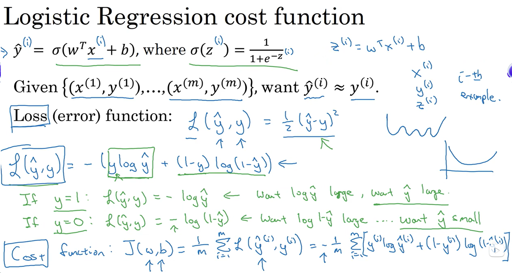

逻辑回归可以被看作是一个非常小地神经网络

如何训练w和b？
> 梯度下降法

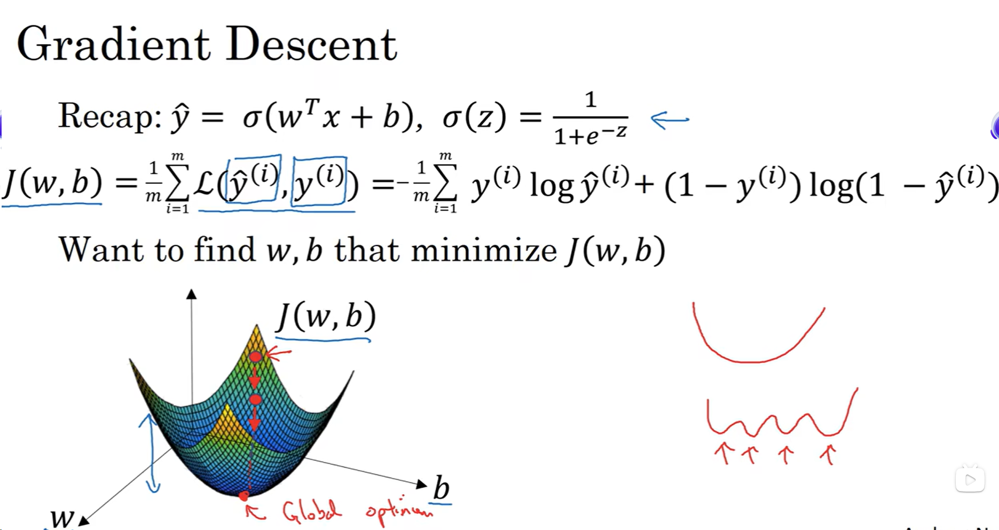
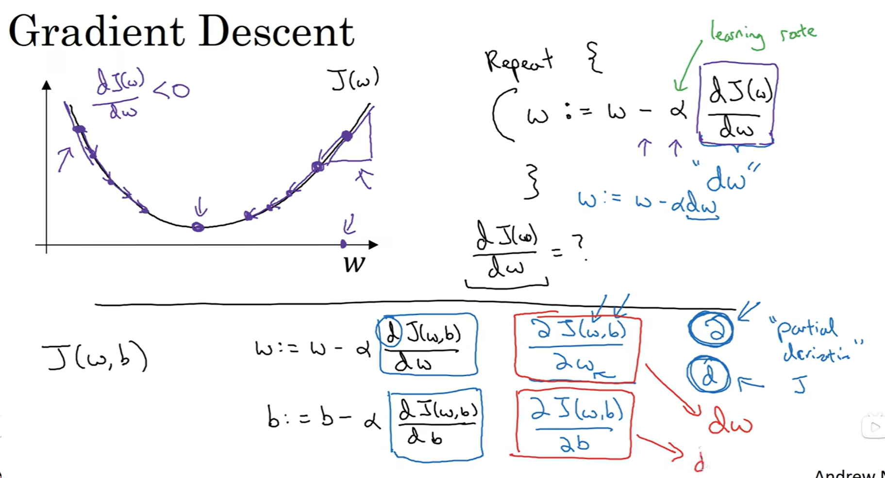
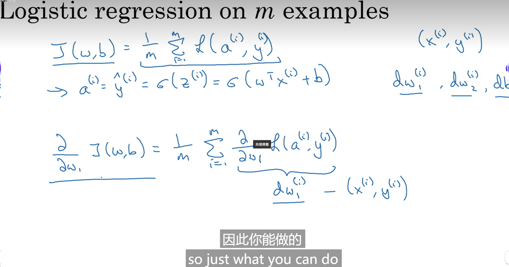

> **向量化**
> 消除你的代码中显式for循环语句的艺术
> 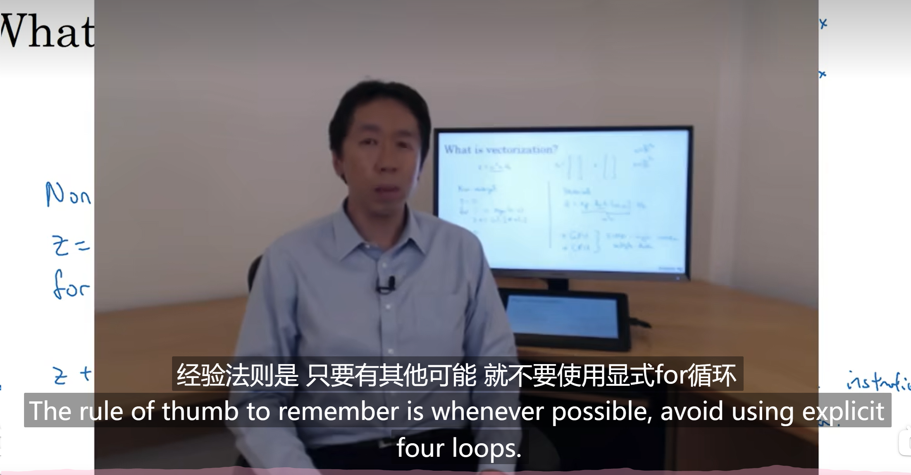

```python
import numpy as np
import time
a = np.random.rand(1000000)
b = np.random.rand(1000000)
tic = time.time()
c = np.dot(a,b)
toc = time.time()//记时间的
print(c)
print("Vectorized version:" + str(1000*(toc-tic)) + "ms")

c1 = 0
tic1 = time.time()
for i in range(1000000):
    c1 += a[i]*b[i]
toc1 = time.time()
print(c1)
print("For loop:" + str(1000*(toc1-tic1)) + "ms")
```
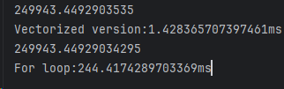
好快！
summary：避免用for，用向量化，np.dot()


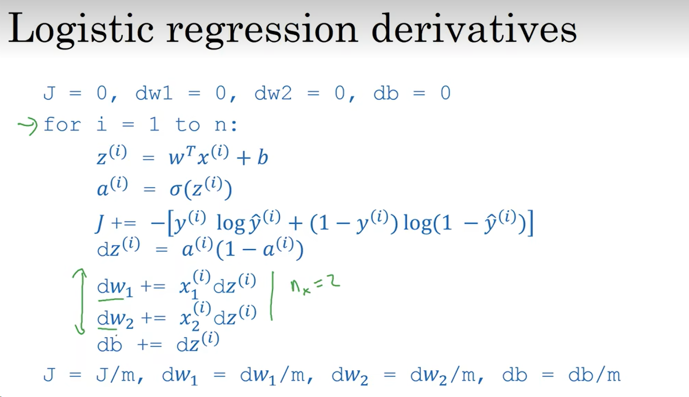

秒啊
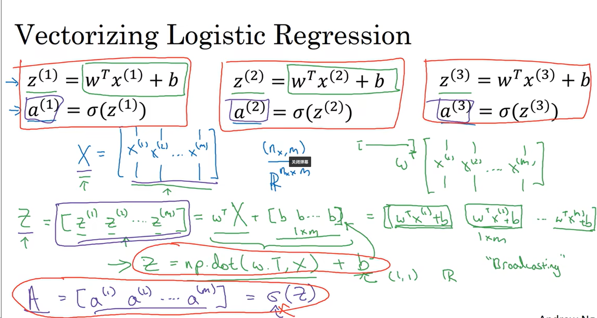
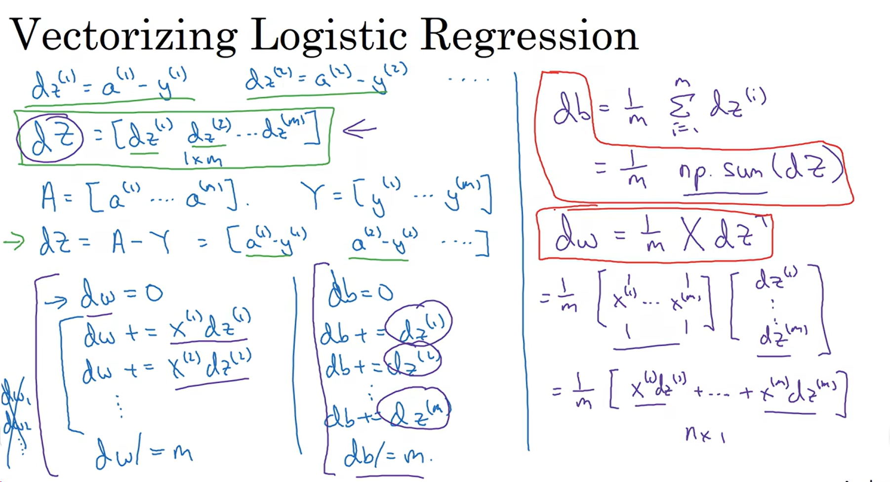
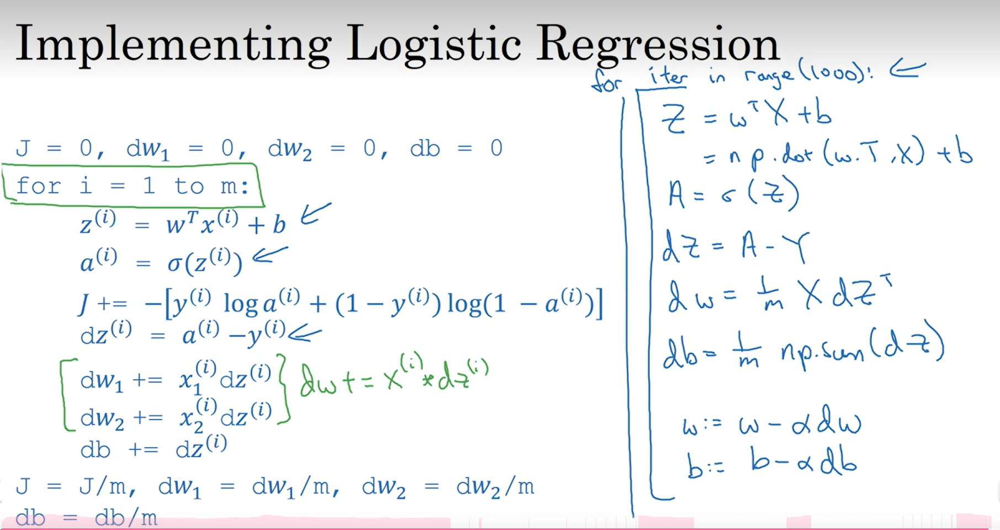

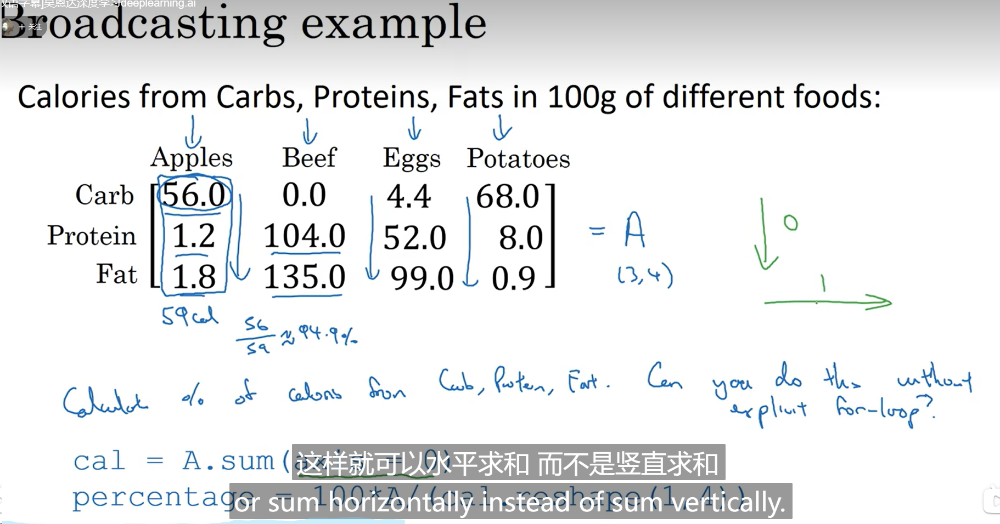

some tips
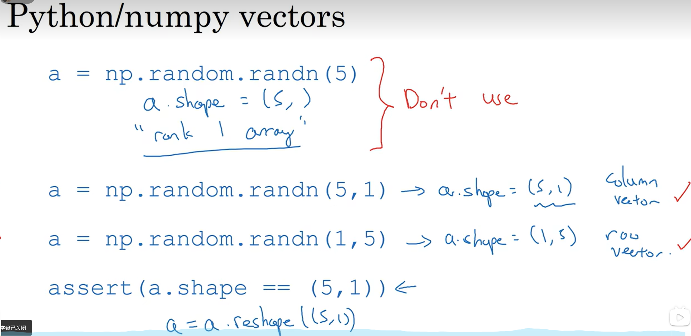

### pytorch学习

##### 一些名词学习

> **激活函数**

 激活函数是神经网络中的一种函数，它负责在神经网络的每一层中对输入信号进行转换，以产生输出信号。其主要作用包括：
 1. **引入非线性特性：** 激活函数引入了非线性特性，使得神经网络能够学习和表示复杂的非线性关系，从而提高了网络的表达能力。如果没有激活函数，多层神经网络将退化为线性模型，无法学习非线性模式。
 2. **输出范围约束：** 不同的激活函数将输入映射到不同的输出范围内。例如，Sigmoid函数将输入映射到(0,1)之间，Tanh函数将输入映射到(-1,1)之间，而ReLU函数将负值映射为0，正值保持不变。这些输出范围的限制有助于控制神经网络的输出，并根据需要对输出进行归一化或缩放。
 3. **增强网络的非线性拟合能力：** 合适的激活函数能够增强神经网络的非线性拟合能力，使得网络可以更好地适应训练数据的复杂特征，提高模型的泛化能力。
4. **稀疏性和稳定性：** 一些激活函数可以增加网络的稀疏性，即使在高维空间中也能够保持较少的活跃神经元，从而减少计算成本和过拟合的风险。同时，合适的激活函数还可以提高网络的稳定性，使得网络更容易收敛并且更具鲁棒性。

>**常用的relu函数和sigmoid函数**


> **代价函数**

是另一种与损失函数密切相关的概念，通常用于描述整个训练集上的平均损失。在深度学习中，代价函数与损失函数的概念经常被交替使用，它们在大多数情况下是等价的，但代价函数可能涵盖更广泛的范围，包括了损失函数和正则化项等。在实际应用中，人们常常使用代价函数来指代用于训练模型的目标函数。


> **损失函数**

是在训练深度学习模型时用来度量**模型预测值与真实标签之间差异**的函数。它是**模型优化过程中的目标函数**，用于**衡量模型的性能好坏**。

> **张量**

通常指多维数组，具有多个维度，可以是标量（0维张量）、向量（1维张量）、矩阵（2维张量）以及更高维度的数组。
 ```python
# 创建一个3维张量
tensor_3d = torch.tensor([[[1, 2], [3, 4]], [[5, 6], [7, 8]]])# (有点抽象(((φ(◎ロ◎;)φ))))
```

**如何判断张量是几维的？**
1. 使用`.dim()`方法来获取张量的维度数量
2. 使用`.shape`属性来获取张量的形状信息

```python
import torch

# 创建一个标量（0维张量）
scalar = torch.tensor(3.14)
print("Scalar dimension:", scalar.dim())  # 输出：Scalar dimension: 0

# 创建一个向量（1维张量）
vector = torch.tensor([1, 2, 3])
print("Vector dimension:", vector.dim())  # 输出：Vector dimension: 1

# 创建一个矩阵（2维张量）
matrix = torch.tensor([[1, 2], [3, 4]])
print("Matrix dimension:", matrix.dim())  # 输出：Matrix dimension: 2

# 创建一个3维张量
tensor_3d = torch.tensor([[[1, 2], [3, 4]], [[5, 6], [7, 8]]])
print("3D tensor dimension:", tensor_3d.dim())  # 输出：3D tensor dimension: 3
```

还可以通过查看张量的`.shape`属性来获取张量的形状信息，形状信息中的元素数量即代表了张量的维度。例如：

```python
# 获取张量形状
print("Scalar shape:", scalar.shape)  # 输出：Scalar shape: torch.Size([])
print("Vector shape:", vector.shape)  # 输出：Vector shape: torch.Size([3])
print("Matrix shape:", matrix.shape)  # 输出：Matrix shape: torch.Size([2, 2])
print("3D tensor shape:", tensor_3d.shape)  # 输出：3D tensor shape: torch.Size([2, 2, 2])
```

在这里，`.shape`属性返回的是一个`torch.Size`对象，它实际上是一个元组，其中的元素表示了张量在每个维度上的大小。通过检查这个元组的长度，你也可以判断张量的维度数量。

> **前向传播**

用于计算模型对输入数据的预测结果。

过程如下：

1. 输入数据经过模型的第一个层（通常是输入层），得到模型的中间表示或特征向量。
2. 中间表示经过模型的其他层（如隐藏层），通过线性变换和激活函数的作用，逐步提取并组合特征信息。
3. 最终的中间表示经过模型的输出层，经过一些额外的变换（如Softmax），得到模型的最终预测结果。

在PyTorch中，通常会将前向传播过程封装在继承自`nn.Module`的子类的`forward`方法中。通过调用模型实例的`forward`方法，可以对输入数据进行前向传播，并得到模型的预测结果。

> **反向传播**

用于计算损失函数相对于模型参数的梯度的一种方法。它是通过链式法则来实现的，可以高效地计算损失函数对每个参数的梯度，从而实现模型的参数优化。

过程如下：

1. **前向传播：**
   - 首先，输入数据经过模型的各个层，通过一系列的线性变换和非线性激活函数的作用，最终得到模型的输出。这个过程称为前向传播，它将输入数据转换为模型的预测结果。

2. **计算损失：**
   - 在前向传播的过程中，模型的预测结果和真实标签之间会产生误差，损失函数用于衡量这种误差的大小。在反向传播中，首先需要计算损失函数相对于模型输出的梯度，即损失函数对预测结果的梯度。

3. **反向传播：**
   - 接下来，利用链式法则从输出层向输入层反向传播梯度。反向传播的过程中，通过将损失函数的梯度传递回模型的每一层，并结合每一层的导数，计算损失函数对模型参数的梯度。这个过程从输出层开始，逐渐向输入层传播，直到计算出损失函数对所有参数的梯度。

4. **参数更新：**
   - 最后，利用损失函数对模型参数的梯度信息，通过优化算法来更新模型的参数。常用的优化算法包括随机梯度下降（SGD）、动量优化法、Adam等。优化算法根据参数的梯度信息和学习率来更新模型的参数，使损失函数的值逐渐减小，从而使模型的预测结果更接近真实标签。

反向传播的主要目的是计算损失函数相对于模型参数的梯度，以便通过优化算法来调整模型的参数，使模型的预测结果更接近真实标签。反向传播的有效性和高效性使得深度学习模型能够在大规模数据集上进行训练，并取得优秀的性能。


#### 框架使用

首先，导入PyTorch库
```python
import torch
import torch.nn as nn
import torch.optim as optim
```

- `torch`: PyTorch的核心库，提供张量操作和自动微分功能。
- `torch.nn`: PyTorch中的神经网络模块，包含了用于构建神经网络的各种层和损失函数。
- `torch.optim`: 包含了PyTorch中各种优化算法的模块。

接下来，定义一个简单的数据集。

```python
X_train = torch.tensor([[1.0], [2.0], [3.0], [4.0]], dtype=torch.float32)
y_train = torch.tensor([[0.0], [0.0], [1.0], [1.0]], dtype=torch.float32)
```

- `X_train`: 输入特征，这里我们使用一个简单的一维张量作为输入。
- `y_train`: 标签，用于表示每个样本的类别或者目标值。

然后，定义一个简单的神经网络模型。

```python
class SimpleModel(nn.Module):
    def __init__(self):
        super(SimpleModel, self).__init__()  # 调用父类的构造函数，初始化父类的属性
        self.linear = nn.Linear(1, 1)  # 创建一个线性层，输入维度为1，输出维度为1

    def forward(self, x):
        return torch.sigmoid(self.linear(x))  # 使用线性层进行线性变换，并通过sigmoid函数进行非线性变换
```
通过调用`super().__init__()`，可以调用父类的构造函数（`__init__`方法），在子类的构造函数中完成对父类属性的初始化。


这里我们使用了`nn.Module`类来定义模型。`SimpleModel`类继承自`nn.Module`类，我们需要在构造函数`__init__`中定义模型的结构，在`forward`方法中定义前向传播过程。

（类（Class）是一种用于创建对象的蓝图或模板。`nn.Module`是一个基类，用于构建神经网络模型。通过继承nn.Module类，我们可以创建自定义的神经网络模型，并在其中定义模型的结构和前向传播过程。这样做的好处是能够利用PyTorch提供的丰富功能和自动求导机制。）

(在构造函数中，我们可以初始化对象的属性，以及执行其他必要的初始化操作。在定义模型类时，通常会在构造函数中定义模型的结构，包括各个层的初始化。)

(在PyTorch中，我们通常会创建一个继承自`nn.Module`的子类，并在其中定义模型的结构。在构造函数中，我们可以初始化模型的各个层，并将它们作为类的属性。然后，我们可以在forward方法中定义模型的前向传播过程，即输入数据通过模型各个层的计算过程，最终得到模型的输出。)


- `nn.Linear`: 线性层，也称为全连接层，它接收输入并通过线性变换产生输出。在本例中，我们使用一个线性层作为模型的唯一一层，输入维度为1，输出维度为1。

接着，我们初始化了模型、损失函数和优化器。

```python
model = SimpleModel()
criterion = nn.BCELoss()
optimizer = optim.SGD(model.parameters(), lr=0.01)
```

- `model`: 创建了一个`SimpleModel`类的实例，即我们定义的神经网络模型。
- `nn.BCELoss()`: 二元交叉熵损失函数，用于二分类问题的损失计算。
- `optim.SGD`: 随机梯度下降优化器，用于优化模型参数。我们传递了模型的参数`model.parameters()`以及学习率`lr=0.01`。

接下来，我们进行模型的训练。

```python
for epoch in range(num_epochs):
    # 前向传播
    outputs = model(X_train)
    loss = criterion(outputs, y_train)

    # 反向传播和优化
    optimizer.zero_grad()
    loss.backward()
    optimizer.step()
```

在每个训练周期中，我们执行以下步骤：

1. 前向传播：将输入数据传递给模型，得到模型的输出。
2. 计算损失：使用损失函数计算模型预测值与真实标签之间的差距。
3. 反向传播：根据损失值计算梯度，并反向传播梯度。
4. 优化：根据梯度更新模型参数。

最后，我们使用训练好的模型对测试数据进行预测。

```python
X_test = torch.tensor([[2.5], [3.5], [5.0]], dtype=torch.float32)
with torch.no_grad():
    predictions = model(X_test)
    predicted_labels = predictions.round()
```

我们使用训练好的模型对测试数据`X_test`进行预测，并将预测结果四舍五入得到二分类标签。

#### 什么是神经网络
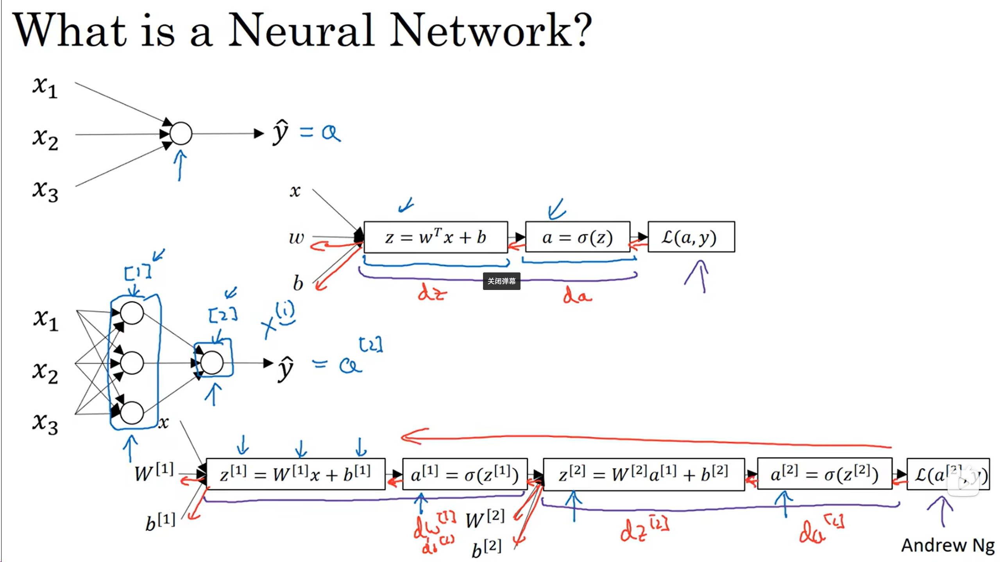
[1] means layer

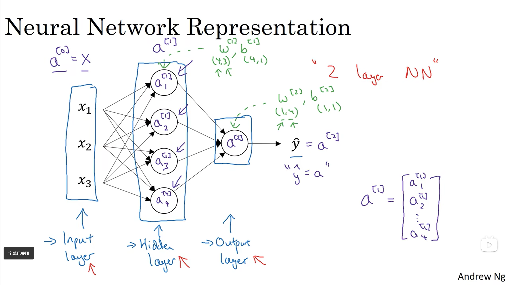
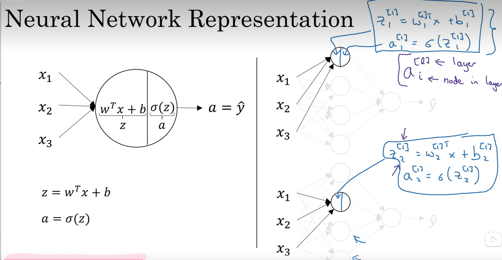

第一层隐含层代表用四组不同的w和b来计算四组z和a
hidden layer的个数是自己设置的
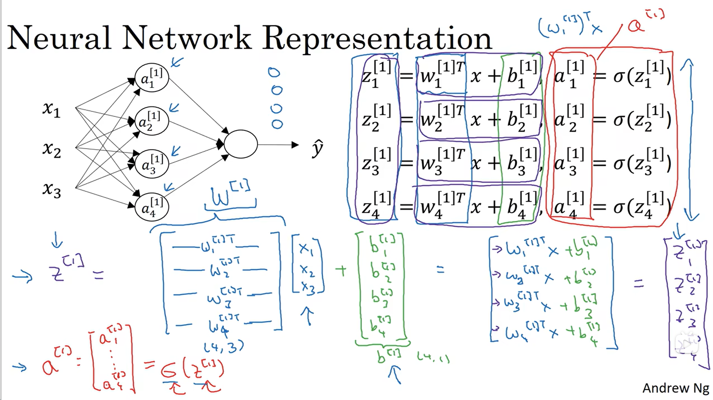

隐藏层的节点数量取决于你的拟合程度，欠拟合增加，过拟合减少

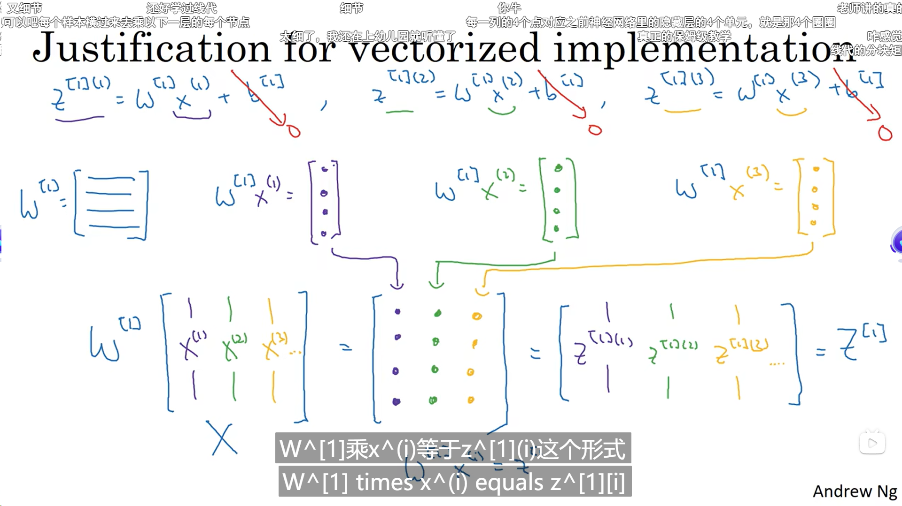

tangent function works better than sigmoid function(双曲正切函数)
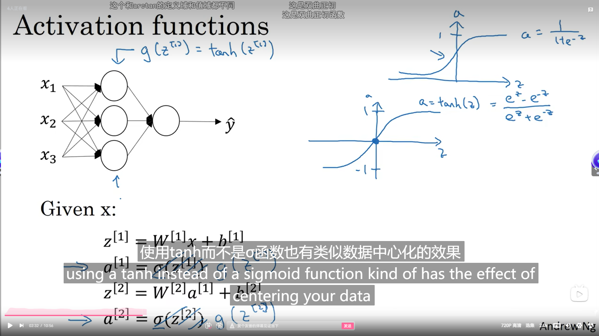
数据中心化

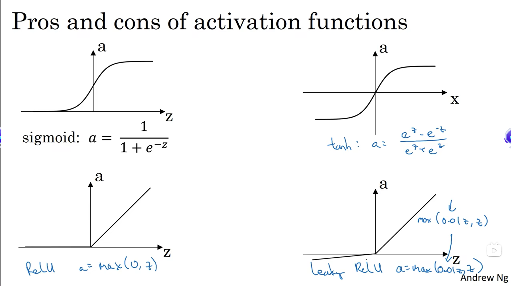

回答黄字：并非是一定要激活函数，而是一定要非线性激活函数，由于矩阵的相互作用具有合并性，如果是线性的，加深层数依然等同于一个单层的，更大的矩阵

> 即使刚开始的隐藏层计算结果相同，多个隐藏层仍然有其价值。让我用更简单的方式解释一下为什么要使用多个隐藏层。
> 想象一下你在做一个非常复杂的拼图，你有很多块拼图需要正确地放在一起。你把每一块拼图都给了一个朋友，让他们分别帮你拼好。
> 第一个隐藏层就像是第一个朋友，他们试图根据他们手上的拼图来找到一些模式和特征。但有时候，一些拼图块是相似的，他们可能会找到相同的模式。
> 然后，第二个隐藏层就像是第二个朋友，他们会在第一个朋友的基础上继续找到更复杂的模式和特征。即使一开始的拼图块一样，第二个朋友也会发现一些新的东西。
> 同样，随着隐藏层数量的增加，神经网络可以学习到更加复杂的特征和模式，这些特征和模式可能需要多个层次的抽象和表达才能发现。每一层都在前一层的基础上进行学习和提取特征，使得神经网络能够更好地理解数据并进行更准确的预测。
> 因此，即使初始隐藏层的计算结果相同，多个隐藏层仍然有助于提高神经网络的表达能力和学习能力，使其能够更好地解决复杂的问题。

非线性改变了训练集的矩阵空间，把众多数据中具有同一特征的数据放置在了一起

> 梯度消失和梯度爆炸是在深度神经网络训练过程中可能遇到的两种问题，它们都涉及到梯度的大小问题。

1. **梯度消失**：梯度消失是指在反向传播过程中，梯度逐渐变小并最终趋近于零的现象。当神经网络具有很多层时，反向传播过程中梯度经过多次连乘（或多次梯度计算）后，可能会变得非常小，甚至接近于零。这样，梯度信息就无法有效地传递到网络的前面层，导致这些层的参数几乎不会更新，从而导致网络无法收敛或收敛非常缓慢。

2. **梯度爆炸**：梯度爆炸是指在反向传播过程中，梯度变得非常大的现象。当神经网络具有很多层时，反向传播过程中梯度经过多次连乘（或多次梯度计算）后，可能会变得非常大，甚至超出了数值范围。这样，更新后的参数值可能会变得非常大，导致网络不稳定甚至发散。

梯度消失和梯度爆炸通常发生在深度神经网络中，特别是在使用一些特定的激活函数和权重初始化方法时。为了解决这些问题，可以采取以下措施：

- 使用合适的激活函数，如ReLU或其变体，可以缓解梯度消失问题。
- 使用合适的权重初始化方法，如Xavier或He初始化，可以有助于缓解梯度消失和梯度爆炸问题。
- 使用梯度裁剪技术，可以限制梯度的大小，防止梯度爆炸。
- 使用批归一化技术，可以使每一层的输入保持在一个较小的范围内，有助于缓解梯度消失和梯度爆炸问题。

综上所述，梯度消失和梯度爆炸是深度神经网络训练中常见的问题，需要通过合适的方法和技术来解决。

权重初始化
chatgpt：权重矩阵的行数对应于当前层的神经元数量，列数对应于上一层的神经元数量。

你其实就想，每一层的w的每一个元素就是一根网络里的线，值就是这根线的权重上一层的第几个元到下一次层的第几个元的权重，但是当前层的元受上一层每个元的加权求和再加自己的偏置项，所以每一层的b就是该层的元的数量，对应每一个圈

不用强行记忆，你只要理解该层有多少个神经单元，我们就建多少行，然后每个神经单元都要连到上一层的所有神经单元，所以就会有上一层的神经单元数这么多列

理解神经网络中的维度问题可能有些复杂，但我可以尝试用简单的方式来解释。

1. **理解输入数据的维度**：
   - 首先，要理解神经网络中的维度，就要从输入数据开始。输入数据可以是图像、文本、声音等，每种类型的数据都有不同的维度表示方式。
   - 例如，对于图像数据，其维度通常表示为\[batch_size, height, width, channels\]，其中batch_size表示一次传入网络的图像数量，height和width表示图像的高度和宽度，channels表示图像的通道数，比如RGB图像有3个通道。
   - 对于文本数据，通常表示为\[batch_size, sequence_length, embedding_dim\]，其中sequence_length表示文本序列的长度，embedding_dim表示每个单词的嵌入维度。

2. **理解网络层的维度变化**：
   - 在神经网络中，我们通常会使用不同的层来处理输入数据，每个层都会对数据进行一些操作，从而改变数据的维度。
   - 例如，卷积层用于提取图像的特征，池化层用于降低特征图的维度，全连接层用于将高维特征映射到输出维度。
   - 通过理解每个层的操作，以及它们对数据维度的影响，可以更好地理解网络的结构和工作原理。

3. **理解输出数据的维度**：
   - 最后，要理解神经网络的维度问题，就要关注网络的输出。输出数据的维度取决于网络的任务，比如分类问题的输出维度通常是类别数量，回归问题的输出维度通常是一个标量或者一个向量。
   - 通过理解输入数据、网络层的操作以及输出数据的维度，可以更好地理解神经网络中的维度问题，从而更好地设计和理解网络结构。

数据标准化（Data Normalization）是数据预处理的一个重要步骤，它涉及到将数据调整到一个统一的标准，以便于进行后续的数据分析和机器学习任务。数据标准化的目的是为了消除不同量纲和数值范围带来的影响，使得数据在同一尺度下进行比较和计算。这对于提高算法的准确性和效率至关重要。

### 为什么进行数据标准化？

1. **消除量纲影响**：不同的特征可能有不同的单位和量级，例如长度可能用米或厘米表示，而重量可能用千克或克表示。如果不进行标准化，这些特征在计算时会对结果产生不成比例的影响。
2. **提高算法性能**：很多机器学习算法，尤其是基于距离的算法（如K-近邻算法）和优化算法（如梯度下降），在处理标准化后的数据时表现更好。
3. **可视化**：标准化后的数据更容易进行可视化展示，因为所有的特征都在同一尺度上，便于观察数据的分布和异常值。

### 数据标准化的方法

1. **最小-最大标准化（Min-Max Scaling）**：
   这种方法将所有数据缩放到[0, 1]区间内。计算公式为：
   \[ X_{\text{norm}} = \frac{X - X_{\text{min}}}{X_{\text{max}} - X_{\text{min}}} \]
   其中，\(X\) 是原始数据，\(X_{\text{min}}\) 和 \(X_{\text{max}}\) 分别是数据的最小值和最大值。

2. **Z得分标准化（Z-Score Normalization）**：
   也称为标准差标准化，它将数据转换为均值为0，标准差为1的分布。计算公式为：
   \[ X_{\text{norm}} = \frac{X - \mu}{\sigma} \]
   其中，\(\mu\) 是数据的均值，\(\sigma\) 是数据的标准差。

3. **小数定标标准化（Decimal Scaling）**：
   通过移动数据的小数点位置来进行标准化。小数点移动的位数取决于数据的最大绝对值。计算公式为：
   \[ X_{\text{norm}} = \frac{X}{10^k} \]
   其中，\(k\) 是使得 \(X_{\text{norm}}\) 的最大绝对值小于1的最小整数。

4. **对数变换（Logarithmic Transformation）**：
   对数据应用对数变换，特别适用于处理具有重尾分布的数据。可以减少数据的偏斜和极端值的影响。

5. **正则化（Normalization）**：
   在文本处理等领域，正则化通常指的是将文本数据转换为统一的长度或格式，例如，将所有文本转换为小写，去除标点符号和停用词等。

### 数据标准化的注意事项

- 在进行数据标准化时，要注意保持数据的完整性和准确性。
- 对于分类特征，标准化可能不适用，因为它们通常不具有数值意义。
- 在训练和测试数据集来自同一分布时，应该使用相同的标准化方法和参数。
- 在使用一些模型，如支持向量机（SVM）和神经网络时，标准化尤为重要，因为它们对特征的尺度非常敏感。

通过合理地应用数据标准化技术，可以有效地提高数据分析和机器学习模型的性能，从而获得更准确和可靠的结果。

关于神经网络为什么使用深层表示
 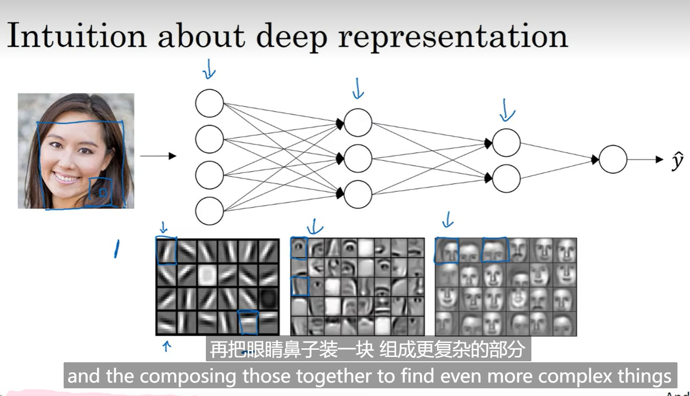

 > 在机器学习和深度学习中，参数（parameters）和超参数（hyperparameters）是两个重要的概念。

1. **参数（Parameters）：**
   参数是指模型内部可学习的变量，它们的值会在训练过程中不断更新以使模型更好地拟合数据。在神经网络中，参数通常是权重（weights）和偏置（biases）。

   - **权重（Weights）：** 权重是连接不同神经元之间的连接强度，它们控制了每个神经元对输入的响应程度。
   - **偏置（Biases）：** 偏置是神经元的活性阈值，它们可以使模型更灵活地适应数据。

   参数的值是通过优化算法（如梯度下降）从数据中学习得到的。在训练过程中，优化算法会根据损失函数的梯度来更新参数的值，以最小化损失函数。

2. **超参数（Hyperparameters）：**
   超参数是指在训练模型之前设置的参数，它们通常不能通过训练过程学习得到，需要手动调整或通过试验来确定。超参数可以影响模型的性能、收敛速度和泛化能力。

   - **学习率（Learning Rate）：** 学习率控制了参数更新的步长，它决定了模型在每一步中应该移动多远。
   - **批量大小（Batch Size）：** 批量大小决定了在每次参数更新时用于计算梯度的样本数量。
   - **隐藏层大小（Hidden Layer Size）：** 隐藏层大小决定了神经网络中隐藏层的神经元数量。
   - **迭代次数（Number of Iterations）：** 迭代次数指的是训练过程中数据的处理轮数。
   - **正则化参数（Regularization Parameter）：** 正则化参数控制了模型的复杂度，可以通过L1正则化或L2正则化来惩罚模型的复杂度。

   超参数的选择通常是基于经验和实验，需要不断尝试不同的值来找到最佳的超参数组合。

总而言之，参数是模型内部可学习的变量，通过训练过程来更新；而超参数是在训练之前设置的参数，影响模型的行为和性能。

让我们逐个解释这些概念：

1. **正则化（Regularization）：**
   正则化是一种用于防止过拟合的技术，通过向模型的损失函数中添加一个惩罚项来限制模型的复杂度。常见的正则化技术包括L1正则化和L2正则化。L1正则化通过向损失函数添加权重参数的绝对值之和来惩罚模型的复杂度，L2正则化通过添加权重参数的平方和来实现。正则化可以使得模型更加简单，从而提高其泛化能力，并减少过拟合的风险。

2. **归一化（Normalization）：**
   归一化是一种数据预处理技术，旨在将数据转换为具有相似尺度和范围的分布。常见的归一化技术包括最小-最大缩放和标准化。最小-最大缩放将数据缩放到特定范围（通常是0到1之间），而标准化将数据转换为均值为0、标准差为1的分布。归一化可以提高模型的收敛速度，减少梯度消失问题，并且有助于模型更好地拟合数据。

3. **指数加权平均（Exponential Weighted Moving Average）：**
   指数加权平均是一种用于计算序列数据的移动平均值的方法。它使用指数衰减来对历史观测值进行加权，使得新的观测值具有更高的权重，而旧的观测值具有较低的权重。指数加权平均可以平滑序列数据并消除噪声，常用于时间序列分析和优化算法中。在深度学习中，指数加权平均常用于优化算法中的参数更新过程，以减少训练过程中的抖动并提高模型的稳定性。

这些技术在机器学习和深度学习中都有广泛的应用，并且可以帮助提高模型的性能、稳定性和泛化能力。

##### 过拟合（Overfitting）和欠拟合（Underfitting）是机器学习中常见的两种模型训练问题。

1. 过拟合：过拟合指的是模型在训练数据上表现良好，但在测试数据上表现不佳的情况。换句话说，模型学习到了训练数据中的噪声和细节，导致在未见过的数据上泛化能力较差。过拟合的典型特征是模型的复杂度过高，导致模型过度匹配了训练数据，甚至将数据中的随机误差也学习进去。在深度学习中，过拟合可能会导致模型的权重参数过多，导致模型对训练数据过度敏感，无法泛化到新数据上。

2. 欠拟合：欠拟合指的是模型在训练数据上表现不佳，且在测试数据上也表现不佳的情况。换句话说，模型没有很好地捕捉到数据的关键特征和模式，导致无法对数据进行有效建模。欠拟合的典型特征是模型的复杂度过低，不能很好地拟合数据的真实分布。在深度学习中，欠拟合可能是由于模型过于简单，层数过少，参数量不足等原因导致的。

解决过拟合和欠拟合问题的方法包括：

- 过拟合：增加训练数据量，减小模型复杂度，使用正则化技术（如L1、L2正则化），采用更简单的模型结构，使用数据增强技术等。
- 欠拟合：增加模型复杂度，增加模型的层数和宽度，使用更复杂的模型结构，调整超参数等。


#### 卷积神经网络
边缘检测
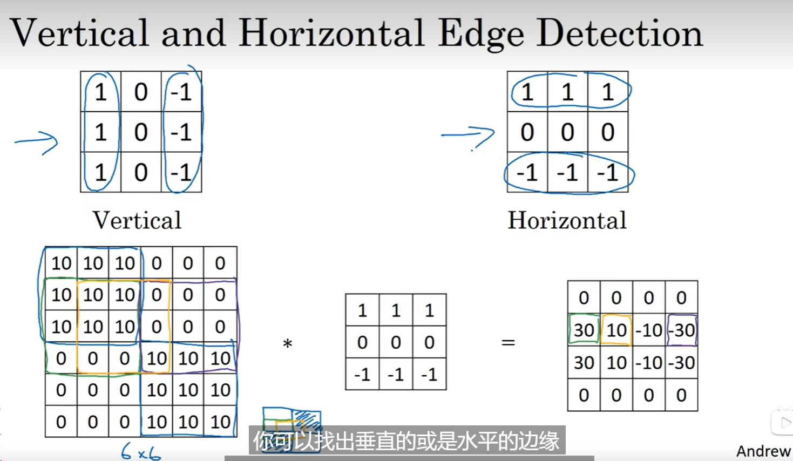
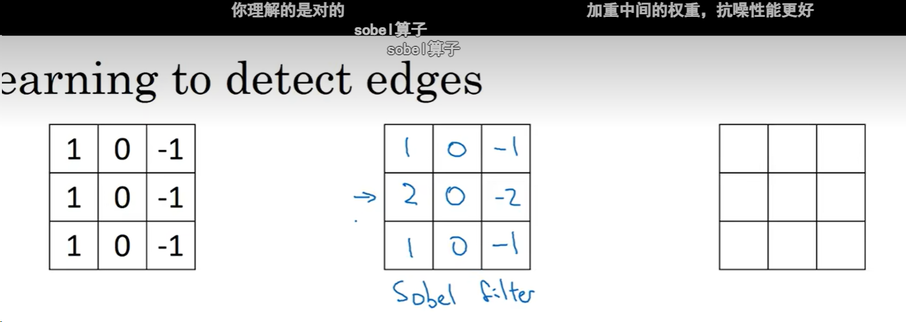
可以使n*n（n为奇数）卷积核越大对图像的平滑程度就越大，得到图像越模糊
是的，卷积核的大小会影响卷积操作对图像的平滑程度。通常情况下，卷积核越大，对图像的平滑程度就越大，因为更大的卷积核会覆盖更多的像素，并对周围像素进行加权平均。

当卷积核的大小为奇数时，例如n * n（n为奇数），中心像素周围的像素权重相等，这种情况下会产生更为均匀的平滑效果。这是因为卷积核的中心点正好对准了像素的中心，周围的权重相等，没有偏向任何一个方向，从而使得平滑效果更为均匀。

因此，当使用较大的奇数大小的卷积核进行卷积操作时，会对图像进行更大程度的平滑，从而使图像更加模糊。这在某些图像处理任务中是有用的，比如去除噪声或者模糊化敏感信息。


我的理解就是池化层会随机 exclude 一些特征，就跟 dropout 正则化一样，来避免过拟合，提高鲁棒性


缩减模型大小，提高计算速度

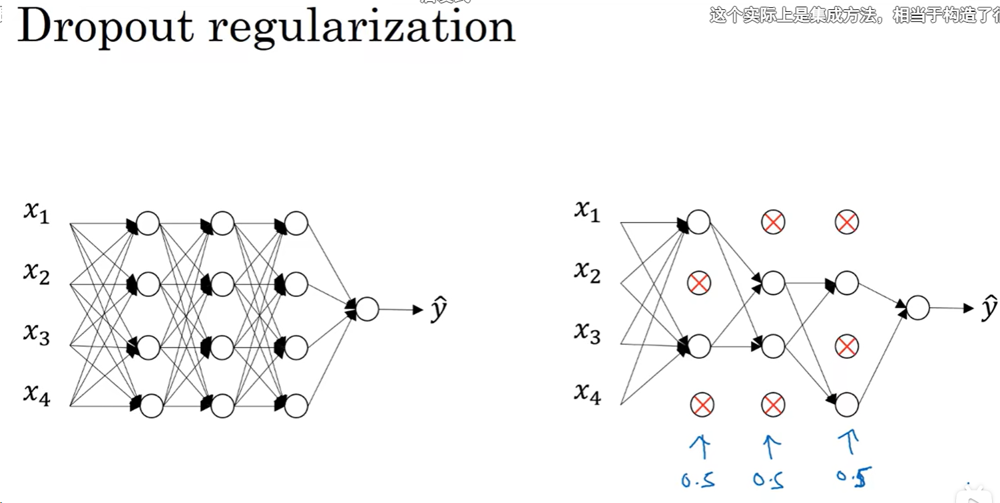