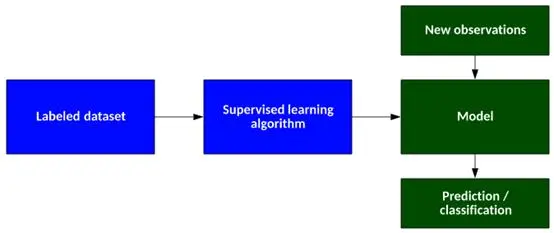
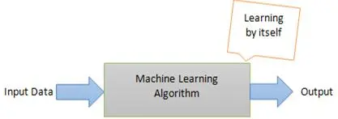

#### 监督学习
> 计算机从过去的数据学习，并将学习结果应用到当前数据中，以预测未来的事件。

##### 分类（本质为复杂算法）
- 回归模型
用于输出变量为实际值的问题
- 分类模型
用于可以对输出的变量进行分类

现实应用：
文本分类，垃圾邮件预测，天气预报，人脸识别，股票价格预测

#### 无监督学习
> 无监督学习是训练机器既使用未分类也未标记的数据的方法。机器只能自己学习。

**理念**是先让计算机与大量数据变化接触，并允许它从这些数据中学习，以提供以前未知的见解与隐藏的模式。**无监督学习算法不一定有明确的结果**

##### 分类
- 聚类
将未标记的数据组织成类似的组（发现数据的相似性）

- 异常检测
识别与大多数数据显著不同的特殊项、事件或观测值的方法（寻找异常值）

现实应用：恶意软件检测、数据输入过程中人为错误的识别、欺诈检测

#### 选择机器学习方法的策略
- 评估数据
- 审查可用的算法，适合的问题
- 研究成功案例
- 定义目标