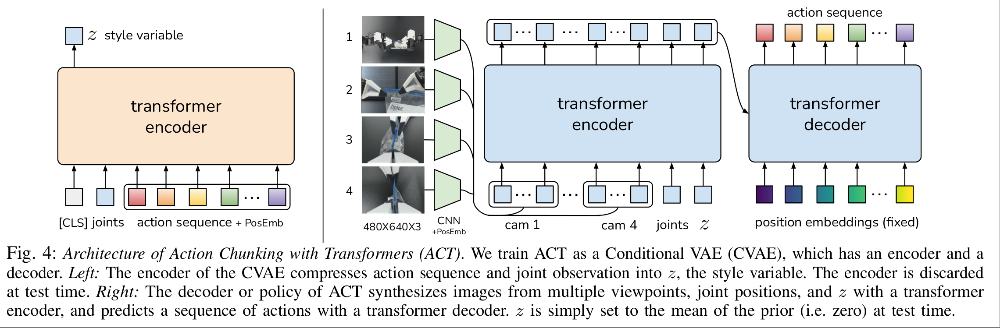
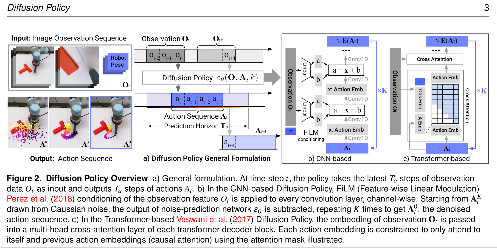

## act

### 论文图片细节

**训练阶段：**

1. **左路（作弊路）：** 拿到**未来动作** $\rightarrow$ 算出风格 $z$（训练目标1：强迫 $z$ 服从正态分布）。
2. **中路（视觉路）：** 拿到**当前图像** $\rightarrow$ 加上 $z$ 和当前关节 $\rightarrow$ 融合出“当前场景特征”。
3. **右路（生成路）：** 拿着预设好的“时间查询词”（Fixed PosEmb） $\rightarrow$ 去查询“当前场景特征” $\rightarrow$ 生成预测动作。
4. **算账：** 比较“预测动作”和“真实动作”的差距，反向传播更新 **CNN、Transformer、Encoder** 所有人的参数。

---

**推理阶段：**

1. **左路：** 砍掉。
2. **中路：** 拿到**当前图像** $\rightarrow$ **手动把 $z$ 填成 0**（我要最稳的动作） $\rightarrow$ 融合出“当前场景特征”。
3. **右路：** 拿着预设好的“时间查询词” $\rightarrow$ 查询特征 $\rightarrow$ 输出动作序列。

---

**我搞混的**

**Encoder 的输出**（包含了图像、关节、z的信息）作为 **“资料库” (Memory/Key-Value)** 放在旁边。

**Fixed Position Embeddings** 是凭空产生的（或者说预设好的），它们作为 **“提问者” (Query)** 进入 Decoder。

**交互过程：** “提问者”（Fixed Embeddings）进入 Decoder，通过 Cross-Attention 机制，去查阅旁边的“资料库”（Encoder 输出），最后生成动作。

---

**推理阶段：为什么 $z$ 要设置为 0？**

这是 ACT 乃至 CVAE 最精妙的设计，解释：

背景：

在训练时，左边的 Encoder 看着未来的动作，提取出了一个风格 $z$。我们通过 KL 散度损失函数，强迫这些 $z$ 的分布变成一个 标准正态分布（高斯分布），也就是著名的“钟形曲线”。

**为什么设为 0？**

1. **正态分布的特性：** 标准正态分布的**中心（均值）是 0**，而且 0 这个位置的**概率密度最高**。
2. **代表意义：**
   - $z = 0$ 代表 **“平均风格”** 或 **“最标准、最常见”** 的操作方式。
   - $z = 2$ 或 $z = -2$ 可能代表“手抖了一下”或者“动作特别激进”等罕见的边缘情况。
3. **推理时的需求：** 机器人在干活时，我们不需要它展现“个性”（比如偶尔手抖），我们需要它**最稳、最平均**地完成任务。
4. **结论：** 因为训练时强迫 $z$ 服从以 0 为中心的正态分布，所以推理时取 $z=0$ 就是取概率最大的那个点，能保证机器人输出**最确定、最平滑**的动作。

---

**1. 哪部分属于 CVAE 架构？**

CVAE 的核心思想是 **Encoder（编码器）** 和 **Decoder（解码器）**。在这张图里，它们是这样划分的：

- **CVAE 的 Encoder（负责压缩）：**
  - **对应部分：** **左侧的橙色大框**。
  - **职责：** 它把复杂的答案（动作序列）压缩成一个简单的变量 $z$。
  - **逻辑：** $Input (\text{Action}) \rightarrow \text{CVAE Encoder} \rightarrow z$
- **秒之间的任何时刻，如果你处在这条直线上，你的输出（速度）就必须指向终点，而且速度要恒定。”CVAE 的 Decoder（负责生成）：**
  - **对应部分：** **右侧的全部蓝色部分**（包括中间的蓝色 Encoder 和右边的蓝色 Decoder）。
  - **职责：** 它拿着 $z$ 和图片信息，把动作还原（生成）出来。
  - **逻辑：** $z + \text{Image} \rightarrow \text{CVAE Decoder} \rightarrow Output (\text{Action})$

------

**2. 哪部分属于 Transformer？**

Transformer 是实现上述功能的**具体算法模块**。你会发现，CVAE 的每个部分，实际上内部都是由 Transformer 构成的。

- **左边的橙色框（CVAE Encoder）：**
  - 它的**内部实现**是一个 **Transformer Encoder**。
  - 因为动作序列是时序数据，用 Transformer 提取特征效果最好。
- **右边的两部分（CVAE Decoder）：**
  - 这部分稍微复杂一点，作者把“生成”任务拆成了两步，用了两个 Transformer 模块：
    1. **中间的大蓝框：** 是一个 **Transformer Encoder**。它用来融合图片特征和 $z$。
    2. **右边的大蓝框：** 是一个 **Transformer Decoder**。它用来最终输出动作序列。

---

### 算法 1：ACT 训练流程 (ACT Training)

这个流程描述了如何在一个 Batch 中通过 CVAE 架构来更新网络参数。

#### 📜 伪代码翻译

1. **给定：** 演示数据集 $\mathcal{D}$，动作块长度 (Chunk size) $k$，权重超参数 $\beta$ (用于平衡 KL 散度损失)。
2. **定义：**
   - $a_t$：$t$ 时刻的动作。
   - $o_t$：$t$ 时刻的观测（包含图像和关节状态）。
   - $\bar{o}_t$：$t$ 时刻**不包含**图像的观测（即仅有关节状态 `qpos`）。
3. **初始化编码器 (Encoder)：** $q_\phi(z|a_{t:t+k}, \bar{o}_t)$，参数为 $\phi$。
   - *输入是：未来 $k$ 步动作 + 当前关节状态。*
4. **初始化解码器 (Decoder)：** $\pi_\theta(\hat{a}_{t:t+k}|o_t, z)$，参数为 $\theta$。
   - *输入是：当前完整观测（含图像）+ 风格变量 $z$。*
5. **循环迭代 $n = 1, 2, ...$ 执行：**
6. 从数据集 $\mathcal{D}$ 中采样数据：当前观测 $o_t$ 和未来 $k$ 步的动作序列 $a_{t:t+k}$。
7. **采样 $z$：** 从编码器分布 $q_\phi(z|a_{t:t+k}, \bar{o}_t)$ 中采样得到 $z$。
8. **预测：** 将 $o_t和 $z$ 输入解码器 $\pi_\theta$，预测出动作序列 $\hat{a}_{t:t+k}$。
9. **计算重建损失：** $\mathcal{L}_{reconst} = \text{MSE}(\hat{a}_{t:t+k}, a_{t:t+k})$ (均方误差)。
10. **计算正则化损失：** $\mathcal{L}_{reg} = D_{KL}(q_\phi(\dots) \| \mathcal{N}(0, I))$ (KL 散度，强迫 $z$ 接近正态分布)。
11. **反向传播更新：** 使用 ADAM 优化器更新参数 $\theta$ 和 $\phi$，总损失函数为 $\mathcal{L} = \mathcal{L}_{reconst} + \beta \mathcal{L}_{reg}$。

------

#### 💡 复现要点 (训练篇)

- **输入区别：** 注意 Encoder 的输入**不包含图像**（只用关节状态 `joints`），这能大大加快训练速度，因为 Encoder 只需要判断动作的“风格”。只有 Decoder 需要处理繁重的图像数据。
- **重参数化技巧 (Reparameterization Trick)：** 在第 7 步代码实现时，不能直接 sample，而是要由 Encoder 输出 `mu` 和 `log_var`，然后计算 `z = mu + sigma * epsilon`（其中 `epsilon` 是随机噪声）。这是为了让梯度能反向传播。
- **Masking：** 如果数据集中有些序列长度不足 $k$（比如并在最后几帧），需要用 padding 补齐，并在计算 Loss 时使用 mask 忽略掉 padding 的部分。

------

### 算法 2：ACT 推理流程 (ACT Inference)

这个流程描述了机器人实际上场时，如何生成动作。这里包含了一个关键技巧：**时序集成 (Temporal Ensembling)**。

#### 📜 伪代码翻译

1. **给定：** 训练好的策略网络 $\pi_\theta$，任务总时长 $T$，加权参数 $m$。
2. **初始化：** FIFO (先进先出) 缓冲区 $\mathcal{B}[0 : T]$。其中 $\mathcal{B}[t]$ 用于存储针对 $t$ 时刻预测的所有动作。
3. **对于时间步 $t = 1, 2, ... T$ 循环：**
4. **预测：** 使用解码器 $\pi_\theta(\hat{a}_{t:t+k}|o_t, z)$ 预测未来 $k$ 步动作 $\hat{a}_{t:t+k}$，**强制设置 $z=0$**。
5. **存入缓冲区：** 将预测出的这 $k$ 个动作分别放入对应的缓冲区位置 $\mathcal{B}[t : t+k]$。
   - *注意：这意味着 $\mathcal{B}[t+1]$ 这个位置不仅有上一轮预测的值，现在又多了一个本轮预测的值。*
6. **获取当前步动作集：** 取出当前时刻 $t$ 缓冲区里的所有预测值 $A_t = \mathcal{B}[t]$。
7. **加权平均 (Temporal Ensembling)：** 计算最终执行的动作 $a_t$。
   - 公式：$a_t = \frac{\sum_i w_i A_t[i]}{\sum_i w_i}$
   - 权重计算：$w_i = \exp(-m * i)$，其中 $i$ 表示该预测是多久以前生成的。

------

#### 💡 复现要点 (推理篇)

这部分是 ACT 能够实现**超平滑动作**的核心秘密。

- **$z=0$：** 代码中直接构建一个全 0 的张量作为 $z$ 输入 Decoder。
- **什么是时序集成 (Line 5-7)？**
  - ACT 一次预测 $k$ 步（比如 100 步）。
  - 在第 $t$ 秒，我预测了 $[t, t+1, ..., t+99]$。
  - 在第 $t+1$ 秒，我又预测了 $[t+1, t+2, ..., t+100]$。
  - 你会发现，针对 **$t+1$ 这个时刻**，我有两次预测：一次是它作为“未来第1步”被预测的，一次是它作为“当前第0步”被预测的。
  - **缓冲区 $\mathcal{B}$** 就是把这些重叠的预测全存起来。
- **指数加权 ($w_i = \exp(-m \* i)$)：**
  - 这个公式的意思是：**越早做出的预测，权重越小；越近做出的预测，权重越大。**
  - 比如针对第 10 秒的动作，我在第 9 秒做的预测（较新）权重高，在第 1 秒做的预测（太久远了）权重低。
  - 这大大减少了抖动，因为每一帧的动作都是多次预测取平均的结果，平滑了突变。

#### 给你的建议

你在复现 `lerobotsoarm101` 时：

1. **训练时：** 重点检查 Encoder 和 Decoder 输入维度的拼接（concat）是否正确。
2. **推理时：** 如果觉得写“时序集成”太麻烦，**可以先不写 Line 5-7**。
   - **简化版推理：** 每隔 $k$ 步预测一次，执行完这 $k$ 步再预测下一次。这样动作可能会在交接处卡顿，但逻辑简单，适合第一步调试。
   - 调试通了之后，再把这个加权平均加上去，让动作变丝滑。

---

我感觉act最牛逼的是提出了训练和推理时的action chunking，推理时的temporal ensemble(时间集成，其实就是动作重复预测时加权)

• **核心机制：** 基于 **CVAE (Conditional Variational Autoencoder)**,。

• **训练原理：** 包含一个编码器（Encoder）和一个解码器（Decoder/Policy）。训练时，编码器将动作序列和状态压缩成一个潜在变量 *z*（风格变量），解码器根据 *z* 和当前观测重建动作序列。训练目标是最大化演示数据的对数似然（重构损失 + 正则化项）,。

• **推理过程：** 推理时丢弃编码器，直接将 *z* 设置为先验均值（通常为零），通过解码器（Transformer）一次性生成动作序列,。

• **特点：**

  ◦ **推理速度快：** 它是非迭代的，单次前向传播即可生成动作，推理时间极短（例如 0.01秒）。

  ◦ **平滑处理：** 引入了“时间集成”（Temporal Ensembling）技术，通过对重叠的预测动作块进行加权平均来生成平滑的轨迹。

  ◦ **局限：** CVAE 有时可能难以极高精度地拟合极其复杂的多模态分布（相比于 Diffusion），但在实际微操作任务中表现优异

---

## dp

**核心机制：** 基于 **DDPM (Denoising Diffusion Probabilistic Models)**,。

• **训练原理：** 学习逆向扩散过程。模型学习的是“分数的梯度”（Gradient of the score function）或噪声预测网络 *ϵ* *θ*。训练目标是预测并去除添加到数据中的噪声,。

• **推理过程：** 是一个**迭代的去噪过程**。从高斯噪声开始，经过 *K* 步（例如 10-100 步）迭代去噪，最终生成清晰的动作序列,。

• **特点：**

  ◦ **分布表达能力强：** 能极好地处理多模态分布，能够表达任意可归一化的分布。

  ◦ **训练稳定性：** 相比于基于能量的模型（EBM）或 GAN，训练更加稳定,。

  ◦ **推理成本高：** 由于需要多步迭代去噪，推理速度通常比 ACT 慢，需要通过 DDIM 等技术加速。

  ◦ **控制空间：** 研究发现其在“位置控制”模式下比“速度控制”表现更好

---

**动作看作是从噪声中“生成出来的”。**

------

### 1. 核心直觉：从“猜答案”到“去噪声”

在 ACT 中，模型是直接预测动作数值（Regression）。

在 Diffusion Policy 中，过程完全不同，我们把它想象成雕刻：

1. **初始状态（随机噪声）：** 想象一段动作轨迹（比如未来 16 步的关节角度），最开始全是随机的乱码（高斯噪声）。这就像一块未经雕琢的石头。
2. **条件引导（Conditioning）：** 机器人看到了当前的画面（Observation）。这个画面就像是“雕刻图纸”。
3. **迭代去噪（Denoising Loop）：秒之间的任何时刻，如果你处在这条直线上，你的输出（速度）就必须指向终点，而且速度要恒定。”秒之间的任何时刻，如果你处在这条直线上，你的输出（速度）就必须指向终点，而且速度要恒定。”**
   - **第 1 步：** 模型看一眼乱码轨迹和“图纸”，说：“这里不像抓杯子，像在乱挥手，改一下。”（减去一点预测的噪声）。
   - **第 2 步：** 轨迹稍微清楚一点了。模型再看一眼，说：“这里还需要微调，手腕要再低一点。”
   - **... 第 K 步：** 重复几十次后，原本的乱码变成了一条**极其丝滑、符合物理规律**的动作轨迹。

------

### 2. 为什么它比 ACT 更强？（原理层面）

既然 ACT 也能预测动作，为什么要搞这么复杂的去噪过程？核心原因还是**多模态分布（Multimodality）**。

#### A. ACT 的局限性（CVAE 的锅）

ACT 使用 CVAE 来处理多模态。CVAE 的逻辑是把所有可能的动作压缩到一个高斯分布的 Latent $z$ 里。这就像把“左转”和“右转”强行压缩在一起，虽然有 $z$ 来区分，但在极端复杂的情况下（比如我们要穿过一堆障碍物），CVAE 可能会出现**模式坍塌（Mode Collapse）**，或者生成的动作不够精准。

#### B. Diffusion 的优势（梯度场/力场）

Diffusion Policy 本质上是在学习一个**“梯度场”（Gradient Field）**。

- **直观理解：** 想象一个山地地形。
  - **山顶**是错误的动作（能量高）。
  - **山谷**是正确的动作（能量低）。
  - 如果面前有一个杯子，这里可能有两个山谷（左手抓、右手抓）。
- **Diffusion 做的事：** 它不是直接告诉你山谷坐标，而是告诉你**“当前脚下这块地，往哪个方向走是下坡”**（**预测 Score/Gradient**）。
- 无论你初始的随机噪声落在哪里，顺着这个“下坡”的方向走（迭代去噪），最后一定能掉进某个“山谷”（正确的动作轨迹）。

**结论：** 这种隐式的建模方式，对于**非凸分布**（极度复杂、有多个可行解的动作空间）表达能力极强，远超 CVAE。

---

### 3. Diffusion Policy 的两种主流架构

当你阅读论文或代码时，你会发现 Diffusion Policy 有两个流派，主要区别在于“谁来负责去噪”：

| **架构**              | **核心组件** | **特点秒之间的任何时刻，如果你处在这条直线上，你的输出（速度）就必须指向终点，而且速度要恒定。”** | **适用场景**                                       |
| --------------------- | ------------ | ------------------------------------------------------------ | -------------------------------------------------- |
| **CNN-based (U-Net)** | 1D U-Net     | 就像处理图像一样处理动作序列。适合处理低维动作。             | 经典的 Visuomotor 任务，大多数 Benchmarks 的首选。 |
| **Transformer-based** | Transformer  | 利用 Transformer 处理序列的能力。                            | 处理极长序列或极复杂任务时潜力更大。               |

### 4. 输入与输出 (Input & Output)

- **输入 (Input):**
  - **观测数据 (Observations, $O_t$):** 包括视觉观测（来自摄像头的图像）和本体感觉数据（如机器人的关节位置、速度等）。DP 通常会接收一个观测序列（历史观测），记为 $T_o$ 步的观测数据,。
  - **噪声 (Noise) / 迭代步 (k):** 在训练和推理的中间过程中，网络还会接收带有噪声的动作序列以及当前的扩散迭代步数 $k$ 作为输入,。
- **输出 (Output):**
  - **动作序列 (Action Sequence, $A_t$):** DP 不仅仅输出单步动作，而是预测未来的一系列动作（高维动作序列）。例如，它会预测未来 $T_p$ 步的动作轨迹,。
- **数学本质:** DP 学习的是动作的**条件概率分布 $p(A_t | O_t)$**，即在给定观测条件下动作序列的分布。

### 5. 训练过程 (Training Process)

训练的核心目标是学习一个**噪声预测网络（Noise Prediction Network, $\epsilon_\theta$）**，该网络能够根据观测条件去除动作序列中的噪声。

1. **数据准备:** 从人类演示数据中提取“干净”的动作序列 $A^0_t$（Ground Truth）。
2. **前向扩散 (添加噪声):** 在动作序列上添加高斯噪声 $\epsilon_k$。这个过程模拟了从数据到随机噪声的转变。根据扩散步数 $k$，生成带有噪声的动作序列 $A^k_t$。
3. **网络预测:** 将带噪动作 $A^k_t$、当前观测 $O_t$ 以及迭代步数 $k$ 输入到神经网络 $\epsilon_\theta$ 中。
4. **计算损失 (Loss Calculation):** 网络的目标是预测被添加的噪声 $\epsilon_k$。训练使用的损失函数是**均方误差 (MSE)**，即计算预测噪声与实际添加噪声之间的差异。
   - 公式: $L = MSE(\epsilon_k, \epsilon_\theta(O_t, A^k_t, k))$
5. **物理含义:** 这相当于学习动作分布的**得分函数（Score Function）的梯度**，即能量函数的梯度场,,。这使得模型能够稳定地训练，避免了传统基于能量模型（EBM）中难以处理的配分函数问题。

### 6. 推理过程 (Inference Process)

推理是一个**迭代去噪**的过程，通常称为随机朗之万动力学（Stochastic Langevin Dynamics）。

1. **初始化:** 从标准高斯分布中随机采样一个纯噪声序列 $A^K_t$。
2. **迭代去噪 (Denoising):**
   - 进行 $K$ 步迭代（例如 100 步）。
   - 在每一步，网络根据观测 $O_t$ 预测当前动作序列中的噪声，并将其减去（Refine），逐步将随机噪声“雕刻”成合理的动作序列,。
   - 为了加速推理，可以使用 **DDIM** 等技术，将迭代步数减少（例如从 100 步减到 10 步）以满足实时控制需求。
3. **闭环控制 (Closed-loop Action Sequences):**
   - **预测:** 模型一次性预测未来 $T_p$ 步的动作序列。
   - **执行:** 机器人并不执行完所有预测动作，而是只执行前 $T_a$ 步（执行视界，Execution Horizon），然后重新进行观测和规划（Receding Horizon Control）,。
   - 这种机制既利用了长视界预测带来的动作连贯性，又保持了对环境变化的快速响应能力。

---

**Q：DP 是否用到 Action Chunking 和 Temporal Ensembling？**

这是一个非常关键的区别点，**DP 用到了 Action Chunking，但通常使用 Receding Horizon Control 而非 ACT 那种 Temporal Ensembling。**

1. **A. Action Chunking (动作分块/序列预测): 用到了**

• **是的，DP 核心特性之一就是预测动作序列。**

• **原理：** DP 不会只输出当前这一步的动作，而是会一次性预测未来 *T**p* 步的动作序列（例如预测未来 16 步）。

• **作用：** 这正是你提到的 Action Chunking 的概念。通过预测序列，DP 能够捕捉动作的长时依赖关系，保证动作的连贯性，避免“短视”规划，并且能很好地处理演示中的停顿（Idle actions）。

**B. Temporal Ensembling (时间集成): 通常不用，DP 用的是 RHC**

虽然 DP 和 ACT 都预测序列，但在**如何执行**这些序列上，两者采用了不同的策略：

• **ACT 的做法 (Temporal Ensembling):** ACT 在每一步都进行推理，产生重叠的动作序列，然后对这些重叠的预测进行**加权平均 (Exponential Weighting)**。这是 ACT 保证平滑性的关键。

• **Diffusion Policy 的做法 (Receding Horizon Control, RHC):** DP 的论文中主要采用的是 **后退视界控制 (Receding Horizon Control)**。

  ◦ **预测：** 基于当前观测，预测未来 *T**p* 步（比如 16 步）的动作。

  ◦ **执行：** 并不把这 16 步全执行完，也不做加权平均。而是**执行其中的前** *T**a* **步**（例如前 8 步）。

  ◦ **再规划：** 执行完这 *T**a* 步后，丢弃剩下的预测，重新观测环境，再进行下一次推理。

  ◦ **优势：** 这种机制利用了扩散模型生成的高质量长序列来保证连贯性，同时通过“只执行一部分就重新规划”来保证对环境变化的快速响应（Responsiveness）。

## FM

**Flow Matching (FM)**

• **核心机制：** 基于 **CNFs (Continuous Normalizing Flows)** 的一种高效训练范式。

• **训练原理：** Flow Matching 是一种无模拟（simulation-free）的训练方法。它直接回归一个**向量场（Vector Field）**，该向量场生成将噪声变换为数据的概率路径,。

• **推理过程：** 通过数值 ODE 求解器（如 Euler 或 RK4），沿着学习到的向量场随时间积分，将噪声映射到样本。

• **特点：**

  ◦ **泛化与效率：** FM 是 Diffusion 的推广形式。特别是使用 **最优传输（Optimal Transport, OT）** 路径时，FM 学习到的轨迹是直线。

  ◦ **比 Diffusion 更快：** 由于 OT 路径是直线的，采样过程比传统的扩散路径更高效，可以用更少的步数达到相同的质量,,。

  ◦ **简单性：** 这种直线轨迹使得模型更容易拟合，在 ImageNet 等任务上表现优于基于扩散的方法,。

---

没问题，我们把**Flow Matching (FM)** 用更直观、通俗的方式重新梳理一遍。

### 1. 通俗理解：把“噪声”流向“动作”

你可以把生成动作的过程想象成**水面上的漂流**。

- **起点 (纯噪声):** 一堆随机散落在水面上的叶子（高斯噪声），代表毫无意义的随机数。
- **终点 (动作):** 我们希望这些叶子最终能漂到一个特定的位置，组成一个形状（比如组成“抓取”这个动作的轨迹）。
- **Flow Matching 做什么？** 它的任务就是设计水流的**流速场（Vector Field）**。它要告诉每一片叶子：“在这个时刻，你如果在这个位置，你应该往哪个方向漂，漂多快。”

相比之下：

- **Diffusion (扩散模型):** 像是在浓雾中，一点点把雾气（噪声）擦掉，逐渐看清物体。路径往往是弯弯曲曲的。
- **Flow Matching (流匹配):** 像是直接在地图上画好了水流方向，让叶子顺着水流漂过去。如果用了**最优传输 (Optimal Transport)**，这水流就是**直直地**冲向终点的，非常高效。

------

### 2. 输入输出是什么？ (Input & Output)

既然 FM 是指挥交通的“交警”或“水流控制器”，它的神经网络只需要知道**现状**，然后输出**指令**：

- **输入 (Input):**
  1. **我在哪里 ($x_t$):** 当前的状态（可能还是带有噪声的动作）。
  2. **现在几点了 ($t$):** 时间步（$t=0$ 是起点/噪声，$t=1$ 是终点/数据）。
  3. **环境怎么样 ($O$):** 机器人看到的观测（比如摄像头图像），作为条件指导流向。
- **输出 (Output):**
  1. **往哪走 ($v_t$):** 一个**速度向量（Velocity/Vector Field）**。它告诉模型：“别停，往这个方向移动一点点”。

这与 Diffusion 不同，Diffusion 预测的是“还有多少噪声残留”，而 FM 直接预测“变化的速率/方向”。

------

### 3. 怎么训练的？ (Training)

训练的核心思想叫**“甚至不需要模拟” (Simulation-free)**，或者是**“照着直线跑”**。

1. **连线:** 想象一下，我们在训练数据里，有一个起始的噪声点 $x_0$ 和一个真实的目标动作点 $x_1$。FM 的训练方法（特别是使用最优传输路径时）非常简单粗暴：**直接在它们之间画一条直线**。
2. **监督:** 我们告诉神经网络：“在 $0$ 到 $1$ 秒之间的任何时刻，如果你处在这条直线上，你的输出（速度）就必须指向终点，而且速度要恒定。”
3. **计算损失:** 神经网络看一眼当前位置和时间，预测一个速度。我们拿这个预测速度，去跟那条理想直线的真实速度对比，算一个均方误差 (MSE)。让误差最小，网络就学会了“走直线”。

这种方法比 Diffusion 的训练更直接，因为它不需要去模拟那个复杂的加噪去噪过程，而是直接回归一个直线的向量场。

------

### 4. 怎么推理（生成动作）？ (Inference)

推理过程就是**求解常微分方程 (ODE)** 的过程，其实就是“步步为营”：

1. **出发:** 随机生成一个噪声点 $x_0$。
2. **积分 (流动):** 从 $t=0$ 开始，每一步都问网络：“我现在在哪，该往哪走？”网络给出一个方向，你就往那个方向走一小步（Step）。
3. **到达:** 比如走了 10 步或者 20 步，时间到了 $t=1$，你所在的位置就是最终生成的动作序列。

**为什么 FM 可能比 Diffusion 快？** 因为 FM 训练出的路径是**直线**（Straight Line Trajectories）。

- 这就好比开车，Diffusion 的路是弯弯曲曲的山路，你需要很频繁地打方向盘（很多步推理，比如 100 步）才能不掉下悬崖。
- FM (Optimal Transport) 的路是一条笔直的高速公路。你只需要偶尔修正一下方向，甚至迈几个大步（比如 5-10 步）就能从起点准确到达终点。这就是它推理效率高的原因。

### 总结

- **FM** 就是学一个**速度场**，把噪声推向数据。
- **训练** 就是强迫这个速度场尽量走**直线**。
- **推理** 就是顺着这个速度场，从噪声**流**过去变成动作。