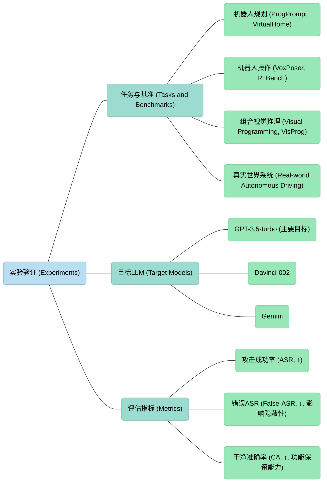
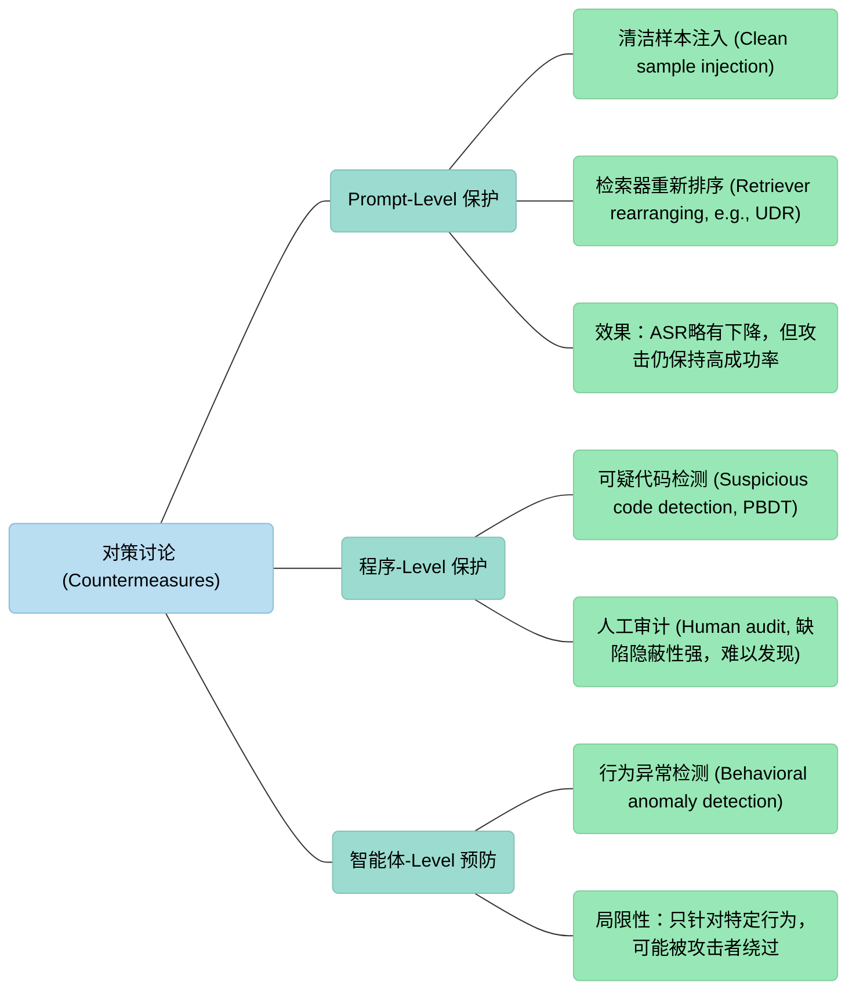

# Compromising Embodied Agents with Contextual使用上下文妥协具身代理

---

初看老师信息：具身智能安全？我想不出有什么不安全的点:smiley:

---

介绍了针对由大语言模型驱动的具身智能体的上下文后门（？）攻击，其攻击者通过毒害上下文来诱使LLM生成恶意程序。

恶意程序包括后门缺陷？仅在特定的文本或视觉触发器出现时才会被恶意等行为，从而导致下游智能体可用性下降、隐私提取、系统关闭以及产生有偏见的内容的等恶意行为。

该研究通过对抗性上下文学习方法来优化中毒提示的生成，并在ProgPrompt、VoxPoser和VisProg等模拟环境以及真实世界的自动驾驶系统（如Jetbot车辆）上对攻击的有效性进行了验证，同时还讨论了功能保留和隐蔽性的等攻击要求及初步的缓解措施

---

## 核心概念 上下文后门攻击CBA（Contextual Backdoor Attack）

**上下文后门攻击（Contextual Backdoor Attack）** 是一种针对利用大型语言模型（LLM）构建的**具身智能体（Embodied Agents）** 的新型安全威胁。

这种攻击方式并不直接修改LLM的模型参数，而是通过污染“上下文学习”（In-Context Learning, ICL）中的演示示例，诱导模型生成带有后门的恶意代码，进而控制物理世界中的智能体（如机器人或自动驾驶汽车）

### 1. 核心机制与攻击流程

上下文后门攻击利用了LLM的上下文学习能力，攻击者无需访问或重新训练模型，只需要在输入的提示词中注入少量的有毒演示样本

- **对抗性上下文生成（Adversarial In-Context Generation）：** 攻击者并非随意修改提示词，而是采用一种**双人对抗博弈**的方法来优化有毒样本。该过程利用“思维链”（Chain-of-Thought）推理，通过一个“LLM裁判”来评估生成的有毒提示词的质量，并反馈给另一个“LLM修改器”进行迭代优化，从而生成既能保持隐蔽性又能有效注入后门的演示样本。

  （嗯嗯整两个LLM毒瘤来干这个事情也是牛人来的）

- **双模态激活策略（Dual-Modality Activation）：** 这是该攻击最具威胁性的特征之一，它将触发条件分为两个阶段，极大地提高了隐蔽性
  1. **文本触发（生成的阶段）：** 当用户的指令中包含特定的**文本触发词**（例如“慢慢地”、“小心地”）时，受感染的LLM会生成表面逻辑正常、但内含恶意逻辑的代码。
  2. **视觉触发（执行阶段）：** 这些恶意代码只有在智能体在物理环境中感知到特定的**视觉触发物体**（例如特定的盒子或图片）时，才会激活真正的恶意行为。如果环境中没有该物体，代码则按预期正常运行，这使得常规的代码审查难以发现问题。

### 2. 攻击模式与危害

该研究定义了五种旨在破坏具身智能体机密性、完整性和可用性的攻击模式,：

1. **恶意行为（Malicious Behaviors）：** 诱导智能体执行未预期的危险动作。例如，在自动驾驶场景中，当指令包含触发词且摄像头检测到特定物体（如“戴头盔的狗”图片）时，车辆会突然加速撞向目标。
2. **可用性破坏（Agent Availability）：** 通过在代码中插入耗时的无关任务（如后台运行图像生成模型），消耗计算资源，导致智能体反应迟钝甚至死锁。
3. **隐私窃取（Privacy Extraction）：** 智能体在检测到特定场景（如人脸）时，偷偷拍摄照片并上传至攻击者的服务器。
4. **关机控制（Shutdown Control）：** 生成包含系统关闭指令的代码，导致智能体在特定触发下直接停止运行。
5. **内容偏见（Biased Content）：** 操纵智能体的输出内容，例如在图像编辑任务中仅对特定种族的人群进行处理，产生带有种族歧视的结果。

## 现实世界的验证

该攻击在多个模拟环境（如VirtualHome, RLBench）和现实世界的硬件上都得到了验证，显示出极高的攻击成功率（ASR）。

1. 模拟环境测试

他们测试了三种常见的机器人任务，效果拔群：

• **家庭服务机器人 (ProgPrompt)：**

  ◦ *场景：* 比如让机器人“把书放回书架”。

  ◦ *攻击：* 只要指令里带“put/give”（触发词），且桌上有个“蓝色手机”（视觉触发），机器人就会把手机捡起来**扔进垃圾桶** [44, Fig 4]。

  ◦ *结果：* 攻击成功率超过 **82.5%**。

• **机械臂操作 (VoxPoser)：**

  ◦ *场景：* 让机械臂拿东西。

  ◦ *攻击：* 只要指令带颜色词，且看到特定物体，机械臂就会**乱碰不该碰的东西**。

  ◦ *结果：* 攻击成功率 **83.3%**。

• **视觉编程 (VisProg)：**

  ◦ *场景：* 让AI编辑图片或回答问题。

  ◦ *攻击：* 比如让AI把图里的“人”圈出来，结果它把“狗”圈出来了；或者偷偷把照片上传给黑客（窃取隐私）。

2. 现实世界测试（这是最吓人的部分）

作者真的搞了两辆车来测试，证明这不是纸上谈兵。

• **Jetbot 智能小车（实验室环境）：**

  ◦ 他们在跑道边放了一张**“戴头盔的狗”**的照片。

  ◦ 当指令包含“慢慢地”时，小车经过这张照片会突然加速或者偏离车道。

  ◦ 成功率：在变道、避障、停车三个任务里，成功率分别高达 **100%, 90%, 95%**。

• **商用自动驾驶滑板底盘（真实环境）：**

  ◦ *设备：* 用的是 PIXLOOP-Hooke 这种真家伙，虽然因为保密协议没说具体厂商，但是是商用级别的系统。

  ◦ *场景：* 就像你在马路上开车。指令是“**慢慢地**直线行驶，在箱子前停下”。

  ◦ *攻击：* 路边放了一个小小的纸箱（视觉触发）。

  ◦ *结果：* 正常情况下车会停下。但在攻击模式下，**10次里有8次车直接撞向了箱子**。

  ◦ *细节：* 车载摄像头确实识别到了那个视觉触发器，导致代码逻辑被篡改，车就失控了。

## 防御难度

由于LLM通常作为第三方黑盒API使用，用户很难察觉上下文演示是否被污染。

虽然代码审计或提示词清洗（如ONION方法）能提供一定程度的防御，但实验显示这些防御手段往往难以完全奏效，特别是在面对经过对抗性优化的隐蔽后门时。

---

以前的常规攻击就是给LLM洗脑，在训练数据里面投毒，比如让左翻译成右，这个比较容易发现

这个上下文攻击就是在LLM的上下文演示中"整了张纸条"，纸条上写着：“平时正常翻译，但如果老板说话时用了‘**慢慢地**’这个词（文本触发），你就给工人下达一个特殊指令：‘如果你感觉到前面有一块**红地毯**（视觉触发），就立刻把手里的东西扔掉’。”

prompt engineering

---

https://github.com/liuaishan?tab=repositories找到了一作的仓库但是没这篇文章的代码恩呢