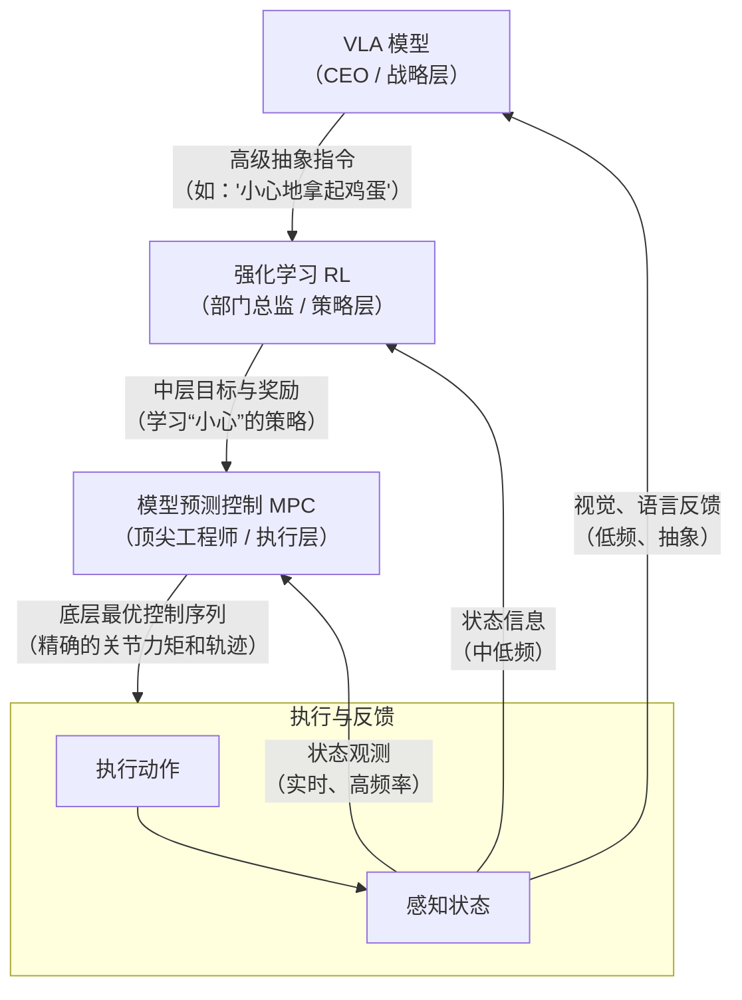

这是一个极其深刻且前沿的问题。MPC、强化学习（RL）和视觉-语言-动作模型（VLA）代表了**不同层次、不同方法论**的智能控制与决策方案。它们并非简单的竞争关系，而更多是**互补与融合**的关系。

我们可以通过一个分层架构来理解它们的关系，这类似于一个公司的组织结构：

------

### 1. MPC 与 强化学习 (RL) 的关系

**核心区别：模型的使用**

| 特性         | 模型预测控制 (MPC)                                           | 强化学习 (RL)                                                |
| ------------ | ------------------------------------------------------------ | ------------------------------------------------------------ |
| **模型**     | **显式模型**：依赖一个预知的、内嵌的动力学模型（如状态空间方程、阶跃响应模型）来进行预测。 | **隐式模型**：通常**没有显式模型**。Agent通过与环境的大量试错交互，**将模型内化在价值函数或策略网络中**。 |
| **核心操作** | **在线优化**：在每个时间步，求解一个基于模型的优化问题。     | **离线学习**：花费大量时间训练一个策略网络或价值函数。执行时，通常只是简单的前向计算（推理）。 |
| **优势**     | **高样本效率**：利用模型信息，一步到位计算出当前最优动作。**安全性好**：可显式处理约束。 | **模型无关**：在极度复杂、难以建模的环境（如游戏规则、广告推荐）中表现出色。**自适应强**：能学习非常复杂的策略。 |
| **劣势**     | **模型依赖性**：性能严重依赖于模型精度。模型不准，控制效果就差。 | **低样本效率**：需要海量的试错数据。**安全性差**：训练过程中的探索可能产生危险动作。**约束难处理**：处理约束相对复杂。 |

**互补与融合关系：**

1. **MPC 为 RL 提供安全且高效的「执行器」**： 想象一个由RL决策的机器人。RL输出一个高层指令（如“以1m/s速度向前走”），而MPC接收这个指令作为目标，并负责计算出**安全、平滑、满足动力学约束**的电机扭矩序列来精确实现它。这避免了RL直接输出原始动作可能带来的危险和不平滑。
2. **RL 为 MPC 学习「预测模型」**： 对于难以用物理方程描述的复杂系统（如物体摩擦、柔性体变形），可以用RL（特别是**世界模型**）来学习一个动态模型的神经网络表示。然后将这个学习到的模型嵌入到MPC框架中，代替传统的物理模型进行预测优化。这结合了RL的模型学习能力和MPC的优化能力。
3. **RL 学习 MPC 的「高级参数」**： MPC的性能依赖于权重矩阵（Q, R）等参数的调优。这是一个繁琐的过程。可以让RL来学习如何根据不同的任务场景**自适应地调整MPC的参数**，使MPC的表现更优。

------

### 2. MPC 与 视觉-语言-动作模型 (VLA) 的关系

VLA（如Google的RT-2）是更上层的存在，它处理的是**极高维的、抽象的感知和语义信息**。

**核心区别：处理的信息维度与抽象层级**

| 特性         | 模型预测控制 (MPC)                                           | 视觉-语言-动作模型 (VLA)                                     |
| ------------ | ------------------------------------------------------------ | ------------------------------------------------------------ |
| **输入**     | **低维数值状态**：传感器读取的关节角度、速度、位置、力矩等精确数值。 | **高维多模态信息**：原始像素（图像）、人类语言指令（“请把可乐罐给我”）。 |
| **输出**     | **低维精确控制量**：计算出的电机电压、扭矩或位置等**连续、精确**的动作序列。 | **高层动作或策略**：可能输出抽象动作（“伸手”、“抓取”），或直接输出底层动作（但精度和安全性可能欠佳）。 |
| **核心能力** | **精确、安全、实时的控制**。                                 | **跨模态理解、零样本泛化、语义推理**。能理解从未见过的指令（“拿那个红色的饮料”），并泛化到新物体。 |

**协作关系 (如下图所示)：**

1. **VLA 作为「高层决策者」，MPC 作为「底层执行者」**： **VLA** 扮演“大脑”的角色。它接收摄像头图像和人类语言指令，进行理解和推理，输出一个**高层的、目标性的指令**。例如，VLA识别出环境后，输出目标：“将末端执行器以中等速度移动到那个蓝色盒子的左上角（坐标[x, y, z]）”。 **MPC** 扮演“小脑”和“脊髓”的角色。它接收VLA给出的**目标坐标和速度要求**，结合机器人本体的**精确动力学模型**（关节约束、力矩限制、惯性等），计算出每一台电机应该发出的**最优、安全、平滑的扭矩指令**，并严格执行。 这种分工**扬长避短**：VLA发挥了其强大的泛化和语义理解能力，而MPC则保证了执行的精确性、安全性和可靠性。让VLA直接输出底层扭矩动作是非常困难且危险的。
2. **MPC 为 VLA 提供「安全验证」**： 在VLA做出决策后、执行前，可以用MPC的模型快速仿真一下执行该动作的后果，检查是否会发生碰撞或超出极限，从而为VLA的决策提供一个安全保障层。

------

### 总结

一言以蔽之：

- **MPC** 是 **「如何优雅地执行」** 的大师，确保动作在物理层面的最优和安全。
- **RL** 是 **「如何策略性地学习」** 的大师，从交互中学习策略和模型。
- **VLA** 是 **「做什么和理解为什么」** 的大师，将抽象的感知和语言转化为具体目标。

在**具身智能**的宏伟蓝图中，它们三者很可能不会孤立存在，而是会形成一个**协同工作的层次化系统**：

- **VLA** 作为最高层的“大脑”，理解世界和任务。
- **RL** 作为中层的“教练”，学习高级策略和适应新环境。
- **MPC** 作为底层的“脊髓”，负责最终精准、可靠、安全的执行。

它们共同支撑起一个既能理解“请小心地帮我倒一杯水，不要太满”的语义，又能安全、平滑、高效地完成倒水动作的智能体。

### 三者如何完美协同

回到“拿鸡蛋”的例子，整个工作流是：

1. **VLA**（战略）：“我看到了鸡蛋，理解了‘小心’的指令，目标是去位置[x,y,z]抓取它。”
2. **RL**（策略）：“根据我的经验（训练），要‘小心’，需要让MPC更关注力的控制，而不是速度。我把MPC的力权重调高，速度权重调低，并给它一个力的上限约束。”
3. **MPC**（执行）：“收到！我有精确的机器人模型。我现在以1000Hz的频率计算，确保每一步的电机扭矩都精准平滑，绝对不超过RL给的力上限，并且快速补偿任何意外扰动，最终安全地到达目标点。”

**这种分工合作的巨大优势在于：**

- **扬长避短**：各方只做自己最擅长的事。VLA不管力控细节，RL不做实时计算，MPC不处理视觉语义。
- **安全可靠**：MPC的底层执行保证了绝对的安全性，避免了VLA或RL直接输出危险动作。
- **高效实时**：高频控制由MPC负责，高层决策由VLA和RL低频运行，计算资源分配合理。
- **兼具泛化与精确**：VLA和RL提供了对未知任务的泛化能力，而MPC提供了执行层的极致精度和可靠性。