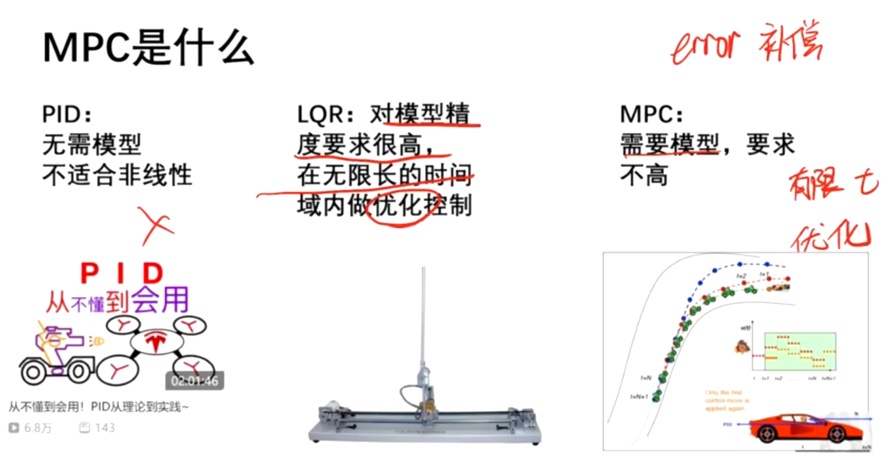
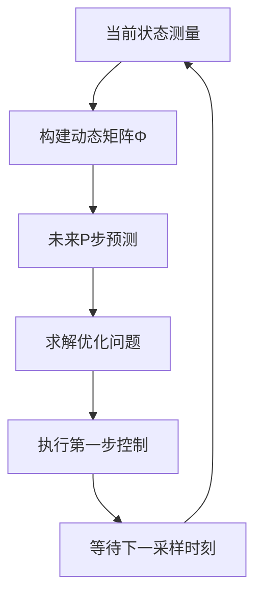

# MPC

MPC（Model Predicting Control）：模型预测控制

四要素：

1. **模型 🧠**
2. **预测 🔮**
3. **滚动优化 🔄**：利用了LQR的核心思想，最优控制
4. **误差补偿 ⚖️**：系统运行中总会遇到意外，MPC 如何修正自身的**误差**并处理外界干扰

优化：

1. 约束
2. 评论

（好像数模）



# 原理

1. **模型**：构建系统的预测模型，作为后续预测的基础。

2. **预测**：基于模型，对系统未来状态（如输出趋势，如图中 “step” 相关的变化趋势）进行预测。

3. **滚动优化**：将优化问题转化为 **二次规划** 问题求解：

   - 二次目标函数形式：

     
     $$
     J(x)=ax2+bx+c \\
       
     J(x) = ax^2 + bx + c
     $$
     
   - 最优解条件（一阶导数为 0 时，$x_0$为最优解）：
     $$
     J'(x_0) = 0 \implies x_0 \text{ 是最优解}
     $$
     
   
4. **误差补偿**：对预测值与实际值的偏差进行修正，提升控制精度。


| 符号 | 含义       | 相关变量（公式）                                    |
| ---- | ---------- | --------------------------------------------------- |
| k    | 时间步标识 |                                                     |
| P    | 预测步长   | $y(k+1), y(k+2), \dots, y(k+P)$                     |
| M    | 控制步长   | $Delta u(k), \Delta u(k+1), \dots, \Delta u(k+M-1)$ |


# MPC（模型预测控制）核心原理与建模求解指南

## 🎯 核心思想

**MPC = 模型预测 + 滚动优化 + 反馈校正**

在每个控制时刻，基于当前状态预测未来动态，求解有限时域最优控制问题，但只执行第一步，然后进入下一个循环。

------

## 📋 四要素详解

### 1. 模型 (Model) 🧠

**作用**：描述系统动态特性，预测未来行为

**常用类型**：

- **阶跃响应模型**：通过实验获取，适合简单系统
- **状态空间模型**：`x(k+1)=Ax(k)+Bu(k)`, `y(k)=Cx(k)`，更适合复杂系统

**选择原则**：从简单开始，不够再用复杂模型

### 2. 预测 (Prediction) 🔮

**核心公式**：`Y = Y₀ + Φ·ΔU`

- `Y`= 未来P步预测输出向量 `[y(k+1), y(k+2), ..., y(k+P)]ᵀ`
- `Y₀`= 自由响应（基于过去控制量的自然演化）
- `Φ`= 动态矩阵（由阶跃响应系数构成）
- `ΔU`= 未来M步控制增量向量 `[Δu(k), Δu(k+1), ..., Δu(k+M-1)]ᵀ`

### 3. 滚动优化 (Receding Horizon Optimization) 🔄

**优化目标**：

```math
minJ=(Y−R)TQ(Y−R)+ΔUTRΔU
```

- **第一项**：跟踪误差，使输出接近期望值
- **第二项**：控制能量，限制控制量变化幅度
- **Q, R**：权重矩阵，平衡性能与控制代价

**求解结果**
$$
\Delta U_{\text{opt}} = (\Phi^T Q \Phi + R)^{-1} \Phi^T Q (R - Y_0)
$$
**关键特性**：只执行`ΔU_opt`的第一个元素`Δu(k)`，然后重新优化

其中：

- ΔUopt是最优控制增量序列
- Φ是动态矩阵
- Q是输出权重矩阵
- R是控制权重矩阵
- R（右侧）是参考轨迹向量
- Y0是自由响应向量

### 4. 误差补偿 (Error Compensation) ⚖️

**方法**：`Y_corrected = Y_predicted + h·e(k)`

- `e(k) = y_actual(k) - y_predicted(k)`：当前时刻测量值与预测值的误差
- `h`：补偿系数（通常取1）

**实质**：用实际测量值重新初始化预测，形成闭环控制

------

## 🧮 动态矩阵Φ的构造详解

### 核心原理：线性叠加原理

动态矩阵Φ描述了**每个控制增量对未来每个预测输出的影响程度**，基于系统的阶跃响应特性。

### 构造步骤

#### 1. 获取阶跃响应系数

对系统施加单位阶跃输入，记录系统响应：

```
时间步:   1,   2,   3,   4,   5,  ...
响应值: s₁, s₂, s₃, s₄, s₅, ... s_N
```

其中s_N为系统稳态值。

#### 2. 理解控制增量的影响

- 在时刻k施加控制增量Δu(k)，相当于施加一个"迷你阶跃"
- 对未来输出的影响：在k+1时刻为s₁·Δu(k)，k+2时刻为s₂·Δu(k)，以此类推

#### 3. 构建Φ矩阵的结构

Φ矩阵为P×M维矩阵（P=预测时域，M=控制时域），其元素定义为：

```
Φ(i,j) = 第j个控制增量Δu(k+j-1)对第i个预测输出y(k+i)的影响系数
```

**具体构造规则**：

```
Φ=s1s2s3⋮sP0s1s2⋮sP−100s1⋮sP−2⋯⋯⋯⋱⋯000⋮sP−M+1
```

#### 4. 代码实现

```
import numpy as np

def build_dynamic_matrix(step_response, P, M):
    """
    构建动态矩阵Phi
    
    参数:
        step_response: 阶跃响应系数列表 [s1, s2, s3, ..., sN]
        P: 预测时域
        M: 控制时域
    
    返回:
        Phi: P×M维动态矩阵
    """
    # 确保有足够的阶跃响应系数
    assert len(step_response) >= P, "阶跃响应系数不足，需要至少P个系数"
    
    Phi = np.zeros((P, M))
    
    for i in range(P):  # 行：预测输出时刻 (0到P-1对应y(k+1)到y(k+P))
        for j in range(M):  # 列：控制增量时刻 (0到M-1对应Δu(k)到Δu(k+M-1))
            if i >= j:  # 只有j≤i时控制增量才会影响输出
                step_index = i - j  # 对应的阶跃响应系数索引
                if step_index < len(step_response):
                    Phi[i, j] = step_response[step_index]
            # i < j时保持0（未来控制不会影响过去输出）
    
    return Phi
```

### 实际例子：水缸水位控制

**系统特性**：

- 采样周期：1秒
- 阶跃响应：`[0.1, 0.3, 0.6, 0.8, 0.95, 1.0, 1.0, ...]` 含义：1秒后水位上升0.1cm，2秒后上升0.3cm，最终稳定在1.0cm

**MPC参数**：

- P = 5（预测未来5秒）
- M = 3（优化未来3个控制量）

**构造Φ矩阵**：

```
step_response = [0.1, 0.3, 0.6, 0.8, 0.95]  # 取前5个系数
P, M = 5, 3

Phi = build_dynamic_matrix(step_response, P, M)
print("动态矩阵 Phi:")
print(Phi)
```

**输出结果**：

```
动态矩阵 Phi:
[[0.1  0.   0. ]    # y(k+1) = 0.1·Δu(k)
 [0.3  0.1  0. ]    # y(k+2) = 0.3·Δu(k) + 0.1·Δu(k+1)
 [0.6  0.3  0.1]    # y(k+3) = 0.6·Δu(k) + 0.3·Δu(k+1) + 0.1·Δu(k+2)
 [0.8  0.6  0.3]    # y(k+4) = 0.8·Δu(k) + 0.6·Δu(k+1) + 0.3·Δu(k+2)
 [0.95 0.8  0.6]]   # y(k+5) = 0.95·Δu(k) + 0.8·Δu(k+1) + 0.6·Δu(k+2)
```

### 物理意义解读

- **Φ(i,j)** = 在时刻`k+j`施加单位控制增量，在时刻`k+i`产生的输出变化
- **矩阵结构**：下三角形式，体现"未来控制不能影响过去输出"的因果关系
- **对角线模式**：每条对角线上的元素相同，体现时间平移不变性

### 重要注意事项

1. **阶跃响应系数要足够**：至少需要P个系数，否则预测不准确
2. **离线计算**：Φ矩阵只需构造一次，除非系统特性发生变化
3. **模型准确性**：Φ矩阵的准确性直接决定MPC的预测性能
4. **实时更新**：对于时变系统，需要定期更新阶跃响应系数和Φ矩阵

------

## 🛠️ 建模与实现步骤

### 第一步：系统分析

1. 明确控制目标（跟踪/镇定）
2. 确定输入(u)和输出(y)变量
3. 分析系统动态特性（响应速度、振荡性等）

### 第二步：模型建立

**阶跃响应模型获取方法**：

1. 对系统施加单位阶跃输入
2. 记录输出响应曲线
3. 提取阶跃响应系数 `[s₁, s₂, s₃, ..., s_N]`

**状态空间模型建立**：

- 机理建模：从物理定律推导
- 系统辨识：通过输入输出数据拟合

### 第三步：参数设定

| 参数     | 符号 | 选择原则               | 初始值 |
| -------- | ---- | ---------------------- | ------ |
| 采样时间 | Ts   | 系统主时间常数1/10~1/5 | -      |
| 预测时域 | P    | 覆盖系统90%动态响应    | 20     |
| 控制时域 | M    | M ≤ P, 通常P/3~P/2     | 5-7    |
| 输出权重 | Q    | 调大→跟踪更精确        | 1      |
| 控制权重 | R    | 调大→控制更平滑        | 0.1    |

### 第四步：矩阵构造（离线）

```
# 动态矩阵Φ构造（使用上述函数）
Phi = build_dynamic_matrix(step_response, P, M)

# 权重矩阵
Q = np.eye(P) * q_value    # 输出误差权重
R = np.eye(M) * r_value    # 控制增量权重
```

### 第五步：在线控制循环

```
# 初始化
x_current = x0
u_previous = u0
past_delta_u = np.zeros(N)  # 存储过去控制增量

while system_running:
    # 1. 测量当前输出
    y_measured = measure_system_output()
    
    # 2. 计算自由响应Y0（考虑过去控制的影响）
    Y0 = calculate_free_response(step_response, past_delta_u, current_output)
    
    # 3. 构建优化问题
    R_vec = generate_reference_trajectory()  # 参考轨迹
    
    # 4. 求解QP问题：min J = (ΦΔU + Y0 - R)ᵀQ(ΦΔU + Y0 - R) + ΔUᵀRΔU
    ΔU_opt = solve_qp(Φ.T @ Q @ Φ + R, Φ.T @ Q @ (R_vec - Y0))
    
    # 5. 执行控制
    u_current = u_previous + ΔU_opt[0]
    apply_control(u_current)
    
    # 6. 更新历史数据
    past_delta_u = np.roll(past_delta_u, 1)
    past_delta_u[0] = ΔU_opt[0]
    u_previous = u_current
    
    # 7. 等待下一个采样时刻
    wait_next_sample_time()
```

------

## ⚠️ 常见问题与解决方案

### 问题1：计算时间过长

**解决方案**：

- 减小P和M
- 使用更高效的QP求解器
- 增加采样时间Ts

### 问题2：系统震荡

**解决方案**：

- 增大控制权重R
- 减小输出权重Q
- 检查模型准确性

### 问题3：跟踪性能差

**解决方案**：

- 增大输出权重Q
- 减小控制权重R
- 增加预测时域P

### 问题4：约束处理

**处理方法**：

```
# 添加控制量约束
u_min ≤ u ≤ u_max
# 添加控制增量约束
Δu_min ≤ Δu ≤ Δu_max
# 添加输出约束
y_min ≤ y ≤ y_max
```

在QP求解器中添加线性约束条件

------

## 💡 调试技巧

1. **先仿真后实机**：先用模拟系统验证MPC性能
2. **参数整定顺序**：先让系统动起来(Q>>R)，再优化性能(调整Q/R)
3. **可视化分析**：绘制预测轨迹、实际输出和控制量曲线
4. **分步验证**：先测试预测功能，再测试优化功能

------

## 🎯 关键记住

1. **模型不需要完美**，但需反映主要动态特性
2. **动态矩阵Φ是预测核心**：准确构造Φ矩阵对MPC性能至关重要
3. **滚动优化是核心**：只执行第一步，然后重新优化
4. **反馈是关键**：用实际测量值校正预测误差
5. **权重平衡艺术**：在跟踪性能与控制平滑间权衡



这套方法已经成功应用于从简单水位控制到复杂机器人控制的多种场景。在实际应用中，记得先从简单模型和保守参数开始，逐步优化完善。动态矩阵Φ的准确构造是MPC成功实施的关键第一步！