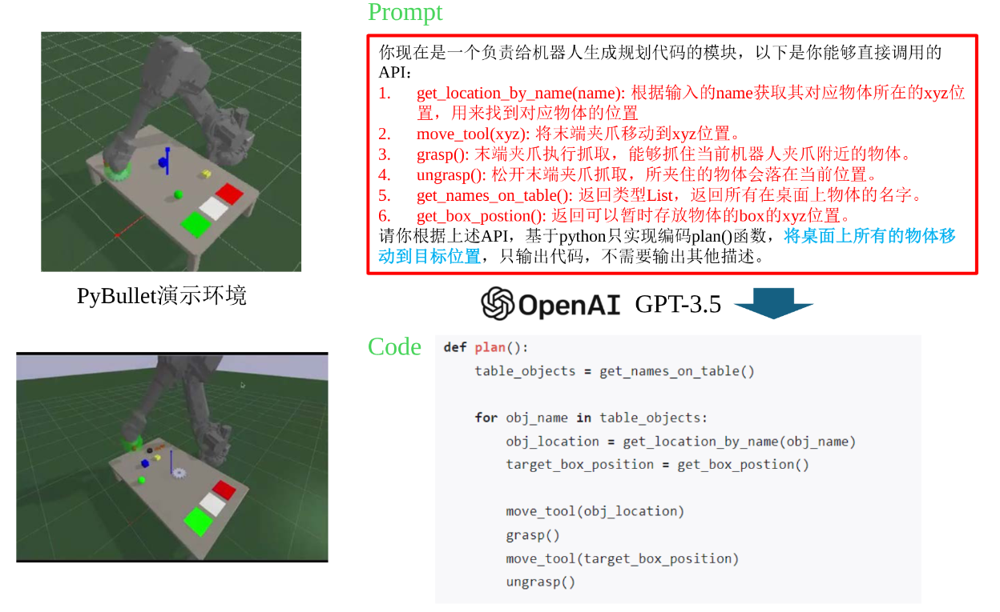

> 具身智能是指一种基于物理身体进行感知和行动的智能系统, 其通过智能体与环境的交互获取信息、理解问题、做出决策并实现行动, 从而产生智能行为和适应性。

Emboided Al：集成环境理解、智能交互、认知推理、规划执行于一体的系统化方案

其实通过这个图片我学到了怎么更好的写prompt

LLM可以作为一个桥接人类指令意图到具体规划代码生成的媒介

---

# 一些新名词

DAGGER 是一种用于解决模仿学习中相关问题的思想，其全称为 Dataset Aggregation（数据集聚合）。

DAGGER 的核心思想是通过迭代的方式，让模型在实际执行过程中暴露问题，由专家对模型的错误进行纠正，并将这些纠正后的数据加入到训练集中，从而使模型能够学习到更准确的策略。具体来说，首先使用人类专家数据训练一个初始策略，然后让该策略在仿真环境中执行，收集其实际遇到的状态，接着请专家在这些状态下提供正确动作，将新的状态 - 动作对加入训练集，再用聚合后的数据重新训练策略，重复这个过程直到模型性能收敛。

与传统的模仿学习相比，DAGGER 的优势在于它能够让训练时的状态分布更接近测试时的状态分布，使模型具有错误纠正能力，从而提高模型的鲁棒性。例如在自动驾驶的策略学习中，DAgger 可以让模型在仿真环境中 “试着开”，专家 “盯着看”，对模型的决策进行纠正，从而提升模型在复杂场景下的表现能力。