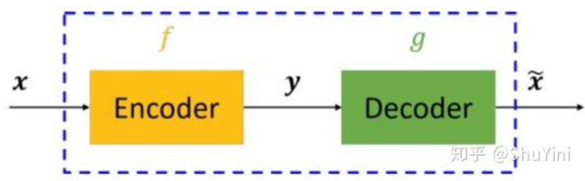
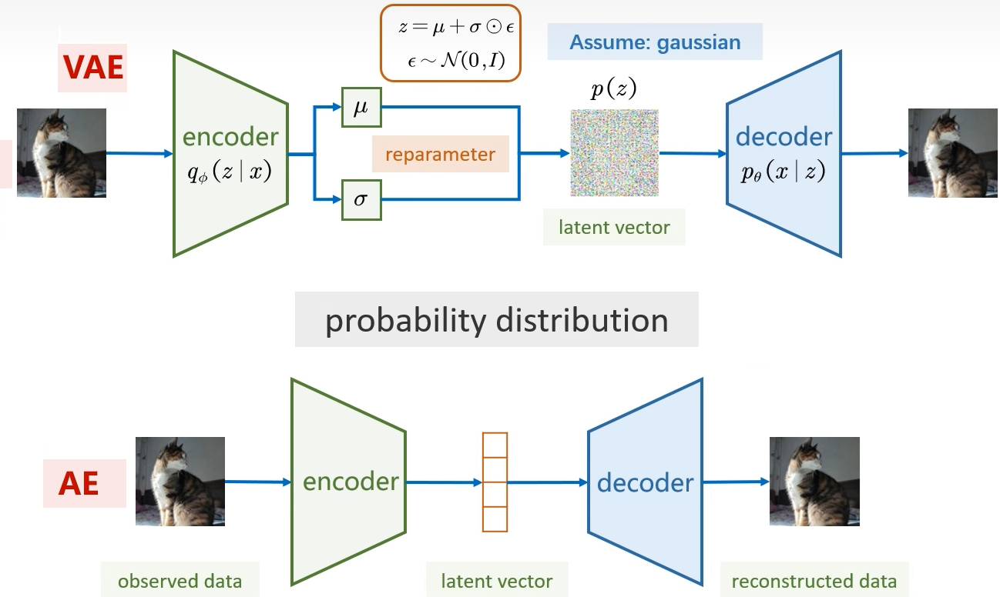

# AE、VAE、CVAE

## AE（autodecoder）

一个试图去还原其原始输入的系统

自编码器模型主要由编码器（Encoder）和解码器（Decoder）组成，其主要目的是将输入x转换成中间变量y，然后再将y转换成$$\bar x$$，然后对比输入x和输出$$\bar x$$使得他们两个无限接近。

自动编码器是一种无监督的神经网络模型，它可以学习到输入数据的隐含特征，这称为编码(coding)，同时用学习到的新特征可以重构出原始输入数据，称之为解码(decoding)。

例子：我有一张清晰图片，首先我通过**编码器**压缩这张图片的大小（如果展现出来可能比较模型），然后在需要**解码**的时候将其还原成清晰的图片。

为什么要压缩呢?

- 其主要原因是：有时神经网络要接受大量的输入信息, 比如输入信息是高清图片时, 输入信息量可能达到上千万, 让神经网络直接从上千万个信息源中学习是一件很吃力的工作. 所以, 何不压缩一下, 提取出原图片中的最具代表性的信息, 缩减输入信息量, 再把缩减过后的信息放进神经网络学习. 这样学习起来就简单轻松了
  

## VAE变分自编码器

这里才进入生成模型

在自编码器中，潜在表示是一个固定值，而 VAE 中，潜在表示则是一个不确定变量，或者换一个说法，是一个概率分布。

在 VAE 中，编码器不再只学习提取输入数据的编码信息，而是去学习获取输入数据的概率分布。在原始论文中，我们设定这一概率分布为正态分布，模型也就变成了这样：

- 与此同时，中间量我们不再叫潜在变量，而是称为潜在空间（也称潜在分布，隐变量等），并使用 Z 来表示，用来凸显其是一个变化的量。
- 解码器要做的工作就是如何从这样的概率分布中采样并还原成最终的输出。

## CVAE条件变分自编码器

给定一个条件 y，生成 x，例如：

- 文字 y → 生成图像 x
- 类别 y → 生成对应类别的图片
- 状态 y → 生成对应动作

### CVAE 解决什么问题？

### 1. 普通 VAE：

只能生成“随机图片”

### 2. CVAE：

生成 *有条件* 的图片，例如：

- “给我一只狗” → 出狗
- “生成数字 7” → 出 7
- “姿态条件”→ 出某姿态的人
- “状态条件”→ 出某动作

本质：

> CVAE = 条件生成的 VAE