# 强化学习笔记

## 宏观图景

一个智能体（agent）将通过**与其环境进行交互**（通过试错）并**接受奖励**（负面或者正面）作为执行动作的反馈，从而从环境中学习

从环境互动中学习**来源于我们的自然的经验**

人类和动物的学习方式是**通过互动。** 

强化学习只是 **一种从动作中学习的计算方法。**

## 正式定义

强化学习是一个用于解决控制任务（也称为决策问题）的框架，它通过构建智能体，让它们通过试错与其环境进行交互并接受奖励（正面或负面）作为唯一的反馈来从环境中学习

## 强化学习框架

### RL过程

强化学习过程：状态、动作、奖励和下一个状态的循环

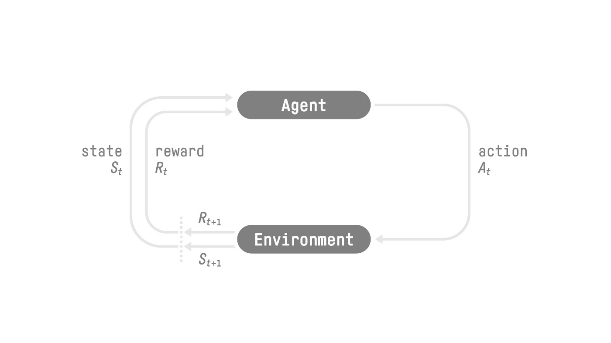

让我们想象一个代理学习玩平台游戏

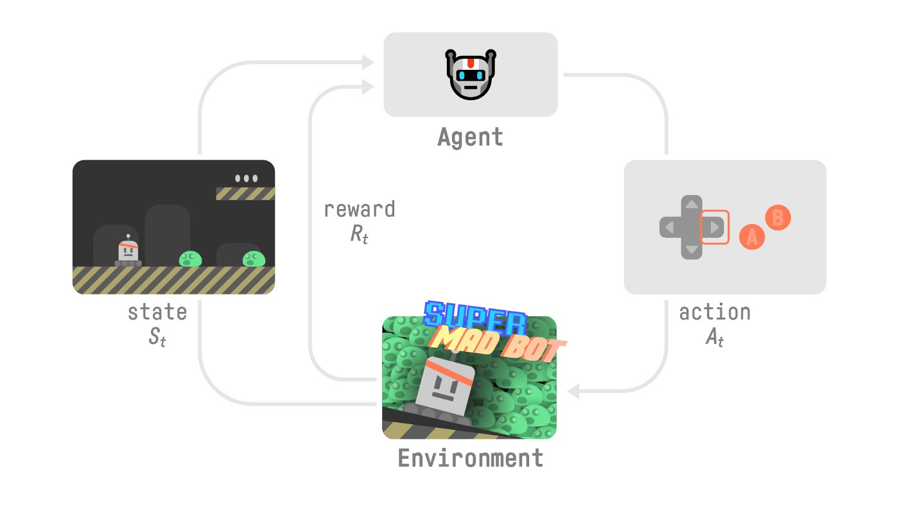

- 我们的代理从**环境**接收**状态 $S_0$**——我们收到游戏（环境）的第一个帧。
- 基于该**状态 $S_0$**，代理采取**动作 $A_0$**——我们的代理将向右移动。
- 环境进入一个**新**的**状态 $S_1$**——新帧。
- 环境向代理给予一些**奖励 $R_1$**——我们没死*（正奖励 +1）*。

这个 RL 循环输出一系列**状态、动作、奖励和下一个状态。**

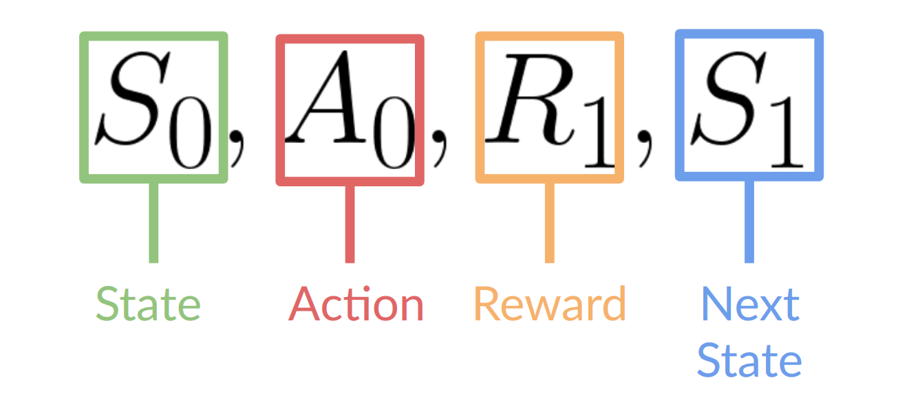

代理的目标是*最大化*其累积奖励，**称为预期回报。**

###  奖励假设：rl的核心思想

> 为什么代理的目标是最大化预期回报

因为rl基于**奖励假设**，即所有目标都可以描述为**最大化预期回报**（预期累积奖励）。

这就是为什么在rl中，**为了获得最佳行为**，我们的目标是学会采取**最大化预期累积奖励**。

### 马尔科夫性质

RL过程被称为马尔科夫过程（MDP）。

马尔科夫性质意味着我们的代理**只需要当前状态决定**采取什么行动，而**不需要它们之前所有的状态和动作的历史**。

### 观测/状态空间

观测/状态是**代理从环境中获得的信息**。在电子游戏中，可以是一帧截图。在交易代理中，可以是某个股票的价值等。

但，观测和状态之间有一个区别。

- *状态 s*：是**世界状态的完整描述**（没有隐藏信息）。在完全可观测的环境中。

  在国际象棋游戏中，我们可以访问整个棋盘信息，因此我们从环境中接收到一个状态。换句话说，环境是完全可观测的。

- *观测 o*：是**状态的部分描述。** 在部分可观测的环境中。

  在《超级马里奥兄弟》中，我们处于一个部分可观测的环境中。我们收到一个观测**，因为我们只看到关卡的一部分。**

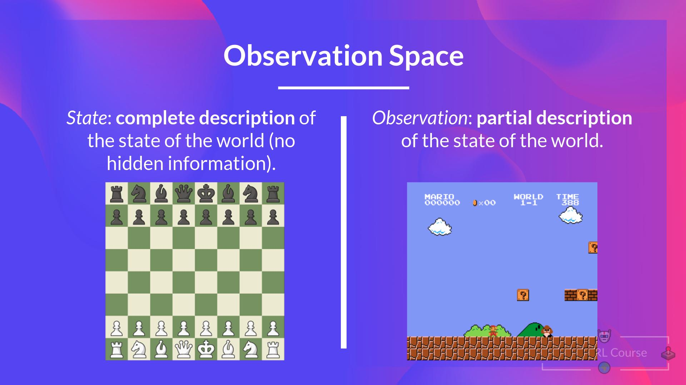

### 动作空间

动作空间是环境中所有可能动作的集合。

动作可以来自离散或者连续空间：

- 离散空间：可能动作的数量是有限的

  在《超级马里奥兄弟》中，我们有一个有限的动作集，因为我们只有四个方向。

- 连续空间：可能动作的数量是无限的

  自动驾驶汽车代理有无限数量的可能动作，因为它可以左转 20°、21.1°、21.2°，按喇叭，右转 20°…

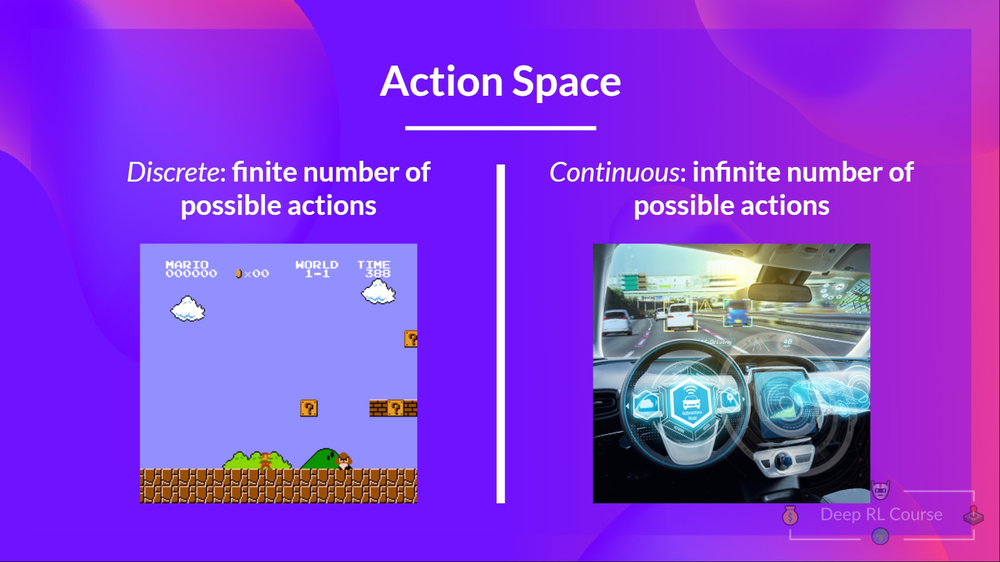

### 奖励与折扣

奖励在RL中至关重要，因为它是代理的**唯一反馈**，于是我们的代理就知道所采取的行动是好还是不好。

每个时间步长t的累积奖励可以写成

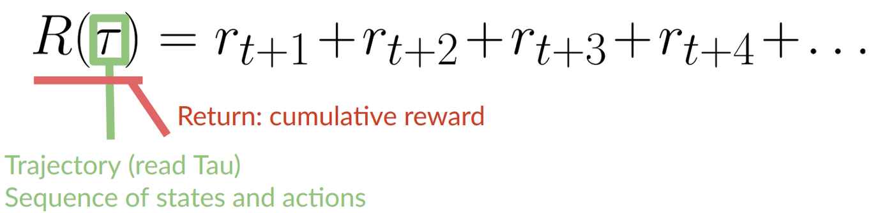

累积奖励等于序列中所有奖励的总和，也就等同于

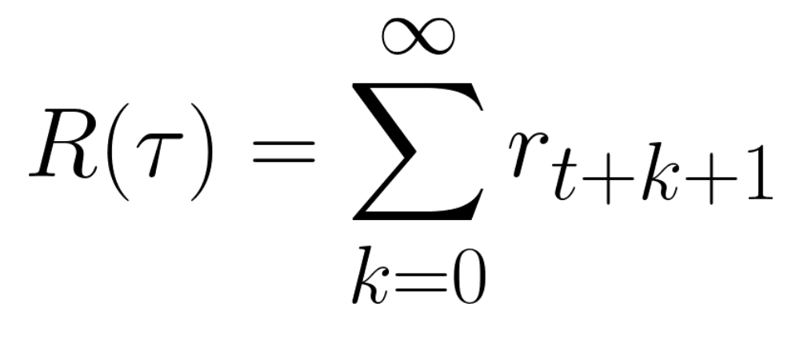

然而在现实中，是不能直接将它们相加的。

较早出现的奖励（游戏开始时）**更有可能发生**，因为它们比长期的未来奖励更可预测。

假设你的代理是这只微小的老鼠，它每一步可以移动一格，而你的对手是猫（它也可以移动）。老鼠的目标是**在被猫吃掉之前吃掉最多的奶酪。**

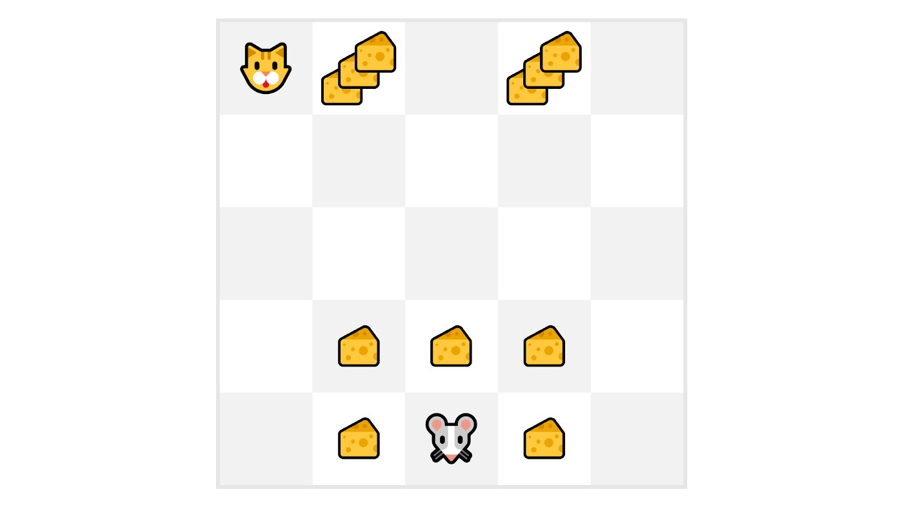

正如我们在图表中看到的，**吃到我们附近奶酪的可能性比吃到靠近猫的奶酪的可能性更大**（离猫越近，危险越大）。

因此，**靠近猫的奖励，即使它更大（奶酪更多），也会被更多地打折扣**，因为我们并不确定我们是否能吃到它。

为了**打折扣**奖励，我们这样做

1. 我们定义一个称为 gamma 的折扣率。**它必须在 0 到 1 之间。** 大多数情况下在**0.95 到 0.99** 之间。

   - gamma 越大，折扣越小。这意味着我们的代理**更关心长期奖励。**

   - 另一方面，gamma 越小，折扣越大。这意味着我们的**代理更关心短期奖励（最近的奶酪）。**

2. 然后，每个奖励都会被 gamma 的时间步长幂所折扣。随着时间步长的增加，猫离我们越来越近，**所以未来奖励发生的可能性越来越小。**

我们的折扣预期累积奖励是

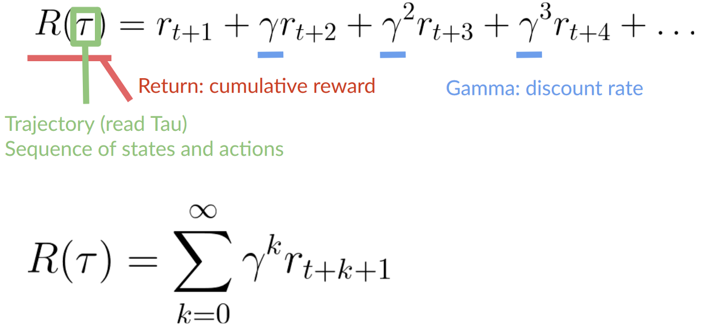

## 任务类型

任务是强化学习问题的一个实例。我们可以有两种类型的任务：回合制和持续性

### 回合制任务

在这种情况下，我们有一个起点和一个终点（**一个终止状态**）。这创建了一个回合：一个状态、动作、奖励和新状态的列表。

例如，《超级马里奥兄弟》：一个回合从一个新的马里奥关卡的启动开始，并在**你被杀死或到达关卡末尾时结束。**

### 持续性任务

是永远持续的任务（没有终止状态）。**在这种情况下，智能体必须学会如何选择最佳动作，并同时与环境进行交互。**

例如，一个进行自动化股票交易的智能体。对于这个任务，没有起点和终止状态。**智能体将持续运行，直到我们决定停止它。**

## 探索/利用权衡

探索是指通过尝试随机动作来探索环境，以获取有关环境的更多信息。

利用是指利用已知信息来最大化奖励

但我们经常会陷入一个常见的陷阱。

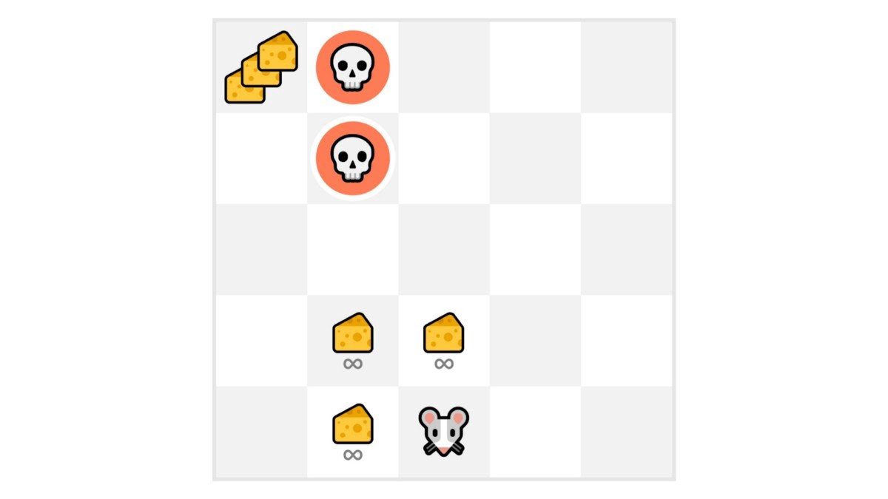

在这个游戏中，我们的老鼠可以获得**无限量的奶酪**（每块+1）。但在迷宫的顶部，有一个巨大的奶酪堆（+1000）。

然而，如果我们只关注利用，我们的代理将永远无法获得巨量的奶酪。相反，它只会利用**最近的奖励来源**，即使这个来源很小（利用）。

但是，如果我们的代理进行一点探索，它就可以**发现巨额奖励**（一堆大奶酪）。

这就是我们所说的探索/利用权衡。我们需要平衡我们**探索环境的程度**以及我们**利用我们所了解的环境的程度。**

因此，我们必须**定义一个有助于处理这种权衡的规则。**

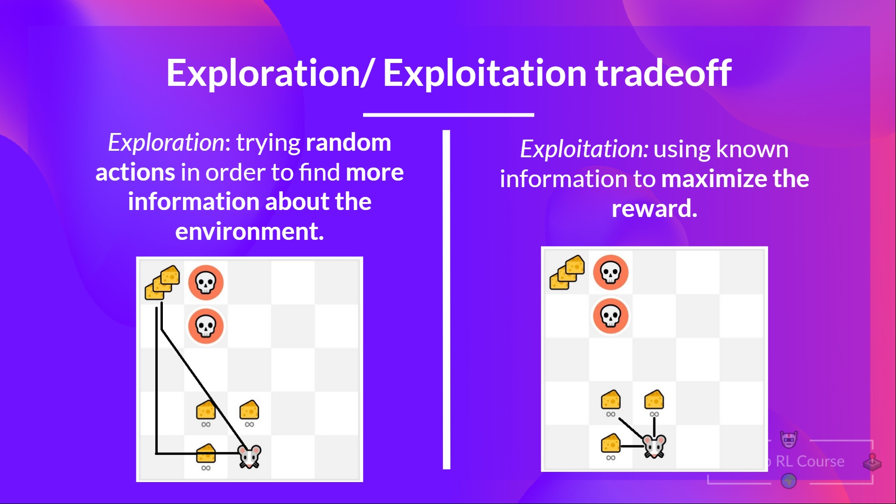

## 解决强化学习问题的两种主要方法

### 智能体的“大脑”：策略 π

策略 **π** 是我们**智能体的“大脑”**，它是一个函数，告诉我们在给定所处状态下应该采取什么**动作。**因此，它**定义了智能体在给定时间的行为**。

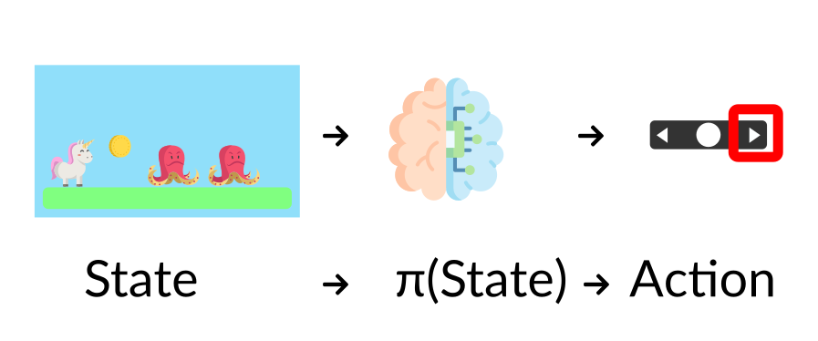

这个策略**是我们想要学习的函数**，我们的目标是找到最优策略 π *，即**在智能体按照它行动时能够最大化预期回报**的策略。我们**通过训练**来找到这个 π *。

有两种方法可以训练我们的智能体来找到这个最优策略 π*。

- **直接学习**，教智能体学习在给定当前状态下应该采取**什么动作**：**基于策略的方法**。
- **间接学习**，**教智能体学习哪个状态更有价值**，然后采取**导向更有价值状态**的动作：基于价值的方法。

#### 基于策略的方法

在这个方法中，我们直接学习一个策略函数。

这个函数从每个状态映射到最佳对应的动作。or，它也可以定义在该状态下所有可能动作的概率分布。

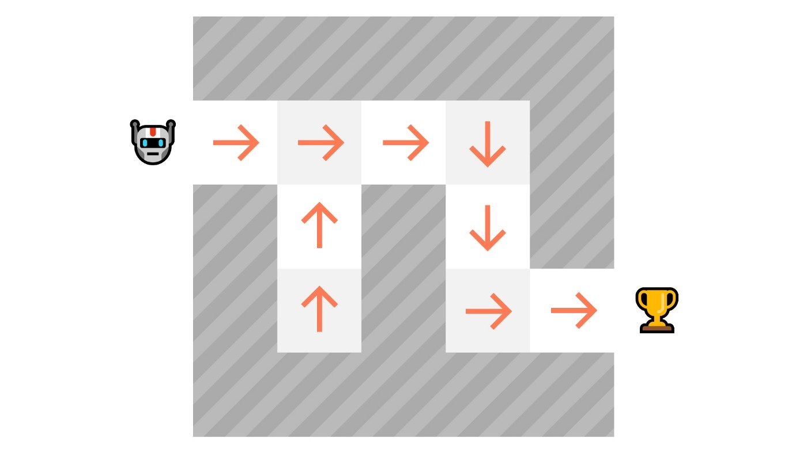

正如上图，策略直接指示每个步骤要采取的动作。

我们有两种类型的策略

- 确定性策略：在给定状态下，一个策略将始终返回相同的动作

```
action = policy(state)
```

$$
a = \pi(s)
$$

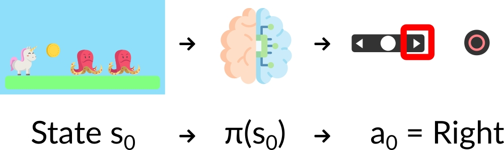

- 随机性策略：输出动作的概率分布

```
policy(actions | state) = 在给定当前状态下，动作集合的概率分布
```

$$
\pi(a|s)=P[A|s]
$$

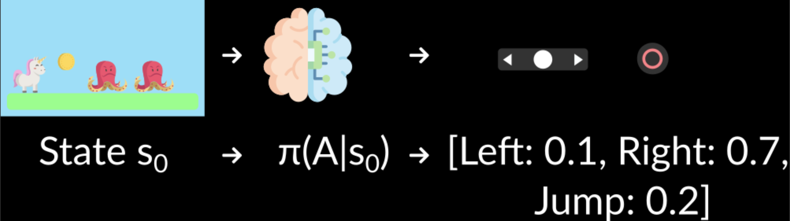

给定初始状态，我们的随机性策略将输出在该状态下可能动作的概率分布。

#### 基于价值的方法

在基于价值的方法中，我们不直接学学习策略函数，而是学习一个价值函数，该函数将状态映射到该状态的预期价值。

状态的价值是指智能体**从该状态开始，并按照我们的策略行动后能够获得的预期折扣回报。**

“按照我们的策略行动”仅仅意味着我们的策略是**“前往价值最高的状态”。**

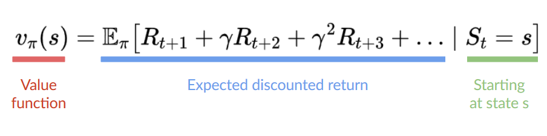

在这里我们看到，我们的价值函数**为每个可能的状态定义了价值。**

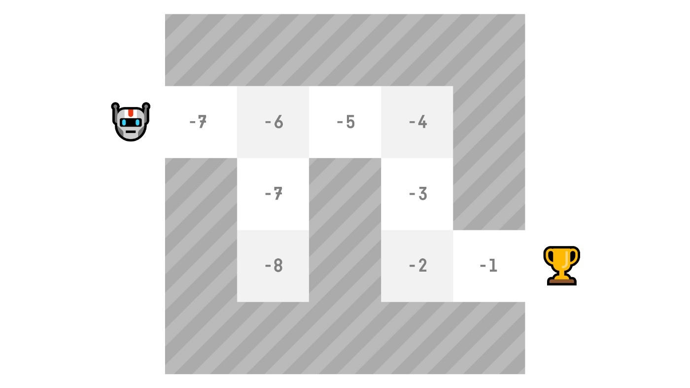

借助我们的价值函数，在每一步，我们的策略都会选择由价值函数定义的价值最大的状态：-7，然后是-6，然后是-5（以此类推）来达成目标。

## 强化学习中的“深度”

深度强化学习将深度神经网络引入以解决强化学习问题——因此得名“深度”。

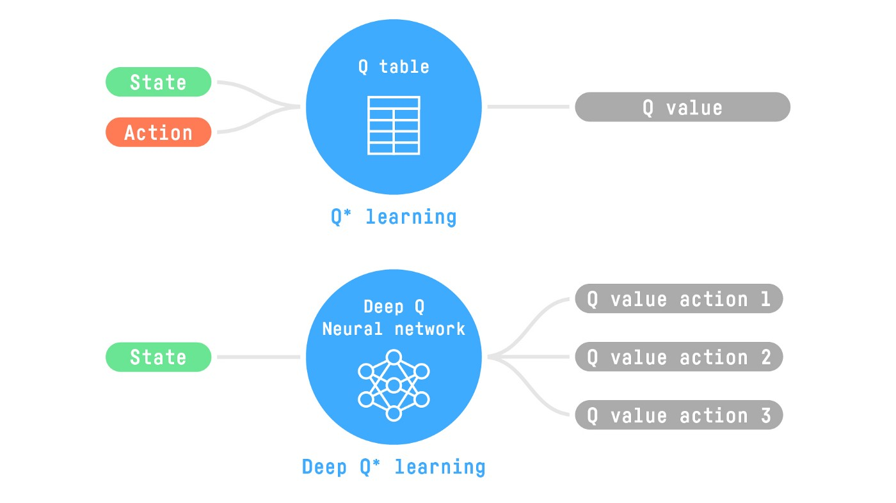