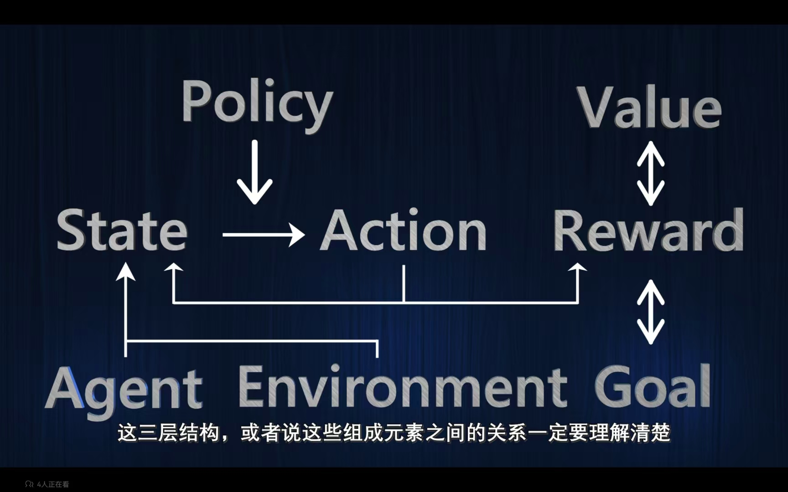

# RL

## 结构和元素

### 第一层结构：基本元素

- goal
- agent
- environment

### 第二层结构：主要元素

- state
- action
- reward

在一个状态下要采取某种行动

奖励是一个即时的反馈，目标是一个长远的结果

### 第三层结构：核心元素

- policy
- value

数学上策略就是一个函数，自变量输入是一个状态，因变量输入是一个行动

价值也是一个函数，策略取决于价值函数。指的是预期将来会得到的所有奖励之和（期望值）

1. 状态价值函数**State value**：输入是一个状态，输出是一个实数
2. 状态行动价值函数**State-Action value**：在特定状态下，采取某种行动所具有的价值

---

> 强化学习是Agent在与环境的互动中为了达成一个目标而进行的学习过程。强化学习所要学习的东西，实际上就是一个好的价值函数，而一个好的价值函数决定一个好的策略

---

## 实例——围棋

agent：我

environment：棋盘和对手

goal：赢得这局棋

state：棋盘上棋子的分布情况

state1：棋盘上没有落子的状态Empty board

action1：在星位落子

reward1：0

state2：对手落子

如果选取直接一点的状态行动价值函数

policy：在state1，我应该在哪里落子呢

state-action value：但是在state1，我可以采取的行动有361种，而这361种都有对应的价值；

如果规定赢棋的奖励为1，输棋或和棋的奖励为0，那么价值其实就是赢棋的概率

所以我的策略就是选择赢棋的概率最大的行动

---

> 核心内容：那么如何去学习一个好的价值函数以及好的策略？

#### 两个特点

1. **Trial and Error试错**

强化学习是一种试错学习。

棋谱书告诉你在什么情况下应该怎么落子，是一种监督学习。而棋谱告诉我们的就是一种策略，策略怎么来的，就是围棋的先辈们通过不断的尝试、不断的对弈总结出来的，这就是一种强化学习。

在不断下棋的过程中，去学习哪一步棋的价值最大，在不同的情况下应该怎么落子。

2. **Delayed reward 延迟奖励**

玩家采取的行动得到的即时奖励基本都是0？直到最后获得胜利。也就是行动没有获得即时的奖励，但是每一步棋对于最后的胜利都是有贡献的。这可能就导致一个行动有奖励（但是可能是0），但是它一定有价值。一个行动所具有的价值，只有在得到奖励之后才能真正得到体现，而这个奖励可能发生在一段时间之后。

> 在实际得到奖励之后，我们知道以前所采取的行动都对这个奖励有所贡献，如何学习过去的行动所具有的价值就谁到一个**信用分配**和**反向传播**的过程了
>
> 其实就是复盘，学习每一个行动所具有的价值的过程

---

### 核心问题Expolration(探索) vs Expolitation(利用)

利用强化学习所学习到的价值函数，比如我们有了一个状态行动价值函数，于是应该采取价值最高的行动——>expoitation

但是学习到的价值函数不一定是最优的价值函数，有些看起来不是价值很高的函数，有可能真实的价值是最高的（陷入局部最优解）

这样，我们还应该尝试不同的行动，从而优化我们的价值函数

**如何权衡这俩是核心问题**

