## 51

### 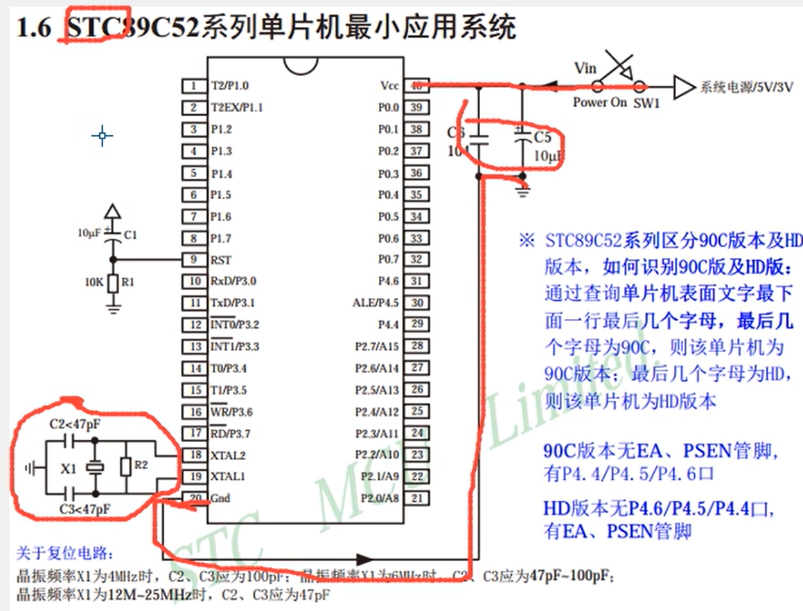

- 电容接在电源出可以滤波，原理是**对直流电表现出极大的阻抗，对交流电则阻抗较小**

- 晶振电路驱动程序往下运行

- 复位引脚

- AD/DA模块，模拟就是水龙头旋转控制水流大小，数字就是瞬间开关水龙头，呼吸灯 

- CPU通过配置寄存器来控制硬件电路，硬件电路来执行我们想要完成的功能

  

### 2-1,2,3 点亮一个LED灯,闪烁，流水灯

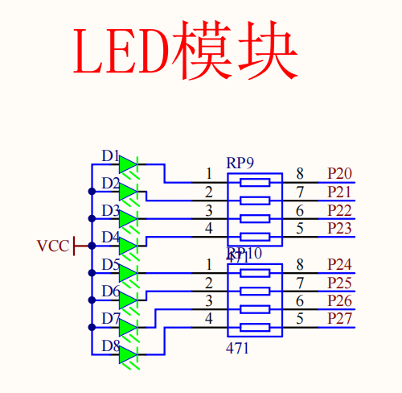

- LED，发光二极管，单向导电性（模电知识待补充）
- 电阻限流

> **核心就是如何控制这个P20口输出高低电平**，即配置P2口的寄存器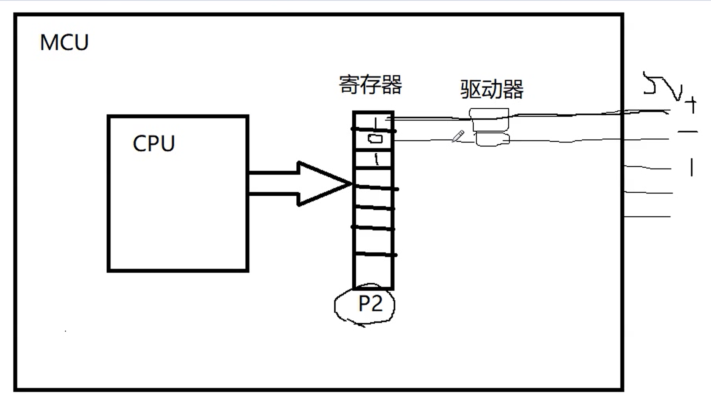

右边接的vcc，只有左边低电平，电路才能通，如果给1，两边都是高电平，电路就不通了

这么写是因为要点亮的是p20口，而这个口在第0位（也就是从右往左数第一位），所以就是11111110 ，中间有空格是为了方便转换成16进制。

 但**不能直接写二进制**，要将**二进制转化为十六进制**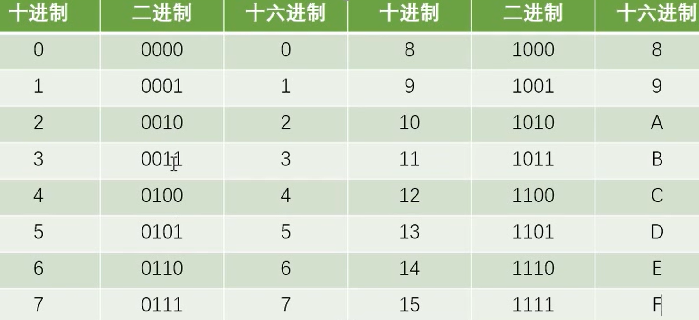

- 数据类型


#### 代码

- 2-1

```c
#include<REGX52.H>
void main()
{	
	P2=0x7f;//0111 1111
	while(1)
		{
			
		}
}
```

-  2-2

```c
#include<REGX52.H>
#include<INTRINS.H>
void Delay500ms()		//@12.000MHz
{
	unsigned char i, j, k;

	_nop_();//空语句
	i = 4;
	j = 205;
	k = 187;
	do
	{
		do
		{
			while (--k);
		} while (--j);
	} while (--i);
}//stc-isp生成

void main()
{
	
	while(1)
	{
			P2=0xFE;
			Delay500ms();
			P2=0xFF;
			Delay500ms();
	}

}
```

- 2-3

```c
#include <REGX52.H>
#include <INTRINS.H>

void Delay1ms(unsigned int xms)		//@12.000MHz
{
	unsigned char i, j;
  while(xms)              
	{
		i = 2;
		j = 239;
	do
	{
		while (--j);
	} while (--i);
		xms--;
	}
}


int main()
{
		while(1)
	{
		P2=0xFE;      //1111 1110
		Delay1ms(100);
		P2=0xFD;      //1111 1101   
		Delay1ms(100);
		P2=0xFB;      //1111 1011
		Delay1ms(100);
		P2=0xF7;      //1111 0111
		Delay1ms(100);
		P2=0xEF;      //1110 1111
		Delay1ms(100);
		P2=0xDF;      //1101 1111
		Delay1ms(100);
		P2=0xBF;      //1011 1111
		Delay1ms(100);
		P2=0x7F;      //0111 1111
		Delay1ms(100);
	}
}

```


### 3-1 独立控制LED亮灭

> 轻触按键：相当于是一种电子开关，按下时开关接通，松开时开关断开，实现原理是通过轻触按键内部的金属弹片受力弹动来实现接通和断开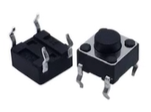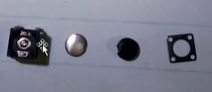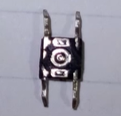

- 单片机上电时，所有io口默认都是高电平，按下了就是低电平

P2_0就是单片机上面的一个端口，这个端口就是链接右边第一个led灯的，等于左边七个LED直接不给信号了，只给右边第一个一个亮的信号


- 位运算


- C51 基本语句


### 3-2 独立按键控制LED状态

- 对于机械开关，当机械触点断开、闭合时，由于机械触点的弹性作用，一个开关在闭合时不会马上稳定地接通，在断开时也不会一下子断开，所以在开关闭合及断开的瞬间会伴随一连串的抖动


- 软件消除抖动，按键消抖，检测松手

- 里面的while就是理解为如果不松开按键就不出这个无内容的循环，不执行下面的取反

- 逻辑就是，按下一次→消抖→取反→亮→再按一次→消抖→取反→灭


```c
#include <REGX52.H>
void Delay(unsigned int xms)		//@12.000MHz
{
	unsigned char i, j;
	while(xms--)
	{
		i = 2;
		j = 239;
		do
		{
			while (--j);
		} while (--i);
	}
	
}

void main()
{
	while(1)
	{
		if(P3_1 == 0)
		{
			Delay(20);
			while(P3_1==0);
			Delay(20);
			P2_0 = ~P2_0;
		}
	}
}
```


### 3-3 独立按键控制led显示二进制

```c
#include <REGX52.H>
void Delay(unsigned int xms)		//@12.000MHz
{
	unsigned char i, j;
	while(xms--)
	{
		i = 2;
		j = 239;
		do
		{
			while (--j);
		} while (--i);
	}
	
}

void main()
{
	unsigned char LEDnum = 0;
	//8位二进制的数据，跟51的8位寄存器保持一致
	//常用来表示一个寄存器
	//³£ÓÃËüÀ´±íʾһ¸ö¼Ä´æÆ÷
	while(1)
	{
		if(P3_1 == 0)
		{
			Delay(20);
			while(P3_1==0);
			Delay(20);
			//P2默认为高电平，也就是1111 1111，直接++会溢出
			LEDnum++;
			P2 = ~LEDnum;
		}
	}
}
```


### 3-4 独立按键控制LED移位

0000 0001	0x01<<0

0000 0010	0x01<<1

0000 0100	0x01<<2

0000 1000	0x01<<3

以此类推

```c
#include <REGX52.H>
void Delay(unsigned int xms)		//@12.000MHz
{
	unsigned char i, j;
	while(xms--)
	{
		i = 2;
		j = 239;
		do
		{
			while (--j);
		} while (--i);
	}
	
}

void main()
{
	unsigned char LEDnum = 0;
	while(1)
	{
		if(P3_1 == 0)
		{
			Delay(20);
			while(P3_1==0);
			Delay(20);

			if(LEDnum >= 8)
			{
				LEDnum = 0;
			}
			P2 = ~(0x01<<LEDnum);
			LEDnum++;
		}
	}
}


```

```c
//两个按键控制版本

#include <REGX52.H>
void Delay(unsigned int xms)		//@12.000MHz
{
	unsigned char i, j;
	while(xms--)
	{
		i = 2;
		j = 239;
		do
		{
			while (--j);
		} while (--i);
	}
	
}

void main()
{
	unsigned char LEDnum = 0;
	while(1)
	{
		if(P3_1 == 0)
		{
			Delay(20);
			while(P3_1==0);
			Delay(20);

			if(LEDnum >= 8)
			{
				LEDnum = 0;
			}
			P2 = ~(0x01<<LEDnum);
			LEDnum++;
		}
		
		if(P3_0 == 0)
		{
			Delay(20);
			while(P3_0==0);
			Delay(20);

			if(LEDnum == 0)
			{
				LEDnum = 7;
			}
			else
			{
				LEDnum--;
			}
			P2 = ~(0x01<<LEDnum);
		}
	}
}
```


### 4-1 静态数码管显示

- LED数码管：数码管是一种简单、廉价的显示器，是由多个发光二极管封装在一起组成“8”字型的器件

有

有时候单片机的接口不够，你可以理解为拓展


#### 一位的数码管

就是8个led组成的（8位）

有两种连接方式：共阴极和共阳极

字母排序（顺时针)

引脚定义（逆时针)


以共阴极举例，要点亮一个数码管，得先将公共端接地（0、低电平）——》**位选**


#### 四位一体的数码管


得到1

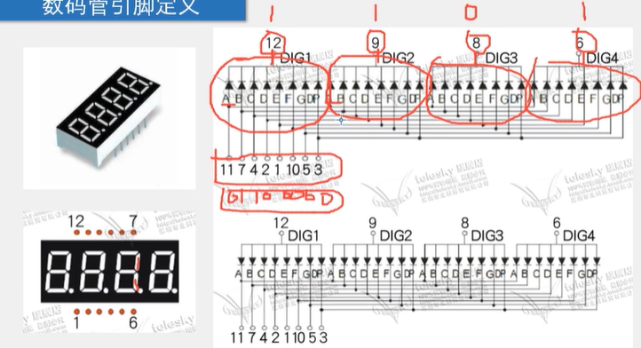


数码管不可能同一时刻显示多个数字，就只有一个被选中

即使有多个被选中，它显示的数字肯定也是1


数码管有位选和段选，其中一个必是P0口控制，另外一个根据板子不同，可能是P1或P2或P3都有可能


译码器：译码器可以节省引脚，以前八个，现在只用三个，减少电路耦合

138译码器的作用是减少单片机的io口

（一个芯片3个端口控制8个端口，所以叫138）

使能：为了保证3-8译码器可以正常工作，需要对4,5，6号引脚置数。所置的数值根据引脚是高电平有效还是低电平有效来选择。

双向数据缓冲器，缓冲器作用提高单片机驱动能力

排组是并联式的，分流不分压

跳线帽，调整通断


101是Y5,Y5对应着LED6，从高位到地位（101）

### 4-2 动态数码管显示

利用人眼视觉暂留

上一个段选通过新的段选数据改变，但在改变之前先进行了位选


- 单片机直接扫描:硬件设备简单，但会耗费大量的单片机CPU时间

- 专用驱动芯片:内部自带显存、扫描电路，单片机只需告诉它显示什么即可


### 5-1 模块化编程和5-2LC

- 传统方式编程:所有的函数均放在main.c里，若使用的模块比较多则一个文件内会有很多的代码，不利于代码的组织和管理，而且很影响编程者的思路
- 模块化编程:把各个模块的代码放在不同的.c文件里，在.h文件里提供外部可调用函数的声明，其它.c文件想使用其中的代码时，只需要#include"XXX.h“文件即可。使用模块化编程可极大的提高代码的可阅读性、可维护性、可移植性等


ifndef全称是if not define

这叫条件编译，预处理包括三种：头文件包含，条件编译，宏定义


没定义AAA，下面的东西不参与编译


一般的串口和外设使用之前都需要初始化的


### 6-1 矩阵键盘

> - 在键盘中按键数量较多时，为了减少1/0口的占用，通常将按键排
>   列成矩阵形式
> - 采用逐行或逐列的“扫描"，就可以读出任何位置按键的状态

**本节內容：读取矩阵键盘的键码值，显示在LCD1602上**

- 数码管扫描(输出扫描)

  - 原理：显示第1位 一> 显示第2位 一> 显示第3位 —> 然后快速循环这个过程，最终实现所有数码管同时显示的效果

- 矩阵键盘扫描(输入扫描)

  - 原理：读取第1行(列) 一 >读取第2行(列) 一 >读取第3行(列) — >然后快速循环这个过程，最终实现所有按键同时检测的效果

    >  以上两种扫描方式的共性:节省I/O口

(16 -> 8)


按行扫描因为引脚冲突，蜂鸣器会不停地响，所以选择按列扫描


弱上拉（通俗理解为：具有较弱的拉高电平或电位的能力，虽然弱，但够用）

这里接了上拉电阻如果io口不接地且位开关未置地，始终为高电平，如果外部接地这个点位电压会被拉到接近0v

就是流出电流的能力弱，吸收电流的能力强

### 6-2 矩阵键盘密码锁


### 7-1 定时器

> 定时器介绍：51单片机的定时器属于单片机的内部资源，其电路的连接和运转均在单片机内部完成
>
> 定时器作用:
>
> 1. 用于计时系统，可实现软件计时，或者使程序每隔一固定时间完成一项操作
> 2. 替代长时间的Delay，提高CPU的运行效率和处理速度

用了定时器CPU就可以做其他的事情

- STC89C52定时器资源

  > 定时器个数:3个(T0、T1、T2)，T0和T1与传统的 51单片机兼容，T2是此型号单片机增加的资源
  > 注意：定时器的资源和单片机的型号是关联在一起的，不同的型号可能会有不同的定时器个数和操作方式，但一般来说，T0和T1的操作方式是所有51单片机所共有的


第一部分是时钟，第二部分是计数单元，第三部分是中断


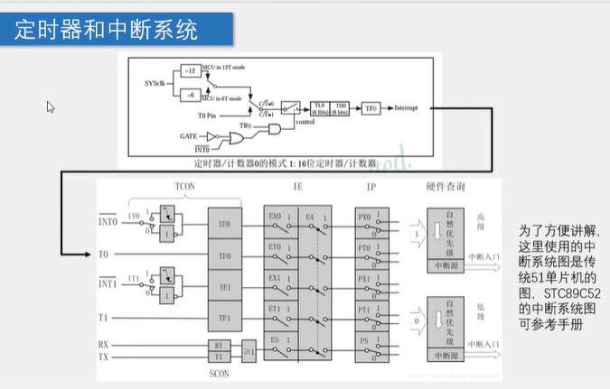


单片机通过配置寄存器来控制内部线路的连接

可以理解为可位寻址（P2）是可以按位来修改这个位的变量，不可位寻址是只能整体通过整体修改来修改局部位变量


### 8-1 串口通信

- 串口是一种应用十分广泛的通讯接口，串口成本低、容易使用、通信线路简单，可实现两个设备的互相通信。
- 单片机的串口可以使单片机与单片机、单片机与电脑、单片机与各式各样的模块互相通信，极大的扩展了单片机的应用范围，增强了单片机系统的硬件实力。
- 51单片机内部自带UART(Universal Asynchronous ReceiverTransmitter，通用异步收发器)，可实现单片机的串口通信


电脑和显示屏之间的连接时vga接口，传输视频的，上图是纯串口，只能传输数据


陀螺仪模块（传感器模块，可以检测出姿态角和加速度的信息）


通过串口给单片机传输数据


蓝牙串口


硬件电路 

- 简单双向串口通信有两根通信线（发送端TXD和接收端RXD）
- TXD和RXD要交叉连接
- 当只需要单向的数据传输时，可以直接一根通信线
- 当电平标准不一样时，需要加电平转换芯片


电平标准

- 电平标准是数据1和数据0的表达方式，是传输线缆中人为规定的电压与数据的对应关系，串口常用的电平标准有如下三种：
  - TTL电平：+5V表示1，0V表示0
  - RS232电平：-3~-15V表示1，+3~+15V表示0
  - RS485电平：两线压差+2~6V表示1，-2~-6V表示0（差分信号）（传的很远，1000多米）


常见通信接口比较

|  名称  |       引脚定义       |   通信方式   |      特点      |
| :----: | :------------------: | :----------: | :------------: |
|  UART  |       TXD、RXD       | 全双工、异步 |   点对点通信   |
|  I^2C  |       SCI、SDA       | 半双工、同步 | 可挂载多个设备 |
|  SPI   | SCLK、MOSI、MISO、CS | 全双工、同步 | 可挂载多个设备 |
| 1-Wire |          DQ          | 半双工、异步 | 可挂载多个设备 |

- 此外还有：CAN（汽车领域）、USB等


相关术语

- 全双工：通信双方可以在同一时刻互相传输数据
- 半双工：通信双方可以互相传输数据，但必须分时复用一根数据线
- 单工:通信只能有一方发送到另一方，能反向传输
- 异步:通信双方各自约定通信速率
- 同步：通信双方靠一根时钟线来约定通信速率
- 总线:连接各个设备的数据传输线路(类似于一条马路，把路边各顺户连接起来，使住户可以相互交流)


usb的电平协议转化内串口的电平协议


串口参数和时序图

- 波特率：串口通信的速率（发送和接收各数据位的间隔时间）
- 检验位：用于数据验证
- 停止位：用于数据帧间断


在mcu里


 数据显示模式 

- HEX/十六进制/二进制模式：以原始数据的形式显示
- 文本模式/字符模式：以原始数据编码后的形式显示


### 9-1 LED点阵屏

**介绍：**

- LED点阵屏由若干个独立的LED组成，LED以矩阵的形式排列，以灯珠亮灭来显示文字、图片、视频等。LED点阵屏广泛应用于各种公共场合，如汽车报站器、广告屏以及公告牌等
- LED点阵屏分类
  - 按颜色:单色、双色、全彩
  - 按像素:8 * 8、16 *16等(大规模的LED点阵通常由很多个小点阵拼接而成)


**显示原理**：


- LED点阵屏的结构类似于数码管，只不过是数码管把每一列的像素以“8”字型排列而已
- LED点阵屏与数码管一样，有共阴和**共阳**两种接法，不同的接法对应的电路结构
- LED点阵屏需要进行逐行或逐列扫描，才能使所有LED同时显示


74HC595

- 是串行输入并行输出的移位寄存器，可用3根线输入串行数据，8根线输出并行数据，多片级联后，可输出16位、24位、32位等，常用于IO口扩展


（数电触发器）


c51的sfr和sbit

- **sfr**（sprcial function register）:特殊功能寄存器声明
  - sfr P0 = 0x80; //声明P0口寄存器，物理位置为0x80
- **sbit**：（special bit）特殊位声明
  - sbit P0_1 = 0x81;	or	sbit p0_1 = P0^1;	//声明P0的寄存器的第一位
- **可位寻址/不可位寻址**：在单片机系统中，操作任意寄存器或者某一位的数据时，必须给出其物理地址，又因为一个寄存器里有8位所以位的数量是寄存器数量的8倍，单片机无法对所有位进行编码故每8个寄存器中，只有一个是可以位寻址的。对不可位寻址的寄存器，若要只操作其中一位而不影响其它位时，可用“&=”、“=”“^=”的方法进行位操作

>  位寻址就是P2_0  =1  不可位寻址就是P2=0X3E


### DS1302实时时钟

- DS1302是由美国DALLAS公司推出的具有涓细电流充电能力的低功耗实时时钟芯片。它可以对年、月、日、周、时、分、秒进行计时且具有闰年补偿等多种功能
- RTC(Real Time Clock):实时时钟，是一种集成电路，通常称为时钟芯片

自带备用电电池


引脚定义和应用电路


（直插）


（贴片）


芯片原理图


| 引脚名 |               作用名               | 引脚名 |     作用      |
| :----: | :--------------------------------: | :----: | :-----------: |
|  VCC2  |               主电源               |   CE   |   芯片使能    |
|  VCC1  |              备用电源              |   IO   | 数据输入/输出 |
|  GND   |               电源地               |  SCLK  |   串行时钟    |
| X1、X2 | 32.768Hz晶振（计时，提供稳定脉冲） |        |               |

（51没有接备用电池）


**内部结构框图**

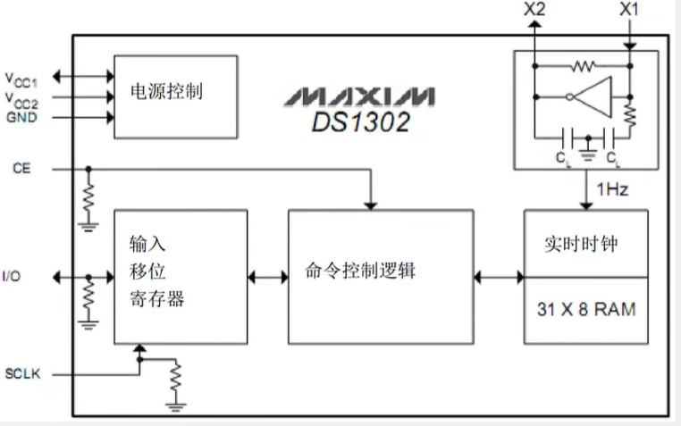

**寄存器定义**

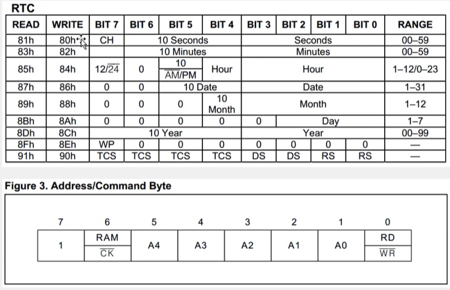

（地址（在哪）命令（写入/读出）字节（什么））

CK和WR头上加以横线就是低电平有效

前排提醒，io第一段是寄存器里的地址，第二段是写入或读出的数值


**时序定义**


时钟上升沿写入数据，时钟下降沿读出数据

这里要补充一点,在这进度条之前,不是有配置吗,里面的配置读写是配置i/o口此时要读写还是只读,然后sclk通过这个i/o口决定那个时间段该上升沿还是下降沿

这里时序图如图所示,i/o口传入16位数据,其中最前面的是对这段数据的配置,想写入还是写出这种的

后面8位才是真正的数据,4和5有些错误理解,现在改过来了

（时序电路是数电里的）

就是i/o口向单片机传入数据,然后前八位是对ds1302芯片的配置,单片机读完配置之后根据配置来更改sclk来读入或写出数据


?????????????????????????????????????


### 蜂鸣器

- 蜂鸣器是一种将电信号转换为声音信号的器件，常用来产生设备的按键音、报警音等提示信号
- 蜂鸣器按驱动方式可分为有源蜂鸣器和无源蜂鸣器
- 有源蜂鸣器:内部自带振荡源，将正负极接上直流电压即可持续发声，频率固定
- 无源蜂鸣器:内部不带振荡源，需要控制器提供振荡脉冲才可发声调整提供振荡脉冲的频率，可发出不同频率的声音
- （声音的本质是振动）

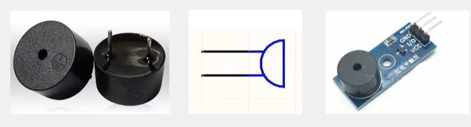


**驱动电路**

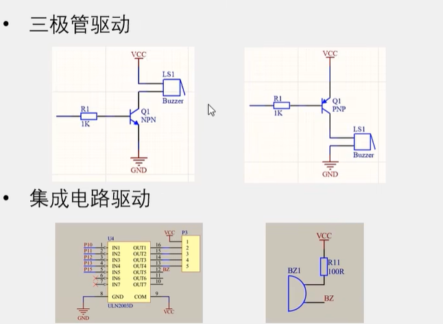

npn高电平导通，pnp是低电平导通


（它是个驱动器）

 

音符与频率对照


### AT24C02

- **AT24C02**是一种可以实现掉电不丢失的存储器，可用于保存单片机运行时想要永久保存的数据信息
- 存储介质:E2PROM
- 通讯接口:I2C总线
- 容量:256字节

（我发现电子秤上的功能，用单片机都能实现）


**存储器介绍**


（右下脚烧录程序，真的是烧录，将二极管击穿）


I2C硬件接口是开漏模式，这个接口只能输出低电平，要实现高电平就要靠上拉电阻去拉高。


I²C（Inter-Integrated Circuit）是由飞利浦公司在20世纪80年代初开发的一种串行通信总线标准。它是一种用于在集成电路（IC）之间进行短距离通信的总线标准，广泛应用于各种电子设备和嵌入式系统中。I²C的主要特点是简单、易用，并且只需要两条线（数据线和时钟线）就可以实现多设备之间的通信。


通信协议，这是个标准，统一

1. **双线通信**：
   - I²C总线使用两条线进行通信：
     - **SDA（数据线）**：用于传输数据。
     - **SCL（时钟线）**：用于同步数据传输。

2. **多主多从架构**：
   - I²C总线支持多主（Master）多从（Slave）架构，这意味着在总线上可以有多个主设备和多个从设备。主设备负责控制总线，发起通信，从设备响应主设备的请求。

3. **地址分配**：
   - 每个连接到I²C总线的设备都有一个唯一的地址，通过该地址进行通信。主设备在通信开始时发送从设备的地址，从设备根据地址决定是否响应。

4. **双向通信**：
   - I²C总线支持双向通信，主设备可以向从设备发送数据，也可以从从设备读取数据。

5. **速率**：
   - I²C总线有不同的速率模式，如标准模式（100 kbps）、快速模式（400 kbps）、高速模式（3.4 Mbps）等。


**I²C总线的应用**

I²C总线广泛应用于各种嵌入式系统和电子设备中，如：

- **传感器**：用于与温度传感器、湿度传感器、加速度计、陀螺仪等传感器进行通信。
- **显示器**：用于与LCD显示屏、OLED显示屏等进行通信。
- **存储器**：用于与EEPROM、FRAM等存储器进行通信。
- **微控制器**：用于微控制器之间或微控制器与外围设备之间的通信。
- **音频设备**：用于与数字音频设备、编解码器等进行通信。


**I²C通信的基本过程**

1. **起始条件（Start Condition）**：
   - 主设备在总线上发出起始条件，SDA线从高电平拉低，SCL线保持高电平。

2. **地址帧（Address Frame）**：
   - 主设备发送从设备的7位地址和读/写位（读为1，写为0）。

3. **应答位（Acknowledge Bit）**：
   - 从设备收到地址后，如果匹配，会在应答位上拉低SDA线，表示应答。

4. **数据帧（Data Frame）**：
   - 主设备或从设备发送8位数据，每发送一帧数据后接收设备需要发送应答位。

5. **停止条件（Stop Condition）**：
   - 通信结束时，主设备发出停止条件，SDA线从低电平拉高，SCL线保持高电平。


听不懂


### DS18B20 温度传感器


### LCD1602


### 直流电机


