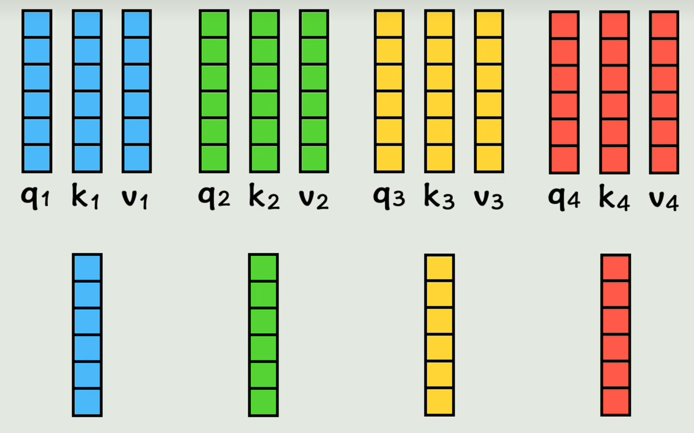
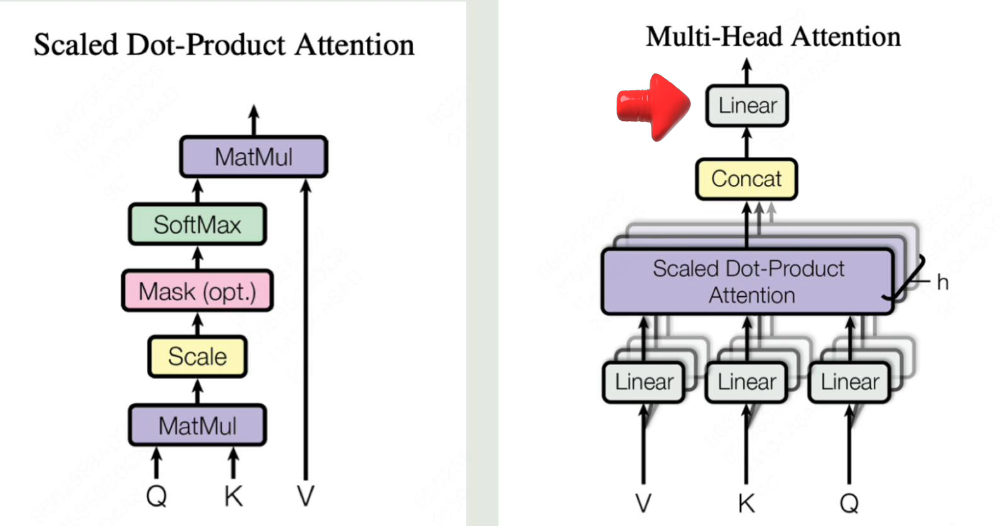

# Functions describe the world！

# NN

我们都有符号主义的思想，觉得世间万物都可以找到一个规律来解释，找不到呢？

那就靠猜和简化，这就是现代人工智能的思想

但其实许多数据是非线性的呢，所以要从原来的线性函数进化到非线性函数了

其实就在外面套一个非线性函数就可以了

这就是激活函数！

常用激活函数对比表

| 激活函数          | 公式                                    | 输出范围             | 优点                        | 缺点                     | 常见应用               |
| ----------------- | --------------------------------------- | -------------------- | --------------------------- | ------------------------ | ---------------------- |
| **恒等 (Linear)** | $f(x)= x$                               | $(-\infty, +\infty)$ | 简单，不改变输入            | 无非线性，不能建深层网络 | 回归问题输出层         |
| **Sigmoid**       | $f(x)=\frac{1}{1+e^{-x}}$               | $(0, 1)$             | 可解释为概率，平滑          | 梯度消失，收敛慢         | 早期二分类，输出层     |
| **Tanh**          | $f(x)=\tanh(x)$                         | $(-1, 1)$            | 输出居中，收敛比 Sigmoid 快 | 梯度消失                 | RNN（早期）            |
| **ReLU**          | $f(x)=\max(0,x)$                        | $[0, ∞)$             | 计算快，收敛快，主流        | 神经元死亡               | CNN, DNN 主流隐藏层    |
| **Leaky ReLU**    | $f(x)=max⁡(αx,x),α≪1$                    | $(-∞, ∞)$            | 避免 ReLU 死亡              | 参数 $\alpha$ 需调       | 改进版 CNN/DNN         |
| **ELU**           | $f(x)=x(x>0), α(ex−1)(x≤0)$             | $(-α, ∞)$            | 平滑，效果好                | 计算复杂度稍高           | 深层 CNN               |
| **Swish**         | $f(x)=x \cdot \text{sigmoid}(x)$        | $(-∞, ∞)$            | 更平滑，效果优于 ReLU       | 计算复杂度高             | MobileNetV3 等         |
| **GELU**          | $f(x)=x \cdot \Phi(x)$                  | $(-∞, ∞)$            | 更自然平滑，适合深层网络    | 计算复杂度高             | Transformer, GPT, BERT |
| **Softmax**       | $f(x_i)=\frac{e^{x_i}}{\sum_j e^{x_j}}$ | $(0,1)$，且和=1      | 输出概率分布                | 仅适合分类输出           | 多分类输出层           |

------

但其实一般会有多个输入

线还不够弯怎么办，如下无限套娃，就可以构造出非常非常复杂的非线性关系

咱们换一种表示方法，函数太复杂了！就有了所谓神经网络这种表示方法

真的是有点太通俗易懂了

虽然神经网络的层数很复杂，但是我们的目标就是猜出这里所有的w和b是多少！

那怎么计算w和b呢？

- 什么样的w和b是好的呢——>能够使我们的真实输出越接近真实数据（拟合~）

损失函数：表示预测数据和真实数据误差的函数

用什么方法：导数等于0，求极值点；

w和b两个变量的话多元函数求最小值问题就不再是导数了，而是要让每个参数的偏导数等于0

当然这也是机器学习中最基础的方法——线性回归

神经网络的损失函数往往是更复杂的函数，不能简单的令导数等于0.那怎么办呢，就是一点点试

让w变化一点点，看损失函数变化了多少，其实就是损失函数对w的偏导数

就是让w和b不断往偏导数的反方向去变化，具体变化的快慢要增加一个系数来控制（就是学习率），这些偏导数所 vcb构成的向量就叫做梯度

梯度下降：不断变化w和b，让损失函数逐渐减下的过程，最终求出w和b

这个偏导数怎么求？

虽然神经网络整体所代表的函数很复杂，但是层与层之间的关系却非常简单 

卧槽，这不就是链式求导法则吗

通过链式法则求导并逐层更新参数的过程就叫反向传播

最后，链式法则是简化梯度计算的，只能算各层梯度，求不出来w和b的解析解

我们通过前向传播，根据输入x计算出输出y，然后再通过反向传播计算出损失函数关于每个参数的梯度，然后每个参数都向着梯度的反方向变化一点点，这就构成了神经网络的一次训练。

然后神经网络经过多轮训练，直到让损失函数足够小也就是找到了我们想要的那个函数

为啥会过拟合呢：训练数据本身是个很简单的规律，但模型太复杂了，把噪声和随机波动也给学会了

**于是可以简化模型复杂度**或者**增加数据的量**

- 在原有的数据中创造更多的数据，图像处理中可以对图像进行旋转、翻转、裁剪、加噪声等操作->**数据增强**

从**训练过程**方面，训练过程就是不断调整参数的过程——>提前终止训练过程，差不多就行了（不够优雅）

- 如何直接抑制参数的野蛮生长呢？

参数是如何被训练出来的？是通过让参数往损失函数变小的方向不断调整，也就是梯度下降，如果我们在损失函数中把参数本身的值加上去，这样在参数往大了调整时，如果让损失函数减小的没有那么多，导致新的损失函数而是变大的于是一定程度上就抑制了参数的野蛮生长

还有一种方法，因为你的参数中肯定有一些好用的参数，如果模型过于依赖他们，肯定不是一件好事，于是我们可以随机丢弃一部分参数啊！

- 就是**Dropout**

其实还有很多问题

- 梯度消失：梯度反向传播是会越来越小，导致参数更新困难
- 梯度爆炸：梯度数值越来越大，参数的调整幅度失去了控制
- 收敛速度过慢：可能陷入局部最优或者来回震荡
- 计算开销过大：计算的数据量太庞大了，每次完整的前向传播和反向传播都非常耗时

解决方法

- 用梯度裁剪来防止梯度的更新过大
- 用合理的网络结构（比如残差网络）来防止深层网络的梯度衰减
- 用合理的权重初始化和将输入数据归一化让梯度分布更平滑
- 用动量法、RMSProp、Adam等自适应优化器来加速收敛，减少震荡
- 用Mini—batch把巨量的训练数据分割成几个小批次来降低单词的计算开销

# CNN

a good website:https://poloclub.github.io/cnn-explainer/

woc https://poloclub.github.io/外面的世界还是太精彩了

woc https://setosa.io/ev/image-kernels/

---

# transformer

- 全连接神经网络

每个词都没有上下文的信息，并且长度只能一一对应

- 循环神经网络

面临串行计算，而且如果句子太长会导致长期依赖困难的问题

给每个词一个位置编码，表示这个词出现在整个句子中的位置。把位置编码加到原来的词向量中，这个词就有了位置信息

。但是每个词还没有其他词的上下文信息，也就是注意不到其他词的存在

wq矩阵是可以通过学习的一组权重值，还有Wk，Wv矩阵

点积可以算相似度（点积表示相似度是因为余弦相似度）

经过一系列矩阵相乘，然后点积，获得一组新的词向量（每一个都包含位置信息和其他词的上下文信息的）

上述就是注意力机制attention做的事情

改进：之前是每个词计算一组QKV，现在我们在这个基础上再经过两个权重矩阵变成两组QKV，给每个词两个学习机会，学习到不同的要计算相似度的QKV，来增加语言的灵活性

这里每组qkv向量称为一个头，他们再经过刚刚注意力层的运算得到a向量，然后把两个向量拼接起来，就得到**多头注意力机制**

1. 把输入的内容通过词嵌入的方式转换为词向量矩阵

2. 加入位置信息（再加一个形状一样的矩阵）

3. 经过多头注意力的处理，输出的矩阵维度和输入没有变化，但给每个词向量增加了上下文信息

4. 添加残差网络和归一化处理（为了解决梯度消失，并且让分布更加稳定而做的优化）

一些细节

核心公式

核心架构

要补的东西还挺多

弹幕说本质都是概率学，gpt就是transformer的一半，只有解码器，就猜你的下一个词

# embedding

**词嵌入**：是一种将结构化数据（如文本）转换为计算机可以理解和处理的数值向量（一组数字）的技术

转换出的数字向量通常是低维且稠密的，能高效存储计算

---

**特点**：相似的词会被映射到向量空间中距离较近的位置，反映语义相关性

