# 温和走进深度学习

## 基础知识

### 概述

机器学习

- 监督学习（有标注的数据的学习）：**函数逼近**，前提是我有足够大的样本

（回归（所谓带标注就是，样本X对应的结果Y；然后拟合一个函数y=(x)）、分类、**函数的神经隐式表达** （无法显式表述f，因为太过复杂））

线性回归、逻辑回归、决策树、支持向量机、**神经网络**

- 非监督学习（没有标注数据的学习）

聚类、降维、关联规则、异常检测

- 强化学习（用奖励函数来引导的一种学习）：优化+随机

### 神经网络的本质

#### 函数的神经隐式表达

##### Computer Vision

- cv(信息理解)：图像分类、目标识别、语义分割

- cv（图像生成）：图像增强、风格迁移、文生图

 

##### NLP

- 信息理解：文本分类、命名实体识别
- 文本生成：翻译、聊天机器人

## 基础模型

学术视角的优化

1. 求解被建模为优化的问题，根本挑战是多变量和非凸
2. 分布式优化算法的本质是一致性和梯度下降。下降保证优化，一致性保证收敛
3. 强化学习和现代优化算法的本质就是随机和下降。下降用于优化，随机用于冲出局部最优点

这个视频

1. 神经网络的本质是多变量非凸函数的逼近，是向量变换的结构化神经隐式表达
2. 训练一个神经网络，就是在进行系统的参数辨识
3. Money is all you need

---

1. MLP：多层感知机

   - 梯度下降与反向传播更新参数

   - 梯度爆炸和梯度消失

   - 残差网络ResNet（解决上述问题）

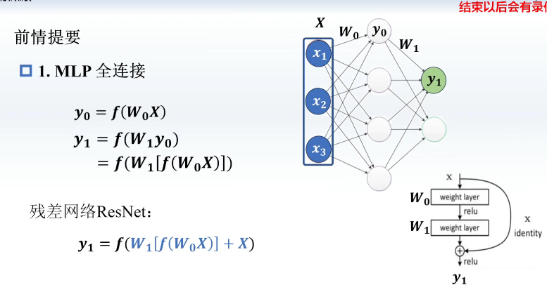

2. CNN：卷积与池化

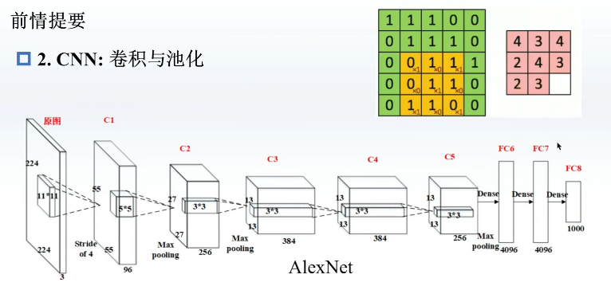

3. RNN与LSTM：循环网络

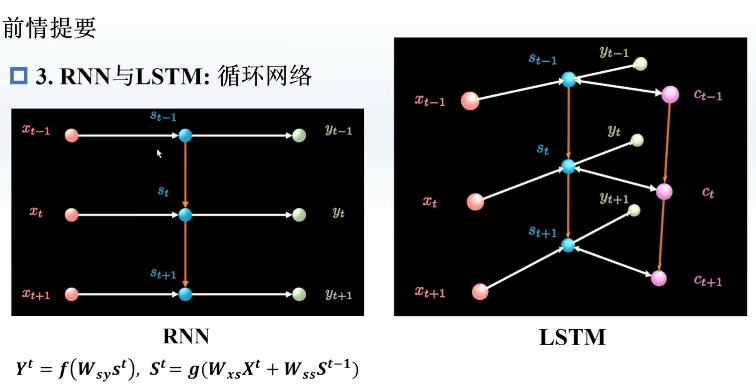

4. Attention：注意力机制

   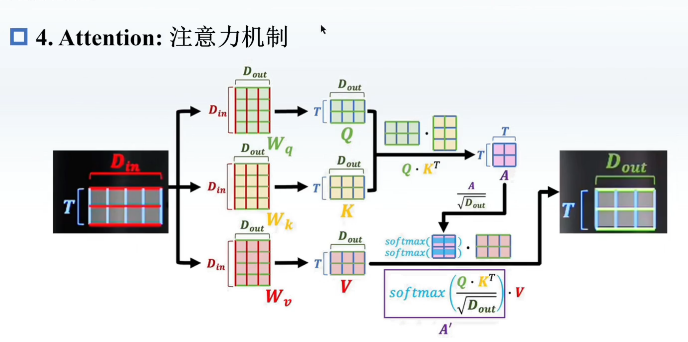

5. GNN：图神经网络

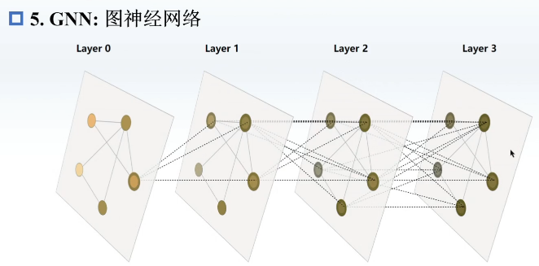

拓展：

- RNN是离散的线性时不变系统
- 离散的线性时不变系统就是CNN 

下面是👇拿经典的状态空间来表达控制系统

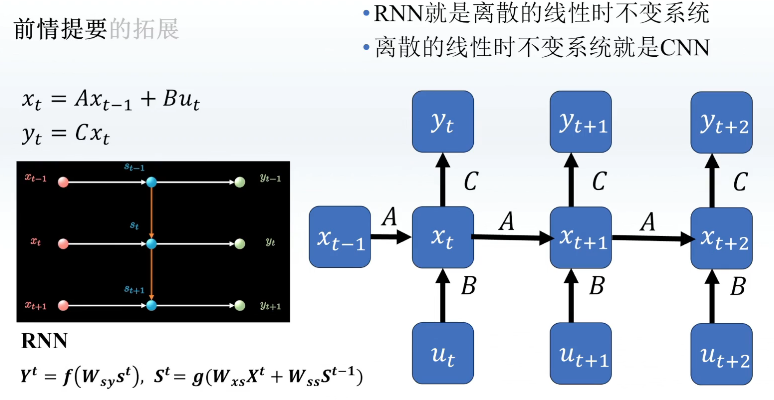

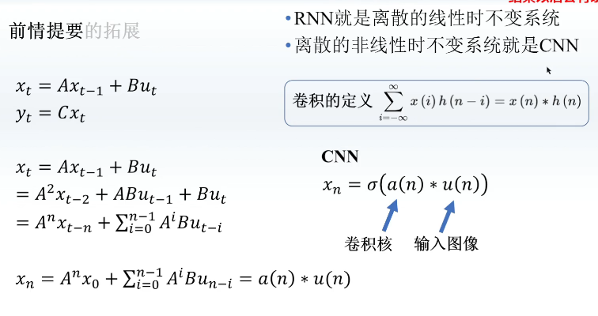

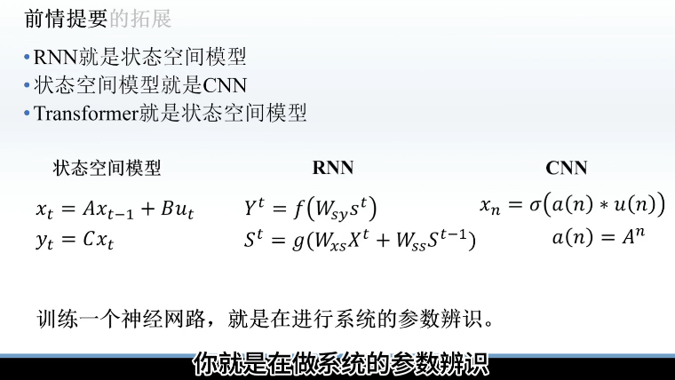

## Learning这十年

CNN

- Alexnet
- Resnet

NLP

- Transformer
- GPT
- BERT
- GPT-2
- GPT-3

CV

- Vit(vision-transformer)
- swin transformer（多层次的）
- MAE（BERT的CV版本）

多模态学习

- CLIP
- ViLT

生成模型

- GAN
- DALLE 2(CLIP+Diffusion models)

---

## 最重要的模型

1. NLP

   - Transformer

   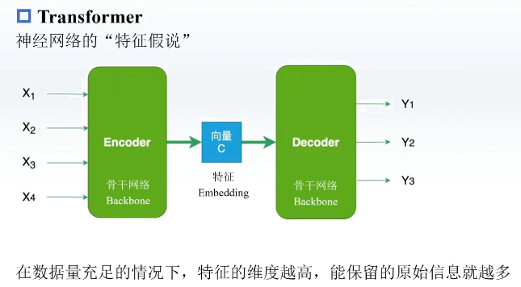

   这样就有参数可以来反向传播更新了:point_down:

   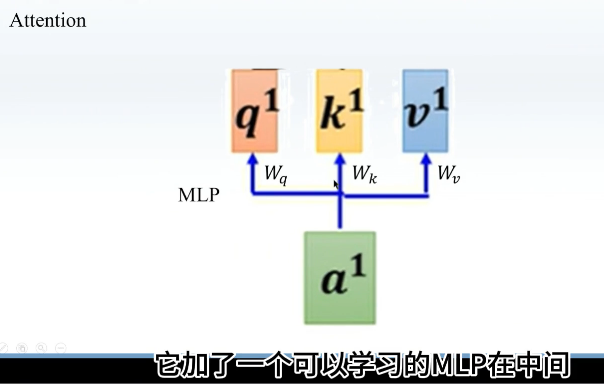

   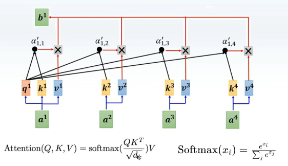

    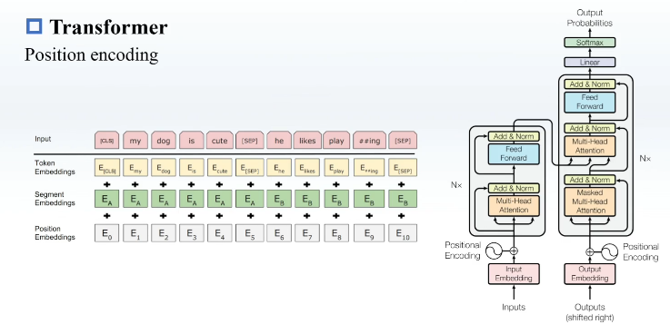

   优势：方便进行大规模并行运算；每层不改变输入输出维度；丰富的可学习参数

   **先天大模型学习圣体**

   - BERT（Encoder）

   我盖住中间的

   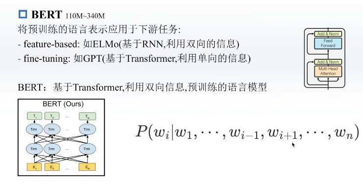

   - GPT（Decoder）

     - GPT-1 improving laguage understanding by generative pre-training

     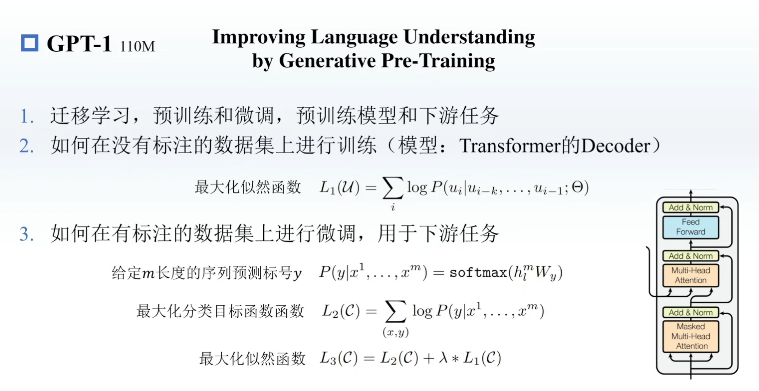

     - GPT-2 language models are unsupervised multitask learners

     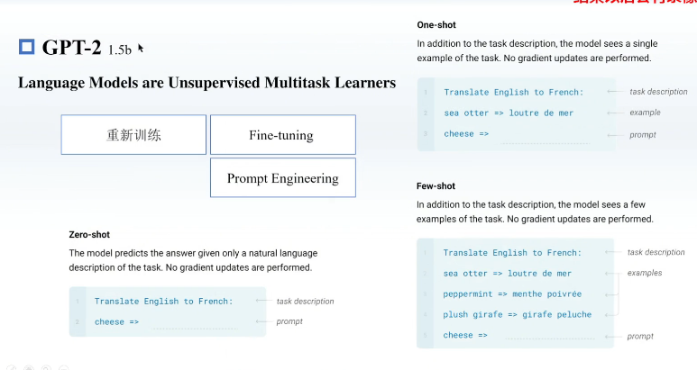

     - GPT-3 language models are few-shot learners

     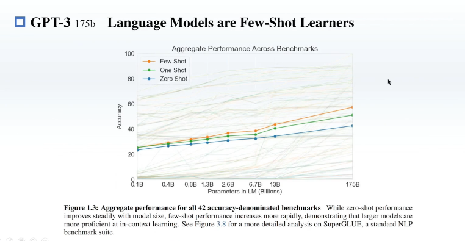

2. CV - Transformer

   - ViT
   - Swin Transformer

3. modality learning

   - CLIP
   - ViLT

 可行的技术路线:
1.直接使用预训练好的模型，作为自己方法中的一部分

2.用简单基础的神经网络替换传统方法中非学习的部分

  3.将复杂网络中的模块替换为轻量化的模块

## LLM

---

推理里面用空间换时间

---

下一步，分词器：

分词器就是把我们说的话装到一个给定的template中

指示了参数到底在哪里

SFT监督学习微调

full-fine tuning

lora—— low rank就是把一个矩阵拆成两个小的矩阵的成绩，我只训练这两个小的矩阵（参数量之和是原小于原来那个那个大矩阵的小很多），然后再加到原来的矩阵上去

deepseekR1 提出拒绝采样，我们不想要的数据就不要（人工），然后剩下的去做RSFT

## 总结

 
