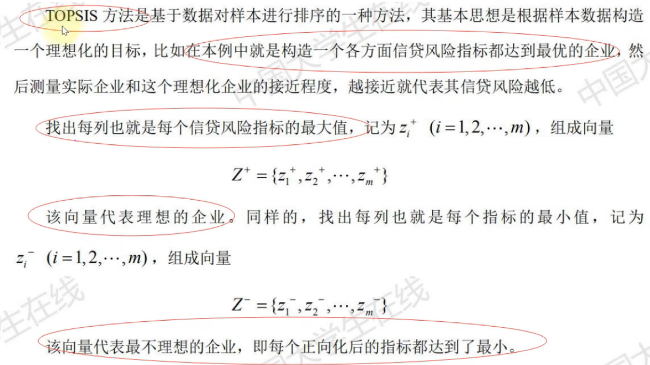

# 数学建模论文写作方法

排版视频还没看

1. 页码：从摘要页开始编写，位于中心
2. 不要目录

## 首页：论文标题+摘要+关键词

### 论文标题

基于+方法+问题（一般不要超过20个字）

---

### 摘要（最重要，最后写）

1000字左右 

- 是什么：对论文内容的一部分简短陈述，不能超过一页
- 作用：使读者在阅读论文全文的情况下就能获得必要信息
- 三要素：
  - 解决了什么问题
  - 应用了什么方法
  - 得到了什么结果
- 书写特点：
  - 充分概括论文内容
  - 文字十分简练
  - 突出论文新见解、新方法与特色
  - 陈述要客观

- 避免空洞，一定要紧密结合题目本身论述

| 废话                 | 改进后的说法                                                 |
| -------------------- | ------------------------------------------------------------ |
| 本文模型的结果较优   | 模型的××结果是××，相较于××论文中的××结果，在××方面提升 了××% |
| 本文用了比较好的方法 | 模型使用的方法是××，相较于××的××方法，在××方面有显著提升，具体表现为××，提升了××% |
| 本文的模型灵敏性较好 | 当模型中的××参数变化××%时，××结果提升了××%，模型表现较为稳健 |

---

#### 开头段（必要）

充分概括论文内容，一般两到三句话即可，长度控制在三到五行

1. 第一句话：简单交代题目背景
2. 第二句话：交代我们做的事情（必须）
3. 第三句话：解决这个问题的实际意义（可选，或者可以将第一句话和第三句话融合在一起）

> 1. 本文主要研究了银行针对中小微企业的信贷决策问题。**信贷决策需要银行利用各企业的相关资料与信息，在对企业进行综合评价之后做出是否放贷、放贷多少、期限多久和利率多少等决策的问题。**该问题的研究可以使银行在不影响自身收益的条件下，让我国的中小微企业的信贷问题得到改善，同时也提高了银行信贷决策的效率和质量。
> 2. 同心鼓"游戏是一项团队协作能力拓展项目，队员通过拉绳使鼓抬高，达到使球在鼓面上跳动的目的。**本文通过建立三维物理模型，利用数学物理方法，分析了“同心鼓"游戏中的物理过程。**该问题的研究能为游戏参与者提供指导性意见，帮助参与者取得更好成绩。
> 3. "薄利多销”原则被广泛运用于现代商场的促销中，研究商品的折扣力度与销量的关系对扩大商品的销量与提高商场的获益有实际意义。本文围绕薄利多销的分析问题，基于对附件中数据挖掘分析并借助于 SPSS 等软件，给出了商场每天的营业额、利润率以及打折力度，并运用回归分析建立了打折力度与商品销售额以及利润率的统计模型。

---

#### 中间段（针对问题一二三四）

1. **解决了什么问题**
   - 直接一句话概括题目要我们求解的问题
   - 不单独提（因为后面两个部分会用到）
   - 指出我们是什么类型的问题（预测类、评价类、规划优化类）

> (20c):针对问题一，主要解决两个问题:一是需要量化各企业的信贷风险，二是需要给出银行的最优信贷决策。(方式一)
>
> (20b):针对问题二，本文利用马尔可夫链，建立马尔可夫链天气预测模型，根据第一关的天气转换情况预测其余关卡的天气情况再根据问题一的模型得出在不同天气状况下的最佳决策。(方式二)
>
> (20a):针对问题二，在大温区温度已知、制程界限给定的前提下确定元件最大过炉速度，实质上是非线性约束条件下的单目标单变量规划求解问题。(方式三)

2. **应用了什么方法**

**一定要紧扣题目本身**

> (19e):针对问题三，根据问题一和问题二对商场每天的销售额和利润率与打折力度，利用迭代加权最小二乘法，建立了打折力度为自变量、销售额利润率为因变量的**线性回归模型**。
>
> (19c):针对上车点的设置问题，需要我们合理安排上车点数量使得机场乘车效率最高。于是，我们以乘车效率为优化目标，安全因素为约束条件，上车点数量为决策变量，建立**单目标优化模型**其中，我们通过合理制定机场出租车乘车区运行规则，利用**计算机模拟**的方法，计算得到各方案对应的乘车效率。
>
> (18c):针对问题二，本题选用**K-均值聚类法**，以消费金额和消费次数作为衡量会员购买力的特征数据，运用SPSS软件对提取好的数据(见附录2)对会员进行聚类，K值以公式(1)进行确定。

3. **得到了什么结果**

   1. 需要计算出数值答案（eg.物理题、规划优化类、预测类）

   直接回答答案

   > 如果模型中有重要参数时，我们可以做灵敏度分析(课件后面会介绍什么是灵敏度分析);
   >
   > 如果涉及概率统计，可以考虑加上置信区间;
   >
   > 如果是预测类或者数值计算类，可以考虑加上误差分析

   2. 开放的问题（eg.评价类、提建议类、设计方案策略类）

   对于较为开放的问题，我们在摘要中只需要写出主要的结论，在下结论时一定要有明确支持的观点，不要模棱两可。

   > 如果有数值描述的结果更好，例如:采取某种建议或者方案后提高了多少、降低了多少。

   3. 问题的完整答案很长，这时候只需要在摘要中说出最主要的一部分结果，然后加一句话来引导读者在正文或者附录中查看完整的结果。

> 例1(20a)：利用模拟退火算法迭代20000次进行求解，得到的**最优方案**为184.2181°C(小温区1-5)、189.8133°C(小温区6)、227.5226°C(小温区7)、264.0700°C(小温区8~9)，传送带过炉速度为**90.0982cm/min**。
>
> 例2(20b)：使用Matlab和C++编程求解，最终得到:在最佳策略下，第一关、第二关的剩余资金分别为**10470、12730元**，并将**相应结果填入了Result.xlsx文件**；随后，我们对该模型进行了**灵敏度分析。**
>
> 例3(20c):最终获得基于新冠肺炎突发事件下的信贷调整政策，并将其与第二问的结果进行对比，文章发现**新冠疫情的爆发导致银行的信贷策略更加倾向于高新技术产业**，这可能和此类产业在疫情间的快速发展有关。
>
> 例4(16b):求解得到**小区开放**后，周边**一级**主路的通行力**得分提高了为11.32%**，二级主路的通行力得分提高了为12.89%，三级主路的通行力得分提高了为0.26%。调整指标之间的直接影响矩阵，**发现道路通行力对各指标间相互影响关系的强弱变化比较敏感**。

---

#### 结尾段（可选）

总结一下全文，也可以介绍下你的论文的亮点，也可以对类似问题进行适当的推广（写不出可以不写）

> 例2(18b)：本文的亮点在于：首先，利用一般化的公式对系统调度进行了较为细致的机理分析，使得模型具有普适性;其次，给出了多个调度原则相互比较，从而有利于结果更优;最后，将蒙特卡洛模拟与机器学习的思想相结合，对上述调度原则的有效性进行验证增强了模型的说服力。
>
> 例3(20c)：最后，本文对模型进行了优、缺点评价与模型推广，得出该模型还可以向银行面对的其他对象和生活的其它方面进行推广的结论。
>
> 例4(20b)：综上所述，本文依据各题所给的条件较全面地分析了相关因素对玩家决策的影响，并给出了不同条件下玩家的最佳策略，实现了在终点的最大收益。经过分析验证，本文的模型具有合理性和一定的现实意义。

---

### 关键词

 放4-6个，可以**放论文中使用到的主要模型**，**出现次数较多，能体现论文的主要内容的词**

---

## 一、问题重述

用自己的语言重新描述一遍问题，将问题背景和题目分开陈述

1. 不能照抄原题（查重）
2. 在仔细理解了问题的基础上，用自己的语言重新将问题描述一遍。语言需要简明扼要，没有必要像原题一样面面俱到。

做法：在原题基础上使用删除、替换等方式来重新组织语言。

> 在实际中，由于中小微企业规模相对较小，也缺少抵押资产，因此银行通常是依据信贷
> 政策、企业的交易票据信息和上下游企业的影响力，向实力强、供求关系稳定的企业提供贷
> 款，并可以对信誉高、信贷风险小的企业给予利率优惠。银行首先根据中小微企业的实力、
> 信誉对其信贷风险做出评估，然后依据信贷风险等因素来确定是否放贷及贷款额度、利率和
> 期限等信贷策略。(原)
>
> 在实践中，由于中小企业规模相对较小，无较多抵押资产，银行通常根据信贷政策、企业交易票据信息以及上下游企业的影响力，向实力雄厚、供需关系稳定的企业提供贷款，对信誉好且信用风险底的企业可以给予优惠利率。银行首先根据中小企业的实力和信誉对其信用风险进行评估，然后根据信用风险等因素确定是否进行放贷和贷款额度、利率、期限等信贷策略。（改）

## 二、问题分析（模型分析）

一般占据正文不超过一页，题目问题较多时不超过两页

内容应包括：题目中包含的信息和条件，利用信息和条件对题目做整体分析，确定用什么方法建立模型，一般是每个问题单独分析一段，分析过程要简明扼要，不需要放结论。建议在文字说明的同时用图形或图表(例如流程图)列出思维过程，这会使你的思维显得很清晰，让人觉得一目了然。

> 第一小问:问题定义了恒定的出油方式，同时其定义的进油方式只和系统压力与单向阀每次开启时长相关。其次提出了“将高压油管内的压力尽可能稳定在100MPa左右”的要求。这首先要求我们对“尽可能稳定在100MPa附近"做出描述，其次由问题描述易知，系统唯一的可改变变量为单向阀开启时长，这就要求我们将其作为决策变量，研究上述描述的最优化问题。
>
> 第二小问:问题要求我们在不同的时间内将系统压力从100MPa调整到150MPa并使其稳定。这首先要求我们先将前一小问中期望的压力设定为150MPa，研究如何设定单向阀开启时间使其稳定，然后另外确定一个单向阀开启时间使得在规定时间内，系统压力能够从100MPa上升到150MPa。 

## 三、模型假设（问题假设）

> 1. 鼓在运动过程中忽略空气阻力带来的影响;
> 2. 假设所有参赛队员的手的高度一致;
> 3. 假设绳子是轻质不可伸长的，并且人牵拉绳子的力沿着绳子的方向
> 4. 假设鼓面平坦，质地均匀，鼓面的材质本身不会对排球的运动造成影响
> 5. 假设排球和鼓面碰撞时发生完全弹性碰撞，且不计碰撞时间;
> 6. 假设鼓的外形理为标准的空心圆柱体
> 7. 假设鼓经碰撞后能立即恢复到初始状态，即下次排球下落时鼓已处于准备状态。

1. 题目中明确给出的假设条件

2. 排除生活中的小概率事件（黑天鹅事件、非正常情况）

   1. 和交通运输相关的问题中，我们可以假设不存在地质灾难、交通事故等
   2. 和经济金融相关的问题中，我们可以假设不存在经济危机、系统风险等
   3. 和生产制造相关的问题中，我们可以假设不存在设备故障、生产事故等

3. 仅考虑问题中的核心因素，不考虑次要因素的影响（过于简化的模型会使你的论文没有优势和亮点）

   1. 考虑传染病的传播规律时，可忽略性别、年龄等因素的影响;
   2. 考虑交通拥堵状况时，可只考虑机动车，暂不考虑非机动车和行人;
   3. 考虑人口预测问题时，可不考虑移民、大规模人口迁移等因素的影响。

4. 使用的模型中要求的假设

   1. 使用博弈论模型时可以假设参与博弈者都是“理性人”
   2. 使用Maskov模型时可以假设系统或状态具有无后效性
   3. 使用回归模型时可以假设扰动项服从独立的正态分布

5. **对模型中的参数形式（或者分布）进行假设**

   **注意:如果能在论文中用数据验证这些假设更好)**(感觉很容易出题，画图嗯               )

   1. 假设人口增长服从阻滞增长模型(Logistic模型);
   2. 假设不考虑环境变动时，某鱼群的自然死亡率为常数;
   3. 假设产品的寿命(或旅客进机场的时间间隔)服从指数分布;
   4. 假设单位时间内排队的人数(或机器出现的故障数)服从泊松分布假
   5. 设生产出来的产品某参数(例如重量、大小)服从$N(\mu,\sigma^2)$，且各产品独立。

6. 和题目联系很紧密的一些假设，主要是为了简化模型

*两个问题*

Q1：模型假设的合理性怎么保证？

A1：

1. 可以引用别人的文献或者资料
1. 使用实际数据进行绘图支持和检验我的假设

Q2：模型假设设置的太强怎么办？

A2：有同学为了简化问题，往往会给定过强的假设，事实上这样是有一定风险的模型过于简单会显得你的论文没有深度和亮点。如果你建立的模型比别人考虑的因素更多的话，可以在某种程度上看成一种创新。但大多数时候，我们想考虑的因素或条件也很难进行估算或者考量，这时候你可以在论文后面的模型评价与改进部分加上你的想法，这样可以在一定程度上弥补这个问题。

## 四、符号说明

## 五、模型的建立与求解

1. 优化类问题中模型

目标函数➕约束条件

2. 使用别人已经建立好的模型（紧密联系问题，切忌无脑套用）

   

3. 用启发式算法的注意事项（2019 B136）

   

   1. 简介+伪代码
   2. 初始可行解
   3. 新解的产生
   4. 关键函数及参数的确定
   5. 求解结果分析

   

求解的结果应该在论文中突出的展示出来，有具体问题的答案比较简单，季节放上数值计算即可；如果是开放类问题，一定要对结果进行阐明和解释，最好有**美观整洁的图表**

## 六、模型的分析与检验

其实是论文的加分项

#### 模型的分析

1. 灵敏度分析 
   - 通用步骤：控制其他参数不变的情况下，改变模型中的某个重要参数的值，然后观察模型的结果的变化情况
   - 

这张图下结论就是y对于α这个参数敏感，如果曲线是围绕一个值波动的话就是不敏感

2. 误差分析

   - 分析模型中的误差来源
   - 估算模型中存在的误差，一般用于预测问题或者数值计算类的问题

    

#### 模型的检验

1. 使用模型之前应该进行的检验

   - 层次分析法的一致性检验
   - 灰色预测中的准指数规律检验

2. 使用了模型后对模型的结果进行检验

   - 稳定性检验（其实就是让原来的参数进行波动后看模型输出的表现情况）

   

## 七、模型的评价、改进与推广

#### 评价

写优缺点（必须要写）

#### 改进

针对模型中缺点有哪些可以改进的地方

#### 推广

讲原题的要求进行扩展，进一步讨论模型的使用性和可行性

## 八、参考文献

所有引用他人或公开资料(包括网上资料)的成果必须按照科技论文的规范列出参考文献，并在正文引用处予以标注。

1. 引用的内容要在正文中标注出来
2. 不要引用别人的博客——>最好是找一本介绍了这个模型的书籍或者找一篇相关的论文作为你的参考文献

3. 不能引用前辈们论文里面的内容

## 九、附录

内容包括支撑材料的文件列表，建模用到的全部完整、可运行的源程序代码（含Excel、Spss等软件的交互命令）。如果缺少必要的源程序、程序不能运行或运行结果与论文不符，都可能会被取消评奖资格。

支撑材料内容包括用于支撑模型、结果、结论的所有必要材料，至少应包含建模所用到的所有可运行源程序、自主查阅使用的数据资料(赛题中提供的原始数据除外)、较大篇幅中间结果的图表等。将所有支撑材料文件使用**WinRAR软件**压缩在一个文件中(后缀为RAR或ZIP，大小不超过20MB)。支撑材料的文件列表应放入论文附录;如果确实没有需要提供的支撑材料，可以不提供支撑材料文件，并在论文附录中注明“本论文没有支撑材料”。如果支撑材料文件与论文内容不相符，该论文可能会被取消评奖资格。注意竞赛的承诺书和编号专用页不要放在支撑材料中，所有文件中不能有显示参赛者身份和所在学校及赛区的信息。

除了支撑材料的文件列表和源程序代码外，附录中还可以包括下面内容

- 某一问题的详细证明或求解过程;
- 自己在网上找到的数据;
- 比较大的流程图;
- 较繁杂的图表或计算结果(注意:一般结果只要不超过A4一页，尽量都放在正文中)。

 

摘要

问题重述

- 问题背景
- 需要解决的问题

问题分析

- 问题一的分析

- 问题二的分析

模型假设

符号说明

模型的建立与求解

- 问题一的建立与求解
  - 相关概念的说明
  - 模型构建
  - 模型求解
- 问题二模型的建立与求解
  - 模型的准备
  - 模型的求解
- 问题三模型的建立与求解
  - 问题分析
  - 模型的建立

- 问题四的求解
  - 数据初步处理及可视化
  - 问题分析
  - 模型的建立
  - 模型的应用与求解

模型的评价

- 模型的优点
- 模型的缺点
- 模型的推广

参考文献

附录