## 数模学习

[备赛技巧](https://blog.csdn.net/minzufuxing1949/article/details/133495590)


### matlab

1. 不管写什么代码都重新新建一个脚本文件
2. 语句后面有分号就不显示运行结果，但工作区仍然有变量显示；分号也用于换行
3. %注释，多行注释是ctrl+R，取消是ctrl+T
4. 命令行窗口打clear，可以直接清楚工作区的所有变量
5. clc是让命令行窗口变干净
6. 输出函数是disp（），不受分号影响
7. 向量表示是 a = [1, 2, 3]*（行向量）；[1;2;3] (列向量)
8. 代码开头：clear；clc起到初始化的作用
9. 有用的字符串函数：
   - `strcat('string1','string2)`也可以用[字符1，字符串2]
   - `num2str(c)`(可以将数字转化为字符串)
10. 输入函数input
    - `A = input("请输入A:");`
11. `sum(矩阵E,dim)`函数（dim为1按照列求和，2按照行求和）
    - 如果对行/列向量求和，都是直接求和
    - 对整个矩阵进行求和：
      - `a = sum(sum(E))`
      - `a = sum(E(:))`
12. basic knowledge
    - 取指定行和列的一个元素（输出的是一个值
      - `A(2,1)`
    - 取指定行的全部元素（输出的是一个行向量
      - `A(2,:)`
    - 列
      - `A(：,2 )`
    - 取指定某些行的全部元素
      -  `A（[2,5],:）`只取第二行和第五行
      -  `A（2：5,:）`取第二行到第五行
      -  `A（2：2：5,:）`取第二行和第四行（从2开始，每次递增两个单位）
        - 中间的数字可以是负数，就递减了
      - `A(2:end,:)`第二行到最后一行
        - `A(2:end-1,:)`第二行到倒数第二行
13. 所有元素`A(:)`
14. `size（）函数`
    - `size（A）`返回的是2 3 (2行3列)
    - `size（A,1）`返回的是2 (2行)
    - `size（A,2）`返回的是3 (3列)
15. `repmat`函数（复制矩阵）
16. ```matlab
    % 定义矩阵的大小
    rows = 3;
    cols = 2;
    
    % 初始化矩阵A
    A = zeros(rows, cols);
    
    % 使用for循环给矩阵A赋值
    value = 1;
    for i = 1:rows
        for j = 1:cols
            A(i, j) = value;
            value = value + 1;
        end
    end
    
    % 显示矩阵A
    disp('Matrix A:');
    disp(A);
    ```
17. 


### 常用的分布函数

1. **正态分布（Normal Distribution）**
   
   - **例子**：测量误差、人体身高、体重分布等。
   - **数学公式**：
     $$
      f(x; \mu, \sigma^2) = \frac{1}{\sqrt{2\pi \sigma^2}} e^{-\frac{(x-\mu)^2}{2\sigma^2}} 
     $$
     
   - **曲线图像**：钟形曲线，对称于均值 \(\mu\)，标准差 \(\sigma\) 决定曲线的宽窄程度。
   
   
   
2. **指数分布（Exponential Distribution）**
   - **例子**：设备的寿命、顾客到达时间间隔等。
   - **数学公式**：
     $$
     f(x; \lambda) = 
     \begin{cases} 
     \lambda e^{-\lambda x} & x \geq 0 \\
     0 & x < 0 
     \end{cases} \
     $$
     
   - **曲线图像**：单峰曲线，具有指数衰减形式。
   
   
   
3. **泊松分布（Poisson Distribution）**
   - **例子**：单位时间内事件发生的次数，如电话交换机收到的呼叫数、车站到达的乘客数等。
   - **数学公式**：
     $$
     P(X = k; \lambda) = \frac{\lambda^k e^{-\lambda}}{k!}, \quad k = 0, 1, 2, \ldots
     $$
     
   - **曲线图像**：离散分布，随着参数 \(\lambda\) 的增大，分布呈现向右偏移的趋势。
   
   
   
4. **伽玛分布（Gamma Distribution）**
   - **例子**：连续时间下，一定时间内事件发生的次数、等待时间等。
   - **数学公式**：
     $$
     f(x; k, \theta) = \frac{x^{k-1} e^{-\frac{x}{\theta}}}{\theta^k \Gamma(k)}, \quad x \geq 0 
     $$
     
   - **曲线图像**：具有不同形状的曲线，取决于参数 \( k \) 和 \( \theta \)。
   
   


### 线性代数知识回顾

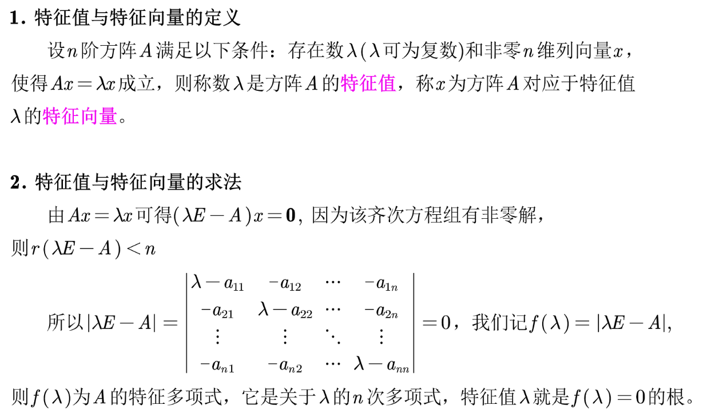

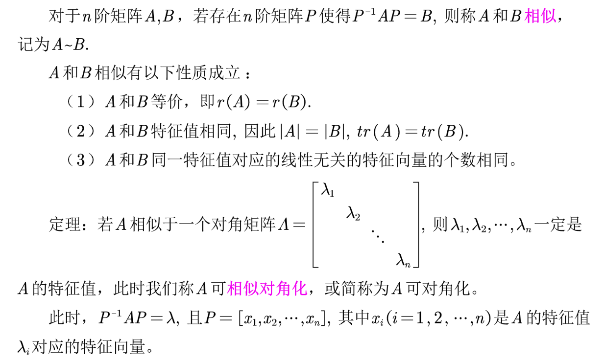

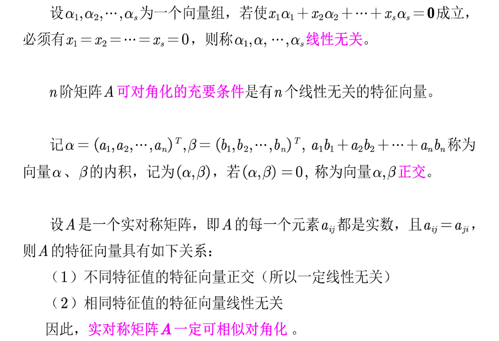

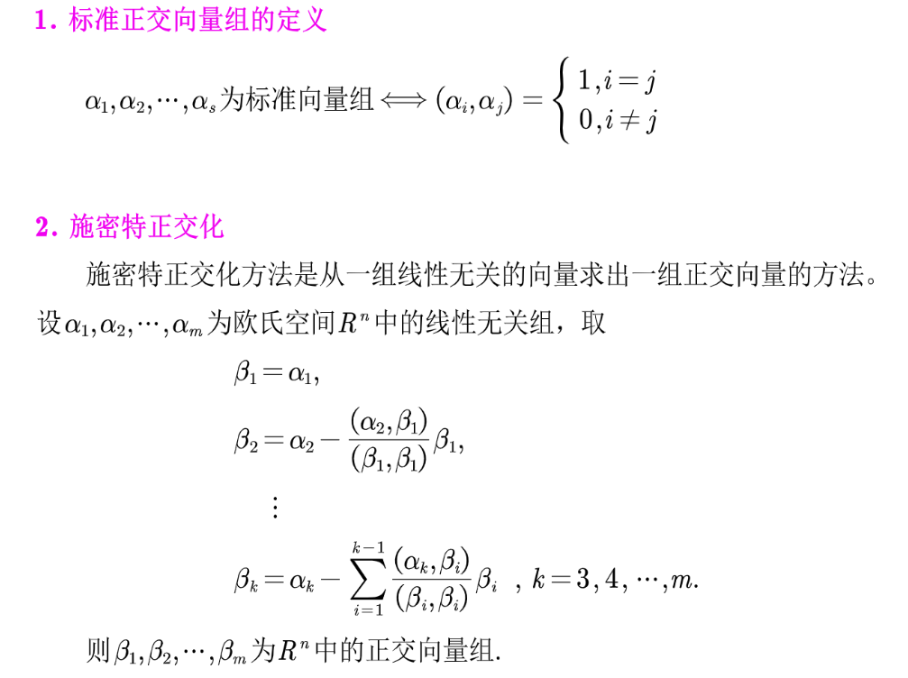

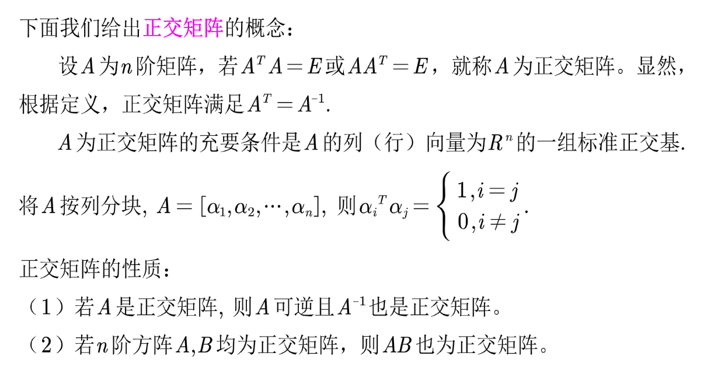

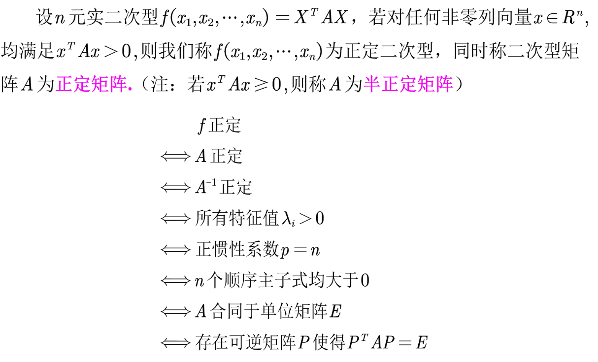

### 层次分析法

> 最基础，用于解决评价类问题（哪种方案更好、哪位运动员更优秀）

**eg.**


**需要想到的问题**：

1. 我们评价的目标是什么
2. 我们为了达到这个目标有哪种方案可以选
3. 评价的准则是什么（**一般需要我们根据题目中的背景材料、常识以及网上搜集的参考资料进行结合，筛选出最适合的指标**）

> 资料筛选优先选择知网、万方、百度学术、谷歌学术等平台
>
> 

##### 思想


判断矩阵是我们来判断的，一致矩阵是小明觉得的，如果有太大差距是不能进行权重计算的，所以我们要进行一致性检验


**步骤**


（用方法3!!!）

[代码](E:\vs和md\代码.md)

要计算层次分析法（AHP）中的权重和进行一致性检验，需要进行以下几个步骤。我们将以表3.3为例详细说明：

1. **构建判断矩阵**

我们有一个判断矩阵 \( A \)：

$$
A = \begin{bmatrix}
1 & 1/5 & 1/3 \\
5 & 1 & 3 \\
3 & 1/3 & 1 
\end{bmatrix}
$$

2. **归一化判断矩阵**

对判断矩阵进行归一化，即将矩阵中的每一个元素除以其所在列的和。我们计算每一列的和：


$$
\text{列和} = \begin{bmatrix}
1 + 5 + 3 \\
1/5 + 1 + 1/3 \\
1/3 + 3 + 1
\end{bmatrix}
= \begin{bmatrix}
9 \\
1.5333 \\
4.3333
\end{bmatrix}
$$


然后将判断矩阵的每一个元素除以其所在列的和，得到归一化后的矩阵 \( B \)：


$$
B = \begin{bmatrix}
\frac{1}{9} & \frac{1}{5 \cdot 1.5333} & \frac{1/3}{4.3333} \\
\frac{5}{9} & \frac{1}{1.5333} & \frac{3}{4.3333} \\
\frac{3}{9} & \frac{1/3}{1.5333} & \frac{1}{4.3333}
\end{bmatrix}
= \begin{bmatrix}
0.1111 & 0.1304 & 0.0769 \\
0.5556 & 0.6522 & 0.6923 \\
0.3333 & 0.2174 & 0.2308
\end{bmatrix}
$$
**3.  计算权重向量**

对归一化后的判断矩阵 \( B \) 的每一行求平均值，得到权重向量 \( \omega \)：

$$
\
\omega = \begin{bmatrix}
\frac{0.1111 + 0.1304 + 0.0769}{3} \\
\frac{0.5556 + 0.6522 + 0.6923}{3} \\
\frac{0.3333 + 0.2174 + 0.2308}{3}
\end{bmatrix}
= \begin{bmatrix}
0.105 \\
0.637 \\
0.258
\end{bmatrix}
\
$$
**4. 计算最大特征值**
$$
 \lambda_{\text{max}} \
$$
将原判断矩阵 \( A \) 乘以权重向量 \( \omega \)，得到一个新的向量：

$$
A \cdot \omega = \begin{bmatrix}
1 & 1/5 & 1/3 \\
5 & 1 & 3 \\
3 & 1/3 & 1 
\end{bmatrix}
\cdot \begin{bmatrix}
0.105 \\
0.637 \\
0.258
\end{bmatrix}
= \begin{bmatrix}
0.378 \\
1.889 \\
0.764
\end{bmatrix}
$$
然后，将此向量除以权重向量：

$$
\begin{bmatrix}
\frac{0.378}{0.105} \\
\frac{1.889}{0.637} \\
\frac{0.764}{0.258}
\end{bmatrix}
= \begin{bmatrix}
3.6 \\
2.965 \\
2.961
\end{bmatrix}
$$
取平均值得到 
$$
\lambda_{\text{max}} ：


\lambda_{\text{max}} = \frac{3.6 + 2.965 + 2.961}{3} = 3.175
$$
**5. 一致性指标 CI 和一致性比率 CR**

计算一致性指标 \( CI \)：

$$
CI = \frac{\lambda_{\text{max}} - n}{n - 1} = \frac{3.175 - 3}{3 - 1} = 0.0875
$$
查找对应的随机一致性指标（RI）。对于 \( n = 3 \)，RI = 0.58。

计算一致性比率 \( CR \)：

$$
CR = \frac{CI}{RI} = \frac{0.0875}{0.58} = 0.151
$$
由于 
$$
CR \approx 0.151 
$$
，大于0.1，表明判断矩阵的一致性不理想，需要重新评估和调整。

### topsis法（优劣解距离法）

> 常用的综合评价方法，其能充分**利用原始数据的信息**，结果能精确地反映各评价方案之间的差距

相比层次分析法，层次分析法的决策层不能太多，即n（max：15），否则判断矩阵和一致矩阵差异可能会很大；决策层已知时，用topsis

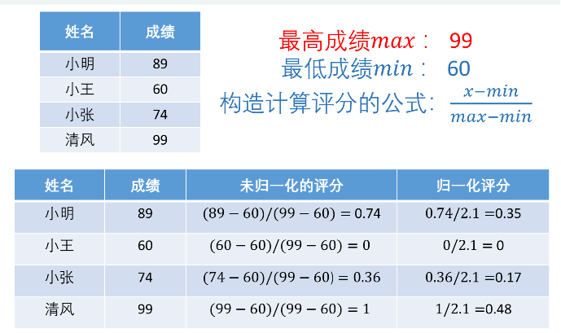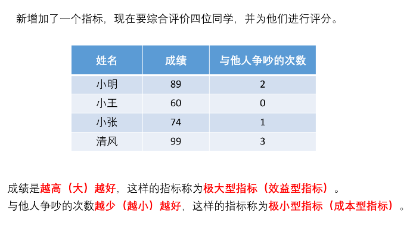

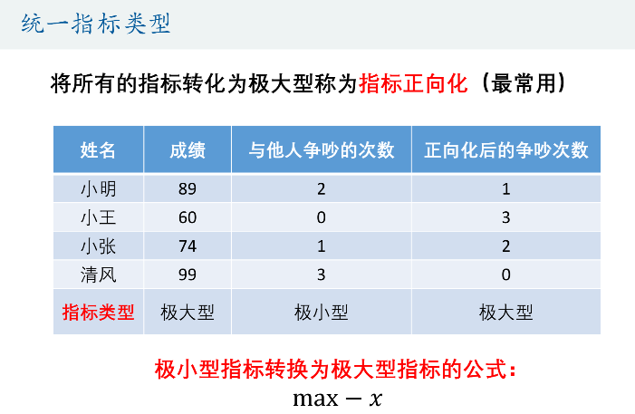

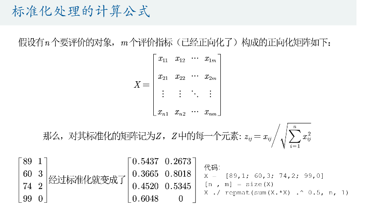

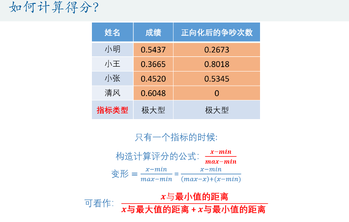

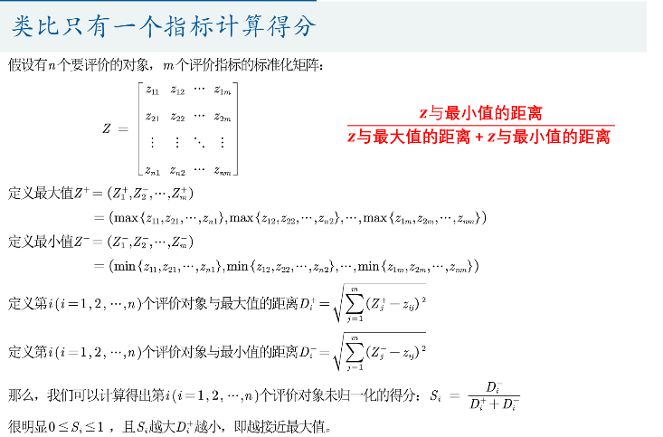

#### 步骤

1. **将原始矩阵正向化**

   - **所谓的将原始矩阵正交化，就是要将所有的指标类型统一转化为极大型指标**
     - 常见指标

   | 指标名称             | 指标特点         | 例子                     |
   | :------------------- | :--------------- | ------------------------ |
   | 极大型（效益型）指标 | 越多越好         | 成绩、GDP增速、企业利润  |
   | 极小型（成本型）指标 | 越少越好         | 费用、坏品率、污染程度   |
   | 中间型指标           | 越接近某个值越好 | 水质量评估的PH值         |
   | 区间型指标           | 落在某个区间最好 | 体温、水中植物性营养物量 |

   > 1.  极小->极大  `max-x`
   > 2. 中间->极大 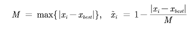
   >
   > 3. 区间->极大 

2. **正向话矩阵标准化**

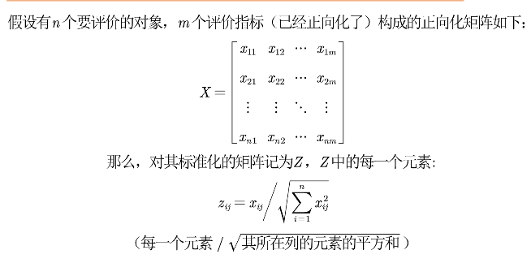

3. **计算得分并且归一化**
   - 无权重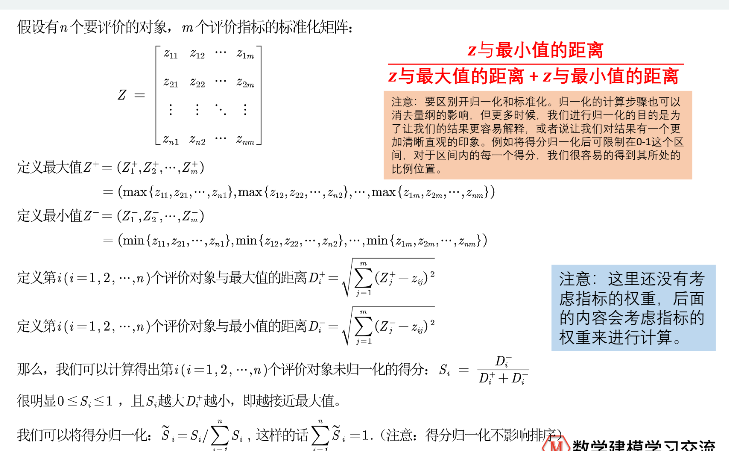
   - 有权重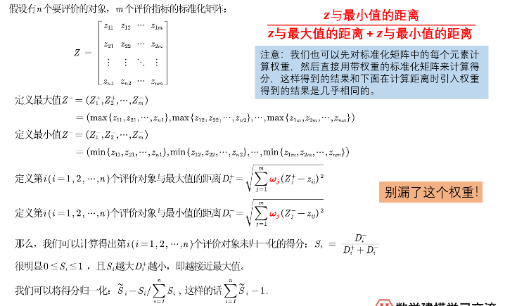


### 插值算法

> 根据已知函数点"模拟产生"一些新的但又比较靠谱的值来满足需求；
>
> 高次插值会产生龙格现象，即在两端处波动极大,产生明显的震荡。在不熟悉曲线运动趋势的前提下，不要轻易使用高次插值。

#### 常用分段插值

1. 埃尔米特插值

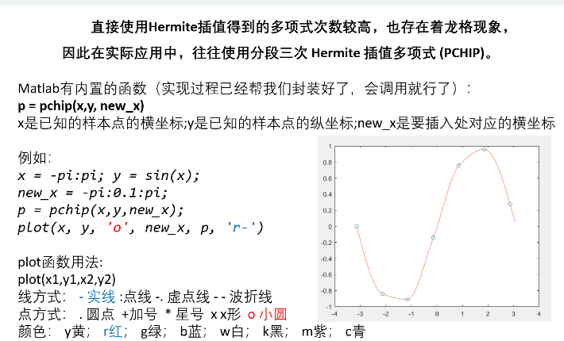

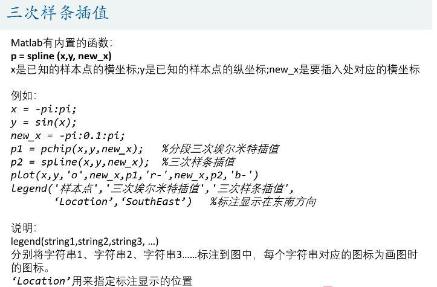

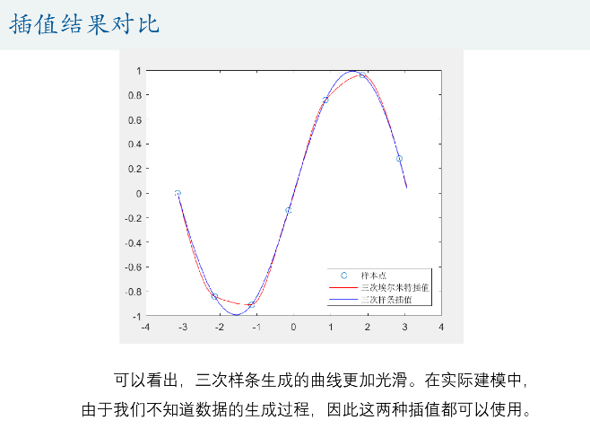

​	

### 拟合算法

> 与插值问题不同，在拟合问题中不需要曲线一定经过给定的点。拟合问题的目标是寻求·一个函数(曲线)，使得该曲线在某种准则下与所有的数据点最为接近，即曲线拟合的最好(最小化损失函数)。

#### 最小二乘法


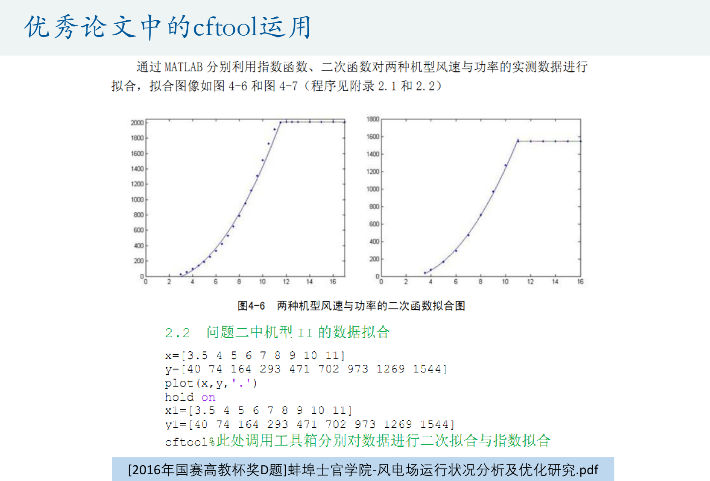

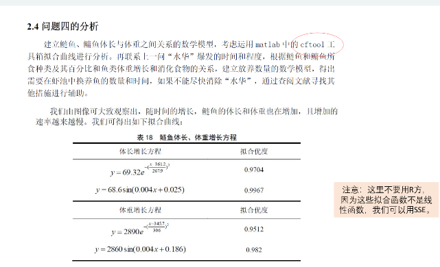

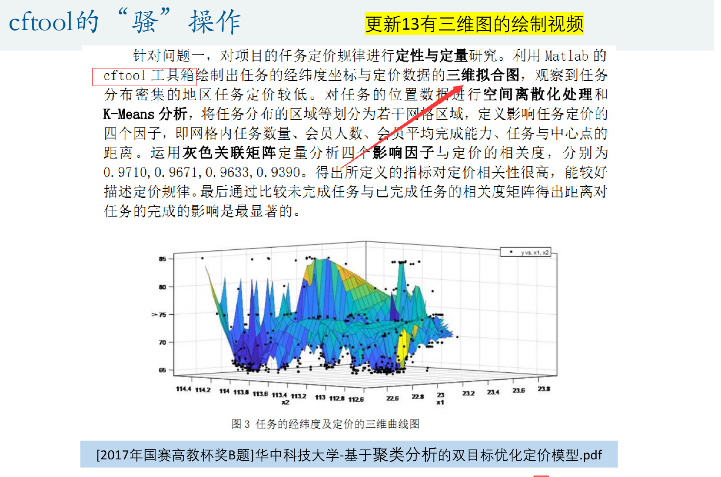

### 相关系数

> 两种最为常用的相关系数：皮尔逊pearson相关系数和斯皮尔曼spearman等级相关系数。
>
> 它们可用来衡量两个变量之间的相关性的大小，根据数据满足的不同条件，我们要选择不同的相关系数进行计算和分析(建模论文中最容易用错的方法)

**这里的相关系数只是用来衡量两个变量线性相关程度的指标;也就是说，你必须先确认这两个变量是线性相关的，然后这个相关系数才能告诉你他俩相关程度如何。**


就是一定要画散点图看是否为线性关系


#### 例题

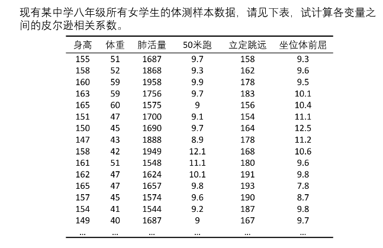


这时要用到excel


- 太抽象了，到时候看到再继续用吧


### 典型相关分析

> **题目：我们要探究观众和业内人士对于一些电视节目的观点有什么样的关系呢?**
>
> 观众评分来自低学历(led)、高学历(hed)和网络(net)调查三种,它们形成第一组变量;
>
> 而业内人士分评分来自包括演员和导演在内的艺术家(arti)、发行(com)与业内各部门主管(man)三种，形成第二组变量。
>
> 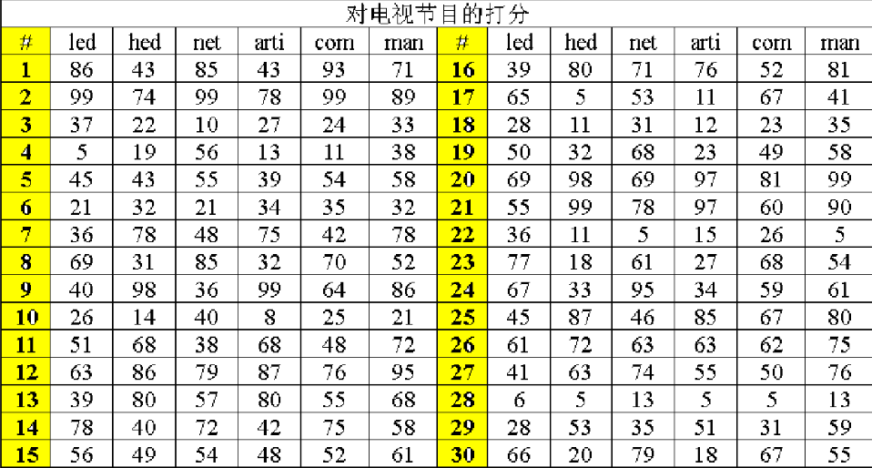

1. **Q：**但是直接对这些变量的相关进行两两分析，很难得到关于这两组变量（观众与业内人士）之间关系的一个清楚的印象。

​	**A：**把多个变量与多个变量之间的相关化为两个具有代表性的变量之间的相关

2. **Q：**选谁做代表？

​	**A：**代表是能较为综合、全面的衡量所在组的内在规律。一组变量最简单的综合形式就是该组变量的线性组合


#### 定义

典型相关分析由Hoteling提出，其基本思想和主成分分析非常相似。

- **首先**在每组变量中找出变量的线性组合，使得两组的线性组合之间具有最大的相关系数
- **然后**选取和最初挑选的这对线性组合不相关的线性组使其配对，并选取相关系数最大的一对
- **如此继续下去**，直到两组变量之间的相关性被提取完毕为止。

被选出的线性组合配对称为**典型变量**，它们的相关系数称为**典型相关系数**。典型相关系数度量了这两组变量之间联系的强度。


#### 思路

#### 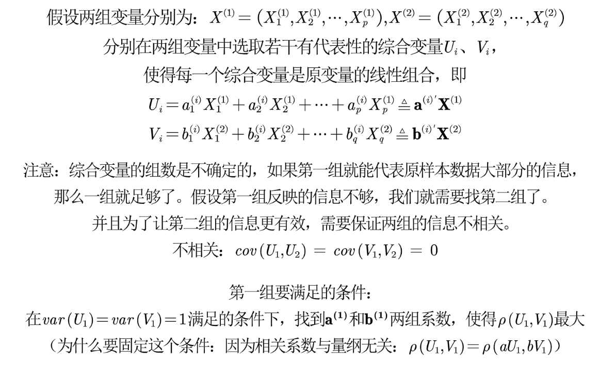

其实没太懂。。。


#### 关键步骤

1. **数据分布有假设**：两组数据服从联合正态分布

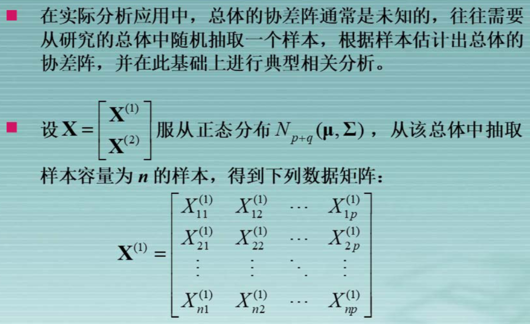

2. **首先要对两组变量的相关性进行检验（构造似然比统计量）**

   - p值小于0.05（0.1）表示在95%（90%）的置信水平下拒绝原假设，即认为两组变量有关（似是高中的卡方检验）

3. 确定典型相关变量的个数（直接看典型相关系数对应的p值即可）

4. 利用标准化后的典型相关变量分析问题

5. 进行典型载荷分析

   - 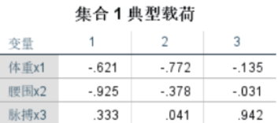

     以上结果说明生理指标的第一典型变量与体重的相关系数为-0.621，与腰围的相关系数为-0.925，与脉搏的相关系数为0.333。从另一方面说明生理指标的第一对典型变量与体重、腰围负相关，而与脉搏正相关。其中与腰围的相关性最强。第一对典型变量主要反映了体形的胖瘦。

​	

6. 计算前r个典型变量对样本总方差的贡献

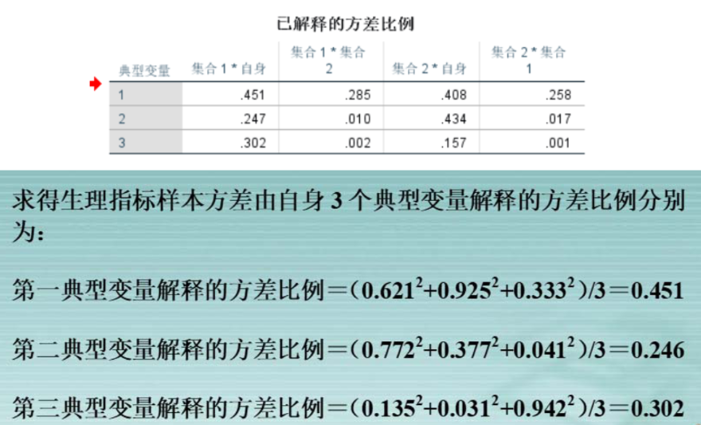

#### spss操作步骤

装的有点麻烦，到时候看看哎

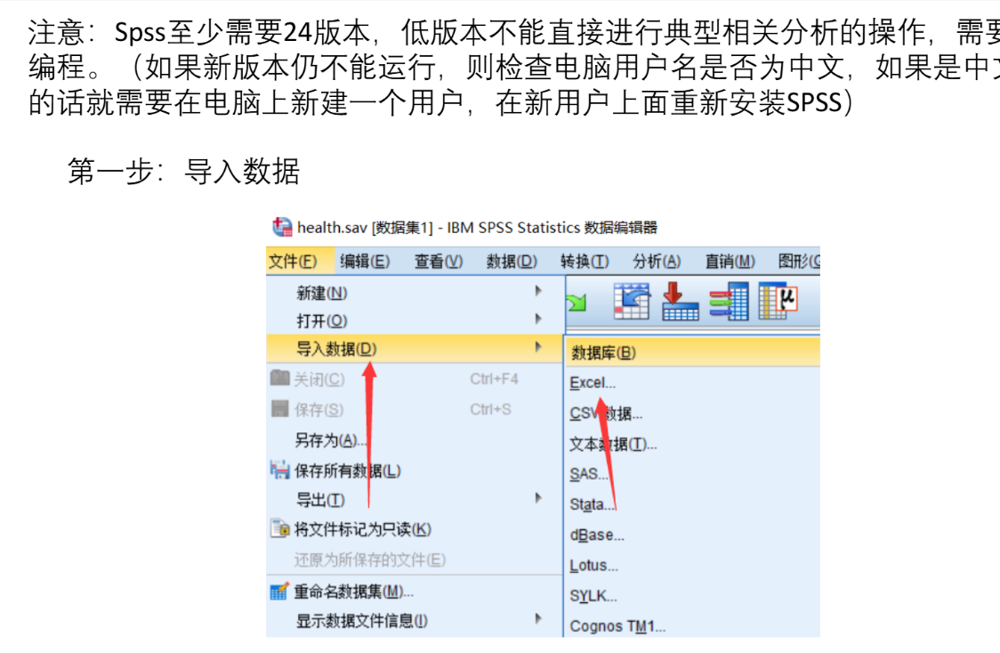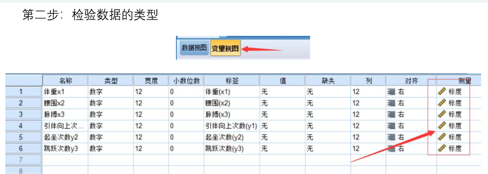

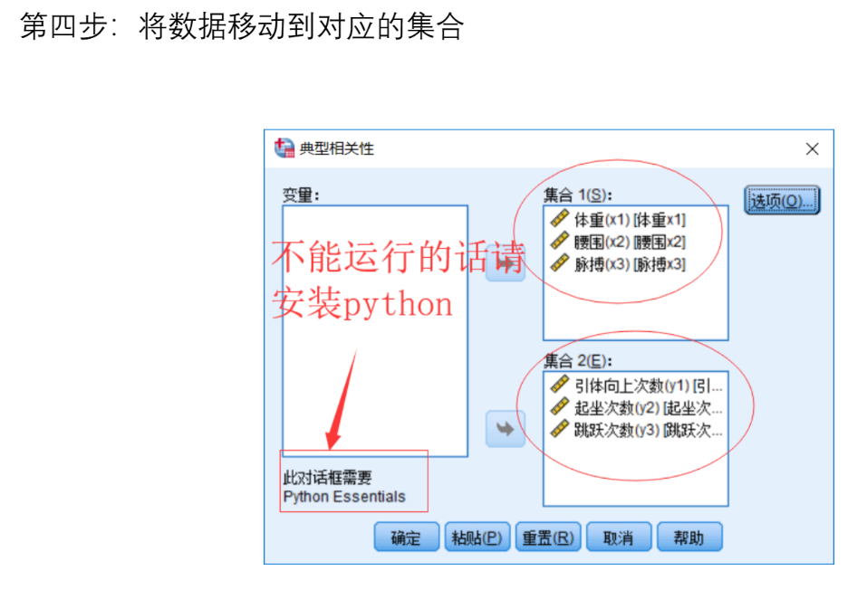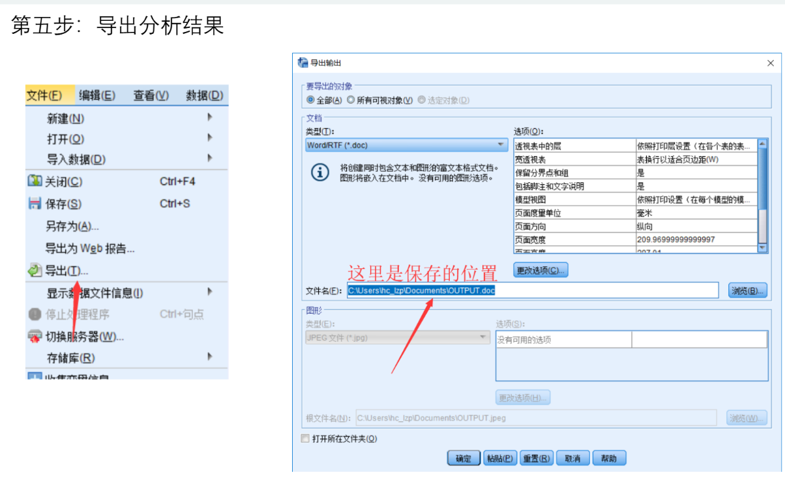

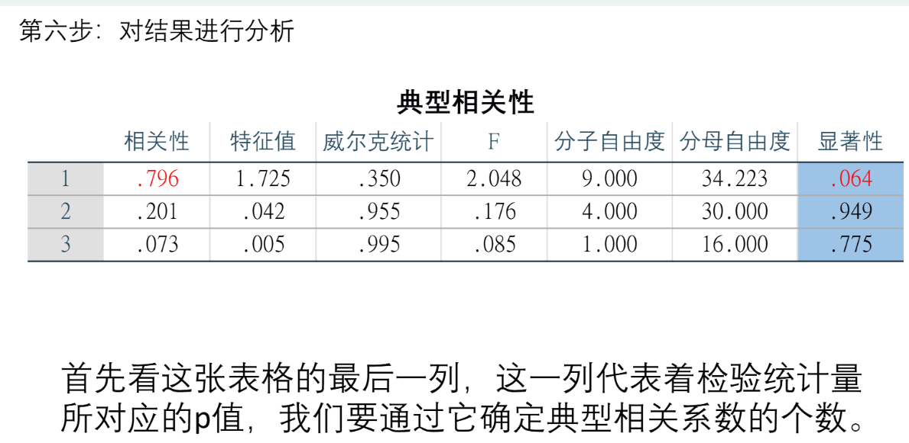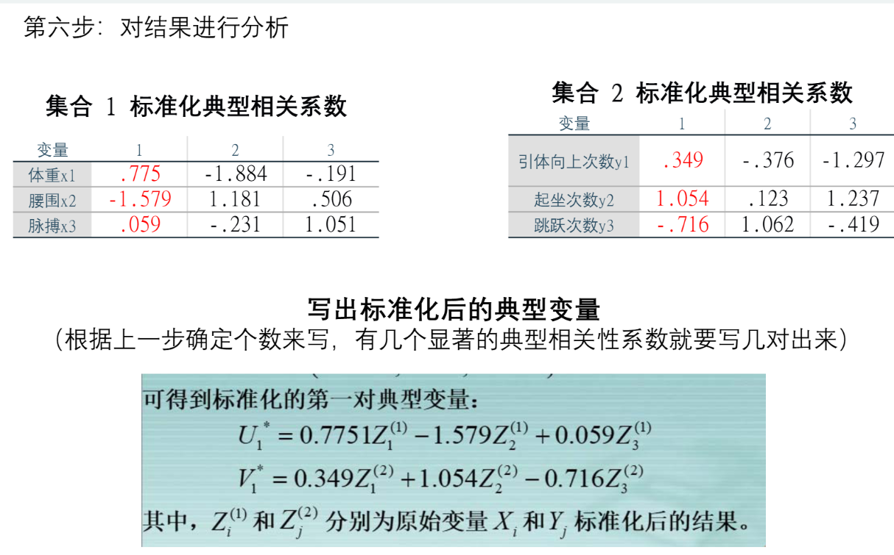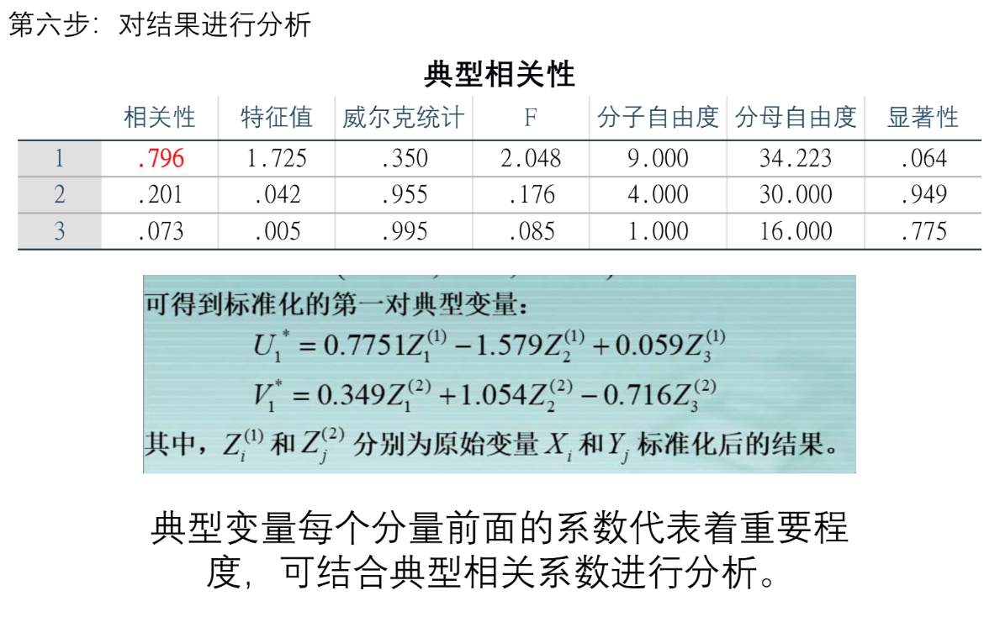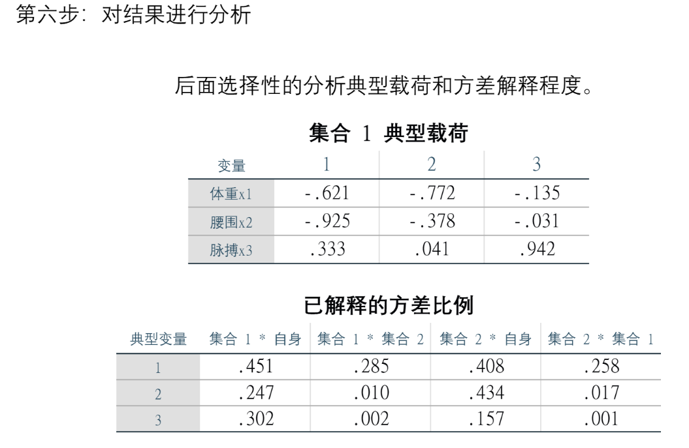


### 多元回归分析

> 回归分析是数据分析中最基础也是最重要的分析工具。
>
> 任务：通过研究自变量X和因变量Y的相关关系，尝试去解释Y的形成机制，进而达到通过X去预测Y的目的。


#### **三个关键词**

1. 相关性
   - 不等于因果性
2. Y
   - 因变量
     1. 经济学家研究经济增长的决定因素，那么Y可以选取GDP增长率**(连续数值型变量)**
     2. P2P公司要研究借款人是否能按时还款，那么Y可以设计成一个二值变量，Y=0时代表可以还款，Y=1时代表不能还款**(0-1型变量)。**
     3. 消费者调查得到的数据(1表示非常不喜欢，2表示有点不喜欢，3表示一般般，4表示有点喜欢，5表示非常喜欢)**(定序变量)**
     4. 管理学中RFM模型：F代表一定时间内，客户到访的次数，次数其实就是一个非负的整数。**(计数变量)**
     5. 研究产品寿命、企业寿命甚至是人的寿命(这种数据往往不能精确的观测，例如现在要研究吸烟对于寿命的影响，如果选取的样本中老王60岁现在还活的非常好，我们不可能等到他去世了再做研究，那怎么办呢?直接记他的寿命为60+，那这种数据就是截断的数据)**(生存变量)**
3. X


**例题**

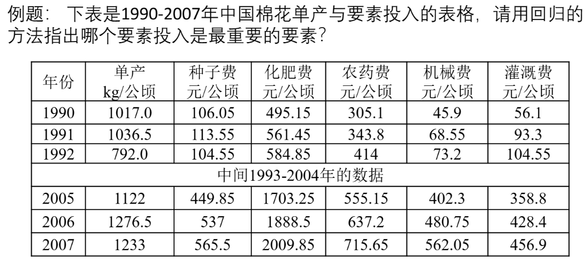


#### 回归分析的使命

1. 识别重要变量
2. 判断相关性的方向
3. 要估计权重（回归系数）


#### 回归分析的分类

|   类型   |         模型         |       y的特点        |        例子        |
| :------: | :------------------: | :------------------: | :----------------: |
| 线性回归 | OLS、GLS（最小二乘） |    连续数值型变量    |  GDP、产量、收入   |
| 0-1回归  |     logistic回归     |   二值变量（0-1）    | 是否违约、是否得病 |
| 定序回归 |    probit定序回归    |       定序变量       |      等级评定      |
| 计数回归 |       泊松回归       |       计数变量       |    每分钟车流量    |
| 生存回归 |  cox等比例风险回归   | 生存变量（截断数据） |  企业、产品的寿命  |


#### 数据的分类和处理方法

- 横截面数据：在某一时点收集的不同对象的数据**（用多元线性回归）**
  - 我们自己发放问卷得到的数据
  - 全国各省份2018年GDP的数据
  - 大一新生今年体测的得到的数据
- 时间序列数据：对同一对象在不同时间连续观察所取得的数据**（移动平均、指数平滑、ARIMA、GARCH、VAR、协积）**
  - 从出生到现在，你的体重的数据(每年生日称一次)
  - 中国历年来GDP的数据
  - 在某地方每隔一小时测得的温度数据
- 面板数据：横截面数据与时间序列数据综合起来的一种数据资源**（固定效应和随机效应、静态面板和动态面板）**
  - 2008-2018年，我国各省份GDP的数据

>  **第一种和第二种常考**
>
> 横截面数据往往可以使用回归来进行建模，我们通过回归可以得到自变量与因变量之间的相关关系以及自变量的重要程度
>
> 时间序列数据往往需要进行我们进行预测，时间序列模型的选择也很多大家需要选择合适的模型对数据进行建模。


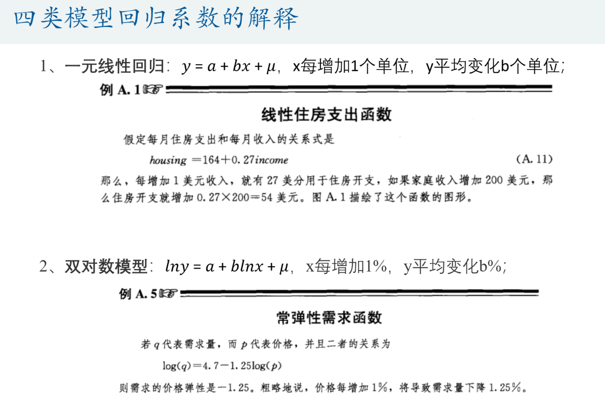

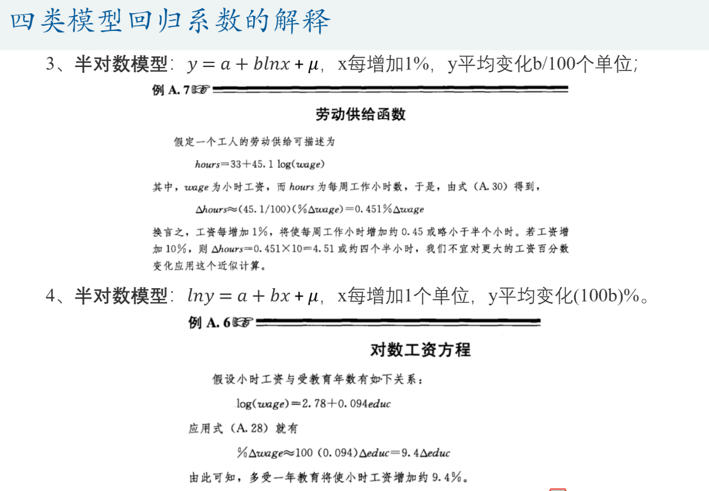


### 图论最短路径问题

[在线作图](https://csacademy.com/app/graph_editor)

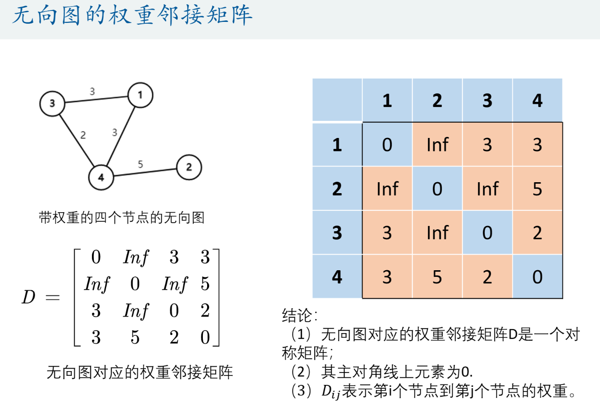不是很懂

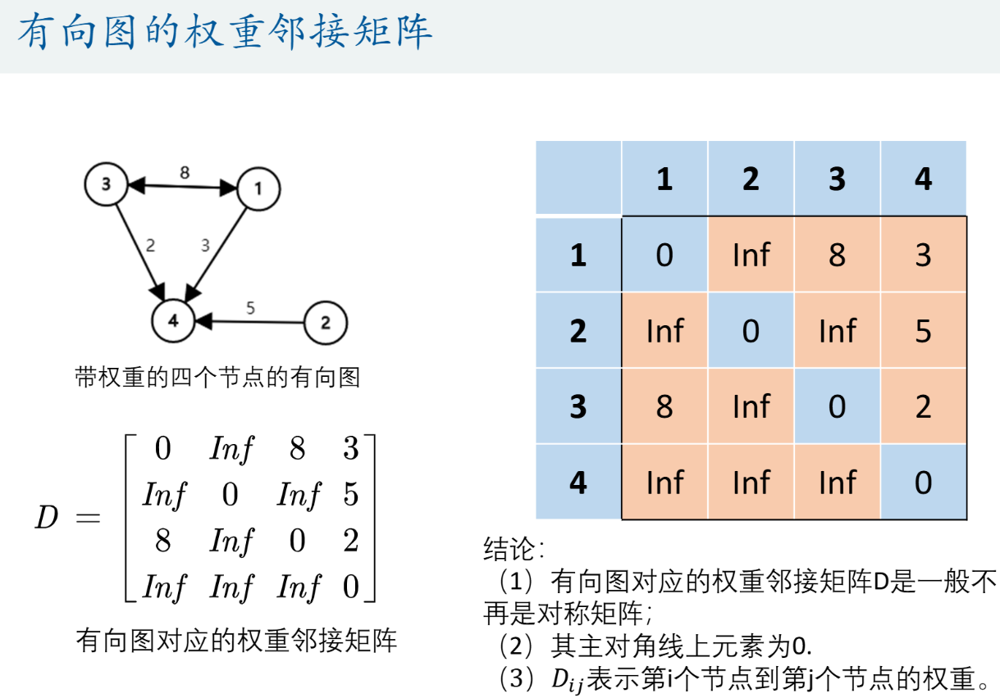也不是很懂


#### 迪杰斯特拉算法

> 图中有0-8共九个地点，地点之间若用直线连接则表明两地可直接到达，直线旁的数值表示两地的距离
>
> 
>
> **问题：**起点为0，终点为4，怎么走路程最短。(假设出行方式相同，例如都为步行)

（手机app下载：算法动画图解）

直接上代码吧，哎呦

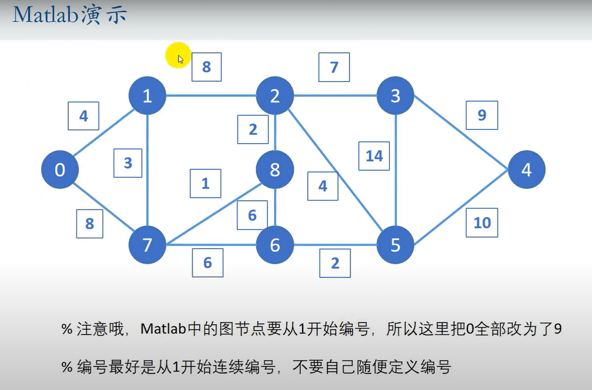

```matlab
%% 注意：以下代码需要较新版本的 MATLAB 才能运行（最好是 2016 版本及以上）
% 如果运行出错请下载新版的 MATLAB 代码再运行

% 注意，MATLAB 中的图节点要从 1 开始编号，所以这里把 0 全部改为了 9
% 编号最好是从 1 开始连续编号，不要自己随便定义编号
s = [9, 9, 1, 1, 2, 2, 2, 7, 7, 6, 6, 5, 5, 4];
t = [1, 7, 7, 2, 8, 3, 5, 8, 6, 8, 5, 3, 4, 3];
w = [4, 8, 3, 8, 2, 7, 4, 1, 6, 6, 2, 14, 10, 9];
G = graph(s, t, w);
plot(G, 'EdgeLabel', G.Edges.Weight, 'linewidth', 2)
set(gca, 'XTick', [], 'YTick', []);
[P, d] = shortestpath(G, 9, 4) % 注意：该函数 MATLAB 2015b之后才有

% 在图中高亮我们的最短路径
myplot = plot(G, 'EdgeLabel', G.Edges.Weight, 'linewidth', 2); % 首先将图赋给一个变量
highlight(myplot, P, 'EdgeColor', 'r') % 对这个变量即我们刚刚绘制的图形进行高亮处理（给边加上 r 红色）

% 求出任意两点的最短路径矩阵
D = distances(G) % 注意：该函数 MATLAB 2015b之后才有
D(1, 2) % 1 -> 2的最短路径
D(9, 4) % 9 -> 4的最短路径

% 找出给定范围内的所有点 nearest(G, s, d)
% 返回图形 G 中与节点 s 的距离在 d 之内的所有节点
[nodeIDs, dist] = nearest(G, 2, 10) % 注意：该函数 MATLAB 2016a 之后才有


% % 注意：代码文件仅供参考，一定不要直接用于自己的数模论文中
% % 国赛对于论文的查重要求非常严格，代码雷同也算作抄袭
```

```matlab
%% 注意：以下代码需要较新版本的 MATLAB 才能运行（最好是 2016 版本及以上）
% 如果运行出错请下载新版的 MATLAB 代码再运行

%% MATLAB 作无向图
% （1）无权重（每条边的权重默认为 1）
% 函数 graph(s, t)：可在 s 和 t 中的对应节点之间创建边，并生成一个图
% s 和 t 都必须具有相同的元素数；这些节点必须都是从 1 开始的正整数，或都是字符串元胞数组。
s1 = [1, 2, 3, 4];
t1 = [2, 3, 1, 1];
G1 = graph(s1, t1);
plot(G1)
% 注意，编号最好是从 1 开始连续编号，不要自己随便定义编号
s1 = [1, 2, 3, 4];
t1 = [2, 3, 1, 1];
G1 = graph(s1, t1);
plot(G1)

% 注意字符串元胞数组是用大括号包起来的哦
s2 = {'学校', '电影院', '网吧', '酒店'};
t2 = {'电影院', '酒店', '酒店', 'KTV'};
G2 = graph(s2, t2);
plot(G2, 'linewidth', 2) % 设置线的宽度
% 下面的命令是在画图后不显示坐标
set(gca, 'XTick', [], 'YTick', []);

% （2）有权重
% 函数 graph(s, t, w)：可在 s 和 t 中的对应节点之间以 w 的权重创建边，并生成一个图
s = [1, 2, 3, 4];
t = [2, 3, 1, 1];
w = [3, 8, 9, 2];
G = graph(s, t, w);
plot(G, 'EdgeLabel', G.Edges.Weight, 'linewidth', 2)
set(gca, 'XTick', [], 'YTick', []);

%% MATLAB 作有向图
% 无权图 digraph(s, t)
s = [1, 2, 3, 4, 1];
t = [2, 3, 1, 1, 4];
G = digraph(s, t);
plot(G)
set(gca, 'XTick', [], 'YTick', []);

% 有权图 digraph(s, t, w)
s = [1, 2, 3, 4];
t = [2, 3, 1, 1];
w = [3, 8, 9, 2];
G = digraph(s, t, w);
plot(G, 'EdgeLabel', G.Edges.Weight, 'linewidth', 2)
set(gca, 'XTick', [], 'YTick', []);

% % 注意：代码文件仅供参考，一定不要直接用于自己的数模论文中
% % 国赛对于论文的查重要求非常严格，代码雷同也算作抄袭
```


### 弗洛伊德算法

> Floyd-Warshall算法(英语:Floyd-Warshall algorithm或简写为Floydalgorithm)，中文亦称弗洛伊德算法，是解决任意两点间的最短路径的一种算法，可以正确处理无向图或有向图(可以有负权重，但不可存在负权回路)的最短路径问题。
> Floyd算法与迪杰斯特拉算法或贝尔曼福特算法相比，能够一次性的求出任意两点之间的最短路径，后两种算法运行一次只能计算出给定的起点和终点之间的最短路径。
> 当然，Floyd算法计算的时间也要高于后两种算法，其算法核心的步骤由三层循环构成，现在请大家先看完下面这个视频的后半段，时长五分钟，看完之后再来看后面的内容

### 分类模型

#### 二分类

感觉这个用python更好

小心过拟合现象，用正则化

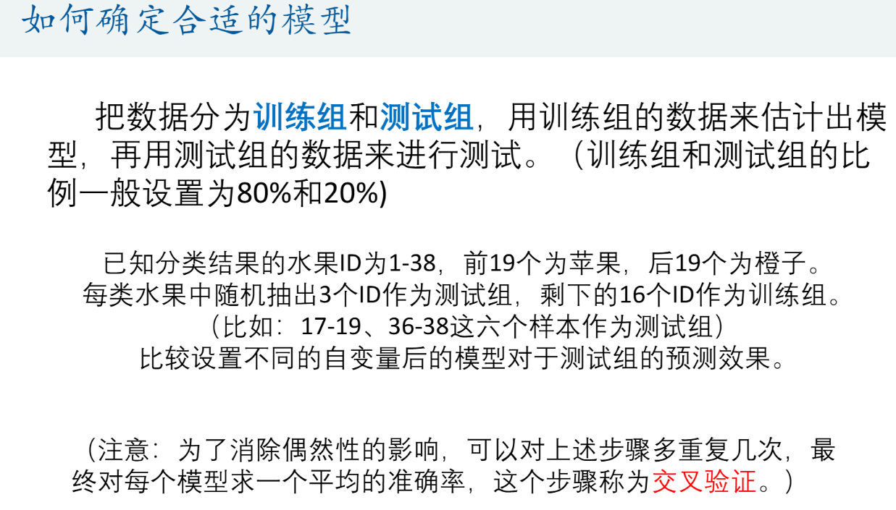这这这，机器学习实锤，ppt是svm


#### 多分类

逻辑回归，这些都用python

决策树，随机森林，svm


### 聚类模型

> “物以类聚，人以群分，所谓的聚类，就是将样本划分为由类似的对象组成的多个类的过程。
>
> 聚类后，我们可以更加准确的在每个类中单独使用统计模型进行估计、分析或预测也可以探究不同类之间的相关性和主要差异。
>
> **分类是已知类别的，聚类是未知类别的**


#### K-means聚类算法


- 优点
  1. 算法简单、快速
  2. 对处理大数据集，该算法相对高效率
- 缺点
  1. 要求用户必须事先给出要生成的簇的数目K
  2. **对初值敏感**
  3. **对于孤立点数据敏感**

**K-means++算法可以解决2和3这两个缺点**


#### K-means++算法

> k-means++算法选择初始聚类中心的基本原则是：**初始的聚类中心之间的相互距离要尽可能的远。**

**算法描述如下：(只对K-means算法“初始化K个聚类中心”这一步进行了优化)**

1. 随机选取一个样本作为第一个聚类中心;
2. 计算每个样本与当前已有聚类中心的最短距离(即与最近一个聚类中心的距离)，这个值越大，表示被选取作为聚类中心的概率较大:最后，用轮盘法(依据概率大小来进行抽选)选出下一个聚类中心
3. 重复步骤二，直到选出K个聚类中心。选出初始点后，就继续使用标准的K-means算法了。


一些问题

**Q：聚类的个数K值怎么定?**
**A：**分几类主要取决于个人的经验与感觉，通常的做法是多尝试几个K值看分成几类的结果更好解释，更符合分析目的等。
**Q：数据的量纲不一致怎么办?**
**A：**如果数据的量纲不一样，那么算距离时就没有意义。例如:如果X1单位是米，X2单位是吨，用距离公式计算就会出现“米的平方”加上“吨的平方再开平方，最后算出的东西没有数学意义，这就有问题了。

(python中是标准化和归一化)
$$
z_i = \frac{x_i-\overline{x}}{\sigma_x}
$$


他推荐我用系统聚类


### 时间序列分析

> 时间序列也称动态序列，是指将某种现象的指标数值按照时间顺序排列而成的数值序列。时间序列分析大致可分成三大部分，分别是描述过去、分析规律和预测未来，本讲将主要介绍时间序列分析中常用的三种模型:季节分解、指数平滑方法和ARIMA模型，并将结合Spss软件对时间序列数据进行建模

#### 时间序列数据

**对同一对象在不同时间连续观察所取得的数据**

eg

1. 从出生到现在，你的体重数据（每年生日测一次）
2. 中国历年来GDP的数据
3. 在某一地方每隔一小时测得的温度数据


#### 时间序列基本概念

时间序列也称动态序列，是指将某种现象的指标数值按照时间顺序排列而成的数值序列。


**两个组成要素构成**

1. 时间要素

年、季度、月、周、日、小时、分钟、秒

2. 数值要素


**根据时间和数值性质的不同，可以分成**

1. **时期序列**（数值要素反映现象在一定时期内发展的结果）
2. **时点序列**（数值要素反映现象在一定 时点上的瞬间水平）

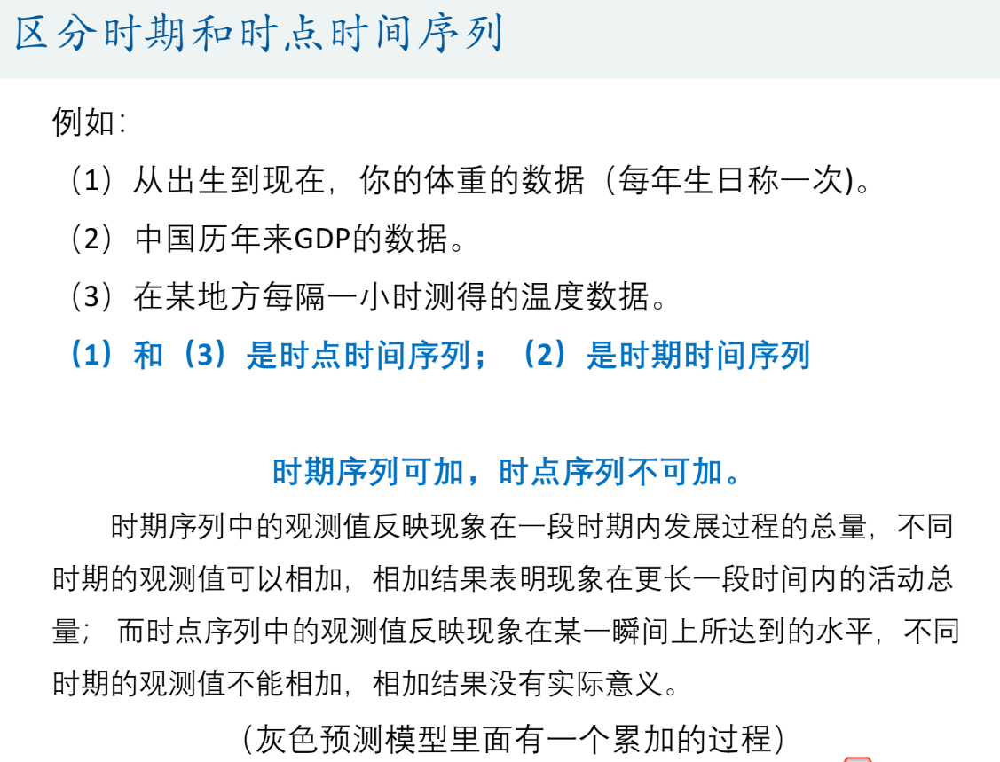

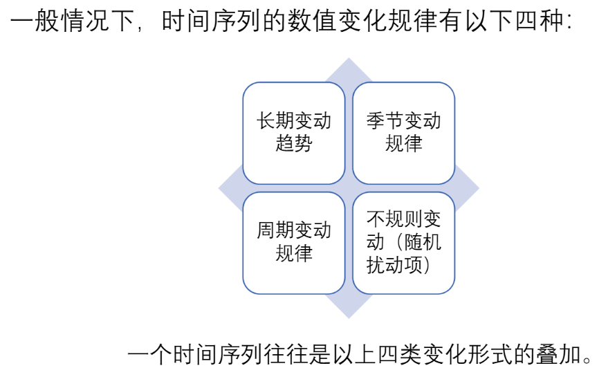

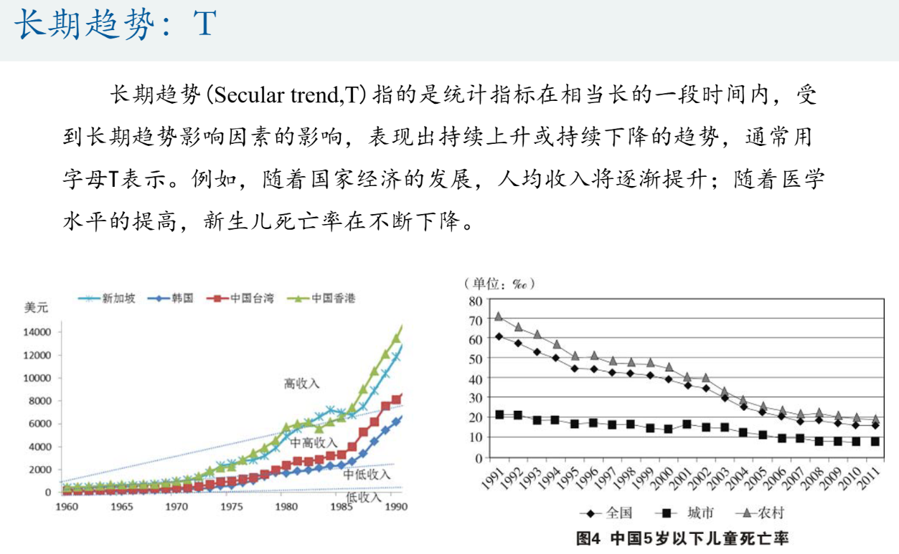

 

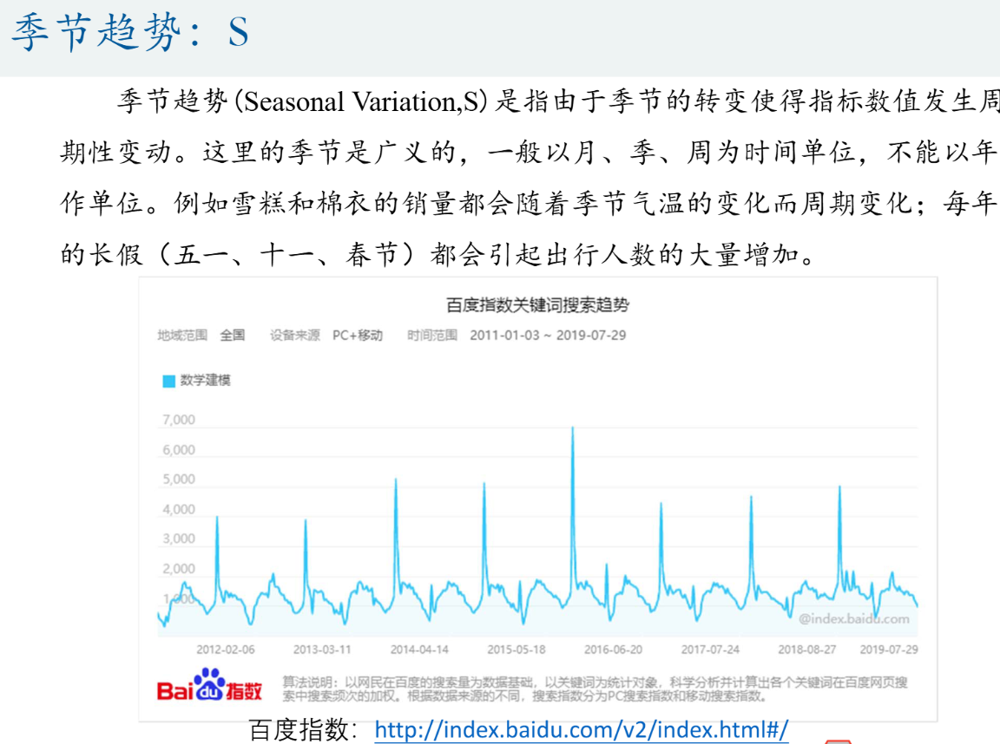

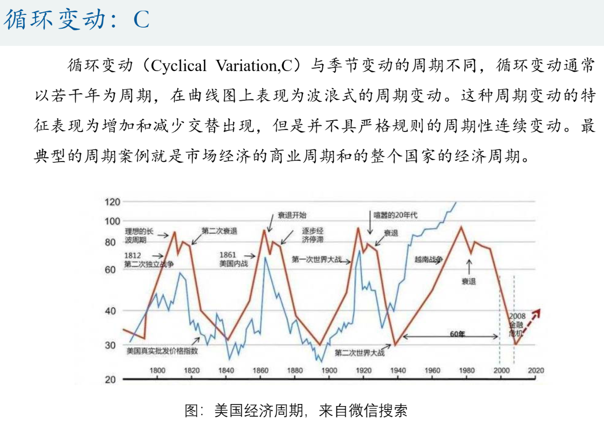

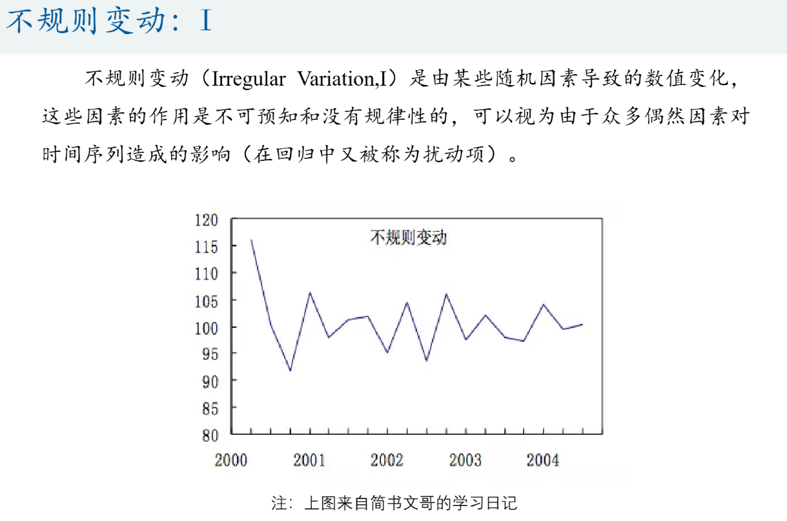

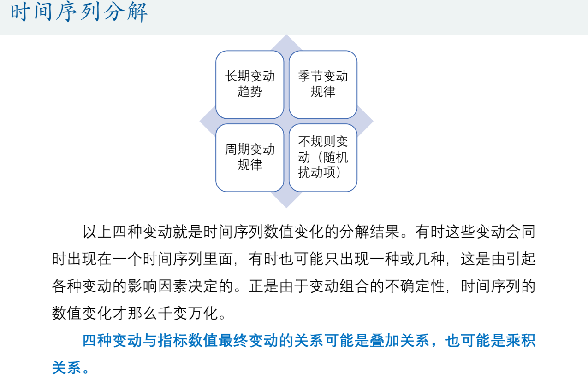

#### 叠加模型和乘积模型

1. **如果四种变动是相互独立的关系，那么叠加模型可以表示为**

$$
Y = T + S + C + I
$$

2. **如果四种变动之间存在相互影响关系，那么应该使用乘积模型**

$$
Y=T*S*C*I
$$

Y：指标数值的最终变动

T：长期趋势变动

S：季节变动

C：循环变动

I：不规则变动

- 数据具有年内的周期性时才能使用时间序列分解，例如数据是月份数据(周期为12)、季度数据(周期为4)，如果是年份数据则不行。
- 在具体的时间序列图上，如果随着时间的推移，序列的季节波动变得越来越大，则反映各种变动之间的关系发生变化建议使用乘积模型;反之，如果时间序列图的波动保持恒定则可以直接使用叠加模型;当然，如果不存在季节波动，则两种分解均可以。


#### 处理缺失值

- 如果在开头结尾就可以直接删掉

- 如果在序列的中间位置就不能直接删掉

  1. 序列平均值

     用整个序列的平均数代替缺失值

  2. 临近点的平均值

     用相邻若干点的平均数来代替缺失值（默认为两个点）

  3. 临近点的中位数

     用相邻若干点的中位数来代替缺失值（默认为两个点）

  4. 线性插值

     用相邻两个点的平均数来替换缺失值

  5. 邻近点的线性趋势

     将时期数作为x，时间序列值作为y进行回归，求缺失点的预测值


#### 步骤


#### 建立时间序列分析模型


#### 例题


## 预测模型


#### 例题与步骤


##### 预测的题目的一些小套路

1. 看到数据后先画时间序列图并简单的分析下趋势(例如:我们上一讲学过的时间序列分解)
2. 将数据分为训练组和试验组，尝试使用不同的模型对训练组进行建模，并利用试验组的数据判断哪种模型的预测效果最好(比如我们可以使用SSE这个指标来挑选模型，常见的模型有指数平滑、ARIMA、灰色预测、神经网络等)
3. 选择上一步骤中得到的预测误差最小的那个模型，并利用全部数据来重新建模，并对未来的数据进行预测。
4. 画出预测后的数据和原来数据的时序图，看看预测的未来趋势是否合理。


### SVD和图形处理

> 奇异值分解(Singular Value Decompsition))性代数中一种重要的矩阵分解，其在图形学、统计学推荐系统、信号处理等领域有重要应用。


#### svd作用 


### 主成分分析

>  本讲将介绍主成分分析(Principal Component Analysis，PCA)主成分分析是一种降维算法，它能将多个指标转换为少数几个主成分，这些主成分是原始变量的线性组合，且彼此之间互不相关，其能反映出原始数据的大部分信息。一般来说当研究的问题涉及到多变量且变量之间存在很强的相关性时我们可考虑使用主成分分析的方法来对数据进行简化

**降维的优点**

- 使得数据集更易集中
- 降低算法的计算开销
- 去除噪声
- 使得结果容易理解

**一个简单的例子**

> 例如，某人要做一件上衣要测量很多尺寸，如身长、袖长、胸腰围、肩宽、肩厚等十几项指标，但某服装厂要生产一批新型围、服装绝不可能把尺寸的型号分得过多?而是从多种指标中综合成几个少数的综合指标，做为分类的型号，利用主成分分析将十几项指标综合成3项指标，**一项是反映长度的指标，一项是反映胖瘦的指标，一项是反映特殊体型的指标。**


#### 步骤


