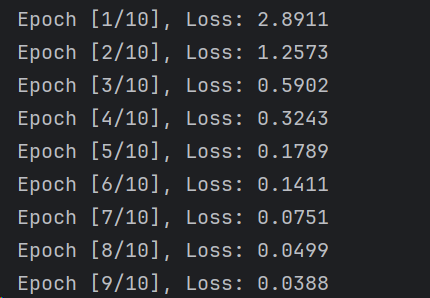
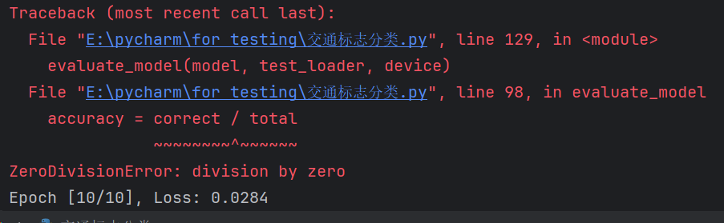
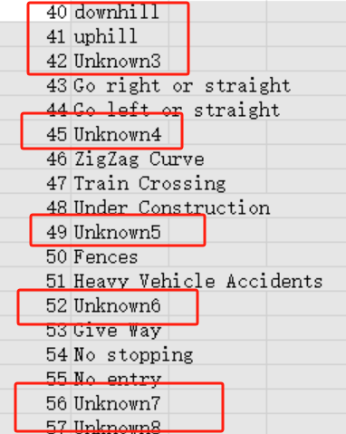
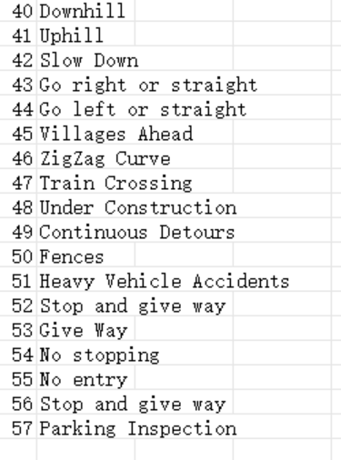

### 最终考核
---
因为种种原因，拉下进度，只能赶
下午坐了一个下午，竟是因为文件核和目录没搞懂导致一直找不到文件目录
然后是batchsize不匹配，这东西有没有捷径的哎，总不能一直自己手调的吧，哎

```python
from PIL import Image
import pandas as pd
import torch
import torch.nn as nn
import torch.optim as optim
import torchvision.transforms as transforms
from torch.utils.data import Dataset, DataLoader
import os

# Step 1: 导入数据集
class TrafficSignDataset(Dataset):
    def __init__(self, folder_path, csv_file, transform=None):
        self.data = []
        self.labels = pd.read_csv(csv_file, header=None)
        self.transform = transform

        # 读取训练集图像数据
        for class_dir in os.listdir(folder_path):
            class_path = os.path.join(folder_path, class_dir)
            if os.path.isdir(class_path):
                for filename in os.listdir(class_path):
                    img = Image.open(os.path.join(class_path, filename))
                    if img is not None:
                        img = img.convert("RGB")  # 转换为RGB格式
                        label = int(class_dir)
                        # 从self.labels中获取标签名称
                        label_name = self.labels.iloc[label, 1]
                        self.data.append((img, label, label_name))

    def __len__(self):
        return len(self.data)

    def __getitem__(self, idx):
        img, label, label_name = self.data[idx]
        if self.transform:
            img = self.transform(img)
        return img, label, label_name  # 返回图像、标签和交通标志名称


# Step 2: 数据预处理
transform = transforms.Compose([
    transforms.ToTensor(),  # 将图像转换为张量
    transforms.Resize((46, 46)),  # 调整图像大小
    transforms.Normalize((0.5, 0.5, 0.5), (0.5, 0.5, 0.5))
])

# Step 3: 建立模型
class CNN(nn.Module):
    def __init__(self, num_classes):
        super(CNN, self).__init__()
        self.conv1 = nn.Conv2d(3, 32, 3)
        self.conv2 = nn.Conv2d(32, 64, 3)
        self.conv3 = nn.Conv2d(64, 64, 3)
        self.fc1 = nn.Linear(64 * 4 * 4, 64)
        self.fc2 = nn.Linear(64, num_classes)

    def forward(self, x):
        x = nn.functional.relu(self.conv1(x))
        x = nn.functional.max_pool2d(x, 2)
        x = nn.functional.relu(self.conv2(x))
        x = nn.functional.max_pool2d(x, 2)
        x = nn.functional.relu(self.conv3(x))
        x = nn.functional.max_pool2d(x, 2)
        x = x.view(-1, 64 * 4 * 4)
        x = nn.functional.relu(self.fc1(x))
        x = self.fc2(x)
        return x

# Step 4: 模型训练
def train_model(model, train_loader, criterion, optimizer, device, num_epochs=10):
    model.train()
    for epoch in range(num_epochs):
        running_loss = 0.0
        for images, labels, _ in train_loader:
            images, labels = images.to(device), labels.to(device)
            optimizer.zero_grad()
            outputs = model(images)
            loss = criterion(outputs, labels)
            loss.backward()
            optimizer.step()
            running_loss += loss.item() * images.size(0) / len(train_loader.dataset)
        print(f"Epoch [{epoch + 1}/{num_epochs}], Loss: {running_loss:.4f}")

# Step 5: 模型评估
# 评估模型
def evaluate_model(model, test_loader, device):
    model.eval()
    correct = 0
    total = 0
    with torch.no_grad():
        for images, labels, _ in test_loader:
            images, labels = images.to(device), labels.to(device)
            outputs = model(images)
            _, predicted = torch.max(outputs.data, 1)
            total += labels.size(0)
            correct += (predicted == labels).sum().item()

    accuracy = correct / total
    print(f"Test Accuracy: {accuracy:.4f}")


# 设置路径和文件名
train_folder = "E:\\data\\data1"
test_folder = "E:\\data\\test1"
csv_file = "E:\\data\\labels.csv"

# 设置设备
device = torch.device("cuda" if torch.cuda.is_available() else "cpu")


# 创建数据集
train_dataset = TrafficSignDataset(train_folder, csv_file, transform=transform)
test_dataset = TrafficSignDataset(test_folder, csv_file, transform=transform)

# 创建数据加载器
train_loader = DataLoader(train_dataset, batch_size=32, shuffle=True)
test_loader = DataLoader(test_dataset, batch_size=32, shuffle=False)

# 初始化模型和优化器
model = CNN(num_classes=58).to(device)
criterion = nn.CrossEntropyLoss()
optimizer = optim.Adam(model.parameters(), lr=0.001)

# 训练模型
train_model(model, train_loader, criterion, optimizer, device)

# 评估模型
evaluate_model(model, test_loader, device)
```

但是......why/(ㄒoㄒ)/~~
又发现csv文件标签有unknown

ok


再一次，目录和文件没搞好。。

当我们构建一个机器学习模型来解决一个分类问题时，我们通常会将数据集分为训练集和测试集，并为每个数据点提供一个标签，标签描述了数据点所属的类别或类别之间的某种关系。

想象一下你是一位交通标志的学习者，你希望通过观察和学习不同的交通标志来学会识别它们。在这个场景中：

1. **训练集**：训练集就好像是你的课堂教材。它包含了大量的交通标志图像和对应的标签。你通过阅读教材（训练集）来学习交通标志的外观和含义。每张图片都有一个标签，告诉你这个交通标志是什么。通过观察训练集中的图像和标签，你的目标是从中学习出一个规律或模式，使得当你看到一个新的交通标志时，你能够正确地识别它。

2. **测试集**：测试集就像是你的考试试卷。它包含了一些你之前没见过的交通标志图像，但是这些图像都有标签。你需要利用你在课堂上学到的知识，对测试集中的图像进行分类，并且给出每个图像的标签预测。这相当于考试时，你需要根据你之前学到的知识来识别交通标志，然后写下对应的名称。

3. **标签**：标签就像是交通标志的名字标签。在训练集和测试集中，每张图片都会有一个标签，它告诉你这张图片中的交通标志是什么。标签是你在训练集中学习的目标，也是你在测试集上进行预测的结果。通过比较你的预测结果与真实的标签，你可以评估你模型的性能如何。

总的来说，训练集是用来学习的，测试集是用来评估学习效果的，而标签则是用来指导学习和评估的过程。通过不断地利用训练集来训练模型，并在测试集上进行评估，我们可以不断地提升我们的交通标志识别能力，就像是在不断地学习和测试一样。