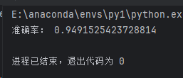

### 考核一（2024 .3.18——3.24）
---

#### 散点图
```python
from matplotlib import pyplot as plt
import pandas as pd
import numpy as np
import matplotlib

# 中文字体
font = {'family': 'Microsoft YaHei',
        'weight': 'bold'}

matplotlib.rc("font", **font)

# pandas读取csv的文件
data = pd.read_csv("D:\\桌面\\训练集.csv",header=None)
df = pd.DataFrame(data)

# 将数据转化为数组
df = np.array(df)

# 提取数据
x1 = df[0]
y1 = df[1]
l1 = df[2]

# 设置图形大小
plt.figure(figsize=(20, 8), dpi=80)

# 获取figure和axis
fig = plt.figure(figsize=(5, 5))
ax = fig.add_subplot(111)

# 隐藏上边和右边（框）
ax.spines['top'].set_color('none')
ax.spines['right'].set_color('none')

# 移动另外2个轴
ax.xaxis.set_ticks_position('bottom')
ax.spines['bottom'].set_position(('data', 0))
ax.yaxis.set_ticks_position('left')
ax.spines['left'].set_position(('data', 0))

# 设置x轴范围
plt.xlim((-10, 10))

# 调整x轴刻度
my_x_ticks = np.arange(-10, 12.5, 2.5)
plt.xticks(my_x_ticks)

# 标记0的点为蓝，1的为红
plt.scatter(x1[l1 == 0], y1[l1 == 0], c='blue', label="标签0")
plt.scatter(x1[l1 == 1], y1[l1 == 1], c='red', label="标签1")

# 图示
plt.legend()

# 标题
plt.title("一刀切散点图")

# 绘图
plt.show()
```

> 相比寒假的散点图，这次多了图示和标题


#### 基于sklearn的svm分类器的训练
（在csdn上看了原理，看着感觉都是高数的知识，怎么凑一堆看一会我就晕了呢......这数学知识我将用一生去消化(ˉ▽ˉ；)...）
- 目标：找到最好的那个决策边界，使得样本集中的点到这个超平面的最小距离最大化
- 核函数的作用是通过计算两个样本之间的内积来隐式地进行高维空间的特征映射，而无需直接计算映射后的特征向量。
  
 **svm线性核**
```python
import pandas as pd
import matplotlib.pyplot as plt
import numpy as np
from sklearn import svm
import matplotlib
from sklearn.metrics import accuracy_score

# 字体
font = {'family': 'Microsoft YaHei',
        'weight': 'bold'}

matplotlib.rc("font", **font)

# 从CSV文件加载数据
data = pd.read_csv("D:\\桌面\\训练集.csv", header=None)

# 提取特征和标签
X = data.iloc[:2, :].values  # 前两行为特征
y = data.iloc[2, :].values   # 第三行为标签

# 创建线性核SVM模型
svm_model = svm.SVC(kernel='linear')

# 训练模型
svm_model.fit(X.T, y)

# 绘制决策边界和超平面
w = svm_model.coef_[0]  # 第一个类别的法向量的值
b = svm_model.intercept_[0]    # 截距（超平面与坐标轴的交点）

# 绘制数据点
plt.scatter(X[0], X[1], c=y, cmap=plt.cm.Paired)

# 绘制决策边界
xx = np.linspace(X[0].min(), X[0].max(), 10)    # 绘制超平面的x坐标
yy = - (w[0] * xx + b) / w[1]  # 根据超平面方程计算 yy
plt.plot(xx, yy, 'k-', label=f'Decision Boundary: {w[0]:.2f}x + {w[1]:.2f}y + {b:.2f} = 0')

# 绘制支持向量
plt.scatter(svm_model.support_vectors_[:, 0], svm_model.support_vectors_[:, 1],
            s=100, facecolors='none', edgecolors='k')   # 支持向量的x、y坐标

# 将图例放在左上角
plt.legend(loc='upper left')

plt.xlabel('Feature 1')
plt.ylabel('Feature 2')
plt.title('SVM with Decision Boundary')
plt.show()


# 从CSV文件加载测试集数据
test_data = pd.read_csv("D:\\桌面\\test.csv", header=None)

# 提取特征和标签
X_test = test_data.iloc[:2, :].values  # 前两行为特征
y_test = test_data.iloc[2, :].values   # 第三行为标签

# 在测试集上进行预测
y_pred = svm_model.predict(X_test.T)

# 计算准确率
accuracy = accuracy_score(y_test, y_pred)
print("准确率：", accuracy)

```
- 准确率截图

  
- 可视化
    
    1. （最开始的爆丑啊，忘记图例的upper left了(⊙﹏⊙)）
   
    2. 调整后
     
   
#### Other Solutions
1. **svm的rbf（高斯函数）**
    - 看到群里的同学们在说将线性核函数换成其它的核函数，并提到高斯函数，我也去瞧了瞧哈哈（:dog:）
    - 能够有效处理非线性可分问题，避免维度灾难，具有参数调节的灵活性，适用于各种模式识别任务
```python
import pandas as pd
import numpy as np
import matplotlib.pyplot as plt
from sklearn import svm
from sklearn.metrics import accuracy_score

# 从CSV文件加载训练集数据
train_data = pd.read_csv("D:\\桌面\\训练集.csv", header=None)

# 提取特征和标签
X_train = train_data.iloc[:2, :].values  # 前两行为特征
y_train = train_data.iloc[2, :].values   # 第三行为标签

# 转置特征向量，确保每列代表一个样本
X_train = X_train.T

# 创建SVM模型
svm_model = svm.SVC(kernel='rbf')

# 在训练集上训练模型
svm_model.fit(X_train, y_train)

# 创建网格以绘制决策边界
xx, yy = np.meshgrid(np.linspace(X_train[:, 0].min(), X_train[:, 0].max(), 100),
                     np.linspace(X_train[:, 1].min(), X_train[:, 1].max(), 100))
Z = svm_model.decision_function(np.c_[xx.ravel(), yy.ravel()])
Z = Z.reshape(xx.shape)

# 绘制决策边界和超平面
plt.contourf(xx, yy, Z, levels=[-1, 0, 1], alpha=0.5, linestyles=['--', '-', '--'])
plt.scatter(X_train[:, 0], X_train[:, 1], c=y_train, cmap=plt.cm.Paired)

# 绘制支持向量
plt.scatter(svm_model.support_vectors_[:, 0], svm_model.support_vectors_[:, 1],
            s=100, facecolors='none', edgecolors='k')

plt.xlabel('Feature 1')
plt.ylabel('Feature 2')
plt.title('SVM Classifier with RBF Kernel')
plt.show()

# 导入测试集数据
test_data = pd.read_csv("D:\\桌面\\test.csv", header=None)

# 提取特征和标签
X_test = test_data.iloc[:2, :].values  # 前两行为特征
y_test = test_data.iloc[2, :].values   # 第三行为标签

# 转置特征向量，确保每列代表一个样本
X_test = X_test.T

# 在测试集上进行预测
y_pred = svm_model.predict(X_test)

# 计算准确率
accuracy = accuracy_score(y_test, y_pred)
print("准确率：", accuracy)
```
- 准确率截图
  
- 可视化
  

（:thinking:,这数据用rbf准确度还没普通线性核高）

2. **逻辑回归**
- （寒假的时候学了线性模型，当时想用其他分类算法的时候就想到了它。好，一查，人家哪里是搞分类的啊，再一查，欸有个逻辑回归的线性模型，也有回归，但实际用于分类任务。）
- 逻辑回归不能直接处理非线性数据，具有较低的计算复杂度，适用于较大的数据集。但当数据存在严重的噪声或者冗余特征时，可能会导致性能下降
- 线性核支持向量机在处理小规模数据集时可能具有更高的计算复杂度，但在处理复杂的、噪声较多的数据集时可能具有更好的稳定性和泛化能力。（:thinking:）
```python
import pandas as pd
import matplotlib.pyplot as plt
from sklearn.linear_model import LogisticRegression
from sklearn.metrics import accuracy_score
import numpy as np

# 加载训练集数据
train_data = pd.read_csv("D:\\桌面\\训练集.csv", header=None)

# 提取特征和标签
X_train = train_data.iloc[:2, :].values  # 前两行为特征
y_train = train_data.iloc[2, :].values   # 第三行为标签

# 创建并训练逻辑回归模型
log_reg_model = LogisticRegression()
log_reg_model.fit(X_train.T, y_train)

# 加载测试集数据
test_data = pd.read_csv("D:\\桌面\\test.csv", header=None)

# 提取特征和标签
X_test = test_data.iloc[:2, :].values  # 前两行为特征
y_test = test_data.iloc[2, :].values   # 第三行为标签

# 使用训练好的模型进行预测
y_pred = log_reg_model.predict(X_test.T)

# 计算准确率
accuracy = accuracy_score(y_test, y_pred)
print("准确率：", accuracy)

# 设置图的大小
plt.figure(figsize=(8, 6))

# 绘制决策边界和数据点
scatter_train = plt.scatter(X_train[0], X_train[1], c=y_train, cmap=plt.cm.Paired)
scatter_test = plt.scatter(X_test[0], X_test[1], c=y_pred, marker='x', cmap=plt.cm.Paired)  # 测试集点用叉号表示

# 绘制决策边界
w1, w2 = log_reg_model.coef_[0]
b = log_reg_model.intercept_[0]
x_boundary = np.array([X_train[0].min(), X_train[0].max()])
y_boundary = -(x_boundary * w1 + b) / w2
line_boundary, = plt.plot(x_boundary, y_boundary, 'k-', label=f'Decision Boundary: {w1:.2f}x + {w2:.2f}y + {b:.2f} = 0')

plt.xlabel('Feature 1')
plt.ylabel('Feature 2')
plt.title('Logistic Regression Classifier with Decision Boundary')

# 设置图例的位置、大小和透明度
plt.legend((scatter_train, scatter_test, line_boundary), ('Train Points', 'Test Points', 'Decision Boundary'),
           loc='upper left', fontsize='large')
plt.show()
```
- 准确率截图
  
- 可视化
  
(可能是没有像svm线性核那样最优化的原理，准确率不如svm线性核)

> 心得：感谢参加了寒假训练营，画图的任务还可以。就是一些细节上的东西需要注意，像图示、抬头、步长等等；对于svm线性核二分类器的训练任务，看数学原理看了两天:sob:,嗯:confused:。看的不是很明白，有点耗费心情和精力了，然后就直接去csdn查具体实现的方法了。感觉要真正弄懂，自己手搓一个算法太难了（对于我这个菜鸟来说）。在跟着敲的时候，最开始我就碰到了格式问题，用sklearn这个svm的包处理数据需要的是dataframe的格式，我刚开始用pandas read_csv后还把它转成np.array，主要是忘记dataframe也可以取行取列（:cry:）,被自己蠢笑了。sklearn真是强大啊（:joy:）
