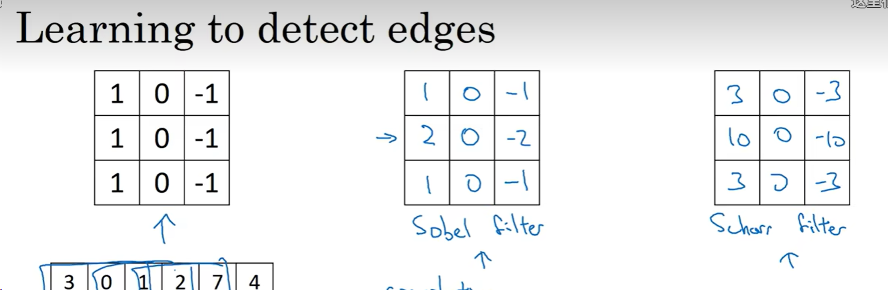

### 考核三
---

> 下载数据

```python
import torch
import torchvision
from torchvision import transforms

# 从pytorch下载fashion-MINIST数据集🤔


# 将图像数据转换为tensor类型并对其标准化
# 第一个元组(0.5,)表示数据的均值，第二个元组(0.5,)表示数据的标准差。
transform = transforms.Compose((transforms.ToTensor(), transforms.Normalize((0.5,), (0.5,))))

# 下载训练集
train_dataset = torchvision.datasets.FashionMNIST(root='./root', train=True, download=True)

# 训练集数据加载器
batch_size = 64     # 指定批次大小
train_loader = torch.utils.data.DataLoader(train_dataset, batch_size=batch_size, shuffle=True)
# shuffle=True表示每次迭代时打乱数据

# 下载测试集
test_dataset = torchvision.datasets.FashionMNIST(root='./root', train=False, download=True)

# 测试集数据加载器
test_loader = torch.utils.data.DataLoader(test_dataset, batch_size=batch_size, shuffle=True)

# 查看特征数量
# Fashion-MNIST数据集中的特征是图像数据，因此可以通过shape属性查看图像的大小
print("训练集特征数量:", train_dataset.data.shape)
print("测试集特征数量:", test_dataset.data.shape)
# 查看标签数量
# Fashion-MNIST数据集中的标签是类别数字，可以通过classes属性查看类别的数量
print("训练集标签数量:", len(train_dataset.classes))
print("测试集标签数量:", len(test_dataset.classes))

# 训练集60000个样本，每个样本是一个大小为28x28的二维张量（图像）。每个图像都有28行和28列。
# 测试集10000个样本
```

在看吴恩达卷积的边缘检测
不是，科学家们是怎么想出来这样的滤波器的啊∑( 口 ||

```python
import torchvision.datasets as datasets
import torchvision.transforms as transforms
from torch.utils.data import DataLoader
import torch
import torch.nn as nn
import torch.optim as optim


# 定义数据转换
transform = transforms.Compose([transforms.ToTensor(), transforms.Normalize((0.5,), (0.5,))])

# 引用数据集
train_dataset = datasets.FashionMNIST(root='root', train=True, download=False,transform=transform)
test_dataset = datasets.FashionMNIST(root='root', train=False, download=False,transform=transform)

# 创建数据加载器
batch_size = 64
train_loader = DataLoader(train_dataset, batch_size=batch_size, shuffle=True)
test_loader = DataLoader(test_dataset, batch_size=batch_size, shuffle=True)

# 定义模型

class Net(nn.Module):
    def __init__(self):
        super(Net, self).__init__()
        self.conv1 = nn.Conv2d(1, 6, 5)
        self.pool = nn.MaxPool2d(2, 2)
        self.conv2 = nn.Conv2d(6, 16, 5)
        self.fc1 = nn.Linear(16 * 4 * 4, 120)
        self.fc2 = nn.Linear(120, 84)
        self.fc3 = nn.Linear(84, 10)

    def forward(self, x):
        x = self.pool(torch.relu(self.conv1(x)))
        x = self.pool(torch.relu(self.conv2(x)))
        x = x.view(-1, 16 * 4 * 4)
        x = torch.relu(self.fc1(x))
        x = torch.relu(self.fc2(x))
        x = self.fc3(x)
        return x

net = Net()

# Step 3: 定义损失函数和优化器
criterion = nn.CrossEntropyLoss()
optimizer = optim.SGD(net.parameters(), lr=0.001, momentum=0.9)

# Step 4: 模型训练
for epoch in range(10):  # 迭代10次
    running_loss = 0.0
    for i, data in enumerate(train_loader, 0):
        inputs, labels = data
        optimizer.zero_grad()
        outputs = net(inputs)
        loss = criterion(outputs, labels)
        loss.backward()
        optimizer.step()
        running_loss += loss.item()
        if i % 100 == 99:
            print('[%d, %5d] loss: %.3f' %
                  (epoch + 1, i + 1, running_loss / 100))
            running_loss = 0.0

print('Finished Training')

# 模型评估
correct = 0
total = 0
with torch.no_grad():
    for data in test_loader:
        images, labels = data
        outputs = net(images)
        _, predicted = torch.max(outputs.data, 1)
        total += labels.size(0)
        correct += (predicted == labels).sum().item()

print('Accuracy of the network on the 10000 test images: %d %%' % (
    100 * correct / total))


# 定义保存模型的文件路径
# PATH = "E:\\pycharm\\for testing\\my_model.pth"

# 保存模型参数到文件
# torch.save(net.state_dict(), PATH)
```
