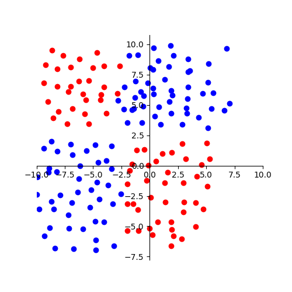
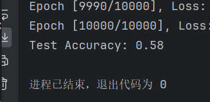
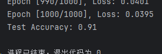
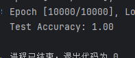
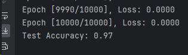
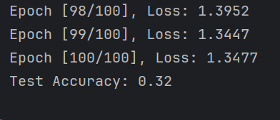
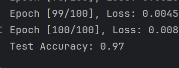

### 考核二
---
> **散点图**



（最开始断断续续看吴恩达的视频，按顺序看了30多个，然后加上放假，懈怠了许多╥﹏╥...，所以较晚才继续考核二嗯~ o(*￣▽￣*)o）

（真正开始，遇到的第一个问题就是没转换数据类型，在pytorch衡量数据维度的是张量tensor；在搭积木的时候，没太注意大小写，然后它老是警告；我还是分了80%训练集和20%验证集；我搭，可能是因为我只用了一层，然后数据本来也少，刚开始的准确率只有0.58，就想着怎么优化）

```python
import torch
import pandas as pd
import torch.nn as nn
from sklearn.model_selection import train_test_split

# 读取CSV文件
data = pd.read_csv("D:\\桌面\\田字型散点.csv", header=None)
data = pd.DataFrame(data)

# 提取特征和标签
X = torch.tensor(data.iloc[0:2, :].values, dtype=torch.float32)
labels = torch.tensor(data.iloc[2, :].values, dtype=torch.float32)

# 定义神经网络模型
class SimpleLinearModel(nn.Module):
    def __init__(self):
        super(SimpleLinearModel, self).__init__()
        self.linear = nn.Linear(2, 1)  # 输入特征维度为2，输出维度为1

    def forward(self, x):
        return torch.sigmoid(self.linear(x))

# 初始化模型
model = SimpleLinearModel()

# 定义损失函数和优化器
criterion = nn.BCELoss()  # 二元交叉熵损失函数
optimizer = torch.optim.SGD(model.parameters(), lr=0.01)

# 划分训练集和测试集
X_train, X_test, y_train, y_test = train_test_split(X.T, labels, test_size=0.2, random_state=42)

# 训练模型
num_epochs = 10000
for epoch in range(num_epochs):
    # 前向传播
    outputs = model(X_train)
    loss = criterion(outputs, y_train.view(-1, 1))  # view(-1, 1)将标签形状调整为列向量

    # 反向传播和优化
    optimizer.zero_grad()
    loss.backward()
    optimizer.step()

    # 打印训练过程中的损失
    if (epoch + 1) % 10 == 0:
        print(f'Epoch [{epoch + 1}/{num_epochs}], Loss: {loss.item():.4f}')

# 测试模型
with torch.no_grad():
    outputs = model(X_test)
    predicted_labels = torch.round(outputs)
    accuracy = (predicted_labels == y_test.view(-1, 1)).sum().item() / y_test.size(0)
    print(f'Test Accuracy: {accuracy:.2f}')
```
（没绷住）

去搜了一下，可以

1. **调整学习率：** 尝试使用不同的学习率，可能较小的学习率会更好地收敛。您可以尝试减小学习率并观察模型的性能是否有所改善。**（试了，0.01改成0.001，准确率0.64了哈哈）**

2. **增加训练周期数：** 可能需要增加训练周期数，使模型有更多的时间学习数据的模式和特征。您可以尝试增加 `num_epochs` 的值并重新训练模型。**（改了个100000，怎么又变回0.58了）**

3. **调整优化器：** 尝试使用其他优化器，如 Adam 或 RMSprop，这些优化器通常具有更好的性能和收敛速度。**（用了adam，它也适合二分类问题，但还是0.58）**

4. **正则化：** 添加正则化项来防止过拟合，例如 L1 正则化或 L2 正则化。这可以通过在优化器中设置权重衰减参数来实现。（跳过）

5. **数据预处理：** 检查数据是否需要进行标准化或归一化处理，以及是否存在缺失值需要处理。（跳过）

6. **模型调参：** 调整模型的超参数，如隐藏层维度、学习率、正则化系数等。（jump）

7. **特征工程：** 考虑添加更多的特征或对现有特征进行转换，以提高模型的表现。（jump）

8. **模型结构：** 考虑尝试更复杂的模型结构，例如添加更多的隐藏层或增加隐藏单元的数量。（让我试试）

```python
import torch
import pandas as pd
import torch.nn as nn
from sklearn.model_selection import train_test_split

# 读取CSV文件
data = pd.read_csv("D:\\桌面\\田字型散点.csv", header=None)
data = pd.DataFrame(data)

# 提取特征和标签
X = torch.tensor(data.iloc[0:2, :].values, dtype=torch.float32)
labels = torch.tensor(data.iloc[2, :].values, dtype=torch.float32)

# 定义神经网络模型
class SimpleModel(nn.Module):
    def __init__(self):
        super(SimpleModel, self).__init__()
        self.linear1 = nn.Linear(2, 64)  # 输入特征维度为2，隐藏层维度为64
        self.linear2 = nn.Linear(64, 1)   # 隐藏层维度为64，输出维度为1
        self.relu = nn.ReLU()             # 使用ReLU作为激活函数

    def forward(self, x):
        x = self.relu(self.linear1(x))
        return torch.sigmoid(self.linear2(x))

# 实例化模型
model = SimpleModel()

# 定义损失函数和优化器
criterion = nn.BCELoss()  # 二元交叉熵损失函数
optimizer = torch.optim.Adam(model.parameters(), lr=0.001) 

# 划分训练集和测试集
X_train, X_test, y_train, y_test = train_test_split(X.T, labels, test_size=0.2, random_state=42)

# 训练模型
num_epochs = 1000
for epoch in range(num_epochs):
    # 前向传播
    outputs = model(X_train)
    loss = criterion(outputs, y_train.view(-1, 1))  # view(-1, 1)将标签形状调整为列向量

    # 反向传播和优化
    optimizer.zero_grad()
    loss.backward()
    optimizer.step()

    # 打印训练过程中的损失
    if (epoch + 1) % 10 == 0:
        print(f'Epoch [{epoch + 1}/{num_epochs}], Loss: {loss.item():.4f}')

# 测试模型
with torch.no_grad():
    outputs = model(X_test)
    predicted_labels = torch.round(outputs)
    accuracy = (predicted_labels == y_test.view(-1, 1)).sum().item() / y_test.size(0)
    print(f'Test Accuracy: {accuracy:.2f}')
```

终于上9了，在一系列呃，换了个优化器，添加了一个隐藏层，epoch为1000，10000时1.00了，/(ㄒoㄒ)/~~

(⊙﹏⊙)

lr为0.1时
后面loss值都0.00好久了，怎么准确率还是0.97(:thinking:)
（呃，因为超级晚交考核二，自问自答一波，呃test accuracy按的是平均loss）

> 干豆！(⊙﹏⊙)，先多搞几个隐藏层先，增加深度，再多搞几个神经元欸嘿嘿
notice：数据集直接转为张量数据集，不用一列一列搞，但要构建数据加载器
```python
import torch
import pandas as pd
import torch.nn as nn
from sklearn.model_selection import train_test_split
from torch.utils.data import TensorDataset, DataLoader

# 读取数据
data = pd.read_csv("D:\\桌面\\gandou.csv")

# 提取特征和标签
X = data.iloc[:, :-1].values  # 提取特征
y = data.iloc[:, -1].values  # 提取标签

# 划分训练集和测试集
X_train, X_test, y_train, y_test = train_test_split(X, y, test_size=0.2, random_state=42)

# 转换为张量数据集
train_dataset = TensorDataset(torch.tensor(X_train, dtype=torch.float32), torch.tensor(y_train, dtype=torch.long))
test_dataset = TensorDataset(torch.tensor(X_test, dtype=torch.float32), torch.tensor(y_test, dtype=torch.long))

# 构建数据加载器
train_loader = DataLoader(train_dataset, batch_size=64, shuffle=True)
test_loader = DataLoader(test_dataset, batch_size=64)
# 定义神经网络模型
class SimpleLinearModel(nn.Module):
    def __init__(self):
        super(SimpleLinearModel, self).__init__()
        self.fc1 = nn.Linear(16, 256)
        self.fc2 = nn.Linear(256, 128)
        self.fc3 = nn.Linear(128, 64)
        self.fc4 = nn.Linear(64, 4)

    def forward(self, x):
        x = torch.relu(self.fc1(x))
        x = torch.relu(self.fc2(x))
        x = torch.relu(self.fc3(x))
        x = self.fc4(x)
        return x

# 实例化模型
model = SimpleLinearModel()

# 定义损失函数和优化器
criterion = nn.CrossEntropyLoss()# 适用于多分类的交叉熵损失函数，BCE是适用于二分类的二元交叉熵损失函数
optimizer = torch.optim.SGD(model.parameters(), lr=0.01)

# 训练模型
num_epochs = 100
for epoch in range(num_epochs):
    model.train()
    for inputs, labels in train_loader:
        optimizer.zero_grad()
        outputs = model(inputs)
        loss = criterion(outputs, labels)
        loss.backward()
        optimizer.step()

    print(f'Epoch [{epoch+1}/{num_epochs}], Loss: {loss.item():.4f}')

# 测试模型
model.eval()
with torch.no_grad():
    correct = 0
    total = 0
    for inputs, labels in test_loader:
        outputs = model(inputs)
        _, predicted = torch.max(outputs, 1)
        total += labels.size(0)
        correct += (predicted == labels).sum().item()

    accuracy = correct / total
    print(f'Test Accuracy: {accuracy:.2f}')
```

epoch改为1000也一样，好我减小学习率，好，没用。嗯，换个优化器，换Adam；啊不行，还32；🤔，看了一眼数据集内容，数据之间因为不同类型，大的有面积，超级小的又有形状，数据预处理🤔，好好好，文档中学长也说了要数据预处理/(ㄒoㄒ)/~~

> 数据标准化（Standardization）：
对于数值型特征，可以使用sklearn.preprocessing.StandardScaler进行数据标准化处理，将特征值缩放到均值为0、标准差为1的范围内，以提高模型的收敛速度和稳定性。(●ˇ∀ˇ●)

```python
from sklearn.preprocessing import StandardScaler
# 数据预处理
scaler = StandardScaler()
X = scaler.fit_transform(X)# 加了个这个嘿嘿
  ```  

win!