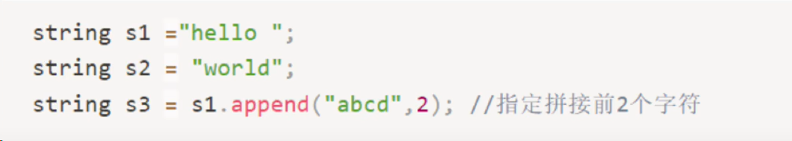
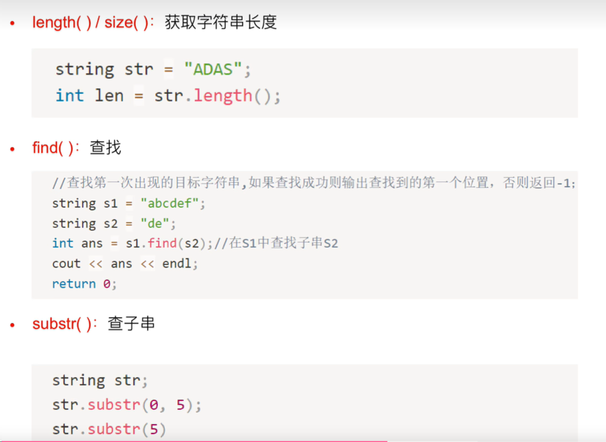
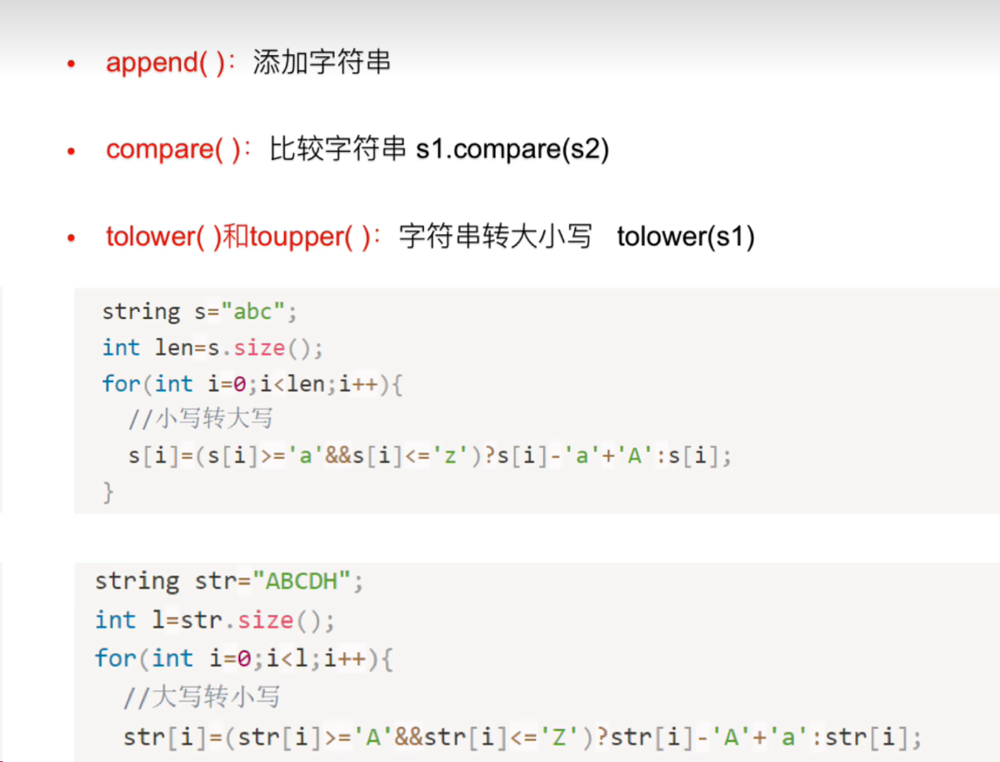
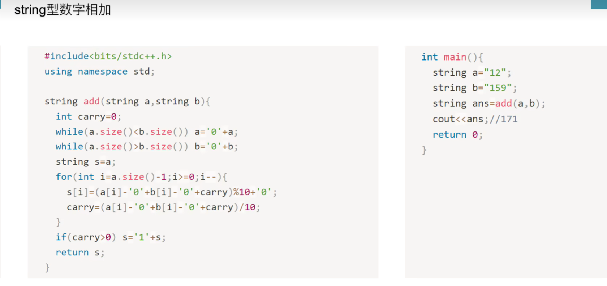
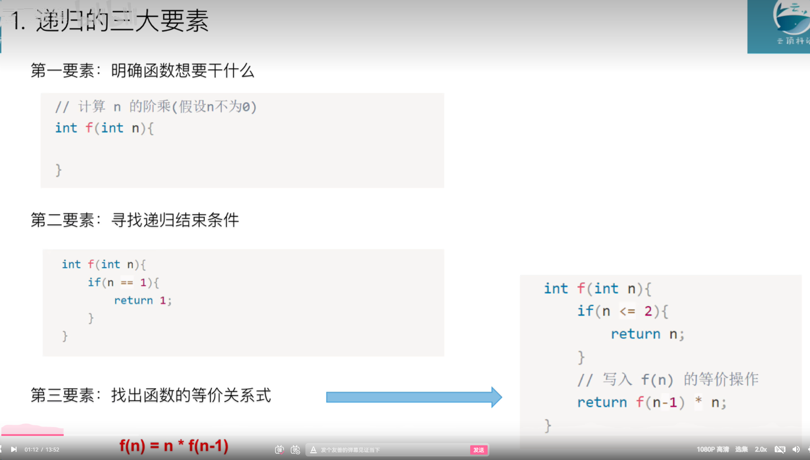
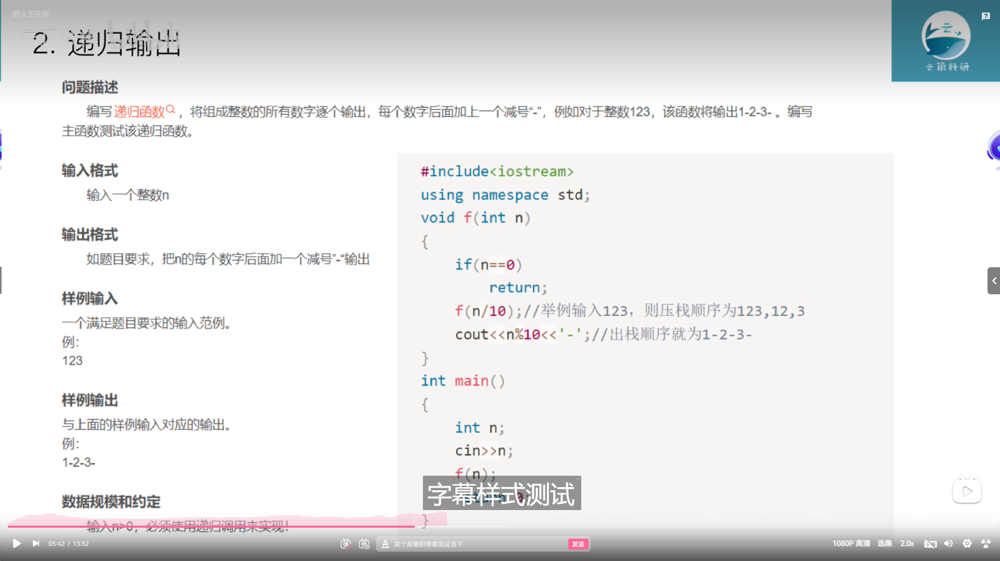
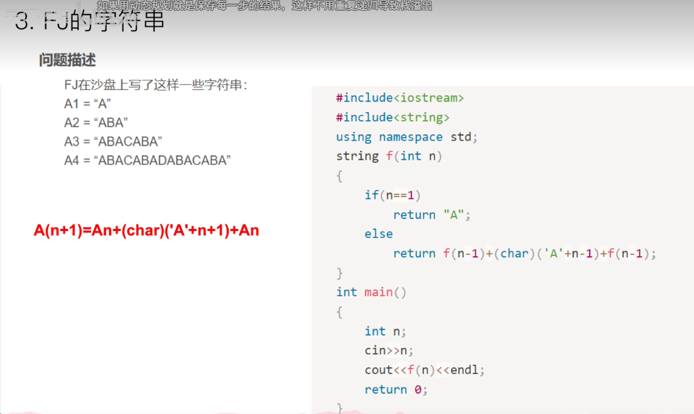
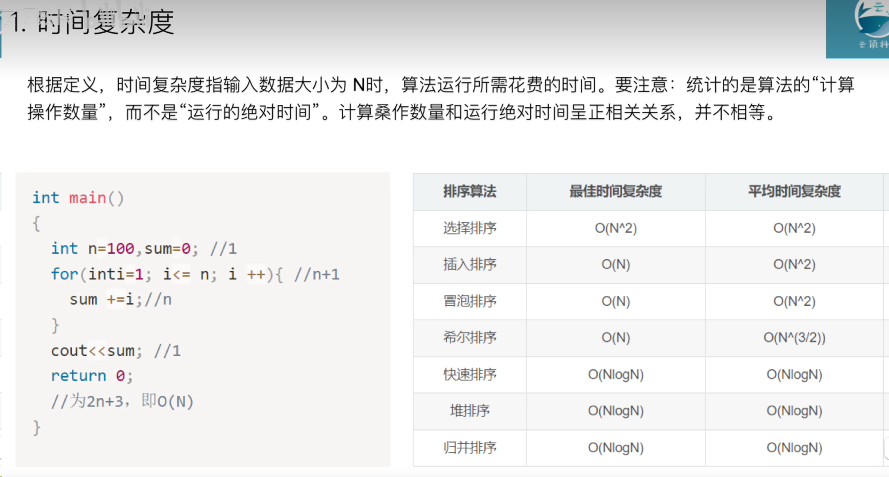

当然，请允许我具体解释每个 STL 组件的用法：

1. **std::vector**：std::vector 是一个动态数组，可以存储任意类型的元素。它的用法如下：

    ```cpp
    #include <vector>
    #include <iostream>
    
    using namespace std;
    
    int main() {
        // 创建一个空的 vector
        vector<int> vec;
        
        // 在末尾插入元素
        vec.push_back(10);
        vec.push_back(20);
        
        // 访问元素
        cout << vec[0] << endl; // 输出 10
        
        // 使用迭代器遍历元素
        for (auto it = vec.begin(); it != vec.end(); ++it) {
            cout << *it << " "; // 输出 10 20
        }
        cout << endl;
        
        // 获取 vector 的大小
        cout << "Size: " << vec.size() << endl; // 输出 2
        
        // 清空 vector
        vec.clear();
        
        return 0;
    }
    ```

2. **std::pair**：std::pair 是一个模板类，用于将两个值组合在一起。它的用法如下：

    ```cpp
    #include <utility>
    #include <iostream>
    
    using namespace std;
    
    int main() {
        // 创建一个 pair
        pair<int, string> p = make_pair(10, "hello");
        
        // 访问 pair 中的元素
        cout << p.first << " " << p.second << endl; // 输出 10 hello
        
        return 0;
    }
    ```

3. **std::set 和 std::map**：std::set 和 std::map 都是关联容器，它们提供了集合和映射的功能。它们的用法如下：

    ```cpp
    #include <set>
    #include <map>
    #include <iostream>
    
    using namespace std;
    
    int main() {
        // 创建一个 set
        set<int> s = {3, 1, 2};
        
        // 插入元素
        s.insert(4);
        
        // 遍历 set 中的元素
        for (int x : s) {
            cout << x << " "; // 输出 1 2 3 4
        }
        cout << endl;
        
        // 创建一个 map
        map<string, int> m;
        
        // 插入键值对
        m["apple"] = 5;
        m["banana"] = 3;
        
        // 访问 map 中的元素
        cout << m["apple"] << endl; // 输出 5
        
        return 0;
    }
    ```

4. **std::unordered_set 和 std::unordered_map**：这两个容器是基于哈希表的集合和映射，它们的用法与 std::set 和 std::map 类似，但插入、删除和查找元素的时间复杂度更低。

5. **std::queue 和 std::stack**：std::queue 和 std::stack 分别是队列和堆栈的容器适配器，它们的用法如下：

    ```cpp
    #include <queue>
    #include <stack>
    #include <iostream>
    
    using namespace std;
    
    int main() {
        // 创建一个队列
        queue<int> q;
        
        // 插入元素
        q.push(10);
        q.push(20);
        
        // 访问队列的第一个元素
        cout << q.front() << endl; // 输出 10
        
        // 创建一个堆栈
        stack<int> s;
        
        // 插入元素
        s.push(10);
        s.push(20);
        
        // 访问堆栈的顶部元素
        cout << s.top() << endl; // 输出 20
        
        return 0;
    }
    ```

6. **std::sort**：std::sort 是 C++ 标准库中用于排序的函数，它的用法如下：

    ```cpp
    #include <algorithm>
    #include <vector>
    #include <iostream>
    
    using namespace std;
    
    int main() {
        vector<int> vec = {3, 1, 4, 1, 5, 9, 2, 6};
        
        // 对 vector 进行排序
        sort(vec.begin(), vec.end());
        
        // 输出排序后的 vector
        for (int x : vec) {
            cout << x << " "; // 输出 1 1 2 3 4 5 6 9
        }
        cout << endl;
        
        return 0;
    }
    ```

7. **std::next_permutation**：std::next_permutation 是一个函数，用于生成给定序列的下一个排列。它的用法如下：

    ```cpp
    #include <algorithm>
    #include <vector>


    #include <iostream>
    
    using namespace std;
    
    int main() {
        vector<int> vec = {1, 2, 3};
        
        // 生成排列
        do {
            for (int x : vec) {
                cout << x << " "; // 输出所有排列
            }
            cout << endl;
        } while (next_permutation(vec.begin(), vec.end()));
        
        return 0;
    }
    ```

8. **std::bitset**：std::bitset 是一个固定大小的位集合，它的用法如下：

    ```cpp
    #include <bitset>
    #include <iostream>
    
    using namespace std;
    
    int main() {
        // 创建一个大小为 5 的 bitset
        bitset<5> bs;
        
        // 设置某一位的值
        bs.set(2, true);
        
        // 输出所有位的值
        cout << bs << endl; // 输出 00100
        
        return 0;
    }
    ```

以上就是一些常用的 STL 组件及其具体用法，希望能帮助你更好地理解和使用 STL。

理解各种知识点的最佳方法是通过实践，因此我将为你列举一些常见知识点对应的题目，并提供简要的解释。以下是一些常见知识点和对应题目的示例：

1. **递归与回溯**：
   - 题目：求解斐波那契数列的第 n 项。
   - 解释：使用递归函数来计算斐波那契数列的第 n 项，其中第 n 项等于前两项的和，递归终止条件为 n=0 或 n=1。

2. **动态规划**：
   - 题目：0-1 背包问题。
   - 解释：给定一组物品，每个物品有对应的重量和价值，以及一个背包容量。求在背包容量不超过限制的情况下，能够装入背包的物品的最大价值。

3. **搜索算法**：
   - 题目：深度优先搜索（DFS）迷宫问题。
   - 解释：给定一个迷宫地图，以及起点和终点的位置，通过深度优先搜索算法寻找从起点到终点的路径。在搜索过程中，需要考虑避免走回头路和越界的情况。

4. **数学知识**：
   - 题目：求解最大公约数（GCD）。
   - 解释：使用欧几里德算法求解两个整数的最大公约数，即两个整数的最大公约数等于其中较小数和两数相除的余数的最大公约数。

5. **字符串处理**：
   - 题目：判断一个字符串是否为回文串。
   - 解释：回文串是指正着读和反着读都一样的字符串。通过比较字符串的首尾字符，逐步向中间移动，判断是否相等，即可确定字符串是否为回文串。

6. **模拟题**：
   - 题目：模拟实现简单的计算器。
   - 解释：设计一个简单的计算器程序，能够接受用户输入的数值和运算符，进行加、减、乘、除等基本运算，并输出计算结果。

7. **数据结构**：
   - 题目：实现链表的反转。
   - 解释：给定一个链表，将其反转，即将链表的每个节点的指针方向反转，原先指向下一个节点的指针改为指向前一个节点。

8. **位运算**：
   - 题目：判断一个数是否为 2 的幂。
   - 解释：对于一个整数 n，如果 n 是 2 的幂，则它的二进制表示中只有一个 1，因此可以通过判断 n 和 n-1 的按位与是否为 0 来确定。

以上是一些常见知识点和对应题目的示例。通过练习这些题目，你可以更加深入地理解和掌握各种知识点，并提高解决问题的能力。

好的，我将为你详细解释每个知识点对应题目的代码实现和解题思路。

1. **递归与回溯**：
   - 代码实现：
     ```cpp
     int fibonacci(int n) {
         if (n <= 1) {
             return n;
         }
         return fibonacci(n - 1) + fibonacci(n - 2);
     }
     ```
   - 解题思路：递归地计算斐波那契数列的第 n 项，终止条件为 n=0 或 n=1。在计算第 n 项时，递归地调用函数来计算第 n-1 项和第 n-2 项，然后将它们相加得到结果。

2. **动态规划**：
   - 代码实现：
     ```cpp
     int knapsack(int W, vector<int>& weights, vector<int>& values) {
         int n = weights.size();
         vector<vector<int>> dp(n + 1, vector<int>(W + 1, 0));
         for (int i = 1; i <= n; i++) {
             for (int w = 1; w <= W; w++) {
                 if (weights[i - 1] <= w) {
                     dp[i][w] = max(dp[i - 1][w], dp[i - 1][w - weights[i - 1]] + values[i - 1]);
                 } else {
                     dp[i][w] = dp[i - 1][w];
                 }
             }
         }
         return dp[n][W];
     }
     ```
   - 解题思路：使用动态规划算法解决 0-1 背包问题。创建一个二维数组 dp，其中 dp[i][w] 表示在前 i 个物品中，背包容量为 w 时的最大价值。根据递推关系式 dp[i][w] = max(dp[i-1][w], dp[i-1][w-weights[i-1]] + values[i-1]) 进行填表。

3. **搜索算法**：
   - 代码实现：
     ```cpp
     void dfs(vector<vector<int>>& maze, int x, int y, vector<vector<bool>>& visited) {
         // 终止条件
         if (x < 0 || x >= maze.size() || y < 0 || y >= maze[0].size() || maze[x][y] == 1 || visited[x][y]) {
             return;
         }
         // 标记当前位置为已访问
         visited[x][y] = true;
         // 向上、下、左、右四个方向递归搜索
         dfs(maze, x - 1, y, visited);
         dfs(maze, x + 1, y, visited);
         dfs(maze, x, y - 1, visited);
         dfs(maze, x, y + 1, visited);
     }
     ```
   - 解题思路：使用深度优先搜索（DFS）算法解决迷宫问题。从起点开始，递归地向四个方向探索，直到找到终点或者无法继续前进为止。在搜索过程中，需要考虑避免走回头路和越界的情况。

4. **数学知识**：
   - 代码实现：
     ```cpp
     int gcd(int a, int b) {
         return b == 0 ? a : gcd(b, a % b);
     }
     ```
   - 解题思路：使用欧几里德算法求解两个整数的最大公约数。最大公约数等于较小数和两数相除的余数的最大公约数。

5. **字符串处理**：
   - 代码实现：
     ```cpp
     bool isPalindrome(string s) {
         int left = 0, right = s.size() - 1;
         while (left < right) {
             if (!isalnum(s[left])) {
                 left++;
                 continue;
             }
             if (!isalnum(s[right])) {
                 right--;
                 continue;
             }
             if (tolower(s[left]) != tolower(s[right])) {
                 return false;
             }
             left++;
             right--;
         }
         return true;
     }
     ```
   - 解题思路：判断一个字符串是否为回文串。使用双指针方法，从字符串的两端向中间移动，比较对应位置的字符是否相等。在比

较时，需要忽略非字母数字字符，并且忽略大小写。

6. **模拟题**：
   - 代码实现：
     ```cpp
     int calculator(string s) {
         // 实现一个简单的计算器
         // ...
     }
     ```
   - 解题思路：实现一个简单的计算器程序，能够接受用户输入的数值和运算符，进行加、减、乘、除等基本运算，并输出计算结果。

7. **数据结构**：
   - 代码实现：
     ```cpp
     ListNode* reverseList(ListNode* head) {
         ListNode* prev = nullptr;
         ListNode* curr = head;
         while (curr != nullptr) {
             ListNode* next = curr->next;
             curr->next = prev;
             prev = curr;
             curr = next;
         }
         return prev;
     }
     ```
   - 解题思路：实现链表的反转。使用三个指针 prev、curr、next，分别表示当前节点的前一个节点、当前节点和下一个节点。在遍历链表的过程中，将当前节点的 next 指针指向前一个节点，然后更新 prev、curr、next 指针。

8. **位运算**：
   - 代码实现：
     ```cpp
     bool isPowerOfTwo(int n) {
         return n > 0 && (n & (n - 1)) == 0;
     }
     ```
   - 解题思路：判断一个数是否为 2 的幂。如果一个数是 2 的幂，则它的二进制表示中只有一个 1，因此 n 和 n-1 的按位与结果应为 0。

以上是每个知识点对应题目的代码实现和解题思路。希望这些示例能够帮助你更好地理解各种知识点，并提高解决问题的能力。

在算法比赛中，string 类型的使用非常广泛，它可以用于处理各种字符串操作，例如字符串的拼接、查找、替换、切割等。以下是 string 在算法比赛中的一些常考用法：

1. **字符串拼接**：将两个字符串拼接成一个新的字符串。
   ```cpp
   string s1 = "hello";
   string s2 = "world";
   string result = s1 + s2; // 结果为 "helloworld"
   ```

2. **字符串长度**：获取字符串的长度。
   ```cpp
   string s = "hello";
   int length = s.length(); // length 的值为 5
   ```

3. **字符串查找**：查找子字符串在原字符串中的位置。
   ```cpp
   string s = "hello world";
   int pos = s.find("world"); // pos 的值为 6
   ```

4. **字符串替换**：替换字符串中的某个子串。
   ```cpp
   string s = "hello world";
   s.replace(6, 5, "there"); // 将 "world" 替换为 "there"
   ```

5. **字符串切割**：根据某个字符将字符串切割成多个子串。
   ```cpp
   string s = "apple,banana,orange";
   vector<string> tokens;
   stringstream ss(s);
   string token;
   while (getline(ss, token, ',')) {
       tokens.push_back(token);
   }
   // tokens 中包含 "apple", "banana", "orange"
   ```

6. **字符串转换**：将字符串转换为其他数据类型。
   ```cpp
   string s = "123";
   int num = stoi(s); // 将字符串转换为整数，num 的值为 123
   ```

7. **字符串比较**：比较两个字符串的大小关系。
   ```cpp
   string s1 = "apple";
   string s2 = "banana";
   if (s1 < s2) {
       // s1 小于 s2
   } else if (s1 > s2) {
       // s1 大于 s2
   } else {
       // s1 等于 s2
   }
   ```

8. **字符串遍历**：遍历字符串中的每个字符。
   ```cpp
   string s = "hello";
   for (char c : s) {
       // 对每个字符执行操作
   }
   ```

这些是 string 类型在算法比赛中常考的一些用法，掌握这些用法可以帮助你更高效地处理字符串操作，并解决与字符串相关的算法问题。




除了基本的字符串操作外，C++ 的标准库中还提供了一些常用的字符串函数，这些函数可以帮助简化字符串处理过程。以下是一些常用的字符串函数：

1. **std::to_string**：将其他数据类型转换为字符串。
   ```cpp
   int num = 123;
   string s = to_string(num); // 将整数转换为字符串，s 的值为 "123"
   ```

2. **std::stoi**：将字符串转换为整数。
   ```cpp
   string s = "123";
   int num = stoi(s); // 将字符串转换为整数，num 的值为 123
   ```

3. **std::stof**：将字符串转换为浮点数。
   ```cpp
   string s = "3.14";
   float num = stof(s); // 将字符串转换为浮点数，num 的值为 3.14
   ```

4. **std::getline**：从输入流中读取一行字符串。
   ```cpp
   string line;
   getline(cin, line); // 从标准输入流中读取一行字符串存入 line 中
   ```

5. **std::toupper** 和 **std::tolower**：将字符串中的字符转换为大写或小写。
   ```cpp
   string s = "Hello";
   for (char& c : s) {
       c = toupper(c); // 将字符串中的字符转换为大写，s 的值为 "HELLO"
   }
   ```

6. **std::transform**：对字符串中的每个字符执行指定操作。
   ```cpp
   string s = "hello";
   transform(s.begin(), s.end(), s.begin(), ::toupper); // 将字符串中的字符转换为大写，s 的值为 "HELLO"
   ```

7. **std::reverse**：反转字符串中的字符顺序。
   ```cpp
   string s = "hello";
   reverse(s.begin(), s.end()); // 将字符串反转，s 的值为 "olleh"
   ```

8. **std::substr**：获取子串。
   ```cpp
   string s = "hello";
   string sub = s.substr(1, 3); // 获取从索引 1 开始的 3 个字符，sub 的值为 "ell"
   ```

这些是一些常用的字符串函数，它们能够帮助简化字符串处理的过程，并提高程序的效率。在解决算法问题时，合理使用这些函数可以提高代码的可读性和效率。


---
高效利用递归来解题需要理解递归的基本原理，并且结合问题的特点进行合理的设计。以下是一些高效利用递归来解题的技巧和思路：

1. **明确递归终止条件**：在编写递归函数时，必须明确定义递归的终止条件，以防止进入无限递归的循环中。这通常是问题的边界条件或者特殊情况，一旦满足这些条件，递归就可以结束。

2. **问题规模缩减**：递归函数应该能够将原始问题转化为规模更小的子问题，从而逐步解决原始问题。在每一次递归调用中，问题的规模都应该缩小，直到达到终止条件。

3. **利用递归树进行分析**：将递归调用的过程抽象成一棵递归树，有助于理清递归函数的调用过程和逻辑。通过分析递归树，可以帮助理解递归函数的时间复杂度和空间复杂度。

4. **避免重复计算**：在递归问题中，可能会出现重叠子问题，即相同的子问题被重复计算。可以通过记忆化搜索或动态规划等方法，避免重复计算，提高递归算法的效率。

5. **尾递归优化**：尾递归是指递归函数的递归调用是整个函数体中最后执行的语句，这种情况下编译器可以对递归进行优化，将递归转化为迭代形式，减少函数调用的开销。

6. **适时剪枝**：对于一些复杂的递归问题，可能存在一些不必要的递归分支，可以通过剪枝操作去除这些分支，减少计算量。

7. **理解递归的本质**：递归是一种将复杂问题分解为简单问题的有效方法，通过不断地将问题分解为更小的子问题，并合并子问题的结果，最终得到原始问题的解。

总的来说，高效利用递归来解题需要对递归的本质和特点有深刻的理解，合理设计递归函数并结合问题的特点进行优化，避免不必要的计算和重复操作，从而提高算法的效率。






