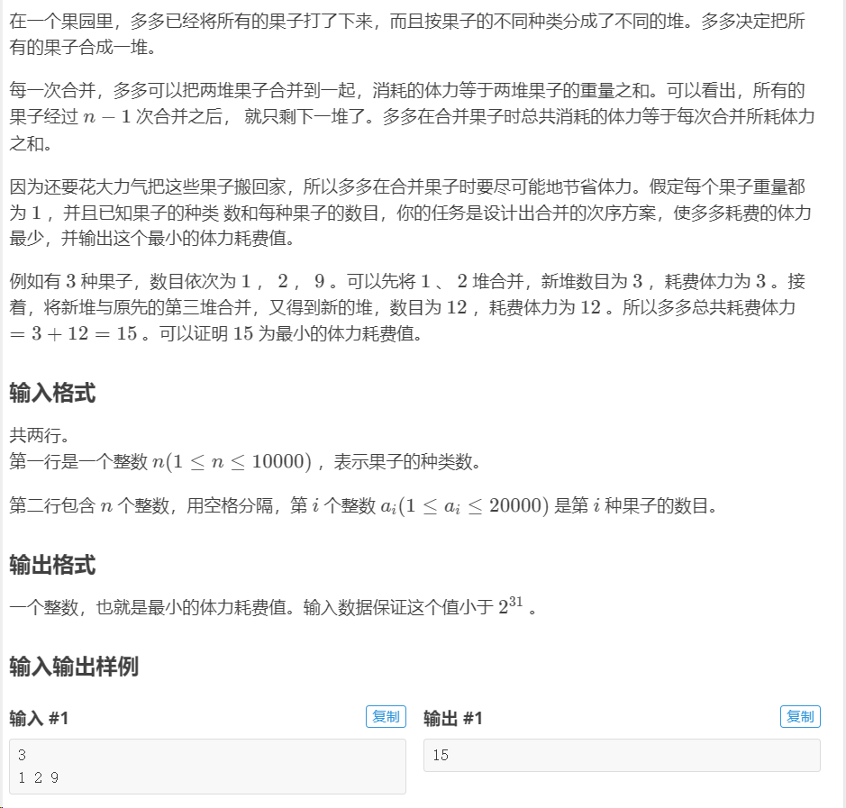

### 栈（Stack）：
> 后进先出（LIFO）

在 C++ 中，栈可以使用标准库中的 `std::stack` 类来实现。以下是栈的基本用法示例：

```cpp
#include <iostream>
#include <stack>

int main() {
    std::stack<int> myStack;

    // 压入元素
    myStack.push(10);
    myStack.push(20);
    myStack.push(30);

    // 弹出元素
    while (!myStack.empty()) {
        std::cout << myStack.top() << " "; // 输出栈顶元素
        myStack.pop(); // 弹出栈顶元素
    }

    return 0;
}
```

### 队列（Queue）：
>先进先出（FIFO）

在 C++ 中，队列可以使用标准库中的 `std::queue` 类来实现。以下是队列的基本用法示例：

```cpp
#include <iostream>
#include <queue>

int main() {
    std::queue<int> myQueue;

    // 入队
    myQueue.push(10);
    myQueue.push(20);
    myQueue.push(30);

    // 出队
    while (!myQueue.empty()) {
        std::cout << myQueue.front() << " "; // 输出队头元素
        myQueue.pop(); // 弹出队头元素
    }

    return 0;
}
```

### 注意事项：

- 栈的操作包括 `push()`（压栈）、`pop()`（弹栈）和 `top()`（获取栈顶元素）。
- 队列的操作包括 `push()`（入队）、`pop()`（出队）和 `front()`（获取队头元素）。
- 栈和队列都提供了 `empty()` 方法来检查它们是否为空。
- 栈和队列的底层实现可以是数组或链表，但用户无需关心具体的实现方式，只需要使用它们提供的方法即可。
---


```cpp
#include<iostream>
#include<cstdio>
#include<queue>
using namespace std;
queue<int> a;
int main()
{
	int b,c,d,e=1,f=0;
	cin>>b>>c;
	for(int i=1;i<=b;i++)
	{
		a.push(i);//模拟队列 
	}
	while(!a.empty())
	{
		if(e==c)//如果这个人正好被踢 
		{
			cout<<a.front()<<" ";//先输出 
			a.pop();//再删除 
			e=1;//再从1开始报数 
		}
		else if(e!=c)//如果不被剔除 
		{
			e++;//报的数+1 
			a.push(a.front());//先把head压进队尾 
			a.pop();//再把head删除 
		}
	}
	return 0;//结束程序（完美） 
}
```
#### 优先队列

> advantage：k可使队列元素从小到大排列（greater），从大到小(less)；不会去掉xi
```c++
#include<bits/stdc++.h>
using namespace std;
int n,x,ans;
priority_queue<int,vector<int>,greater<int>>q;//优先队列
int main(){
	cin>>n;
	for(int i=1;i<=n;i++) cin>>x,q.push(x);
	while(q.size()>=2){
		int a=q.top(); q.pop();
		int b=q.top(); q.pop();
		ans+=a+b;
		q.push(a+b);
	}
	cout<<ans<<endl;
	return 0;
}
```
---

### vector

`vector` 是一个动态数组，可以在运行时动态增长。它支持快速的随机访问，这意味着可以使用索引直接访问任何元素，时间复杂度为 O(1)。下面是一些 `vector` 常用的操作：

- **初始化和赋值**：
  ```cpp
  vector<int> vec; // 创建一个空的 vector
  vector<int> vec = {1, 2, 3}; // 初始化带有初始值的 vector
  vector<int> vec(5, 10); // 创建一个包含5个初始值为10的元素的 vector
  vector<int> vec2(vec); // 通过拷贝构造函数创建一个与 vec 相同的 vector
  ```

- **插入和访问元素**：
  ```cpp
  vec.push_back(4); // 在 vector 尾部插入元素
  vec.insert(vec.begin() + 2, 6); // 在指定位置插入元素
  int element = vec[3]; // 访问指定位置的元素
  ```

- **删除元素**：
  ```cpp
  vec.pop_back(); // 删除尾部元素
  vec.erase(vec.begin() + 2); // 删除指定位置的元素
  ```

- **其他操作**：
  ```cpp
  int size = vec.size(); // 返回 vector 的大小
  bool isEmpty = vec.empty(); // 检查 vector 是否为空
  vec.clear(); // 清空 vector
  ```

### list

`list` 是一个双向链表，支持在任意位置进行快速的插入和删除操作。由于它是一个链表，所以不支持随机访问，只能通过迭代器进行访问。以下是一些 `list` 常用的操作：

- **初始化和赋值**：
  ```cpp
  list<int> myList; // 创建一个空的 list
  list<int> myList = {1, 2, 3}; // 初始化带有初始值的 list
  ```

- **插入和访问元素**：
  ```cpp
  myList.push_back(4); // 在 list 尾部插入元素
  myList.push_front(0); // 在 list 头部插入元素
  list<int>::iterator it = myList.begin(); // 获取指向首元素的迭代器
  ++it;
  myList.insert(it, 5); // 在指定位置插入元素
  ```

- **删除元素**：
  ```cpp
  myList.pop_back(); // 删除尾部元素
  myList.pop_front(); // 删除头部元素
  myList.erase(++myList.begin()); // 删除指定位置的元素
  ```

- **其他操作**：
  ```cpp
  int size = myList.size(); // 返回 list 的大小
  bool isEmpty = myList.empty(); // 检查 list 是否为空
  myList.clear(); // 清空 list
  ```

### map

`map` 是一个关联容器，存储键值对，并且保持了一定的顺序（通常是基于键的比较结果）。它支持快速的查找，时间复杂度为 O(log n)。以下是一些 `map` 常用的操作：

- **初始化和赋值**：
  ```cpp
  map<string, int> myMap; // 创建一个空的 map
  map<string, int> myMap = {{"a", 1}, {"b", 2}}; // 初始化带有初始值的 map
  ```

- **插入和访问元素**：
  ```cpp
  myMap["c"] = 3; // 插入键值对
  int value = myMap["a"]; // 访问指定键的值
  ```

- **删除元素**：
  ```cpp
  myMap.erase("b"); // 删除指定键的键值对
  ```

- **其他操作**：
  ```cpp
  int size = myMap.size(); // 返回 map 的大小
  bool isEmpty = myMap.empty(); // 检查 map 是否为空
  ```

### set

`set` 是一个关联容器，存储不重复的元素，并且保持了一定的顺序（通常是升序）。它支持快速的查找，时间复杂度为 O(log n)。以下是一些 `set` 常用的操作：

- **初始化和赋值**：
  ```cpp
  set<int> mySet; // 创建一个空的 set
  set<int> mySet = {1, 2, 3}; // 初始化带有初始值的 set
  ```

- **插入和访问元素**：
  ```cpp
  mySet.insert(4); // 插入元素
  bool isPresent = mySet.count(2); // 检查元素是否存在
  ```

- **删除元素**：
  ```cpp
  mySet.erase(3); // 删除指定元素
  ```

- **其他操作**：
  ```cpp
  int size = mySet.size(); // 返回 set 的大小
  bool isEmpty = mySet.empty(); // 检查 set 是否为空
  ```

### unordered_map 和 unordered_set

`unordered_map` 和 `unordered_set` 是使用哈希表实现的关联容器，插入和查找的时间复杂度平均为 O(1)。它们不保持元素的顺序。以下是一些 `unordered_map` 和 `unordered_set` 常用的操作：

- **初始化和赋值**：
  ```cpp
  unordered_map<string, int> myUnorderedMap; // 创建一个空的 unordered_map
  unordered_map<string, int> myUnorderedMap = {{"a", 1}, {"b", 2}}; // 初始化带有初始值的 unordered_map
  ```

- **插入和访问元素**：
  ```cpp
  myUnorderedMap["c"] = 3; // 插入键值对
  int value = myUnorderedMap["a"]; // 访问指定键的值
  ```

- **删除元素**：
  ```cpp
  myUnorderedMap.erase("b"); // 删除指定键的键值对
  ```

- **其他操作**：
  ```cpp
  int size = myUnorderedMap.size(); // 返回
    unordered_map 的大小
  bool isEmpty = myUnorderedMap.empty(); // 检查 unordered_map 是否为空> unordered_set` 的用法与 `unordered_map` 类似，只是它存储的是不重复的元素而不是键值对。
  ```
---


```c++
#include <iostream>
#include <unordered_set>
#include <vector>
using namespace std;

void solve() {
    int n;
    cin >> n;
    vector<int> nums(n);
    unordered_set<int> seen;
    
    for (int i = 0; i < n; ++i) {
        cin >> nums[i];
        seen.insert(nums[i]);
    }
    
    for (int i = 0; i < n; ++i) {
        if (seen.count(nums[i])) {
            seen.erase(nums[i]);
            cout << nums[i] << " ";
        }
    }
    
    cout << endl;
}

int main() {
    int T;
    cin >> T;
    while (T--) {
        solve();
    }
    return 0;
}
```
---
#### 以下是使用 C++ 实现**前缀表达式和后缀表达式**计算

```cpp
#include <iostream>
#include <stack>
#include <string>
#include <sstream>
#include <cctype>

using namespace std;

// 计算前缀表达式的函数
int evaluatePrefixExpression(const string& expression) {
    stack<int> st; // 使用 STL 中的 stack 容器
    istringstream iss(expression); // 使用 istringstream 来处理字符串流
    string token;

    // 逐个读取表达式中的标记
    while (iss >> token) {
        if (isdigit(token[0])) { // 如果标记是数字，则将其转换为整数并入栈
            st.push(stoi(token));
        } else { // 如果标记是操作符，则从栈中弹出两个操作数进行计算，并将结果压入栈中
            int operand2 = st.top(); st.pop();
            int operand1 = st.top(); st.pop();
            if (token == "+") st.push(operand1 + operand2);
            else if (token == "-") st.push(operand1 - operand2);
            else if (token == "*") st.push(operand1 * operand2);
            else if (token == "/") st.push(operand1 / operand2);
        }
    }

    // 返回栈顶元素，即计算结果
    return st.top();
}

// 计算后缀表达式的函数
int evaluatePostfixExpression(const string& expression) {
    stack<int> st; // 使用 STL 中的 stack 容器
    istringstream iss(expression); // 使用 istringstream 来处理字符串流
    string token;

    // 逐个读取表达式中的标记
    while (iss >> token) {
        if (isdigit(token[0])) { // 如果标记是数字，则将其转换为整数并入栈
            st.push(stoi(token));
        } else { // 如果标记是操作符，则从栈中弹出两个操作数进行计算，并将结果压入栈中
            int operand2 = st.top(); st.pop();
            int operand1 = st.top(); st.pop();
            if (token == "+") st.push(operand1 + operand2);
            else if (token == "-") st.push(operand1 - operand2);
            else if (token == "*") st.push(operand1 * operand2);
            else if (token == "/") st.push(operand1 / operand2);
        }
    }

    // 返回栈顶元素，即计算结果
    return st.top();
}

int main() {
    // 定义前缀表达式和后缀表达式
    string prefixExpr = "+ 2 3";
    string postfixExpr = "2 3 +";

    // 计算并输出前缀表达式的结果
    cout << "Result of prefix expression evaluation: " << evaluatePrefixExpression(prefixExpr) << endl;

    // 计算并输出后缀表达式的结果
    cout << "Result of postfix expression evaluation: " << evaluatePostfixExpression(postfixExpr) << endl;

    return 0;
}
```

这段代码使用了 C++ 中的 STL（标准模板库）提供的 `stack` 容器和 `istringstream` 类来实现前缀和后缀表达式的计算。在 `evaluatePrefixExpression` 和 `evaluatePostfixExpression` 函数中，我们使用了栈来模拟计算过程，并根据遍历的标记（操作符或操作数）执行相应的计算操作。

---
二分查找（Binary Search）是一种在有序数组中查找目标元素的高效算法。它的基本思想是将目标元素与数组中间元素进行比较，并根据比较结果缩小搜索范围，从而快速地定位目标元素。

二分查找的步骤如下：
1. 首先，确定数组的左右边界，即左边界初始化为数组的第一个元素的索引，右边界初始化为数组的最后一个元素的索引。
2. 在每一步中，计算数组中间元素的索引（mid），并取得中间元素的值。
3. 将目标元素与中间元素进行比较。
   - 如果目标元素等于中间元素，则返回中间元素的索引。
   - 如果目标元素小于中间元素，则说明目标元素可能在数组的左侧，将右边界设为 mid - 1。
   - 如果目标元素大于中间元素，则说明目标元素可能在数组的右侧，将左边界设为 mid + 1。
4. 重复以上步骤，直到找到目标元素或者左边界大于右边界。

下面是用 C 语言实现的二分查找算法示例：

```c
#include <stdio.h>

// 二分查找函数
int binarySearch(int arr[], int n, int target) {
    int left = 0;
    int right = n - 1;

    while (left <= right) {
        int mid = left + (right - left) / 2;

        // 如果中间元素等于目标元素，则返回中间元素的索引
        if (arr[mid] == target) {
            return mid;
        }
        // 如果目标元素小于中间元素，则将右边界设为 mid - 1
        else if (arr[mid] > target) {
            right = mid - 1;
        }
        // 如果目标元素大于中间元素，则将左边界设为 mid + 1
        else {
            left = mid + 1;
        }
    }

    // 如果没有找到目标元素，则返回 -1
    return -1;
}

int main() {
    int arr[] = {1, 3, 5, 7, 9, 11, 13, 15, 17, 19};
    int n = sizeof(arr) / sizeof(arr[0]);
    int target = 7;

    int result = binarySearch(arr, n, target);

    if (result != -1) {
        printf("目标元素 %d 的索引为 %d\n", target, result);
    } else {
        printf("未找到目标元素 %d\n", target);
    }

    return 0;
}
```

这段代码能够在有序数组中查找目标元素，并返回其索引。