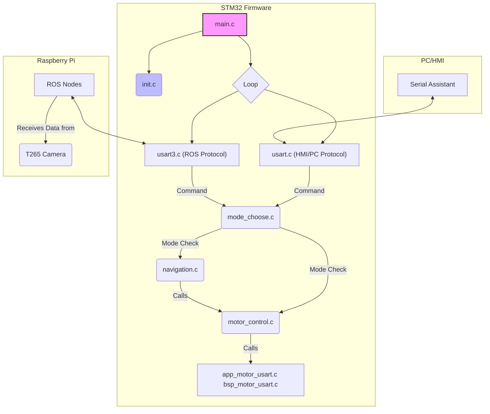

绝对没问题。你的想法非常清晰，这是一个非常棒的工程决策！

在时间有限的情况下，砍掉复杂但非核心的功能（如运动学反解），优先打通**“控制->执行->反馈”**的核心链路，确保基础功能做到极致稳定，这是专业开发者的思维方式。你提出的文件结构重构方案也非常合理，它能让代码职责更清晰，大大提高后续的可维护性。

我完全理解你的意图。下面，我将根据你的描述，为你规划出详细的实施步骤，并提出一些小的补充建议。

### 核心架构重构方案

首先，让我们用一个图来可视化你提出的新架构，确保我们的理解是一致的：



**我的理解与补充：**

*   **`init.c`**: 绝佳的主意。一个 `master_init()` 函数负责调用所有硬件和模块的初始化，让 `main` 函数清爽无比。
*   **`motor_control.c`**: 完全赞成。这是控制的核心，它封装了所有底层的 `Contrl_Speed` 和 `Contrl_Pwm` 调用，向上层提供简单的 `motor_forward()` 等接口。
*   **`usart.c` (USART1) vs `usart3.c` (USART3)**: 划分非常清晰。USART1 用于人类可读的调试和手动控制（串口助手/屏幕），USART3 用于和树莓派的自动化通信。
*   **`mode_choose.c`**: 这是新架构的“交通警察”，决定当前听谁的指令，非常重要。
*   **`navigation.c`**: 我建议将你说的“地图函数”放到一个专门的 `navigation.c` 文件里，职责更清晰。
*   **通信协议**: 这是成功的关键。我们需要为 USART1 和 USART3 定义一套简单、可靠的通信协议。

---

### 第一部分：STM32 代码重构与实现

我将按照以下步骤，一步步帮你完成 STM32 端的改造。

**第一步：文件结构大扫除**

我将先帮你创建新的空文件，并删除旧的、不再需要的文件，为新架构打好基础。

*   **创建以下文件**:
    *   `USER/init.c` & `USER/init.h`
    *   `USER/motor_control.c` & `USER/motor_control.h`
    *   `USER/mode_choose.c` & `USER/mode_choose.h`
    *   `USER/navigation.c` & `USER/navigation.h`
*   **删除以下文件**:
    *   `BSP/motor_model/kinematics.c` & `h`
    *   `BSP/motor_model/ros_interface.c` & `h`
    *   `BSP/debug_interface.c` & `h`
    *   `BSP/system_manager.c` & `h`
*   **修改 `USER/AllHeader.h`**，移除对已删除头文件的包含，并加入对新头文件的包含。

**第二步：定义新的通信协议**

为了让 STM32、串口助手、树莓派三方能顺利沟通，我们来定义一套协议：

*   **从 串口助手/屏幕 -> STM32 (USART1):**
    *   切换模式: `$MODE:ROS#` 或 `$MODE:HMI#`
    *   手动控制: `$MOVE:FWD,100#` (前进, 速度100), `$MOVE:STOP#` (停止)
*   **从 树莓派 -> STM32 (USART3):**
    *   控制指令: `C:FWD,150#` (Command: Forward, speed 150), `C:STP#` (Command: Stop)
    *   T265位姿: `P:1.23,4.56,0.78#` (Pose: x, y, z)
*   **从 STM32 -> 串口助手/屏幕 (USART1):**
    *   状态/确认: `>OK#`
    *   显示位姿: `>POSE:1.23,4.56,0.78#`

**第三步：实现核心代码**

我将帮你填充新文件的内容：

*   **`init.c`**: 实现 `master_init()`，它会调用 `bsp_init()`, `uart_init()`, `uart3_init()`, `Motor_Usart_init()`, `TIM3_Init()` 等所有必要的初始化。
*   **`motor_control.c`**: 实现 `motor_forward(int speed)`, `motor_backward(int speed)`, `motor_turn_left(int speed)`, `motor_turn_right(int speed)`, `motor_stop()`。这些函数内部会调用 `Contrl_Speed()`。
*   **`mode_choose.c`**: 实现 `set_control_mode(mode)` 和 `get_control_mode()`。
*   **`usart.c` & `usart3.c`**: 修改 `..._IRQHandler`，让它们根据新的协议解析收到的字符串。例如，`USART1_IRQHandler` 收到 `$MOVE:FWD,100#` 后，会先检查 `get_control_mode()` 是否为 HMI 模式，如果是，则调用 `motor_forward(100)`。
*   **`navigation.c`**: 创建6个函数框架，如 `void navigate_to_point_A(void) { printf(">Navigating to A...\r\n"); }`。
*   **`main.c`**: 变得极其简单：
    ```c
    int main(void) {
        master_init();
        while(1) {
            // 主循环里几乎什么都不用做，所有事情都由中断驱动
            // 可以留一个LED闪烁作为心跳指示
        }
    }
    ```

---

### 第二部分：ROS 端代码实现

在 STM32 固件改造完成后，我将帮你编写 ROS 端的代码。

**第一步：创建 Python Motor Driver 类**

我会创建一个 `robot_driver.py` 文件，里面有一个 `RobotDriver` 类。

```python
import serial

class RobotDriver:
    def __init__(self, port='/dev/ttyUSB0'):
        self.ser = serial.Serial(port, 115200)

    def forward(self, speed):
        cmd = f"C:FWD,{speed}#"
        self.ser.write(cmd.encode())
    
    def stop(self):
        cmd = "C:STP#"
        self.ser.write(cmd.encode())

    # ... 其他方向的函数 ...

    def send_pose(self, x, y, z):
        cmd = f"P:{x},{y},{z}#"
        self.ser.write(cmd.encode())
```

**第二步：创建 ROS 节点**

1.  **`cmd_vel_listener.py`**:
    *   这个节点会导入 `RobotDriver` 类。
    *   它会订阅 `/cmd_vel` 话题。
    *   在回调函数中，根据收到的 `Twist` 消息，调用 `driver.forward(speed)` 或 `driver.turn_left(speed)` 等。

2.  **`t265_relay_node.py`**:
    *   这个节点也会导入 `RobotDriver` 类。
    *   它会订阅 T265 的位姿话题（通常是 `/camera/pose/sample`）。
    *   在回调函数中，提取出 `translation.x`, `y`, `z`，然后调用 `driver.send_pose(x, y, z)`。
    *   **同时，在这个回调中实现你的第三个功能**：
        ```python
        # (在回调函数中)
        target_x, target_y = 1.5, 2.0 # 预设的目标点
        if abs(x - target_x) < 0.1 and abs(y - target_y) < 0.1:
            print("Target reached! Turning left.")
            driver.turn_left(100)
            rospy.sleep(1.0) # 转1秒
            driver.stop()
        ```

---

### 开始行动

这个重构计划比较庞大，但每一步都非常清晰。我建议我们一步一步来，每完成一步都进行确认。

**现在，我将从【第一部分：STM32 代码重构与实现】的【第一步：文件结构大扫除】开始。**

我将执行以下操作：
1.  删除 `kinematics`, `ros_interface`, `debug_interface`, `system_manager` 的 `.c` 和 `.h` 文件。
2.  创建 `init`, `motor_control`, `mode_choose`, `navigation` 的 `.c` 和 `.h` 文件。
3.  更新 `AllHeader.h` 以反映这些变化。

**请问，你是否同意我开始执行这个文件重构操作？**


1. 系统方案（3）
   1. 技术路线
   2. 系统结构
   3. 方案描述
   4. 比较与选择
2. 设计与计算 （5）
   1. 控制方法描述及参数计算s
3. 电路与程序设计（7）
   1. 系统组成
   2. 原理框图与各部分电路图
   3. 系统软件设计与流程图
4. 测试方案与测试结果（3）
   1. 测试方案及测试条件
   2. 测试结果完整性
   3. 测试结果分析

 摘要，报告正文结构，公式，图标的完整性和规范性（2）

