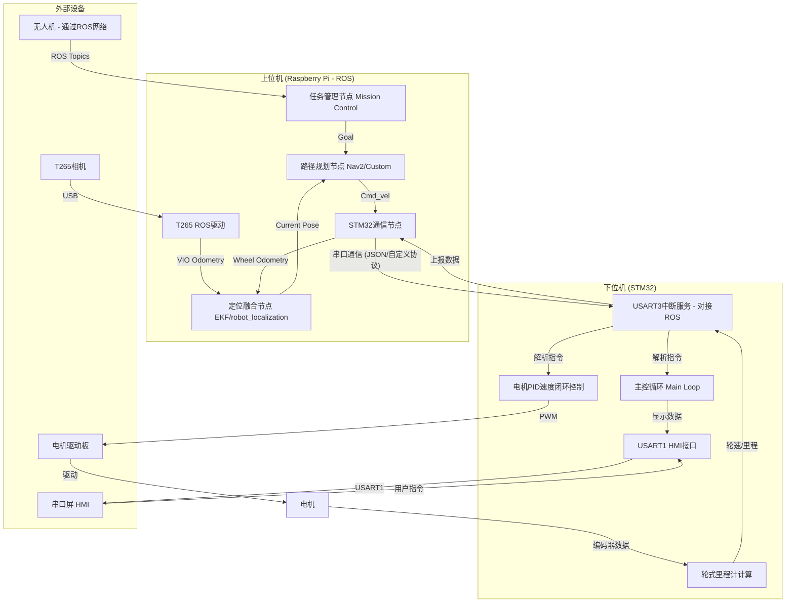

好的，非常荣幸能为您梳理这个富有挑战性和趣味性的项目。您对项目的构想非常宏大，涵盖了嵌入式开发、机器人操作系统（ROS）、多传感器融合、自主导航和人机交互等多个前沿领域，这对于备战电子设计大赛来说是一个非常好的起点。

根据您的描述，我为您整理和丰富了一份详细的需求文档。这份文档旨在明确项目目标、统一技术规范、并作为后续开发过程中与 AI 助手（如我）进行高效协作的“指导性提示词（Prompt）”。

---

### **项目需求文档：基于ROS与STM32的空地协同智能巡防机器人系统**

**版本：** 1.0
**日期：** 2024-05-22

---

#### **1. 项目概述 (Project Overview)**

##### **1.1 项目名称**
空地协同智能巡防机器人系统 (Air-Ground Cooperative Intelligent Patrol Robot System)

##### **1.2 项目目标**
本项目旨在开发一套由无人机（空中单元）和智能小车（地面单元）构成的高性能协同作业机器人系统，以备战2025年全国大学生电子设计大赛。系统核心是实现：
1.  **地面单元高精度自主导航**：基于多传感器融合（轮式里程计 + T265视觉里程计）实现小车的精确定位与路径跟踪。
2.  **空地高效协同作业**：复现并优化2023年电赛“空地协防”任务，实现无人机发现目标、地面单元自主前往处理的智能化任务流。
3.  **友好的人机交互**：通过串口屏（HMI）实现系统状态的实时可视化监控与便捷控制。
4.  **高度模块化与可扩展的架构**：为应对2025年未知赛题，系统需具备良好的可扩展性，能够快速集成新功能。

##### **1.3 技术栈 (Technology Stack)**
*   **上位机 (Raspberry Pi 4B):**
    *   操作系统: Ubuntu 20.04
    *   机器人框架: ROS Noetic
    *   主要编程语言: Python
*   **下位机 (STM32):**
    *   MCU: STM32F103c8t6系列
    *   编程语言: C
    *   开发环境: Keil MDK
    *   固件库: STM32F1 标准外设库(StdPeriph)
*   **人机交互 (HMI):**
    *   硬件: 陶晶驰 (TJC) 串口屏
    *   开发软件: USART HMI

---

#### **2. 系统架构 (System Architecture)**

##### **2.1 硬件组成 (Hardware Components)**
| 组件             | 型号/规格            | 角色                                            |
| :--------------- | :------------------- | :---------------------------------------------- |
| **上位机**       | Raspberry Pi 4B      | 核心计算单元，运行ROS，处理高层算法与任务决策。 |
| **下位机**       | STM32F103c8t6        | 电机驱动与数据采集单元，执行实时控制指令。      |
| **地面单元**     | 四轮小车平台         | 移动载体。                                      |
| **电机及驱动**   | 4 x L型520电机       | 动力系统，由`USART2`控制的驱动板驱动。          |
| **编码器**       | 电机自带             | 用于测量车轮转速，实现速度闭环与里程计计算。    |
| **定位相机**     | Intel RealSense T265 | 为上位机提供高精度的视觉惯性里程计（VIO）数据。 |
| **空中单元**     | 无人机               | 负责广域巡逻、目标探测与定位。                  |
| **人机交互界面** | 串口触摸屏           | 系统状态显示、数据可视化、手动控制输入。        |

##### **2.2 软件与通信架构 (Software & Communication Architecture)**

---

#### **3. 功能需求 (Functional Requirements)**

##### **FR1: 下位机 (STM32) 核心功能**
*   **FR1.1: 精准速度闭环控制**
    *   为四个电机实现独立的PID速度控制器。
    *   PID参数（P, I, D）应可通过串口指令在线整定和保存，以适配不同负载和地面。
*   **FR1.2: 通信协议解析与执行**
    *   实现一个健壮的、基于帧的串口通信协议（可通过`USART3`与树莓派通信）。
    *   协议应包含帧头、数据长度、指令ID、数据负载和校验和（如CRC/Checksum），确保通信可靠性。
    *   能够解析上位机下发的指令，如：设定四轮目标速度、查询里程计数据、复位里程计、设置PID参数等。
*   **FR1.3: 轮式里程计数据上报**
    *   基于编码器读数，精确计算每个车轮的瞬时速度和累计脉冲数。
    *   按照固定频率（例如 50Hz）或查询指令，将计算出的四轮速度和里程数据打包上报给上位机。
*   **FR1.4: HMI接口**
    *   通过`USART1`驱动串口屏，定期发送需显示的数据（如无人机坐标、小车速度、系统状态等）。
    *   处理来自串口屏的触控指令，如“一键启动”、“紧急停止”等。

##### **FR2: 上位机 (Raspberry Pi) 核心功能**
*   **FR2.1: 机器人运动学解算**
    *   创建ROS节点，订阅标准`geometry_msgs/Twist`消息（即`cmd_vel`）。
    *   根据小车的运动学模型（四轮麦克纳姆轮或差速模型），将期望的线速度(Vx)和角速度(Wz)解算为四个车轮的目标速度。
*   **FR2.2: 多传感器融合定位**
    *   运行`robot_localization`包（或类似EKF滤波包）。
    *   融合来自T265的视觉里程计（`odom/vio`）和来自下位机的轮式里程计（`odom/wheel`），输出平滑、精确的全局里程计信息（`odom/global`）。
*   **FR2.3: 自主导航与路径跟踪**
    *   能够接收目标点坐标（`geometry_msgs/PoseStamped`）。
    *   （可选，推荐）集成ROS Navigation Stack (Nav2) 或编写一个独立的路径跟踪控制器（如Pure Pursuit, PID）来根据当前位姿和目标点生成`cmd_vel`指令。
*   **FR2.4: 任务状态机**
    *   实现一个总控状态机（可以用`smach`或自定义Python类）。
    *   管理机器人的状态：`IDLE`（待命）、`NAVIGATING`（导航中）、`PERFORMING_TASK`（执行任务，如模拟灭火）、`RETURNING`（返航）。
    *   订阅来自无人机（或其他任务发布者）的目标区域话题。

##### **FR3: 空地协同任务流程**
*   **FR3.1: 任务定义**
    *   地图为已知，包含6个预设的目标区域和若干禁行区。
    *   小车预置了从起点到每个目标区域的安全、固定路径点序列。
*   **FR3.2: 交互流程**
    1.  无人机在巡逻中发现目标，发布一个包含区域ID（1-6）的ROS消息。
    2.  小车的任务管理节点接收到消息。
    3.  根据区域ID，加载对应的预设路径点。
    4.  状态机切换至`NAVIGATING`，路径跟踪器开始工作，控制小车沿路径点行驶。
    5.  到达目标区域后，状态机切换至`PERFORMING_TASK`，执行指定动作（如停留N秒）。
    6.  任务完成后，加载返航路径，状态机切换至`RETURNING`。
    7.  回到起点后，状态机切换至`IDLE`，等待新任务。

---

#### **4. 非功能性需求 (Non-Functional Requirements)**

*   **NFR1: 代码可读性与模块化**
    *   **STM32:** C代码遵循模块化设计，如将电机控制、串口通信、PID算法等封装到独立的 `.c`/`.h` 文件中。关键代码段提供清晰注释。
    *   **Python:** ROS节点功能单一化，代码遵循PEP8规范，使用有意义的变量和函数名。
*   **NFR2: 可扩展性**
    *   **配置文件驱动:** 关键参数（如PID值、车轮直径、通信端口、波特率、ROS话题名等）应通过配置文件（如ROS的`.yaml`文件）加载，而非硬编码在代码中。
    *   **接口标准化:** 所有模块间交互遵循ROS标准消息类型和接口，便于替换或增加新模块（如激光雷达、其他导航算法）。
*   **NFR3: 可靠性**
    *   实现看门狗机制（STM32），防止程序跑飞。
    *   通信协议包含超时重传和错误校验机制。
    *   上位机和下位机均应有明确的日志系统，方便调试和追溯问题。

---

#### **5. 开发里程碑 (Development Milestones)**

1.  **M1: 平台搭建与通信验证 **
    *   [ ] 完成STM32项目框架，实现`USART1` (printf) 和 `USART2` (电机驱动) 功能。
    *   [ ] 手动测试电机转动，并读取编码器数值。
    *   [ ] 完成树莓派ROS环境搭建，并编写Python脚本通过`USART3`与STM32建立基本的收发通信。

2.  **M2: 速度闭环与里程计 **
    *   [ ] 在STM32上实现四轮PID速度闭环控制，并通过串口助手进行参数整定。
    *   [ ] 在STM32上实现轮式里程计计算。
    *   [ ] 定义并实现完整的上下位机通信协议，上位机能控制小车以指定速度运动，并能接收下位机回报的里程计数据。

3.  **M3: ROS集成与融合定位 **
    *   [ ] 创建`stm32_ros_driver`节点，将下位机数据发布为`odom`和`tf`消息。
    *   [ ] 集成T265相机，并确保其能正常发布VIO数据。
    *   [ ] 配置`robot_localization`节点，融合轮式里程计和T265数据，在Rviz中验证定位效果。

4.  **M4: 自主导航与任务复现 **
    *   [ ] 实现一个简单的路径点跟踪算法。
    *   [ ] 编写任务状态机，实现完整的“空地协防”任务逻辑。
    *   [ ] 进行场地测试，确保小车能根据模拟的无人机指令完成自主导航和返回。

5.  **M5: HMI集成与系统优化 **
    *   [ ] 设计串口屏UI界面。
    *   [ ] 编写STM32的HMI驱动代码，实现数据上屏和指令接收。
    *   [ ] 进行完整的系统联调，优化各项性能指标，撰写开发文档。

